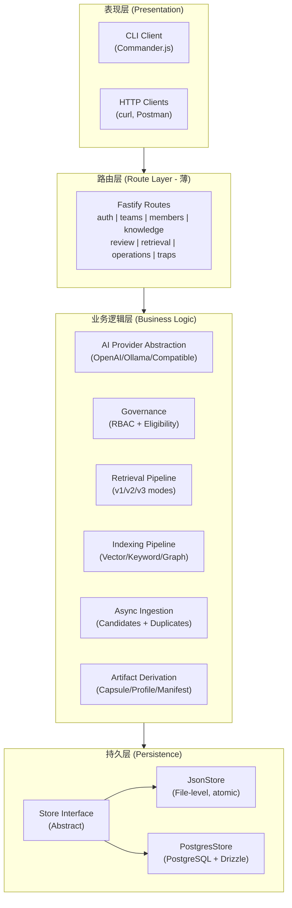
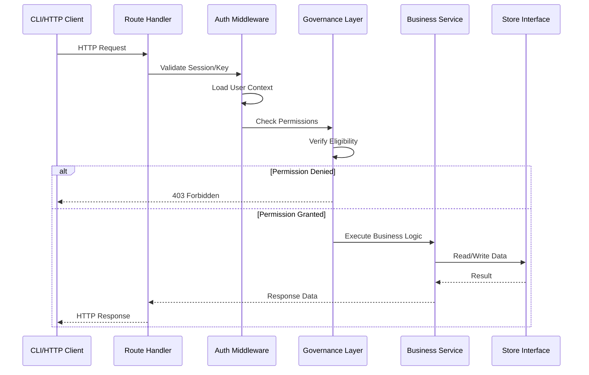
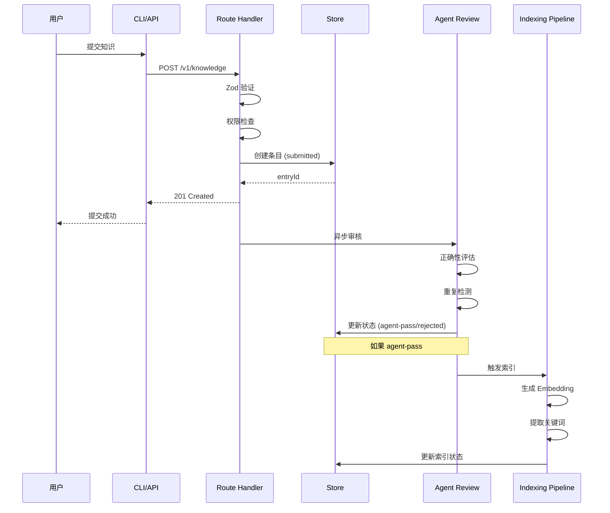
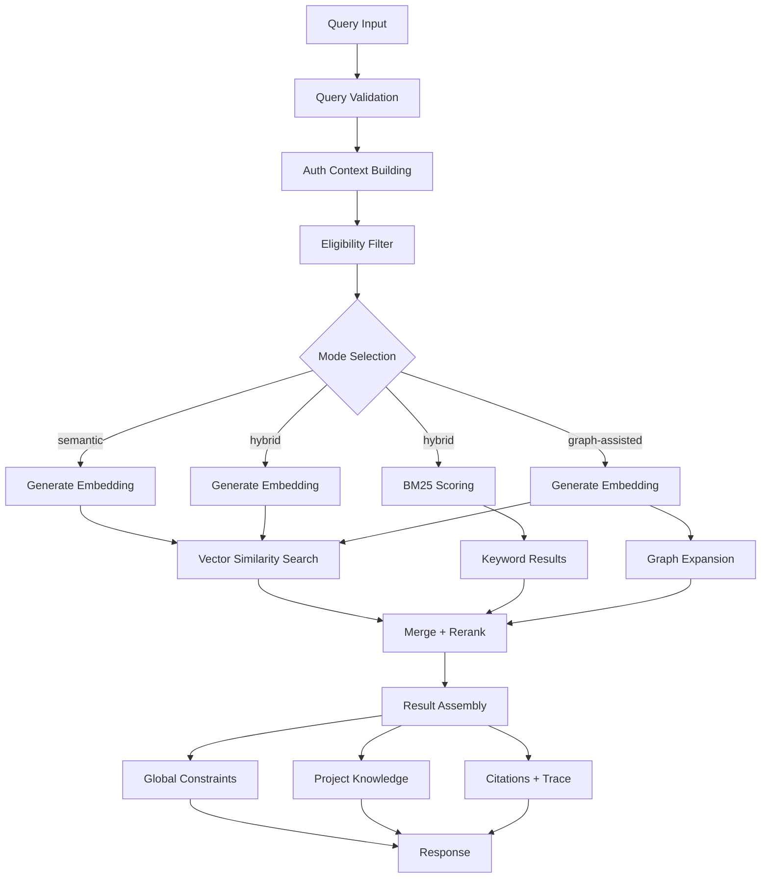
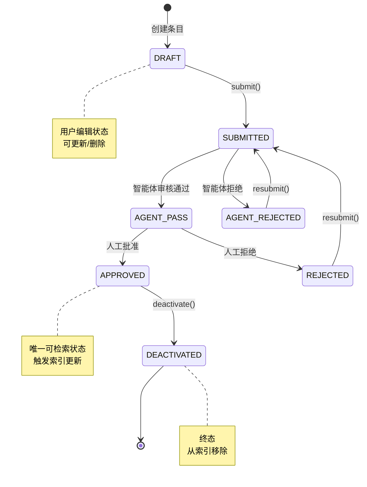
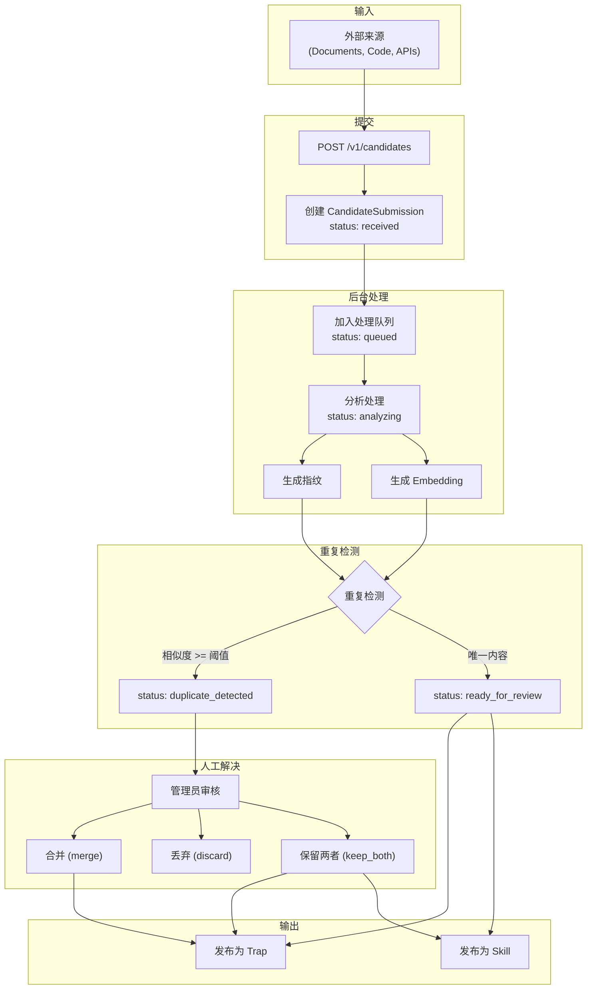
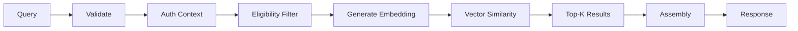
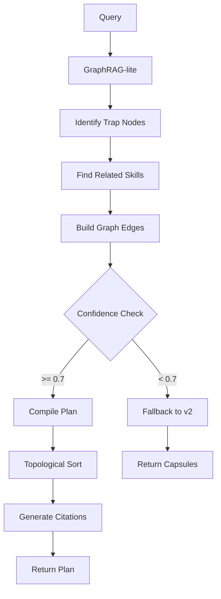
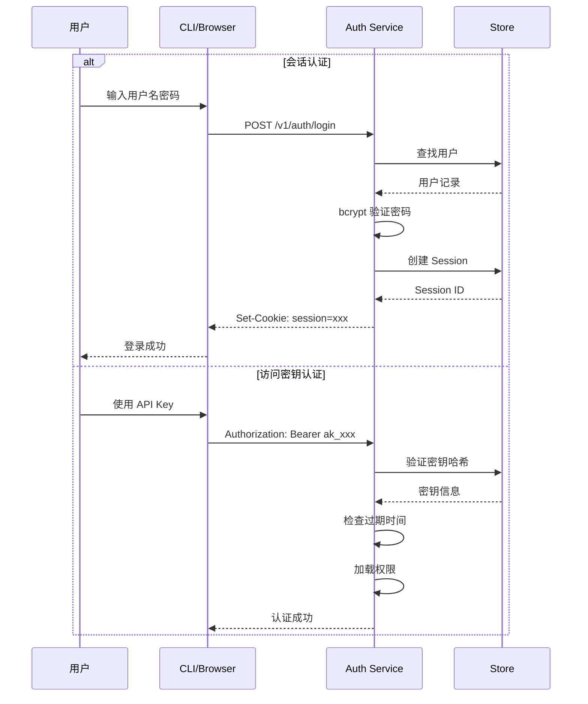
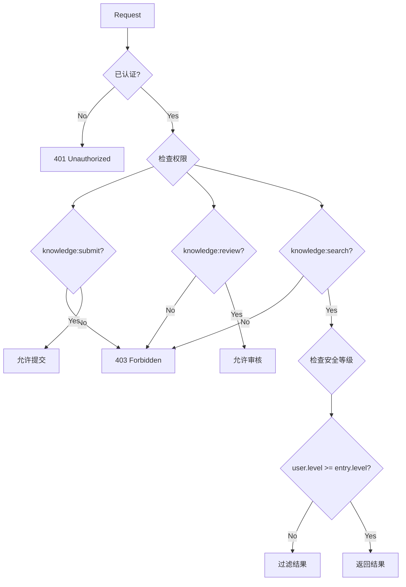

# Plan 88-05: Add Mermaid Flow Diagrams

## Context

Current architecture docs use ASCII art diagrams. ROADMAP requires adding Mermaid diagrams to improve readability and enable proper rendering in GitHub/GitLab.

**Target files (6 minimum):**
1. ARCHITECTURE.md - system layered architecture, request lifecycle
2. FLOW.md - core data flow (submission→review→index→retrieval)
3. KNOWLEDGE_LIFECYCLE.md - state machine transitions
4. INGESTION.md - async ingestion pipeline
5. RETRIEVAL.md - retrieval pipeline multi-stage
6. SECURITY.md - authentication/authorization flow

## Task

### Step 1: Add Mermaid system architecture diagram to ARCHITECTURE.md

<read_first>
- docs/architecture/ARCHITECTURE.md (current content)
</read_first>

<action>
Find the "核心架构" section and add Mermaid diagrams alongside the existing ASCII art.

After the existing ASCII layered architecture diagram, add:

```markdown
### 系统分层架构图（Mermaid）


```
</action>

<acceptance_criteria>
- ARCHITECTURE.md contains `flowchart TB` or `graph TB` Mermaid diagram
- ARCHITECTURE.md contains `subgraph` elements for layered architecture
</acceptance_criteria>

---

### Step 2: Add request lifecycle sequence diagram to ARCHITECTURE.md

<read_first>
- docs/architecture/ARCHITECTURE.md (current content)
</read_first>

<action>
After the system architecture diagram, add a request lifecycle diagram:

```markdown
### 请求生命周期流程图


```
</action>

<acceptance_criteria>
- ARCHITECTURE.md contains `sequenceDiagram` Mermaid diagram
- ARCHITECTURE.md contains request lifecycle showing auth→governance→service flow
</acceptance_criteria>

---

### Step 3: Add Mermaid sequence diagram to FLOW.md

<read_first>
- docs/architecture/FLOW.md (current content with ASCII diagrams)
</read_first>

<action>
Find the "知识提交流程" section and add a Mermaid sequenceDiagram after the ASCII art:

```markdown
### 知识提交流程（Mermaid）


```
</action>

<acceptance_criteria>
- FLOW.md contains `sequenceDiagram` for knowledge submission flow
</acceptance_criteria>

---

### Step 4: Add retrieval flow diagram to FLOW.md

<read_first>
- docs/architecture/FLOW.md (current content)
</read_first>

<action>
Find the "检索查询流程" section and add a Mermaid flowchart:

```markdown
### 检索查询流程（Mermaid）


```
</action>

<acceptance_criteria>
- FLOW.md contains `flowchart` for retrieval flow
- FLOW.md shows mode branching (semantic/hybrid/graph-assisted)
</acceptance_criteria>

---

### Step 5: Add state machine diagram to KNOWLEDGE_LIFECYCLE.md

<read_first>
- docs/architecture/components/KNOWLEDGE_LIFECYCLE.md (current content with ASCII state diagram)
</read_first>

<action>
After the existing ASCII state diagram, add a Mermaid stateDiagram-v2:

```markdown
### 生命周期状态图（Mermaid）


```
</action>

<acceptance_criteria>
- KNOWLEDGE_LIFECYCLE.md contains `stateDiagram-v2`
- KNOWLEDGE_LIFECYCLE.md shows all state transitions: DRAFT→SUBMITTED→AGENT_PASS→APPROVED→DEACTIVATED
</acceptance_criteria>

---

### Step 6: Add ingestion pipeline flowchart to INGESTION.md

<read_first>
- docs/architecture/components/INGESTION.md (current content)
</read_first>

<action>
After the existing architecture ASCII diagram, add a Mermaid flowchart:

```markdown
### 异步摄取管道流程（Mermaid）


```
</action>

<acceptance_criteria>
- INGESTION.md contains `flowchart` for ingestion pipeline
- INGESTION.md shows duplicate detection branching
</acceptance_criteria>

---

### Step 7: Add retrieval pipeline diagrams to RETRIEVAL.md

<read_first>
- docs/architecture/components/RETRIEVAL.md (current content)
</read_first>

<action>
Add Mermaid diagrams for the three retrieval modes.

For v1 Semantic Mode, add:

```markdown
### v1 语义检索流程（Mermaid）



### v1 混合检索流程（Mermaid）

```mermaid
flowchart TB
    A[Query] --> B[Validate & Auth]
    B --> C{Parallel Processing}

    C -->|Semantic Path| D1[Generate Embedding]
    D1 --> D2[Vector Similarity]
    D2 --> D3[Top-K Semantic]

    C -->|Keyword Path| E1[Tokenize Query]
    E1 --> E2[BM25 Scoring]
    E2 --> E3[Top-K Keyword]

    D3 --> F[Score Fusion<br/>(RRF)]
    E3 --> F
    F --> G[Merge & Rerank]
    G --> H[Assembly]
    H --> I[Response]
```

### v3 陷阱优先计划编译（Mermaid）


```
</action>

<acceptance_criteria>
- RETRIEVAL.md contains at least 3 Mermaid diagrams
- RETRIEVAL.md contains diagrams for semantic, hybrid, and plan modes
</acceptance_criteria>

---

### Step 8: Add authentication flow diagram to SECURITY.md

<read_first>
- docs/operations/SECURITY.md (current content)
</read_first>

<action>
After the security architecture overview, add authentication flow diagrams:

```markdown
### 认证流程图（Mermaid）



### 授权流程图（Mermaid）


```
</action>

<acceptance_criteria>
- SECURITY.md contains `sequenceDiagram` for authentication flow
- SECURITY.md contains `flowchart` for authorization flow
</acceptance_criteria>

---

## Verification

After all steps:
1. Count Mermaid diagrams: `grep -c "^\`\`\`mermaid" docs/architecture/ARCHITECTURE.md docs/architecture/FLOW.md docs/architecture/components/KNOWLEDGE_LIFECYCLE.md docs/architecture/components/INGESTION.md docs/architecture/components/RETRIEVAL.md docs/operations/SECURITY.md` should be >= 6
2. Verify specific diagram types:
   - `grep -c "flowchart" docs/architecture/ARCHITECTURE.md` >= 1
   - `grep -c "sequenceDiagram" docs/architecture/ARCHITECTURE.md` >= 1
   - `grep -c "sequenceDiagram" docs/architecture/FLOW.md` >= 1
   - `grep -c "stateDiagram-v2" docs/architecture/components/KNOWLEDGE_LIFECYCLE.md` >= 1
   - `grep -c "flowchart" docs/architecture/components/INGESTION.md` >= 1
   - `grep -c "flowchart" docs/architecture/components/RETRIEVAL.md` >= 1
   - `grep -c "sequenceDiagram" docs/operations/SECURITY.md` >= 1
3. All diagrams are properly closed with triple backticks
