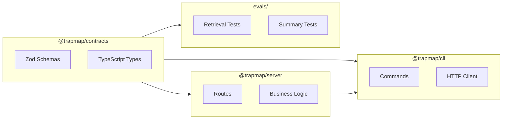

# Plan 88-06: Fix Inconsistencies & Update Navigation

## Context

After restructuring docs/, need to:
1. Update all navigation links in AGENTS.md and README.md
2. Fix lifecycle state capitalization (draft → DRAFT)
3. Remove references to non-existent scripts
4. Update PACKAGES.md dependency diagram
5. Verify all links are valid

## Task

### Step 1: Update AGENTS.md links

<read_first>
- AGENTS.md (current content with links)
</read_first>

<action>
Update all documentation links in AGENTS.md to reflect the new directory structure:

Find and replace the following paths:
- `docs/GETTING_STARTED.md` → `docs/guides/GETTING_STARTED.md`
- `docs/CODE_GUIDE.md` → `docs/guides/CODE_GUIDE.md`
- `docs/PACKAGES.md` → `docs/PACKAGES.md` (unchanged)
- `docs/CONTRIBUTING.md` → `docs/guides/CONTRIBUTING.md`
- `docs/TESTING.md` → `docs/operations/TESTING.md`
- `docs/SECURITY.md` → `docs/operations/SECURITY.md`
- `docs/ENVIRONMENT.md` → `docs/operations/ENVIRONMENT.md`
- `docs/architecture/components/GOVERNANCE.md` → `docs/architecture/components/GOVERNANCE.md` (unchanged)

The "按任务跳转" section should be updated to:
```markdown
## 按任务跳转

- 改 CLI：从 [`packages/cli/src/index.ts`](packages/cli/src/index.ts) 和 [`packages/cli/src/commands/`](packages/cli/src/commands/) 开始。
- 改 Server：从 [`packages/server/src/app.ts`](packages/server/src/app.ts)、[`packages/server/src/routes/`](packages/server/src/routes/) 和 [`packages/server/src/lib/`](packages/server/src/lib/) 开始。
- 改契约：先看 [`packages/contracts/src/index.ts`](packages/contracts/src/index.ts) 与 [`packages/contracts/src/domain/`](packages/contracts/src/domain/)。
- 改检索或摘要质量：先看 [`docs/operations/TESTING.md`](docs/operations/TESTING.md)、[`evals/retrieval/README.md`](evals/retrieval/README.md)、[`evals/summary/README.md`](evals/summary/README.md)。
- 改安全、权限或配置：先看 [`docs/operations/SECURITY.md`](docs/operations/SECURITY.md)、[`docs/operations/ENVIRONMENT.md`](docs/operations/ENVIRONMENT.md)、[`docs/architecture/components/GOVERNANCE.md`](docs/architecture/components/GOVERNANCE.md)。
- 改 Skill 工作流：先看 [`packages/skills/trapmap-knowledge-workflow/SKILL.md`](packages/skills/trapmap-knowledge-workflow/SKILL.md)。
```
</action>

<acceptance_criteria>
- AGENTS.md contains `docs/guides/GETTING_STARTED.md` (not `docs/GETTING_STARTED.md`)
- AGENTS.md contains `docs/operations/TESTING.md` (not `docs/TESTING.md`)
- AGENTS.md contains `docs/operations/SECURITY.md` (not `docs/SECURITY.md`)
</acceptance_criteria>

---

### Step 2: Update README.md links

<read_first>
- README.md (current content with links)
</read_first>

<action>
Update documentation links in README.md:

Find and replace:
- `docs/GETTING_STARTED.md` → `docs/guides/GETTING_STARTED.md`
- `docs/DATA_MODEL.md` → `docs/reference/DATA_MODEL.md`
- `docs/CONTRIBUTING.md` → `docs/guides/CONTRIBUTING.md`
- `docs/GLOSSARY.md` → `docs/reference/GLOSSARY.md`

Update the documentation table to:
```markdown
## 📖 文档

| 文档 | 说明 |
|------|------|
| [architecture.md](architecture.md) | 系统架构概览 |
| [docs/guides/GETTING_STARTED.md](docs/guides/GETTING_STARTED.md) | 本地开发环境搭建 |
| [docs/reference/DATA_MODEL.md](docs/reference/DATA_MODEL.md) | 数据模型详解 |
| [docs/architecture/](docs/architecture/) | 完整架构文档（API、CLI、部署、流程图等） |
| [docs/reference/api-surface.md](docs/reference/api-surface.md) | v1 API 契约表面 |
| [CHANGELOG.md](CHANGELOG.md) | 版本更新日志 |
| [docs/guides/CONTRIBUTING.md](docs/guides/CONTRIBUTING.md) | 投稿指南 |
| [docs/reference/GLOSSARY.md](docs/reference/GLOSSARY.md) | 项目术语表 |
```

Also update the last line:
```markdown
> 📘 本地开发环境详细搭建步骤请参阅 [docs/guides/GETTING_STARTED.md](docs/guides/GETTING_STARTED.md)。
```
</action>

<acceptance_criteria>
- README.md contains `docs/guides/GETTING_STARTED.md`
- README.md contains `docs/reference/DATA_MODEL.md`
- README.md does NOT contain `docs/GETTING_STARTED.md` (old path)
</acceptance_criteria>

---

### Step 3: Fix lifecycle state capitalization in KNOWLEDGE_LIFECYCLE.md

<read_first>
- docs/architecture/components/KNOWLEDGE_LIFECYCLE.md (current content)
</read_first>

<action>
Fix lifecycle state names to use uppercase convention:

Find and replace:
- `'submitted'` → `'SUBMITTED'` (in code examples)
- `'approved'` → `'APPROVED'` (in code examples)
- `'rejected'` → `'REJECTED'` (in code examples)
- `'agent-pass'` → `'AGENT-PASS'` (in code examples)
- `'agent-rejected'` → `'AGENT-REJECTED'` (in code examples)
- `'deactivated'` → `'DEACTIVATED'` (in code examples)
- `'draft'` → `'DRAFT'` (in code examples)

In the state transition matrix, ensure all states are uppercase:
```markdown
| 当前状态 | 允许转换到 | 触发条件 | 必需权限 |
|----------|-----------|----------|----------|
| DRAFT | SUBMITTED | submit() | knowledge:submit |
| SUBMITTED | AGENT-PASS, AGENT-REJECTED | 智能体审核完成 | SYSTEM |
| AGENT-PASS | APPROVED, REJECTED | 人工审核 | knowledge:review |
| AGENT-REJECTED | SUBMITTED | resubmit() | knowledge:submit |
| APPROVED | DEACTIVATED | deactivate() | knowledge:update |
| REJECTED | SUBMITTED | resubmit() | knowledge:submit |
| DEACTIVATED | (无) | - | - |
```
</action>

<acceptance_criteria>
- KNOWLEDGE_LIFECYCLE.md contains `DRAFT` state (uppercase)
- KNOWLEDGE_LIFECYCLE.md contains `AGENT-PASS` state (uppercase with hyphen)
- KNOWLEDGE_LIFECYCLE.md does NOT contain lowercase state names in the state table
</acceptance_criteria>

---

### Step 4: Remove non-existent script references

<read_first>
- docs/guides/GETTING_STARTED.md (moved file)
- docs/architecture/DEPLOYMENT.md (deployment guide)
</read_first>

<action>
Search for and remove references to non-existent scripts:
- `setup-db.sh` (doesn't exist)
- `seed.sh` (doesn't exist)

Run: `grep -r "setup-db.sh\|seed.sh" docs/`

If found, remove or update those references. The correct approach is:
1. Remove any mention of `./scripts/setup-db.sh`
2. Remove any mention of `./scripts/seed.sh`
3. Replace with the correct initialization method (likely using pnpm commands)
</action>

<acceptance_criteria>
- `grep -r "setup-db.sh" docs/` returns empty
- `grep -r "seed.sh" docs/` returns empty
</acceptance_criteria>

---

### Step 5: Update PACKAGES.md dependency diagram

<read_first>
- docs/PACKAGES.md (current content)
</read_first>

<action>
Update or add a Mermaid dependency diagram to PACKAGES.md:

```markdown
## 包依赖关系



**依赖说明:**
- `@trapmap/contracts` 被所有其他包依赖，定义共享 Schema 和类型
- `@trapmap/server` 依赖 contracts，提供 REST API
- `@trapmap/cli` 依赖 contracts 和 server (via HTTP)
- `evals/` 依赖 contracts 进行测试验证
```
</action>

<acceptance_criteria>
- PACKAGES.md contains `mermaid` diagram
- PACKAGES.md shows dependency relationships between packages
</acceptance_criteria>

---

### Step 6: Verify all internal links are valid

<read_first>
- All documentation files that were modified
</read_first>

<action>
Create a verification script to check for broken links:

```bash
# Check for links to files that don't exist
echo "Checking for broken links..."

# Check for links to old file locations
grep -r "docs/GETTING_STARTED\.md" --include="*.md" . 2>/dev/null | grep -v ".git" || echo "No broken GETTING_STARTED links"
grep -r "docs/CONTRIBUTING\.md" --include="*.md" . 2>/dev/null | grep -v ".git" || echo "No broken CONTRIBUTING links"
grep -r "docs/SECURITY\.md" --include="*.md" . 2>/dev/null | grep -v ".git" || echo "No broken SECURITY links"
grep -r "docs/TESTING\.md" --include="*.md" . 2>/dev/null | grep -v ".git" || echo "No broken TESTING links"
grep -r "docs/DATA_MODEL\.md" --include="*.md" . 2>/dev/null | grep -v ".git" || echo "No broken DATA_MODEL links"
grep -r "docs/GLOSSARY\.md" --include="*.md" . 2>/dev/null | grep -v ".git" || echo "No broken GLOSSARY links"

# Check for links to deleted files
grep -r "ARCHITECTURE_en\.md" --include="*.md" . 2>/dev/null | grep -v ".git" || echo "No ARCHITECTURE_en references"
grep -r "retrieval-structure-adjustment\.md" --include="*.md" . 2>/dev/null | grep -v ".git" | grep -v "archived/" || echo "No broken retrieval-structure links"
```
</action>

<acceptance_criteria>
- Verification script output shows no broken links to moved files
- No references to `ARCHITECTURE_en.md` outside archived/
</acceptance_criteria>

---

### Step 7: Update architecture/README.md if exists

<read_first>
- docs/architecture/components/README.md (current content)
</read_first>

<action>
Update the component README to reflect the new structure:

```markdown
# TrapMap 架构组件

本目录包含系统各组件的详细架构文档。

## 组件列表

| 文档 | 描述 |
|------|------|
| [AI_PROVIDER.md](AI_PROVIDER.md) | AI 提供商抽象层 |
| [ARTIFACTS.md](ARTIFACTS.md) | 技能工件系统 |
| [AUTH.md](AUTH.md) | 认证与会话管理 |
| [EVALUATION.md](EVALUATION.md) | 评估系统 |
| [GOVERNANCE.md](GOVERNANCE.md) | 治理模型 (RBAC + 安全等级) |
| [INDEXING.md](INDEXING.md) | 多适配器索引管道 |
| [INGESTION.md](INGESTION.md) | 异步摄取管道 |
| [KNOWLEDGE_LIFECYCLE.md](KNOWLEDGE_LIFECYCLE.md) | 知识生命周期状态机 |
| [PERSISTENCE.md](PERSISTENCE.md) | 持久层实现 |
| [RETRIEVAL.md](RETRIEVAL.md) | 检索管道 (v1/v2/v3) |

## 相关文档

- [主架构文档](../ARCHITECTURE.md)
- [数据流图](../FLOW.md)
- [API 参考](../API.md)
- [CLI 参考](../CLI.md)
```
</action>

<acceptance_criteria>
- docs/architecture/components/README.md exists with component table
</acceptance_criteria>

---

## Verification

After all steps:
1. Run `grep -r "docs/GETTING_STARTED.md" --include="*.md" .` should only find results in archived/ or return empty
2. Run `grep -r "ARCHITECTURE_en.md" --include="*.md" .` should return empty
3. All documentation links in AGENTS.md and README.md point to existing files
4. KNOWLEDGE_LIFECYCLE.md uses uppercase state names in the state table
5. PACKAGES.md contains a Mermaid dependency diagram
6. No references to non-existent scripts (setup-db.sh, seed.sh)

## Final Phase Verification

After all 6 plans are complete, verify Phase 88 success criteria:

1. **No duplicate architecture files:**
   - `ls docs/architecture.md` should fail
   - Only `architecture.md` (root) and `docs/architecture/ARCHITECTURE.md` should exist

2. **ARCHITECTURE_en.md deleted:**
   - `ls docs/architecture/ARCHITECTURE_en.md` should fail

3. **Outdated docs archived:**
   - `ls docs/archived/README.md` should succeed
   - `ls docs/archived/retrieval-structure-adjustment.md` should succeed

4. **Directory structure reorganized:**
   - `ls docs/guides/` should contain GETTING_STARTED.md, CONTRIBUTING.md, CODE_GUIDE.md
   - `ls docs/reference/` should contain api-surface.md, DATA_MODEL.md, GLOSSARY.md, PERFORMANCE.md
   - `ls docs/operations/` should contain SECURITY.md, ENVIRONMENT.md, TESTING.md

5. **API.md coverage:**
   - `grep -c "^### " docs/architecture/API.md` should be >= 50 (significantly more endpoints)

6. **CLI.md coverage:**
   - `grep -c "^### \`trapmap" docs/architecture/CLI.md` should be >= 35 (significantly more commands)

7. **Mermaid diagrams:**
   - `grep -c "^\`\`\`mermaid" docs/architecture/ARCHITECTURE.md docs/architecture/FLOW.md docs/architecture/components/KNOWLEDGE_LIFECYCLE.md docs/architecture/components/INGESTION.md docs/architecture/components/RETRIEVAL.md docs/operations/SECURITY.md` should be >= 6

8. **No broken links:**
   - All links in AGENTS.md and README.md point to existing files
