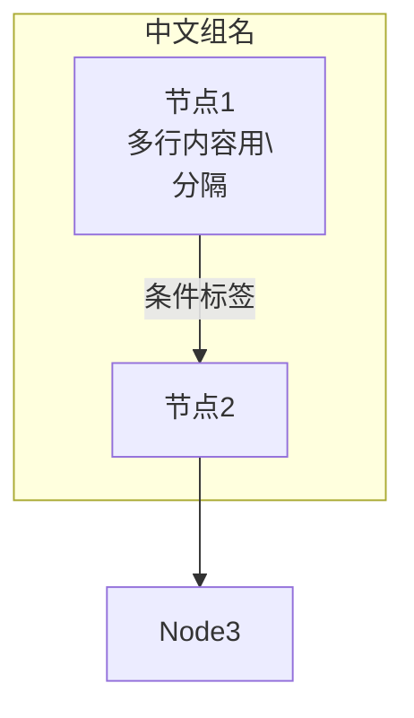

# ASCII框图替换为Mermaid流程图 - 实施计划

## 当前进度

### ✅ 已完成

| 文件 | 替换数量 | 状态 |
|------|---------|------|
| `docs/architecture/ARCHITECTURE.md` | 6处 | ✅ 全部完成 |
| `docs/architecture/FLOW.md` | 8处 | ✅ 全部完成 |
| `docs/architecture/components/KNOWLEDGE_LIFECYCLE.md` | 1处 | ✅ Agent Review流程图已替换 |
| `docs/architecture/components/INGESTION.md` | 4处 | ✅ 架构概览、候选状态机、提交流程、重复检测流程已替换 |

### ⏳ 待完成

| 文件 | 预估数量 | 优先级 |
|------|---------|--------|
| `docs/architecture/components/INGESTION.md` | 1处 | 高 - 人工解决流程 |
| `docs/architecture/components/RETRIEVAL.md` | 5处 | 高 - 各种检索模式流程图 |
| `docs/architecture/components/INDEXING.md` | 5处 | 高 - 架构概览、适配器流程等 |
| `docs/architecture/components/AUTH.md` | 2处 | 中 - 认证流程、密码重置 |
| `docs/architecture/components/GOVERNANCE.md` | 3处 | 中 - 等级继承、权限检查、访问密钥 |
| `docs/architecture/components/AI_PROVIDER.md` | 1处 | 中 - 提供商抽象架构 |
| `docs/architecture/components/DEDUPLICATION.md` | 1处 | 低 - 候选状态机 |
| `docs/README.md` | 1处 | 低 - 系统架构图 |
| 其他文档 | 若干 | 低 - PERSISTENCE、EVALUATION等 |

## 替换规范

### Mermaid语法要求



### 翻译原则

- 所有节点标签使用中文
- API路径、技术术语保留英文
- 状态值如 `'received'`、`'approved'` 保留原样
- 使用 `\n` 分隔多行内容

### subgraph分组策略

- 按流程阶段分组
- 按功能模块分组
- 按数据流向分组

## 执行顺序

1. 完成 `INGESTION.md` 剩余部分
2. 处理 `RETRIEVAL.md`（检索相关）
3. 处理 `INDEXING.md`（索引相关）
4. 处理 `AUTH.md`、`GOVERNANCE.md`、`AI_PROVIDER.md`
5. 处理 `DEDUPLICATION.md` 和其他低优先级文档
6. 验证所有Mermaid语法

## 验证方法

- 检查每个 ```mermaid 块的语法
- 确保 flowchart 方向统一使用 TB
- 确保所有 subgraph 正确闭合
- 确保所有箭头连接正确
