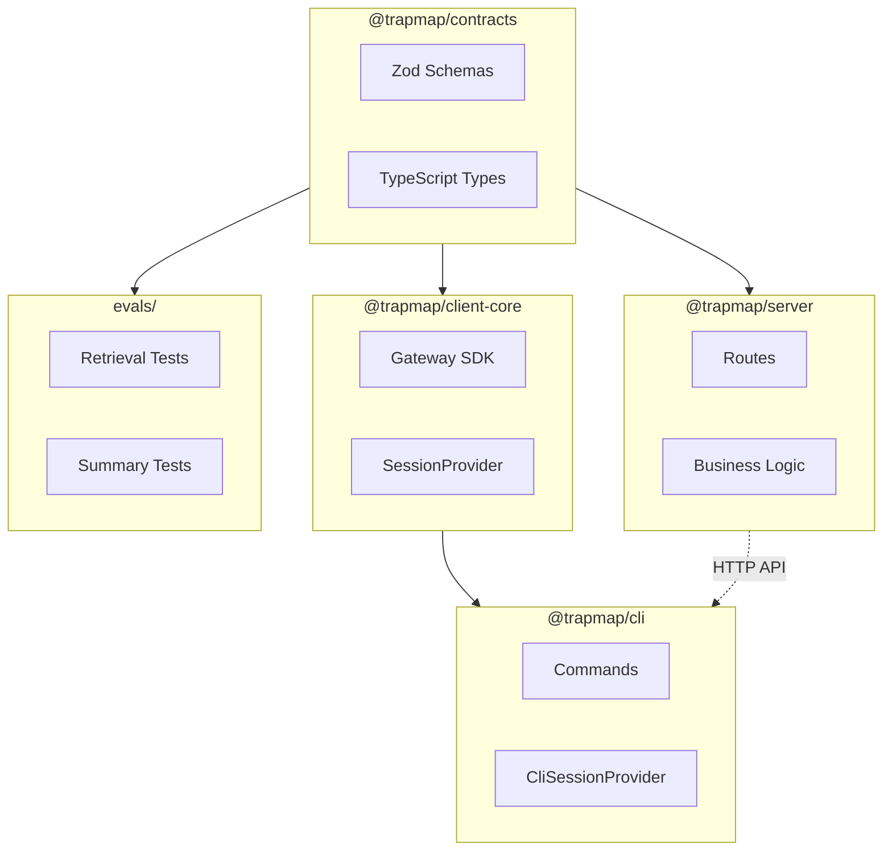

# TrapMap 包结构

本文档说明 TrapMap 各包的职责、接口和关键类型。若你关心的是“为什么选这套技术栈”，请配合阅读 [PACKAGE_STACK_RATIONALE.md（已归档）](archived/PACKAGE_STACK_RATIONALE.md)。

## 包概览

| 包 | 入口 | 职责 |
|----|------|------|
| `packages/client-core` | `src/index.ts` | 客户端共享 gateway 传输层：HTTP SDK、session contract、error model |
| `packages/cli` | `src/index.ts` | Commander.js CLI 客户端，用户交互终端入口 |
| `packages/backend-core` | `src/index.ts` | 宿主无关的后端核心内核、运行时能力模型与端口 |
| `packages/ai-providers` | `src/index.ts` | 共享 AI provider 配置、provider factory 与 chat/embedding contracts；不得依赖 server compatibility shell。 |
| `packages/service-identity-access` | `src/index.ts` | identity-access service assembly 与内部路由 |
| `packages/service-knowledge-read` | `src/index.ts` | knowledge-read service assembly 与检索读侧路由 |
| `packages/service-knowledge-write` | `src/index.ts` | knowledge-write service assembly 与 authoritative 写路径 |
| `packages/service-candidate-ingestion` | `src/index.ts` | candidate-ingestion service assembly 与候选处理路由 |
| `packages/service-governance-review` | `src/index.ts` | governance-review service assembly 与 review/feedback/conflict/remediation/operator routes |
| `packages/service-job-runtime` | `src/index.ts` | job-runtime service assembly、内部 route、typed handlers 与 queue/runtime server |
| `packages/host-local` | `src/index.ts` | `local-agent` / `team-monolith` 的 `light` 宿主装配；默认 `main` / `dev` / `start` 只进入 `src/nest/**` 主线，旧 Fastify 轻宿主路径已删除。 |
| `packages/host-distributed` | `src/index.ts` | `distributed` 的 `heavy` 重宿主装配 |
| ~~`packages/server（Wave-10 已删除）`~~ | ~~`src/index.ts`~~ | **已删除**（Wave-10）。原为 Fastify compatibility shell + shared runtime/status seam。 |
| `packages/contracts` | `src/index.ts` | 共享 Zod Schema 和 TypeScript 类型 |
| `packages/web-panel` | `src/main.tsx` | 管理员浏览器运维面板，继续只面向 gateway surface |
| `packages/skills` | `workflow-with-trapmap/SKILL.md` | 项目级 Skill 工作流与 CLI 使用指南 |

---

## Phase 0 冻结结论

- 当前架构整改主线以根 [`plan.md`](../plan.md) 和 [`docs/archived/archived-plans/trapmap-architecture-remediation-plan.md`](archived/archived-plans/trapmap-architecture-remediation-plan.md) 为准；`docs/archived/archived-plans/nestjs-service-evolution-00-target-architecture.md` 仅保留为历史目标架构背景输入。
- `docs/plans/runtime-recomposition/` 继续保留迁移背景，但不再承担当前阶段执行入口或唯一长期叙事。
- gateway 继续作为宿主拥有的外部适配层存在；Phase 0 不把 `packages/service-gateway` 作为当前主线 package 目标。
- `backend-core` 在 Phase 0 冻结为单包内核，先按模块边界收口，而不是预先切成多个 `domain-*` workspace 包。

## Phase 1 Server / Backend-Core boundary freeze

- `packages/server（Wave-10 已删除）` 保留 Fastify compatibility shell 与 shared runtime/status seam；当前仍负责 `packages/server（Wave-10 已删除）/src/app.ts`、`packages/server（Wave-10 已删除）/src/config.ts`、`packages/server（Wave-10 已删除）/src/lib/repos/index.ts`、`packages/server（Wave-10 已删除）/src/lib/persistence/schema/index.ts`，但不再被描述为默认 `light` 主应用主体。迁移 baseline 由各 service owner 本地维护。
- `packages/backend-core` 不是“仅接口”空壳。它继续承载 runtime capability model、internal ports、invocation contract、bounded-context module factory 与 testing utilities，作为 host-agnostic 内核被 `host-local`、`host-distributed` 和 `service-*` 复用。
- `packages/service-*` 只承载 owner-aligned thin assembly：`deps.ts`、`routes.ts`、`server.ts`、`index.ts`。它们暴露 backend-core owner module，但不定义自己的 schema/migration owner。
- `packages/host-local` 与 `packages/host-distributed` 负责 transport/DI/process composition；host-local 直接组合临时 shared runtime infrastructure，底层仍可暂时复用 `packages/server（Wave-10 已删除）` 的实现面。
- repository interface 的当前 target package 仍冻结在 `packages/server（Wave-10 已删除）/src/lib/*/repository.ts` 与 `packages/server（Wave-10 已删除）/src/lib/repos/index.ts`，Drizzle schema 与 migration owner 仍在 `packages/server（Wave-10 已删除）`，后续 phase 再决定是否抽出共享 seam。
- 高复杂度 domain logic 继续允许留在 `packages/server（Wave-10 已删除）` 的 compatibility/application debt 区，但文档必须把它们视为冻结中的过渡态，而不是新的 long-term owner。

## Phase 2 模块化单体边界冻结

- `backend-core` 继续保留单包，但其内部必须按六个 bounded context 收口到 `<context>/domain/`、`<context>/application/`、`<context>/module.ts`；`ports`、`invocation`、`runtime`、`testing` 继续作为共享且 framework-free 的顶层目录。当前六个 context 目录已经落地：`identity-access/`、`knowledge-read/`、`knowledge-write/`、`candidate-ingestion/`、`governance-review/`、`job-runtime/`；原 `src/modules/*.ts` compatibility re-export facade 已在 build-target closeout 的 Wave 1 清理中删除，消费方应直接使用真实 context 入口。
- `packages/host-local/src/nest/**` 是 `light` 默认主入口终局与真实宿主实现；`embedded/local-agent` 与 `team-monolith` 继续共用这套 module graph，两档 profile 只允许在 capability、provider wiring、route surface gating 上有差异。
- `packages/service-*` 继续只承载 thin assembly：`deps.ts`、`routes.ts`、`server.ts`、`index.ts`。业务规则不在这些包里分叉。
- `packages/server（Wave-10 已删除）` 是兼容壳；默认 `light` 主入口已经完全收敛到 `packages/host-local/src/nest/**`。
- `packages/host-distributed` 继续是 distributed profile 的部署展开层，但必须消费与 modular monolith 相同的 `backend-core` + `service-*` 主实现，而不是维护第二套 business truth。

## Phase 2 Store Snapshot / PG-first posture freeze

- `store_snapshot` 继续只扮演 compatibility JSONB store：它是 InMemory repository fallback、migration/backfill、startup recovery、部分 operator/admin mutation、以及少量 payload/projection seam 的载体，不是新的聚合 owner。
- PG-first 的当前真相是“生产主事实走 PostgreSQL 结构化表 + `repos.*`；兼容缓存/兼容快照按命名例外保留”。身份/审计、knowledge、artifact、candidate、feedback、usage、queue/outbox 已冻结为 PG-first domain，不得再在文档中写成依赖 `store_snapshot` 才能成立。对 `teams`、`members`、`access-keys` 这几条路由，PG-primary 事实已经成立，但它们当前仍保留 live no-PG / InMemory fallback，所以这里不能被写成“回退已完全删除”。
- InMemory 不是与 PG 对等的长期生产轨道。它只是在无 PG 场景和测试里，通过 `InMemory*Repository -> SkillShareerStore` 维持相同 repo/route contract 的 fallback posture。对仍保留 fallback 的 teams / members / access-keys 入口，这一姿态仍在运行中。
- direct `store.snapshot()` / `store.transact()` 入口当前仍集中在 compatibility shell 与 operator/admin seam：`teams`、`members`、`access-keys`、`knowledge`、`evidence`、`maintenance`、`admin-*`、`operations/artifacts-*`、`operations/skill-*`、`operations/migrate`、`operations/knowledge-legacy`，以及 startup recovery、index follow-up handlers、`lib/operations/read-model.ts`、`lib/session.ts`、`lib/knowledge/review-application-service.ts`。Wave-4 feedback-admin、remediation、conflict 和 badcase handler 已移出 server；Wave-9 的 `store_snapshot` 删除范围仍保持未执行。
- 当前 compatibility-cache 边界也已冻结：artifact / knowledge 等结构化真表优先，JSONB 只在 `artifactFilePayloads`、skill history full-data read、maintenance/operator projection helper 等命名 seam 中兜底；后续 phase 只能通过补 repo/projection capability 来缩小这条边界。

## Phase 3 Unified adapter boundary freeze

- 统一适配器不是 mega-adapter。它当前只覆盖 infrastructure/provider seam，不混入 repository、application service、gateway route/client 或 host composition owner。
- `backend-core` 只定义 port contract、invocation model 和 host-agnostic invocation semantics；它不拥有 concrete provider implementation，也不在本 phase 承诺抽出新的 shared provider package。
- `packages/host-local/src/nest/runtime/backend-core-adapters.ts` 是当前默认 `light` host 的 host-owned adapter selection seam，决定 `in-process` 与 `remote` 两种 port adapter，business code 不负责自行挑选实现。
- port-level remote adapter 不是 repository adapter。它把 remote HTTP call 包装成 port 语义，并把 transport failure 收口为 `InvocationError`，而不是把 `fetch`/`Response` 暴露给上层。
- `packages/host-distributed/src/gateway/internal-client.ts` 是 distributed gateway 的 thin transport helper / canonical error normalization seam；它负责内部 forwarding、header propagation 与 canonical body normalization，而不是业务编排或 repo adapter。
- `packages/host-distributed/src/shared/internal-knowledge-write-client.ts` 是 remote port client wrapper 示例：它消费 gateway internal client，把 transport 错误映射回 `InvocationError` / `KnowledgeWritePort` 语义，证明 remote client wrapper 与 gateway transport helper 属于不同层次。
- `packages/server（Wave-10 已删除）/src/lib/ai/**` 与 `packages/server（Wave-10 已删除）/src/lib/indexing/adapters/**` 继续是 server-owned concrete infrastructure/provider implementation。Phase 3 冻结 taxonomy 和 owner，不把它们提前描述成 `backend-core` provider contract，也不把它们抽离成新的 shared workspace package。
- gateway client 和 remote adapter 不是 repository adapters；repository / persistence seam 仍继续冻结在 repo-owned boundary。`packages/server（Wave-10 已删除）/src/lib/repos/**`、`packages/server（Wave-10 已删除）/src/lib/*/repository.ts` 与 persistence implementation 不属于 unified adapter 目录。
- host-local runtime composition 暂时借用 `packages/server（Wave-10 已删除）` 的 shared infra helpers；它不是 `packages/server（Wave-10 已删除）` 仍是默认 host owner 的证据，也不是统一适配器范围应该无限扩大到 host bootstrap 的依据。

## Phase 4 数据、运维与退役收尾

- 仓库级 owner matrix（gateway + 六个 owner service + job-runtime 的 data / projection / runtime / operations owner）已冻结，详见 [`plan.md`](../plan.md) Phase 4 和 [`docs/archived/archived-plans/nestjs-service-evolution-04-data-runtime-and-cutover-archived.md`](archived/archived-plans/nestjs-service-evolution-04-data-runtime-and-cutover-archived.md)。
- `packages/server（Wave-10 已删除）` 中 candidate apply-resolution、knowledge review、maintenance、decay 旧 Fastify 写路由都已删除。`light` 默认 review/manual-result/apply-resolution 写链路现由 `packages/host-local/src/nest/gateway/gateway.route-defs.ts` 直接委托 `governance-review` / `candidate-ingestion` owner port；candidate-ingestion 再通过 `KnowledgeWritePort` 完成最终 aggregate mutation，而不是回落到 `packages/server（Wave-10 已删除）`。
- `packages/backend-core/src/modules/*.ts` 兼容 re-export facade 已退役并删除；truth source 只保留真实 context 目录入口。
- `packages/host-distributed` 与 `packages/service-*` 不是 compatibility shell，继续保留为分布式部署展开层和 thin service assembly。
- `packages/host-local/src/nest/**` 是冻结后的默认 `light` 主入口终局和 bounded-context module graph，不属于 compatibility shell。

## Phase 4 Adapter env / target-pruning freeze

- Phase 4 的 adapter env freeze 只收口 selector env 与 owner-specific env truth，不把配置层改写成新的 mega taxonomy。selector env 继续以 `TRAPMAP_DEPLOYMENT_PROFILE`、`TRAPMAP_DEPLOYMENT_PRESET`、`TRAPMAP_TASK_TRANSPORT` 为中心；AI provider env 继续留在 `packages/server（Wave-10 已删除）` / shared runtime seam；distributed internal service URL env 继续留在 `packages/host-distributed` owner seam。
- 推荐组合冻结为 `local-agent` / `team-monolith` -> `light`，`distributed` -> `heavy`。这表示 `local-agent` 继续是 in-process/internal defaults + `json-store-ok` posture，`team-monolith` 继续是 `postgres-required` + `gateway-core` + `split-owned` async posture，而 `distributed` 继续是 service/gateway split + `remote-expected` async posture。
- fail-fast / fallback 规则不再允许文档写模糊话术：`rabbitmq` 缺少 RabbitMQ config 时必须 fail-fast；`distributed` 缺少 PostgreSQL 不能被描述成仍支持 JSON-store runtime；`local-agent` 允许保持 JSON store fallback；`in-process` mode 下 internal service URLs 继续只是 ignored config。
- target-pruning posture 冻结为文档边界，不夸大实现程度：`light` 与 `heavy` 是 build/deployment targets，不是新的 runtime profiles；optional dependency、tree-shaking 与 target-pruning 仅可写成当前 intent / non-goal，除非代码明确证明，否则不能声称已经具备自动化 optional dependency pruning。

## Phase 5 Distributed baseline freeze

- `distributed` 当前成熟度继续冻结为 `Level 2 / transitional-microservice`。它不是 fake split，也不是 mature service-autonomous platform；后续文档必须同时保留这两个边界。
- gateway-only external access 继续是当前正式入口事实。CLI 与外部调用方仍只面向 gateway，不能把内部 service URL 写成 public integration surface。
- `packages/host-distributed` 与 `packages/service-*` 继续证明这是“真实分布式”：存在真实 service process、真实 owner-aligned process assembly，以及真实 HTTP-based inter-service communication，而不是单进程内模拟出来的 hop。
- shared PostgreSQL (Transitional) 继续是当前 distributed 的主要持久化底座。shared queue/outbox、auth/session 和部分 shared runtime seam 仍是过渡复用，不得写成每个服务已拥有完全独立 persistence substrate。
- retrieval 当前仍保留逻辑服务 seam，而不是已落地成独立 runtime binary；因此 distributed 文案只能写“服务边界已开始收口”，不能夸大成“所有 bounded context 都已独立部署自治”。
- compose / runtime 叙事继续冻结为当前拓扑证据：`docker-compose.yml` 证明 `distributed` profile 会展开 gateway 与多个 service/worker 进程，并通过环境变量连到真实 internal surface；这不是 service discovery、K8s orchestration 或成熟平台化能力的证据。
- deferred boundary 当前必须显式保留在 platform follow-up：service discovery、K8s/platformization、per-service database、全链路 tracing、以及更强 isolation/autonomy claim 继续 deferred，不纳入 Phase 5 当前 state。

## Phase 6 Mature capability freeze

- `internal client + resilience` 当前已经是主线 shared runtime seam，但不是完整 mature-service platform stack。`packages/host-distributed/src/gateway/internal-client.ts`、`packages/server（Wave-10 已删除）/src/lib/runtime/resilience.ts` 与 `packages/server（Wave-10 已删除）/src/lib/runtime/metrics.ts` 证明当前存在 internal forwarding、canonical error normalization、timeout/retry/degraded 统计与 shared runtime helper；它们不能被改写成“平台层 resilience 已全面产品化”。
- `tracing + metrics` 当前只冻结到现有 request/trace headers、runtime metrics snapshot、operator summary、以及低基数 label discipline。文档不得把这层夸大成完整 distributed tracing、外部 metrics backend、或 per-service telemetry platform 已落地。
- `rate limiting + bulkhead / 背压` 当前不是 runtime built-in default。即使 compatibility shell 仍保留 `rateLimitMaxPerMinute` 这类 config seam，也只能写成 follow-up capability order，而不是 host-local 或 distributed 已默认拥有 service bulkhead / adaptive backpressure。
- retrieval-side `cache + invalidation` 当前是 active seam，而不是自治缓存平台。`packages/server（Wave-10 已删除）/src/lib/cache/invalidation.ts`、read-model cache、intent cache 与 operator status/stats surface 证明当前有 freshness / invalidation contract；它们不构成 remote cache fabric、service-owned cache budget、或 service-autonomous cache substrate 的当前-state claim。
- `service discovery`、`DB budget / PgBouncer`、以及 richer `health indicator` rollout 继续冻结为 adoption conditions。当前 distributed 仍使用 checked-in URL env 与 shared PostgreSQL；pool budget / PgBouncer 还只是 operator/capacity follow-up；health/readiness surface 已存在，但 richer rollout policy 不应被描述成当前平台保证。
- `light` 与 `heavy` 只冻结不同默认策略姿态。`light` 继续以 host-local、in-process 默认、较少 remote dependency 为主；`heavy` 继续以 distributed、gateway + internal HTTP hop、shared PostgreSQL、remote-expected async posture 为主。这里的区别是 adoption posture，不是新 runtime behavior，也不是证明 `heavy` 已自动具备 tracing/discovery/bulkhead 默认值。
- graph runtime 继续使用同一组 `TRAPMAP_GRAPH_DB_*` env family，但文档必须承认当前实现只是 shared config family + partial shared consumer seam。`packages/server（Wave-10 已删除）` compatibility shell、`host-local` 默认主线、distributed gateway/service/worker 不能在没有源码证据时被写成 graph provider、readiness disposition、fail-open behavior 完全等价。

### Phase 6 Wave 6D replacement matrix freeze

- `优先引成熟库`：当前优先复用 repo 已有 seam，包括 internal client、shared resilience helper、runtime metrics snapshot、cache invalidation seam。Phase 6 的当前事实是先把这些能力当作 shared runtime surface 维护，而不是立即替换成新的平台库。
- `条件成熟后引入`：只有在真实吞吐、独立故障域、外部 telemetry / discovery、或 database pool governance 需求持续存在时，才把对应成熟库纳入 follow-up。当前这类候选包括 richer tracing / observability backend、service discovery、以及 DB budget / PgBouncer rollout。
- `暂不替换`：service-autonomous remote cache、完整 distributed tracing platform、以及默认内建的 bulkhead / adaptive backpressure 继续冻结为 deferred capability，不得在 secondary docs 中写成已决定替换或已默认落地。

## packages/contracts

共享 Schema 和类型定义，同时被 CLI 和 Server 导入。

### 导出域

| 域 | 文件 | 说明 |
|----|------|------|
| auth | `domain/auth.ts` | 登录、会话、访问密钥 Schema |
| team | `domain/team.ts` | 团队、成员 Schema |
| knowledge | `domain/knowledge.ts` | 知识条目生命周期 Schema |
| review | `domain/review.ts` | 审核决策 Schema |
| retrieval | `domain/retrieval.ts` | 检索查询/响应 Schema |
| operations | `domain/operations.ts` | 导入/导出 Schema |
| candidates | `domain/candidates.ts` | 异步摄取候选 Schema |
| artifacts | `domain/artifacts.ts` | Skill 工件 Schema |
| evals | `domain/evals/` | 评估相关 Schema |
| feedback | `domain/feedback.ts` | 用户反馈 Schema、remediation/suppression 聚合状态与管理员队列契约 |
| decay | `domain/decay.ts` | Decay 管理 Schema |
| maintenance | `domain/maintenance.ts` | 维护管理 Schema |
| evidence | `domain/evidence.ts` | Evidence 元数据 Schema |
| admin | `domain/admin.ts` | 管理员操作 Schema |
| boundary | `domain/boundary.ts` | 边界约束 Schema |
| common | `domain/common.ts` | 共享通用类型、sha256/mediaType 验证辅助 |
| conflict | `domain/conflict.ts` | 冲突检测 Schema |
| graph-extraction | `domain/graph-extraction.ts` | 图提取 Schema |
| plans | `domain/plans.ts` | 执行计划 Schema |
| parsing | `domain/parsing.ts` | 解析规则（frontmatter 等） |
| path-validation | `domain/path-validation.ts` | 路径安全验证 |

> **Source of truth**: Shared validation helpers (`canonicalPathSchema`, `sha256HexSchema`, `mediaTypeSchema`) are defined in `common.ts` and `path-validation.ts` and reused across all domain files. Always import these helpers rather than duplicating validation logic.

### 关键类型

```typescript
// 检索响应
import { retrievalResponseSchema } from '@trapmap/contracts';

// 知识条目
import { knowledgeEntrySchema } from '@trapmap/contracts';

// 审核决策
import { reviewDecisionRequestSchema } from '@trapmap/contracts';
```

---

## ~~packages/server（Wave-10 已删除）~~

**已删除**（Wave-10，提交 `a66d94e6`）。原为 Fastify compatibility shell + shared runtime/status seam。

当前架构：`backend-core` + `service-*` + `host-local` / `host-distributed`。各 service owner 包通过 owner-local PostgreSQL bundle 管理数据。详见 `docs/archived/archived-plans/compatibility-shell-retirement-runtime-infra-ownership.md`。

### Runtime 与部署词汇

Server 相关文档默认使用以下术语，不再混用：

| 术语 | 当前含义 | 当前实现状态 |
|---|---|---|
| `deployment profile` | 产品/部署目标形态：`local-agent`、`team-monolith`、`distributed` | 计划层已冻结，能力模型在后续阶段继续落地 |
| `deployment preset` | 启动快捷方式/兼容输入：`monolith`、`api`、`candidate-worker`、`governance-worker`、`outbox-worker` | 已在 `packages/server（Wave-10 已删除）/src/config.ts` 与 `lib/runtime/deployment-preset.ts` 中实现 |
| `runtimeMode` | 当前进程是否暴露 API、task worker、outbox worker | 已实现 |
| `serviceUnit` | 当前进程拥有哪类 bounded-context async ownership | 已实现 |
| `task transport` | 任务投递走 PostgreSQL 还是 RabbitMQ | 已实现 |

`deployment profile` 不等同于 `deployment preset`。前者描述目标产品形态，后者只负责把当前进程解析到既有的 `runtimeMode × serviceUnit` 组合上。

P1 之后，server runtime 会统一生成 `ResolvedRuntimeDeployment`，其中至少包含：

- `deploymentProfile`
- `preset`
- `runtimeMode`
- `serviceUnit`
- `topology`
- `capabilities.routeSurface`
- `capabilities.asyncOwnershipExpectation`
- `capabilities.storagePosture`
- `capabilities.authTeamExpectation`

路由暴露、worker ownership、`/health`、`/ready`、`/v1/operations/status/async` 都消费这同一份解析结果，不再各自散落推导。

P3 起，`topology` 会把 distributed 第一阶段的正式服务词汇固化到 runtime seams：

- `gateway`
- `retrieval`
- `candidate-ingestion`
- `governance`
- `outbox-runtime`

当前实现仍保持单个 `packages/server（Wave-10 已删除）` 包和共享 PostgreSQL，不平行实现第二套后端；拓扑的事实源是 runtime metadata，而不是仅靠 docker compose 命名。

> **Round 2 更新**：知识、工件、候选的持久化已迁移到 PostgreSQL 专用表。`DualWriteKnowledgeRepository`、`DualWriteCandidateRepository`、`DualWriteArtifactRepository` 已删除。路由层不再对 `store_snapshot` 进行业务读写（审查/衰减/维护等操作仍用于审计/索引等辅助目的，延后至各轮次处理）。
>
> **Round 8 更新**：命名规范已统一（`revision` → `revision_no`，`submitted_by` → `submitted_by_user_id`）。所有核心表已补齐外键约束。`store_snapshot` 仅作为尚未迁移辅助域的兼容层，不再是 PG 主读路径用于身份/审计域；这些域的迁移已在 Round 10 Phase 3 完成。权威的迁移状态记录见 [reference/DATA_MODEL.md](reference/DATA_MODEL.md)。
>
> **Round 4 更新**：Skill Artifact 域已补入结构化子表，当前采用“结构化事实源 + JSONB 兼容缓存”双表示。`artifact_revisions.files`、`script_descriptors`、`derived` 不再被视为唯一事实源；对应真表为 `skill_artifact_files`、`skill_artifact_script_descriptors`、`skill_artifact_profiles`、`skill_artifact_capsules`、`skill_artifact_client_manifests` 与 `skill_artifact_manifest_*`。`PgArtifactRepository` 负责同步维护两套表示，并优先从结构化子表读取。

**写入顺序**：JSONB 缓存先写入 → 结构化子表后覆盖写入。**读取优先级**：结构化子表优先，空时 fallback 到 JSONB 缓存（`reconstructSkillArtifactRecord()` 中 `??` 模式）。

**Artifact 仓库代码阅读入口**：
- 接口定义：`packages/server（Wave-10 已删除）/src/lib/artifacts/repository.ts`（`ArtifactRepository` 接口）
- PG 实现：`packages/server（Wave-10 已删除）/src/lib/artifacts/pg-repository/`（`PgArtifactRepository` 类及辅助模块）
  - `index.ts` — `PgArtifactRepository` 类（委托给辅助模块）
  - `revision-reader.ts` — `loadStructuredRevisionData()`（结构化读取）
  - `revision-writer.ts` — `upsertStructuredRevisionRows()` + `replaceStructuredDerivedRows()`（结构化写入）
  - `record-reconstruction.ts` — `reconstructSkillArtifactRecord()`（重建逻辑）
  - `derived-store.ts` — boundary / maintenance / agent-review / metadata CRUD
- Schema 定义：`packages/server（Wave-10 已删除）/src/lib/persistence/schema/artifacts.ts`（所有 `skill_artifact_*` 表）
- 迁移文件：`packages/server（Wave-10 已删除）/drizzle/0007_round4_artifact_structural.sql`
- Artifact 路由：`packages/server（Wave-10 已删除）/src/routes/operations/artifacts-import.ts`、`artifacts-export.ts`、`artifacts-activate.ts`
- 完整事实源/缓存规则：`docs/plans/round4-cross-table-consistency-plan.md` 阶段 0 结论

### 持久化层

**规范服务边界**：组合层仍可从 `app.skillShareer.repos`（`SkillShareerRepos`）取仓库实例，但关键 application services 应注入最小 repo ports，而不是整包 repos。Actor 查找（用户 handle、成员安全等级）通过 `lib/actors/lookup.ts` 使用 `repos.user` 和 `repos.membership`，不再依赖 `store.snapshot()`。`store_snapshot` 仅作为未迁移辅助域和 supersede 工作流的兼容层。

| 仓库 | 文件 | 存储后端 |
|------|------|----------|
| `KnowledgeRepository` | `lib/knowledge/repository.ts` | PG (`PgKnowledgeRepository`) 或 JSON (`InMemoryKnowledgeRepository`) |
| `ArtifactRepository` | `lib/artifacts/repository.ts` | PG (`PgArtifactRepository`) 或 JSON (`InMemoryArtifactRepository`) |
| `CandidateRepository` | `lib/candidates/repository.ts` | PG (`PgCandidateRepository`) 或 JSON (`InMemoryCandidateRepository`) |

> **Phase 2 更新**：`buildNormalizedDuplicateInput`（`packages/server（Wave-10 已删除）/src/lib/candidates/fingerprint.ts`）是 trap 与 skill 候选的共享归一化入口，输出 `NormalizedDuplicateInput`（`packages/server（Wave-10 已删除）/src/lib/candidates/types.ts`）并被 in-memory / PostgreSQL 探测器与 LLM 精排共享，确保 skill 候选也产出非空 title/body 用于 PG embedding 与 LLM 比对。
>
> **Phase 0 更新**：PostgreSQL 模式下，`createAndEnqueueCandidate()` 通过 `PostgresStore.transactWithPgClient()` 将候选创建、初始状态更新、以及 `asyncTransport.queue` 上的 `candidate_processing` 注册放进同一事务；`task_queue` / `domain_event_outbox` 都携带 lease 与 reclaim 元数据，worker 启动后可回收过期 `running` / `processing` 记录。
>
> **Phase 1 更新**：queue / outbox 仍保持两套独立抽象，但 operator 入口统一收敛到 `routes/operations/status.ts`。`lib/queue/task-queue.ts` 与 `lib/lifecycle/outbox.ts` 负责各自的 status snapshot、dead-letter / failed-event 可视化与 reclaim 计数；runtime health surfaces 只消费这些 snapshot，不直接读取原始表。
>
> **Phase 2 更新**：server runtime 现在用 `runtimeMode × serviceUnit` 表达启动语义。`runtimeMode` 仍区分 `api`、`task-worker`、`outbox-worker`、`combined`，而 `TRAPMAP_SERVICE_UNIT` 进一步声明当前进程拥有哪类 bounded-context async work：`candidate-ingestion` 只拥有 candidate task work，`knowledge-governance` 拥有 shared-job task work 与 outbox work，`full-platform` 拥有全部。`src/index.ts` 与 `src/worker.ts` 共用 `bootstrap/run-startup-sequence.ts` / `bootstrap/run-worker-sequence.ts`，避免重复初始化仓库、配置和 bootstrap 逻辑。
>
> **Phase 3 更新**：`lib/workflows/` 持有长任务运行快照的持久化与类型。当前由 candidate processing 和 capsule-index rebuild 写入 `workflow_runs`，而 `routes/operations/status.ts` 负责把最近 workflow runs 暴露到 operator status family。
>
> **Phase 4 更新**：retrieval 路由负责生成并公开 `queryId`；gateway 将 feedback 请求转发给 `governance-review`，由 owner 接收最小 badcase envelope，并在 PostgreSQL 模式下把可复现快照写入 `retrieval_badcase_traces`。usage analytics 仍可复用 `queryId` 做关联，但不再是 badcase reconstruction 的唯一事实源。
>
> **Phase 5 更新**：`service-job-runtime` 是共享派生重活的统一执行入口。候选处理之外，生命周期索引 follow-up、governance-review 的 conflict detection、feedback remediation 完成后的 reactivation/reindex follow-up、以及 badcase export draft generation 都通过 typed task contract 进入 `task_queue` + `workflow_runs`；job-runtime 保留 queue、retry、lease、dead-letter，治理 owner 只提供业务 handler/command。
>
> **Phase 6 更新**：retrieval-side process-local caches 现在被显式视为 derived artifacts，而不是“透明优化”。`lib/cache/retrieval-read-model-cache.ts` 持有 read-model 缓存，`lib/retrieval/capsules/intent-cache.ts` 持有意图缓存；两者都通过 `lib/cache/invalidation.ts` 接受 shared invalidation events。生命周期 approval/deactivation、remediation suppression、remediation reactivation 都会清理 retrieval caches，operator 可在 `/v1/operations/status/async` 查看 cache hit/miss/eviction/invalidation 指标。
| `UsageAnalyticsRepository` | `lib/analytics/repository.ts` | PG (`PgUsageAnalyticsRepository`) 或 InMemory (no-op) |
| `AccessKeyRepository` | `lib/auth/repository.ts` | PG (`PgAccessKeyRepository`) 或 JSON (`InMemoryAccessKeyRepository`) |
| `SessionRepository` | `lib/auth/repository.ts` | PG (`PgSessionRepository`) 或 JSON (`InMemorySessionRepository`) |
| `UserRepository` | `lib/users/repository.ts` | PG (`PgUserRepository`) 或 JSON (`InMemoryUserRepository`) |
| `TeamRepository` | `lib/teams/repository.ts` | PG (`PgTeamRepository`) 或 JSON (`InMemoryTeamRepository`) |
| `MembershipRepository` | `lib/teams/repository.ts` | PG (`PgMembershipRepository`) 或 JSON (`InMemoryMembershipRepository`) |

> **Phase 2 更新**：`POST /v1/access-keys`、`POST/PATCH /v1/members`、`GET/POST /v1/teams` 在仓库可用时优先走 `repos.*`，但 compatibility shell 仍保留 InMemory / no-PG fallback，因此这些 route 文件今天仍是 `store.transact()` / `store.snapshot()` inventory 的一部分。Auth 路由（login/session/logout）已在 PG 模式下使用 `repos.session`、`repos.accessKey`、`repos.membership`；成员 `securityLevel` 也已按 caller-provided value 持久化，而不是硬编码为 0。

### 路由模块

| 文件 | 端点前缀 | 说明 |
|------|----------|------|
| `routes/auth.ts` | `/v1/auth` | 认证 |
| `routes/teams.ts` | `/v1/teams` | 团队管理 |
| `routes/members.ts` | `/v1/members` | 成员管理 |
| `routes/access-keys.ts` | `/v1/access-keys` | 访问密钥签发 |
| `routes/knowledge.ts` | `/v1/knowledge` | 知识条目 CRUD，通过 `KnowledgeApplicationService` 执行提交/重提/取代 |
| `host-local/src/nest/gateway/candidate-review.controller.ts` + `host-distributed/src/gateway/routes.ts` | `/v1/knowledge/review` | 审核工作流；默认写链路委托 `governance-review` owner |
| `routes/evidence.ts` | `/v1/knowledge/:id/evidence` | 知识条目 evidence 元数据更新 |
| `routes/retrieval.ts` | `/v1/retrieval`、`/v2/retrieval`、`/v3/retrieval` | 检索（v1/v2/v3），通过 `buildRetrievalReadModel()` 从仓库读取数据 |
| `routes/operations.ts` | `/v1/operations` | 导入/导出（注册子路由：audit、knowledge-legacy、artifacts-export/import/activate、migrate、status、skill-edit、skill-review、stats） |
| `routes/candidates.ts` | `/v1/candidates`、`/v1/duplicates` | 异步摄取与重复检测 |
| `routes/traps.ts` | `/v1/traps` | Trap 管理（与 knowledge 共享同一 `KnowledgeApplicationService` 工作流） |
| `host-distributed/src/gateway/routes.ts` + `service-governance-review/src/routes.ts` | `/v1/feedback` | gateway 保留 public URL，governance-review owner 写入用户反馈 |
| `host-distributed/src/gateway/routes.ts` + `service-governance-review/src/admin.ts` | `/v1/operations/feedback*` | gateway 保留 feedback admin/remediation public URLs，governance-review owner 提供内部 API |
| `routes/decay.ts` | `/v1/operations/decay` | Decay 管理 |
| `routes/maintenance.ts` | `/v1/operations/maintenance` | 维护管理 |
| `routes/admin-boundary-search.ts` | `/admin/boundary-search` | 管理员边界搜索 |
| `routes/admin-benchmark.ts` | `/admin/benchmark` | 管理员基准测试 |

### Shared Jobs

| 模块 | 文件 | 说明 |
|------|------|------|
| shared jobs | `service-job-runtime/src/` | 统一 task contracts、scheduler、typed handlers 与运行时状态 |
| governance handlers | `service-governance-review/src/async-commands.ts`、`service-job-runtime/src/handlers/` | remediation reactivation、badcase export draft、conflict detection 的 owner command 与 job-runtime consumer |
| worker bootstrap | `service-job-runtime` + host composition | job-runtime 注册 queue/lease/retry/dead-letter worker；governance 只注入业务 handlers |

> **Wiring debt convergence 更新**：知识生命周期的 PG 投影发布统一走 `emitLifecycleTransition()` / `createLifecyclePublisher()`，异步底座统一从 `app.skillShareer.asyncTransport` 暴露。业务写路径不再直接拼装 `task_queue` / `domain_event_outbox`；JSON 模式仅保留同步 event bus 兼容回退。

### 配置

```typescript
// src/config.ts
import { loadConfig } from './config.js';

const config = loadConfig();
```

For package-local navigation, read:

- `packages/server（Wave-10 已删除）/src/lib/README.md`
- `packages/server（Wave-10 已删除）/src/routes/README.md`

---

## packages/client-core

客户端共享 gateway 传输层，从 CLI 中提取。浏览器兼容，仅依赖标准 `fetch` API。

### 导出

| 导出 | 类型 | 说明 |
|------|------|------|
| `apiRequest` | function | 对 gateway 发起带类型的 HTTP 请求 |
| `ApiError` | class | 统一 gateway 错误，含状态码和 payload |
| `SessionProvider` | interface | base URL 和 session token 的注入契约 |
| `ApiResponse<T>` | type | 成功响应包装 |
| `RequestOptions` | type | 单次请求选项 |

CLI 通过 `CliSessionProvider`（`packages/cli/src/lib/client-core-adapter.ts`）实现 `SessionProvider`，将 `CliState` 桥接到 client-core 的通用契约。

---

## packages/cli

命令行接口，命令格式明确，shell 友好输出，支持可选 JSON 模式。

CLI 当前正式接入模型固定为单一 gateway：

- `packages/cli/src/lib/http.ts` 只基于一个 gateway URL 发起请求。
- `packages/cli/src/lib/config.ts` 只持久化一个 `gatewayUrl`，并兼容读取旧 `serverUrl`。
- 即使后端后续演进到 `distributed` profile，CLI 仍然只连接统一 gateway，不直接感知微服务拆分。

### 命令模块

| 命令 | 文件 | 说明 |
|------|------|------|
| `auth` | `commands/auth.ts` | 登录/登出 |
| `team` | `commands/team.ts` | 团队管理 |
| `member` | `commands/member.ts` | 成员管理 |
| `knowledge` | `commands/knowledge.ts` | 知识提交/查询 |
| `review` | `commands/review.ts` | 审核操作 |
| `retrieval` | `commands/retrieval.ts` | 检索命令 |
| `operations` | `commands/operations.ts` | 导入/导出/列表/激活/状态/迁移/编辑/停用 |
| `audit` | `commands/audit.ts` | 审计日志 |
| `trap` | `commands/trap.ts` | Trap 管理 |
| `skill` | `commands/skill.ts` | Skill 管理 |
| `feedback` | `commands/feedback.ts` | 反馈提交 |
| `feedback-admin` | `commands/feedback-admin.ts` | 反馈管理（管理员） |
| `decay` | `commands/decay.ts` | Decay 管理 |
| `maintenance` | `commands/maintenance.ts` | 维护管理 |
| `evidence` | `commands/evidence.ts` | Evidence 元数据更新 |
| `load` | `commands/load.ts` | 数据加载 |

### Operations 权限模型

Operations 命令组使用细粒度权限标志，每个子命令独立控制：

| 权限标志 | 控制命令 | 映射自 `visibility` |
|----------|----------|---------------------|
| `allowList` | `list` | `allowKnowledgeExport` |
| `allowEdit` | `edit` | `allowKnowledgeUpdate` |
| `allowDeactivate` | `deactivate` | `allowKnowledgeDeactivate` |
| `allowExport` | `export`, `artifact-export` | `allowKnowledgeExport` |
| `allowImport` | `import` | `allowKnowledgeImport` |
| `allowActivate` | `activate` | `allowKnowledgeExport` |
| `allowMigrate` | `migrate` | `allowKnowledgeImport` |
| `allowStatus` | `status` | `allowKnowledgeExport` |

### 输出模式

```bash
# 人类可读输出（默认）
pnpm --filter @trapmap/cli dev -- knowledge search "如何处理 N+1"

# JSON 模式（机器解析）
pnpm --filter @trapmap/cli dev -- knowledge search "如何处理 N+1" --json
```

### 状态管理

```typescript
// src/lib/config.ts
import { loadCliState } from './lib/config.js';

const cliState = await loadCliState();
const session = cliState.session;
```

配置文件路径默认使用 `os.homedir()`。在无 HOME 环境的容器化部署中，`getConfigPath` 会自动回退到 `os.tmpdir()`。

---

## packages/skills

当前包含两个 skill：`workflow-with-trapmap` 用于规范 TrapMap 相关规划、检索、评审和经验沉淀流程；`trapmap-cli-usage-guide` 用于提供按阶段组织的 CLI 命令索引。

```
workflow-with-trapmap/
├── SKILL.md          # 入口文件：工作流定义和控制路径
├── agents/           # 子智能体定义
└── references/       # 工作流参考资料

trapmap-cli-usage-guide/
├── SKILL.md          # 入口文件：CLI 使用边界与装载时机
└── references/       # CLI 命令索引
```

**控制路径**：`workflow-with-trapmap/SKILL.md` 定义知识条目的完整工作流；`trapmap-cli-usage-guide/SKILL.md` 则提供命令签名查询入口，避免把工作流和命令索引耦合在一个 skill 中。

> 源码：`packages/skills/workflow-with-trapmap/SKILL.md`、`packages/skills/trapmap-cli-usage-guide/SKILL.md`

---

## 包依赖关系



**依赖说明:**
- `@trapmap/contracts` 被所有其他包依赖，定义共享 Schema 和类型
- `@trapmap/client-core` 依赖 contracts，提供浏览器兼容的 gateway SDK
- `@trapmap/server` 依赖 contracts，提供 REST API
- `@trapmap/cli` 依赖 contracts、client-core 和 server (via HTTP)
- `evals/` 依赖 contracts 进行测试验证

---

## Phase 0 冻结的目标包布局

> 以 [`plan.md`](../plan.md) 和 [`docs/archived/archived-plans/trapmap-architecture-remediation-plan.md`](archived/archived-plans/trapmap-architecture-remediation-plan.md) 为准；`docs/archived/archived-plans/nestjs-service-evolution-00-target-architecture.md` 与 `docs/plans/runtime-recomposition/` 只保留历史目标/迁移背景输入。

### 包角色与迁移决策

| 类别 | 包 / 目录 | Phase 0 冻结决策 |
|---|---|---|
| client | `packages/client-core` | 保持 gateway SDK 角色，不依赖 `backend-core` 或内部服务包 |
| client | `packages/cli` | 继续只连统一 gateway；对后端是单 URL 视角 |
| client | `packages/web-panel` | 保持管理员浏览器面板角色；继续只消费 gateway API |
| kernel | `packages/backend-core` | 保留单包，持续按 bounded-context 模块收口，不预拆成多个 `domain-*` workspace 包 |
| shared contracts | `packages/contracts` | 继续作为 HTTP、internal、event contract 的共享事实源 |
| service assembly | `packages/service-identity-access` | 保留，承载 identity-access owner 的内部路由与装配 |
| service assembly | `packages/service-knowledge-read` | 保留，承载 retrieval/read-model/freshness contract |
| service assembly | `packages/service-knowledge-write` | 保留，承载 authoritative knowledge/trap/lifecycle 写路径 |
| service assembly | `packages/service-candidate-ingestion` | 保留，承载 candidate owner 并通过 `KnowledgeWritePort` 发布结果 |
| service assembly | `packages/service-governance-review` | 保留，承载 review/feedback/governance owner；Phase 0 不重命名 |
| service assembly | `packages/service-job-runtime` | 保留，承载 queue / outbox / workflow runtime owner |
| light host | `packages/host-local` | 保留；`local-agent` / `team-monolith` 都映射到 `light`，冻结默认主入口终局为 `src/nest/**` |
| heavy host | `packages/host-distributed` | 保留；`distributed` 映射到 `heavy`，继续作为重宿主与部署展开点 |
| compatibility shell | `packages/server（Wave-10 已删除）` | 继续缩减，只保留 shared runtime/status seam 与必要的 Fastify compatibility 面 |
| project workflow | `packages/skills` | 保留，不受宿主迁移主线影响 |
| deferred / not-on-mainline | `packages/service-gateway` | 不创建；gateway 是宿主拥有的外部适配层，不是当前主线里的独立 service package |

### 运行模型与宿主分工

- `embedded/local-agent`：是 `local-agent` 的产品语义，映射到 `light`；继续由 `host-local` 提供，要求单用户、单端口、低依赖、`in-process` 优先。
- `team-monolith`：映射到 `light`；继续由 `host-local` 提供，要求单进程完整治理与 PostgreSQL 主路径。
- `distributed`：映射到 `heavy`；继续由 `host-distributed` 提供，作为 gateway + 六个 bounded-context owner + runtime worker 的部署展开；当前成熟度冻结为 `Level 2 / transitional-microservice`。
- 未来切换到 NestJS 时，替换的是 host/transport/DI 层，而不是 `backend-core`、`contracts` 或 service owner contract。

### 依赖方向

```
contracts ────────────────────────────────────────────────┐
    │                                                     │
    ├── client-core ──> cli                              │
    ├── gateway API ──> web-panel                        │
    │                                                     │
    └── backend-core <── service-* <── host-local / host-distributed
                                 ▲
                                 │
                        server (compatibility shell)
```

关键约束：

1. 所有客户端都只对 gateway surface 编程，不直连内部服务。
2. `backend-core` 是框架无关内核；Nest/Fastify 都只能在 host 层做 adapter。
3. 各 `service-*` 包互不直接依赖；跨服务交互通过 `backend-core` 中定义的 internal ports 与 invocation model。
4. `host-local` / `host-distributed` 负责把 concrete transport 与依赖装配到统一 port contract 上。
5. `packages/server（Wave-10 已删除）` 只能继续缩成迁移期兼容壳层，不能再长出新的 authoritative write orchestration。

### 数据库与事务边界

首期继续共享 PostgreSQL，但服务 owner、写侧事实源和投影边界已经冻结。详见 [architecture/DATABASE_OWNERSHIP.md（已归档）](archived/architecture/DATABASE_OWNERSHIP.md) 和 [architecture/SERVICE_BOUNDARIES.md（已归档）](archived/architecture/SERVICE_BOUNDARIES.md)。

### 参考文档

- [docs/archived/archived-plans/nestjs-service-evolution-00-target-architecture.md](archived/archived-plans/nestjs-service-evolution-00-target-architecture.md) -- Phase 0 冻结结论
- [docs/archived/archived-plans/nestjs-service-evolution-distributed-maturity-assessment.md](archived/archived-plans/nestjs-service-evolution-distributed-maturity-assessment.md) -- distributed 当前成熟度基线
- [architecture/DATABASE_OWNERSHIP.md（已归档）](archived/architecture/DATABASE_OWNERSHIP.md) -- 表级 ownership 和事务边界规则
- [architecture/SERVICE_BOUNDARIES.md（已归档）](archived/architecture/SERVICE_BOUNDARIES.md) -- 服务角色定义和 ownership 模型
- [plans/runtime-recomposition/](plans/runtime-recomposition/) -- 历史迁移背景，不再承担当前阶段执行入口
