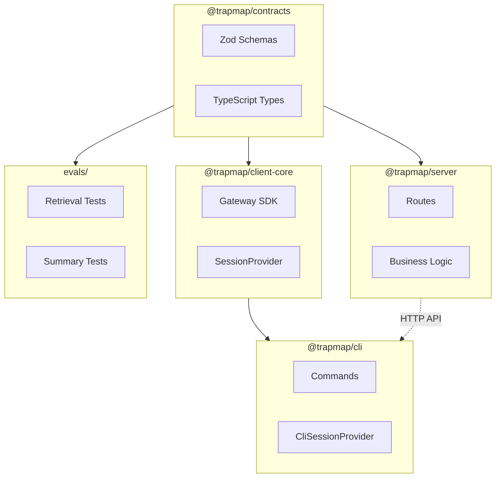

# TrapMap 包结构

本文档说明 TrapMap 各包的职责、接口和关键类型。若你关心的是“为什么选这套技术栈”，请配合阅读 [PACKAGE_STACK_RATIONALE.md](PACKAGE_STACK_RATIONALE.md)。

## 包概览

| 包 | 入口 | 职责 |
|----|------|------|
| `packages/client-core` | `src/index.ts` | 客户端共享 gateway 传输层：HTTP SDK、session contract、error model |
| `packages/cli` | `src/index.ts` | Commander.js CLI 客户端，用户交互终端入口 |
| `packages/backend-core` | `src/index.ts` | 宿主无关的后端核心内核、运行时能力模型与端口 |
| `packages/host-local` | `src/index.ts` | `local-agent` / `team-monolith` 轻量宿主装配 |
| `packages/host-distributed` | `src/index.ts` | `distributed` 重型宿主装配 |
| `packages/server` | `src/index.ts` | 迁移期兼容壳层与既有实现面 |
| `packages/contracts` | `src/index.ts` | 共享 Zod Schema 和 TypeScript 类型 |
| `packages/skills` | `trapmap-knowledge-workflow/SKILL.md` | 项目级 Skill 工作流与参考资料 |

---

## packages/contracts

共享 Schema 和类型定义，同时被 CLI 和 Server 导入。

### 导出域

| 域 | 文件 | 说明 |
|----|------|------|
| auth | `domain/auth.ts` | 登录、会话、访问密钥 Schema |
| team | `domain/team.ts` | 团队、成员 Schema |
| knowledge | `domain/knowledge.ts` | 知识条目生命周期 Schema |
| review | `domain/review.ts` | 审核决策 Schema |
| retrieval | `domain/retrieval.ts` | 检索查询/响应 Schema |
| operations | `domain/operations.ts` | 导入/导出 Schema |
| candidates | `domain/candidates.ts` | 异步摄取候选 Schema |
| artifacts | `domain/artifacts.ts` | Skill 工件 Schema |
| evals | `domain/evals/` | 评估相关 Schema |
| feedback | `domain/feedback.ts` | 用户反馈 Schema、remediation/suppression 聚合状态与管理员队列契约 |
| decay | `domain/decay.ts` | Decay 管理 Schema |
| maintenance | `domain/maintenance.ts` | 维护管理 Schema |
| evidence | `domain/evidence.ts` | Evidence 元数据 Schema |
| admin | `domain/admin.ts` | 管理员操作 Schema |
| boundary | `domain/boundary.ts` | 边界约束 Schema |
| common | `domain/common.ts` | 共享通用类型、sha256/mediaType 验证辅助 |
| conflict | `domain/conflict.ts` | 冲突检测 Schema |
| graph-extraction | `domain/graph-extraction.ts` | 图提取 Schema |
| plans | `domain/plans.ts` | 执行计划 Schema |
| parsing | `domain/parsing.ts` | 解析规则（frontmatter 等） |
| path-validation | `domain/path-validation.ts` | 路径安全验证 |

> **Source of truth**: Shared validation helpers (`canonicalPathSchema`, `sha256HexSchema`, `mediaTypeSchema`) are defined in `common.ts` and `path-validation.ts` and reused across all domain files. Always import these helpers rather than duplicating validation logic.

### 关键类型

```typescript
// 检索响应
import { retrievalResponseSchema } from '@trapmap/contracts';

// 知识条目
import { knowledgeEntrySchema } from '@trapmap/contracts';

// 审核决策
import { reviewDecisionRequestSchema } from '@trapmap/contracts';
```

---

## packages/server

HTTP 路由、授权、持久化、审核编排、检索和审计记录。

### Runtime 与部署词汇

Server 相关文档默认使用以下术语，不再混用：

| 术语 | 当前含义 | 当前实现状态 |
|---|---|---|
| `deployment profile` | 产品/部署目标形态：`local-agent`、`team-monolith`、`distributed` | 计划层已冻结，能力模型在后续阶段继续落地 |
| `deployment preset` | 启动快捷方式/兼容输入：`monolith`、`api`、`candidate-worker`、`governance-worker`、`outbox-worker` | 已在 `packages/server/src/config.ts` 与 `lib/runtime/deployment-preset.ts` 中实现 |
| `runtimeMode` | 当前进程是否暴露 API、task worker、outbox worker | 已实现 |
| `serviceUnit` | 当前进程拥有哪类 bounded-context async ownership | 已实现 |
| `task transport` | 任务投递走 PostgreSQL 还是 RabbitMQ | 已实现 |

`deployment profile` 不等同于 `deployment preset`。前者描述目标产品形态，后者只负责把当前进程解析到既有的 `runtimeMode × serviceUnit` 组合上。

P1 之后，server runtime 会统一生成 `ResolvedRuntimeDeployment`，其中至少包含：

- `deploymentProfile`
- `preset`
- `runtimeMode`
- `serviceUnit`
- `topology`
- `capabilities.routeSurface`
- `capabilities.asyncOwnershipExpectation`
- `capabilities.storagePosture`
- `capabilities.authTeamExpectation`

路由暴露、worker ownership、`/health`、`/ready`、`/v1/operations/status/async` 都消费这同一份解析结果，不再各自散落推导。

P3 起，`topology` 会把 distributed 第一阶段的正式服务词汇固化到 runtime seams：

- `gateway`
- `retrieval`
- `candidate-ingestion`
- `governance`
- `outbox-runtime`

当前实现仍保持单个 `packages/server` 包和共享 PostgreSQL，不平行实现第二套后端；拓扑的事实源是 runtime metadata，而不是仅靠 docker compose 命名。

> **Round 2 更新**：知识、工件、候选的持久化已迁移到 PostgreSQL 专用表。`DualWriteKnowledgeRepository`、`DualWriteCandidateRepository`、`DualWriteArtifactRepository` 已删除。路由层不再对 `store_snapshot` 进行业务读写（审查/衰减/维护等操作仍用于审计/索引等辅助目的，延后至各轮次处理）。
>
> **Round 8 更新**：命名规范已统一（`revision` → `revision_no`，`submitted_by` → `submitted_by_user_id`）。所有核心表已补齐外键约束。`store_snapshot` 仅作为尚未迁移辅助域的兼容层，不再是 PG 主读路径用于身份/审计域；这些域的迁移已在 Round 10 Phase 3 完成。权威的迁移状态记录见 [reference/DATA_MODEL.md](reference/DATA_MODEL.md)。
>
> **Round 4 更新**：Skill Artifact 域已补入结构化子表，当前采用“结构化事实源 + JSONB 兼容缓存”双表示。`artifact_revisions.files`、`script_descriptors`、`derived` 不再被视为唯一事实源；对应真表为 `skill_artifact_files`、`skill_artifact_script_descriptors`、`skill_artifact_profiles`、`skill_artifact_capsules`、`skill_artifact_client_manifests` 与 `skill_artifact_manifest_*`。`PgArtifactRepository` 负责同步维护两套表示，并优先从结构化子表读取。

**写入顺序**：JSONB 缓存先写入 → 结构化子表后覆盖写入。**读取优先级**：结构化子表优先，空时 fallback 到 JSONB 缓存（`reconstructSkillArtifactRecord()` 中 `??` 模式）。

**Artifact 仓库代码阅读入口**：
- 接口定义：`packages/server/src/lib/artifacts/repository.ts`（`ArtifactRepository` 接口）
- PG 实现：`packages/server/src/lib/artifacts/pg-repository/`（`PgArtifactRepository` 类及辅助模块）
  - `index.ts` — `PgArtifactRepository` 类（委托给辅助模块）
  - `revision-reader.ts` — `loadStructuredRevisionData()`（结构化读取）
  - `revision-writer.ts` — `upsertStructuredRevisionRows()` + `replaceStructuredDerivedRows()`（结构化写入）
  - `record-reconstruction.ts` — `reconstructSkillArtifactRecord()`（重建逻辑）
  - `derived-store.ts` — boundary / maintenance / agent-review / metadata CRUD
- Schema 定义：`packages/server/src/lib/persistence/schema/artifacts.ts`（所有 `skill_artifact_*` 表）
- 迁移文件：`packages/server/drizzle/0007_round4_artifact_structural.sql`
- Artifact 路由：`packages/server/src/routes/operations/artifacts-import.ts`、`artifacts-export.ts`、`artifacts-activate.ts`
- 完整事实源/缓存规则：`docs/plans/round4-cross-table-consistency-plan.md` 阶段 0 结论

### 持久化层

**规范服务边界**：组合层仍可从 `app.skillShareer.repos`（`SkillShareerRepos`）取仓库实例，但关键 application services 应注入最小 repo ports，而不是整包 repos。Actor 查找（用户 handle、成员安全等级）通过 `lib/actors/lookup.ts` 使用 `repos.user` 和 `repos.membership`，不再依赖 `store.snapshot()`。`store_snapshot` 仅作为未迁移辅助域和 supersede 工作流的兼容层。

| 仓库 | 文件 | 存储后端 |
|------|------|----------|
| `KnowledgeRepository` | `lib/knowledge/repository.ts` | PG (`PgKnowledgeRepository`) 或 JSON (`InMemoryKnowledgeRepository`) |
| `ArtifactRepository` | `lib/artifacts/repository.ts` | PG (`PgArtifactRepository`) 或 JSON (`InMemoryArtifactRepository`) |
| `CandidateRepository` | `lib/candidates/repository.ts` | PG (`PgCandidateRepository`) 或 JSON (`InMemoryCandidateRepository`) |

> **Phase 2 更新**：`buildNormalizedDuplicateInput`（`packages/server/src/lib/candidates/fingerprint.ts`）是 trap 与 skill 候选的共享归一化入口，输出 `NormalizedDuplicateInput`（`packages/server/src/lib/candidates/types.ts`）并被 in-memory / PostgreSQL 探测器与 LLM 精排共享，确保 skill 候选也产出非空 title/body 用于 PG embedding 与 LLM 比对。
>
> **Phase 0 更新**：PostgreSQL 模式下，`createAndEnqueueCandidate()` 通过 `PostgresStore.transactWithPgClient()` 将候选创建、初始状态更新、以及 `asyncTransport.queue` 上的 `candidate_processing` 注册放进同一事务；`task_queue` / `domain_event_outbox` 都携带 lease 与 reclaim 元数据，worker 启动后可回收过期 `running` / `processing` 记录。
>
> **Phase 1 更新**：queue / outbox 仍保持两套独立抽象，但 operator 入口统一收敛到 `routes/operations/status.ts`。`lib/queue/task-queue.ts` 与 `lib/lifecycle/outbox.ts` 负责各自的 status snapshot、dead-letter / failed-event 可视化与 reclaim 计数；runtime health surfaces 只消费这些 snapshot，不直接读取原始表。
>
> **Phase 2 更新**：server runtime 现在用 `runtimeMode × serviceUnit` 表达启动语义。`runtimeMode` 仍区分 `api`、`task-worker`、`outbox-worker`、`combined`，而 `TRAPMAP_SERVICE_UNIT` 进一步声明当前进程拥有哪类 bounded-context async work：`candidate-ingestion` 只拥有 candidate task work，`knowledge-governance` 拥有 shared-job task work 与 outbox work，`full-platform` 拥有全部。`src/index.ts` 与 `src/worker.ts` 共用 `bootstrap/run-startup-sequence.ts` / `bootstrap/run-worker-sequence.ts`，避免重复初始化仓库、配置和 bootstrap 逻辑。
>
> **Phase 3 更新**：`lib/workflows/` 持有长任务运行快照的持久化与类型。当前由 candidate processing 和 capsule-index rebuild 写入 `workflow_runs`，而 `routes/operations/status.ts` 负责把最近 workflow runs 暴露到 operator status family。
>
> **Phase 4 更新**：retrieval 路由负责生成并公开 `queryId`；feedback 路由负责接收最小 badcase envelope，并在 PostgreSQL 模式下把可复现快照写入 `retrieval_badcase_traces`。usage analytics 仍可复用 `queryId` 做关联，但不再是 badcase reconstruction 的唯一事实源。
>
> **Phase 5 更新**：`lib/jobs/` 成为共享派生重活的统一入口。候选处理之外，生命周期索引 follow-up、feedback remediation 完成后的 reactivation/reindex follow-up、以及 badcase export draft generation 都通过 `asyncTransport.queue` 背后的 `task_queue` + `workflow_runs` 进入统一 worker substrate；路由和订阅器负责 authoritative write / outbox commit 后经窄 queue port 入队，不再在本地同步执行重活。
>
> **Phase 6 更新**：retrieval-side process-local caches 现在被显式视为 derived artifacts，而不是“透明优化”。`lib/cache/retrieval-read-model-cache.ts` 持有 read-model 缓存，`lib/retrieval/capsules/intent-cache.ts` 持有意图缓存；两者都通过 `lib/cache/invalidation.ts` 接受 shared invalidation events。生命周期 approval/deactivation、remediation suppression、remediation reactivation 都会清理 retrieval caches，operator 可在 `/v1/operations/status/async` 查看 cache hit/miss/eviction/invalidation 指标。
| `UsageAnalyticsRepository` | `lib/analytics/repository.ts` | PG (`PgUsageAnalyticsRepository`) 或 InMemory (no-op) |
| `AccessKeyRepository` | `lib/auth/repository.ts` | PG (`PgAccessKeyRepository`) 或 JSON (`InMemoryAccessKeyRepository`) |
| `SessionRepository` | `lib/auth/repository.ts` | PG (`PgSessionRepository`) 或 JSON (`InMemorySessionRepository`) |
| `UserRepository` | `lib/users/repository.ts` | PG (`PgUserRepository`) 或 JSON (`InMemoryUserRepository`) |
| `TeamRepository` | `lib/teams/repository.ts` | PG (`PgTeamRepository`) 或 JSON (`InMemoryTeamRepository`) |
| `MembershipRepository` | `lib/teams/repository.ts` | PG (`PgMembershipRepository`) 或 JSON (`InMemoryMembershipRepository`) |

> **Phase 2 更新**：`POST /v1/access-keys` 已从 `store.transact()` 迁移到 `repos.accessKey` + `repos.membership`，PG 模式下不再经过 JSONB 兼容层。`POST /v1/members` 现在持久化 caller-provided `securityLevel`（而非硬编码为 0）。Auth 路由（login/session/logout）已在 PG 模式下使用 `repos.session`、`repos.accessKey`、`repos.membership`。

### 路由模块

| 文件 | 端点前缀 | 说明 |
|------|----------|------|
| `routes/auth.ts` | `/v1/auth` | 认证 |
| `routes/teams.ts` | `/v1/teams` | 团队管理 |
| `routes/members.ts` | `/v1/members` | 成员管理 |
| `routes/access-keys.ts` | `/v1/access-keys` | 访问密钥签发 |
| `routes/knowledge.ts` | `/v1/knowledge` | 知识条目 CRUD，通过 `KnowledgeApplicationService` 执行提交/重提/取代 |
| `routes/review.ts` | `/v1/knowledge/review` | 审核工作流 |
| `routes/evidence.ts` | `/v1/knowledge/:id/evidence` | 知识条目 evidence 元数据更新 |
| `routes/retrieval.ts` | `/v1/retrieval`、`/v2/retrieval`、`/v3/retrieval` | 检索（v1/v2/v3），通过 `buildRetrievalReadModel()` 从仓库读取数据 |
| `routes/operations.ts` | `/v1/operations` | 导入/导出（注册子路由：audit、knowledge-legacy、artifacts-export/import/activate、migrate、status、skill-edit、skill-review、stats） |
| `routes/candidates.ts` | `/v1/candidates`、`/v1/duplicates` | 异步摄取与重复检测 |
| `routes/traps.ts` | `/v1/traps` | Trap 管理（与 knowledge 共享同一 `KnowledgeApplicationService` 工作流） |
| `routes/feedback.ts` | `/v1/feedback` | 用户反馈提交 |
| `routes/feedback-admin.ts` | `/v1/operations/feedback` | 反馈管理（列表、批量处理、统计）以及 remediation 工作队列（列表、详情、完成） |
| `routes/decay.ts` | `/v1/operations/decay` | Decay 管理 |
| `routes/maintenance.ts` | `/v1/operations/maintenance` | 维护管理 |
| `routes/admin-boundary-search.ts` | `/admin/boundary-search` | 管理员边界搜索 |
| `routes/admin-benchmark.ts` | `/admin/benchmark` | 管理员基准测试 |

### Shared Jobs

| 模块 | 文件 | 说明 |
|------|------|------|
| shared jobs | `lib/jobs/index.ts` | 统一导出 shared task types、scheduler 与 handlers |
| job handlers | `lib/jobs/handlers/*.ts` | 生命周期索引 follow-up、remediation reactivation、badcase export draft |
| worker bootstrap | `bootstrap/bootstrap-workers.ts` | 把 candidate handler 与 shared job handlers 注册到同一 `task_queue` worker |

> **Wiring debt convergence 更新**：知识生命周期的 PG 投影发布统一走 `emitLifecycleTransition()` / `createLifecyclePublisher()`，异步底座统一从 `app.skillShareer.asyncTransport` 暴露。业务写路径不再直接拼装 `task_queue` / `domain_event_outbox`；JSON 模式仅保留同步 event bus 兼容回退。

### 配置

```typescript
// src/config.ts
import { loadConfig } from './config.js';

const config = loadConfig();
```

For package-local navigation, read:

- `packages/server/src/lib/README.md`
- `packages/server/src/routes/README.md`

---

## packages/client-core

客户端共享 gateway 传输层，从 CLI 中提取。浏览器兼容，仅依赖标准 `fetch` API。

### 导出

| 导出 | 类型 | 说明 |
|------|------|------|
| `apiRequest` | function | 对 gateway 发起带类型的 HTTP 请求 |
| `ApiError` | class | 统一 gateway 错误，含状态码和 payload |
| `SessionProvider` | interface | base URL 和 session token 的注入契约 |
| `ApiResponse<T>` | type | 成功响应包装 |
| `RequestOptions` | type | 单次请求选项 |

CLI 通过 `CliSessionProvider`（`packages/cli/src/lib/client-core-adapter.ts`）实现 `SessionProvider`，将 `CliState` 桥接到 client-core 的通用契约。

---

## packages/cli

命令行接口，命令格式明确，shell 友好输出，支持可选 JSON 模式。

CLI 当前正式接入模型固定为单一 gateway：

- `packages/cli/src/lib/http.ts` 只基于一个 gateway URL 发起请求。
- `packages/cli/src/lib/config.ts` 只持久化一个 `gatewayUrl`，并兼容读取旧 `serverUrl`。
- 即使后端后续演进到 `distributed` profile，CLI 仍然只连接统一 gateway，不直接感知微服务拆分。

### 命令模块

| 命令 | 文件 | 说明 |
|------|------|------|
| `auth` | `commands/auth.ts` | 登录/登出 |
| `team` | `commands/team.ts` | 团队管理 |
| `member` | `commands/member.ts` | 成员管理 |
| `knowledge` | `commands/knowledge.ts` | 知识提交/查询 |
| `review` | `commands/review.ts` | 审核操作 |
| `retrieval` | `commands/retrieval.ts` | 检索命令 |
| `operations` | `commands/operations.ts` | 导入/导出/列表/激活/状态/迁移/编辑/停用 |
| `audit` | `commands/audit.ts` | 审计日志 |
| `trap` | `commands/trap.ts` | Trap 管理 |
| `skill` | `commands/skill.ts` | Skill 管理 |
| `feedback` | `commands/feedback.ts` | 反馈提交 |
| `feedback-admin` | `commands/feedback-admin.ts` | 反馈管理（管理员） |
| `decay` | `commands/decay.ts` | Decay 管理 |
| `maintenance` | `commands/maintenance.ts` | 维护管理 |
| `evidence` | `commands/evidence.ts` | Evidence 元数据更新 |
| `load` | `commands/load.ts` | 数据加载 |

### Operations 权限模型

Operations 命令组使用细粒度权限标志，每个子命令独立控制：

| 权限标志 | 控制命令 | 映射自 `visibility` |
|----------|----------|---------------------|
| `allowList` | `list` | `allowKnowledgeExport` |
| `allowEdit` | `edit` | `allowKnowledgeUpdate` |
| `allowDeactivate` | `deactivate` | `allowKnowledgeDeactivate` |
| `allowExport` | `export`, `artifact-export` | `allowKnowledgeExport` |
| `allowImport` | `import` | `allowKnowledgeImport` |
| `allowActivate` | `activate` | `allowKnowledgeExport` |
| `allowMigrate` | `migrate` | `allowKnowledgeImport` |
| `allowStatus` | `status` | `allowKnowledgeExport` |

### 输出模式

```bash
# 人类可读输出（默认）
pnpm --filter @trapmap/cli dev -- knowledge search "如何处理 N+1"

# JSON 模式（机器解析）
pnpm --filter @trapmap/cli dev -- knowledge search "如何处理 N+1" --json
```

### 状态管理

```typescript
// src/lib/config.ts
import { loadCliState } from './lib/config.js';

const cliState = await loadCliState();
const session = cliState.session;
```

配置文件路径默认使用 `os.homedir()`。在无 HOME 环境的容器化部署中，`getConfigPath` 会自动回退到 `os.tmpdir()`。

---

## packages/skills

当前包含 `trapmap-knowledge-workflow`，用于规范 TrapMap 相关规划、检索、评审和经验沉淀流程。

```
trapmap-knowledge-workflow/
├── SKILL.md          # 入口文件：工作流定义和控制路径
├── agents/           # 子智能体定义
└── references/       # 参考资料（架构、API、数据模型等）
```

**控制路径**：SKILL.md 定义了知识条目的完整工作流——从需求分析、检索、评审到经验沉淀的每一步骤和决策点。

> 源码：`packages/skills/trapmap-knowledge-workflow/SKILL.md`

---

## 包依赖关系



**依赖说明:**
- `@trapmap/contracts` 被所有其他包依赖，定义共享 Schema 和类型
- `@trapmap/client-core` 依赖 contracts，提供浏览器兼容的 gateway SDK
- `@trapmap/server` 依赖 contracts，提供 REST API
- `@trapmap/cli` 依赖 contracts、client-core 和 server (via HTTP)
- `evals/` 依赖 contracts 进行测试验证

---

## 目标包布局（Runtime Recomposition）

> 本节冻结于 runtime recomposition 计划 Task 00。当前 `cli + server + contracts` 三包结构将逐步演进为 `client-core + backend-core + services + hosts` 可装配体系。权威定义见 [architecture/TARGET_ARCHITECTURE.md](architecture/TARGET_ARCHITECTURE.md)。

### 目标包角色

| 角色 | 包 | 职责 |
|------|------|------|
| **client-core** | `packages/client-core` | 客户端共享访问层：HTTP gateway SDK、session handling、error model、request helpers |
| **backend-core** | `packages/backend-core` | 后端核心内核：应用服务、端口、宿主无关 runtime capability model、bounded-context 编排 |
| **host (light)** | `packages/host-local` | 轻量宿主：面向 `local-agent` 和 `team-monolith`，单机、最小依赖、低运维 |
| **host (heavy)** | `packages/host-distributed` | 重型宿主：面向分布式装配，独立扩缩容、读写隔离、服务边界 |
| **service** | `packages/service-*` | 七个逻辑服务包，每个对应一个 bounded context（见下表） |

### 目标服务包

| 包 | 服务角色 | bounded context |
|------|------|------|
| `packages/service-gateway` | `gateway` | 唯一外部入口：请求聚合、限流、外部认证边界、稳定 API surface |
| `packages/service-identity-access` | `identity-access` | auth、session、access-keys、membership、team、RBAC decision |
| `packages/service-knowledge-read` | `knowledge-read` | retrieval、query trace、只读投影、status read model、读缓存 |
| `packages/service-knowledge-write` | `knowledge-write` | knowledge/trap/skill/lifecycle/maintenance/decay 的 authoritative 写路径 |
| `packages/service-candidate-ingestion` | `candidate-ingestion` | candidate intake、归一化、去重预处理、候选状态推进 |
| `packages/service-governance-review` | `governance-review` | 人工介入队列、审核工作流、冲突解决、remediation 队列 |
| `packages/service-job-runtime` | `job-runtime` | task queue、workflow runs、outbox dispatch、shared jobs 执行 |

### 目标包布局

```
Trap-Map/
├── packages/
│   ├── client-core/               # 客户端共享 HTTP gateway SDK
│   ├── backend-core/              # 后端核心内核（服务、端口、能力模型）
│   ├── service-gateway/           # Gateway 宿主/传输/装配
│   ├── service-identity-access/   # Auth、session、access-keys、membership、team、RBAC
│   ├── service-knowledge-read/    # Retrieval、只读投影、query trace、读缓存
│   ├── service-knowledge-write/   # Knowledge/trap/skill/lifecycle/maintenance/decay 写路径
│   ├── service-candidate-ingestion/ # Candidate intake、归一化、去重、状态推进
│   ├── service-governance-review/ # 审核队列、工作台、冲突解决、remediation
│   ├── service-job-runtime/       # Task queue、workflow runs、outbox dispatch、shared jobs
│   ├── host-local/                # 轻量宿主装配（local-agent、team-monolith）
│   ├── host-distributed/          # 重型宿主装配（分布式服务）
│   ├── cli/                       # CLI（精简后不再持有共享 HTTP SDK）
│   ├── server/                    # 迁移期兼容壳层，逐步被 host-local/host-distributed 替代
│   ├── contracts/                 # 共享 Zod Schema 和 TypeScript 类型
│   └── skills/                    # 项目级 Skill 工作流
├── evals/
├── docs/
├── scripts/
└── docker-compose.yml
```

### 依赖方向

```
contracts ──────────────────────────────────────────────────┐
    │                                                       │
    ▼                                                       │
client-core ← cli, future web client                        │
    │                                                       │
backend-core ← service-* ← host-local, host-distributed     │
    │                           │                           │
    └───────────────────────────┴───────────────────────────┘
                                ↑
                           server (迁移期壳层，逐步缩减)
```

关键约束：

1. `client-core` 只依赖 `contracts`，不依赖 `backend-core` 或任何服务端包。
2. `backend-core` 依赖 `contracts`，不依赖任何 service 或 host 包。
3. 各 `service-*` 是对等包，互不直接依赖；跨服务交互通过 `backend-core` 中定义的 internal ports。
4. `host-local` 和 `host-distributed` 依赖 `backend-core`、`contracts` 和所装配的 service 包。
5. `packages/cli` 依赖 `client-core` 和 `contracts`，不依赖 `backend-core` 或任何服务端包。
6. `packages/server`（迁移期壳层）在迁移期间依赖 `backend-core`、`contracts` 和 service 包，最终被替代。

### 数据库与事务边界

首期继续共享 PostgreSQL，但已冻结表级 ownership。详见 [architecture/DATABASE_OWNERSHIP.md](architecture/DATABASE_OWNERSHIP.md) 和 [architecture/SERVICE_BOUNDARIES.md](architecture/SERVICE_BOUNDARIES.md)。

### 架构原则摘要

1. 所有客户端只对 gateway SDK / gateway API 编程。
2. 所有宿主都对 `backend-core` 编程，不直接复制业务逻辑。
3. 微服务边界先按 authoritative ownership、读写路径和故障域划分，再考虑物理进程数。
4. 首期可以保留共享数据库，但不能把共享数据库当作"服务边界不需要定义"的借口。
5. 不引入分布式事务；跨服务一致性通过 outbox + queue + projection 实现。
6. 不引入 RPC-first 架构；先做 port-first、transport-agnostic。

### 参考文档

- [architecture/TARGET_ARCHITECTURE.md](architecture/TARGET_ARCHITECTURE.md) -- 术语冻结、包角色、部署角色、服务角色、架构原则
- [architecture/DATABASE_OWNERSHIP.md](architecture/DATABASE_OWNERSHIP.md) -- 表级 ownership 和事务边界规则
- [architecture/SERVICE_BOUNDARIES.md](architecture/SERVICE_BOUNDARIES.md) -- 服务角色定义和 ownership 模型
- [plans/runtime-recomposition/](plans/runtime-recomposition/) -- 完整 Runtime Recomposition 计划
