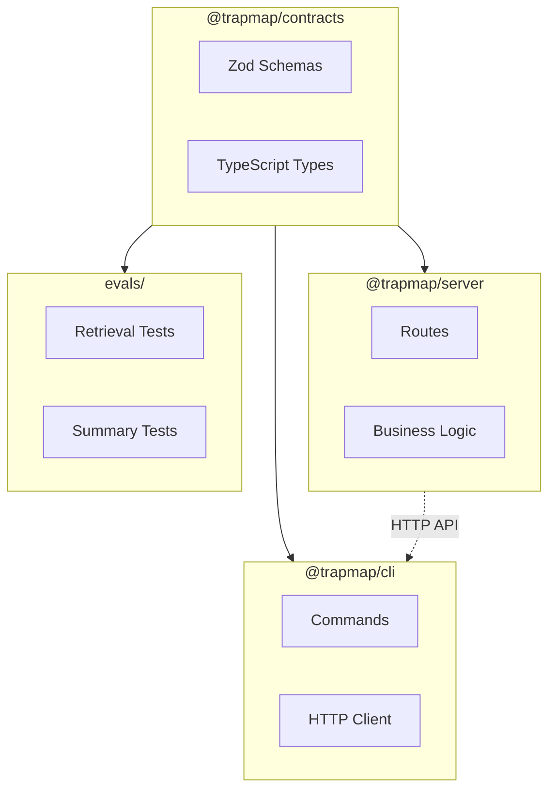

# TrapMap 包结构

本文档说明 TrapMap 各包的职责、接口和关键类型。若你关心的是“为什么选这套技术栈”，请配合阅读 [PACKAGE_STACK_RATIONALE.md](PACKAGE_STACK_RATIONALE.md)。

## 包概览

| 包 | 入口 | 职责 |
|----|------|------|
| `packages/cli` | `src/index.ts` | Commander.js CLI 客户端，用户交互终端入口 |
| `packages/server` | `src/index.ts` | Fastify API 服务器，业务逻辑编排 |
| `packages/contracts` | `src/index.ts` | 共享 Zod Schema 和 TypeScript 类型 |
| `packages/skills` | `trapmap-knowledge-workflow/SKILL.md` | 项目级 Skill 工作流与参考资料 |

---

## packages/contracts

共享 Schema 和类型定义，同时被 CLI 和 Server 导入。

### 导出域

| 域 | 文件 | 说明 |
|----|------|------|
| auth | `domain/auth.ts` | 登录、会话、访问密钥 Schema |
| team | `domain/team.ts` | 团队、成员 Schema |
| knowledge | `domain/knowledge.ts` | 知识条目生命周期 Schema |
| review | `domain/review.ts` | 审核决策 Schema |
| retrieval | `domain/retrieval.ts` | 检索查询/响应 Schema |
| operations | `domain/operations.ts` | 导入/导出 Schema |
| candidates | `domain/candidates.ts` | 异步摄取候选 Schema |
| artifacts | `domain/artifacts.ts` | Skill 工件 Schema |
| evals | `domain/evals/` | 评估相关 Schema |
| feedback | `domain/feedback.ts` | 用户反馈 Schema |
| decay | `domain/decay.ts` | Decay 管理 Schema |
| maintenance | `domain/maintenance.ts` | 维护管理 Schema |
| evidence | `domain/evidence.ts` | Evidence 元数据 Schema |
| admin | `domain/admin.ts` | 管理员操作 Schema |
| boundary | `domain/boundary.ts` | 边界约束 Schema |
| common | `domain/common.ts` | 共享通用类型 |
| conflict | `domain/conflict.ts` | 冲突检测 Schema |
| graph-extraction | `domain/graph-extraction.ts` | 图提取 Schema |
| plans | `domain/plans.ts` | 执行计划 Schema |
| parsing | `domain/parsing.ts` | 解析规则（frontmatter 等） |
| path-validation | `domain/path-validation.ts` | 路径安全验证 |

### 关键类型

```typescript
// 检索响应
import { retrievalResponseSchema } from '@trapmap/contracts';

// 知识条目
import { knowledgeEntrySchema } from '@trapmap/contracts';

// 审核决策
import { reviewDecisionRequestSchema } from '@trapmap/contracts';
```

---

## packages/server

HTTP 路由、授权、持久化、审核编排、检索和审计记录。

> **Round 2 更新**：知识、工件、候选的持久化已迁移到 PostgreSQL 专用表。`DualWriteKnowledgeRepository`、`DualWriteCandidateRepository`、`DualWriteArtifactRepository` 已删除。路由层不再对 `store_snapshot` 进行业务读写（审查/衰减/维护等操作仍用于审计/索引等辅助目的，延后至各轮次处理）。
>
> **Round 8 更新**：命名规范已统一（`revision` → `revision_no`，`submitted_by` → `submitted_by_user_id`）。所有核心表已补齐外键约束。`store_snapshot` 仅作为尚未迁移辅助域的兼容层，不再是 PG 主读路径用于身份/审计域；这些域的迁移已在 Round 10 Phase 3 完成。权威的迁移状态记录见 [reference/DATA_MODEL.md](reference/DATA_MODEL.md)。
>
> **Round 4 更新**：Skill Artifact 域已补入结构化子表，当前采用“结构化事实源 + JSONB 兼容缓存”双表示。`artifact_revisions.files`、`script_descriptors`、`derived` 不再被视为唯一事实源；对应真表为 `skill_artifact_files`、`skill_artifact_script_descriptors`、`skill_artifact_profiles`、`skill_artifact_capsules`、`skill_artifact_client_manifests` 与 `skill_artifact_manifest_*`。`PgArtifactRepository` 负责同步维护两套表示，并优先从结构化子表读取。

**写入顺序**：JSONB 缓存先写入 → 结构化子表后覆盖写入。**读取优先级**：结构化子表优先，空时 fallback 到 JSONB 缓存（`reconstructSkillArtifactRecord()` 中 `??` 模式）。

**Artifact 仓库代码阅读入口**：
- 接口定义：`packages/server/src/lib/artifacts/repository.ts`（`ArtifactRepository` 接口）
- PG 实现：`packages/server/src/lib/artifacts/pg-repository/`（`PgArtifactRepository` 类及辅助模块）
  - `index.ts` — `PgArtifactRepository` 类（委托给辅助模块）
  - `revision-reader.ts` — `loadStructuredRevisionData()`（结构化读取）
  - `revision-writer.ts` — `upsertStructuredRevisionRows()` + `replaceStructuredDerivedRows()`（结构化写入）
  - `record-reconstruction.ts` — `reconstructSkillArtifactRecord()`（重建逻辑）
  - `derived-store.ts` — boundary / maintenance / agent-review / metadata CRUD
- Schema 定义：`packages/server/src/lib/persistence/schema/artifacts.ts`（所有 `skill_artifact_*` 表）
- 迁移文件：`packages/server/drizzle/0007_round4_artifact_structural.sql`
- Artifact 路由：`packages/server/src/routes/operations/artifacts-import.ts`、`artifacts-export.ts`、`artifacts-activate.ts`
- 完整事实源/缓存规则：`docs/plans/round4-cross-table-consistency-plan.md` 阶段 0 结论

### 持久化层

**规范服务边界**：路由和业务逻辑通过 `app.skillShareer.repos`（`SkillShareerRepos`）访问所有领域仓库。Actor 查找（用户 handle、成员安全等级）通过 `lib/actors/lookup.ts` 使用 `repos.user` 和 `repos.membership`，不再依赖 `store.snapshot()`。`store_snapshot` 仅作为未迁移辅助域和 supersede 工作流的兼容层。

| 仓库 | 文件 | 存储后端 |
|------|------|----------|
| `KnowledgeRepository` | `lib/knowledge/repository.ts` | PG (`PgKnowledgeRepository`) 或 JSON (`InMemoryKnowledgeRepository`) |
| `ArtifactRepository` | `lib/artifacts/repository.ts` | PG (`PgArtifactRepository`) 或 JSON (`InMemoryArtifactRepository`) |
| `CandidateRepository` | `lib/candidates/repository.ts` | PG (`PgCandidateRepository`) 或 JSON (`InMemoryCandidateRepository`) |
| `UsageAnalyticsRepository` | `lib/analytics/repository.ts` | PG (`PgUsageAnalyticsRepository`) 或 InMemory (no-op) |
| `AccessKeyRepository` | `lib/auth/repository.ts` | PG (`PgAccessKeyRepository`) 或 JSON (`InMemoryAccessKeyRepository`) |
| `SessionRepository` | `lib/auth/repository.ts` | PG (`PgSessionRepository`) 或 JSON (`InMemorySessionRepository`) |
| `UserRepository` | `lib/users/repository.ts` | PG (`PgUserRepository`) 或 JSON (`InMemoryUserRepository`) |
| `TeamRepository` | `lib/teams/repository.ts` | PG (`PgTeamRepository`) 或 JSON (`InMemoryTeamRepository`) |
| `MembershipRepository` | `lib/teams/repository.ts` | PG (`PgMembershipRepository`) 或 JSON (`InMemoryMembershipRepository`) |

> **Phase 2 更新**：`POST /v1/access-keys` 已从 `store.transact()` 迁移到 `repos.accessKey` + `repos.membership`，PG 模式下不再经过 JSONB 兼容层。`POST /v1/members` 现在持久化 caller-provided `securityLevel`（而非硬编码为 0）。Auth 路由（login/session/logout）已在 PG 模式下使用 `repos.session`、`repos.accessKey`、`repos.membership`。

### 路由模块

| 文件 | 端点前缀 | 说明 |
|------|----------|------|
| `routes/auth.ts` | `/v1/auth` | 认证 |
| `routes/teams.ts` | `/v1/teams` | 团队管理 |
| `routes/members.ts` | `/v1/members` | 成员管理 |
| `routes/access-keys.ts` | `/v1/access-keys` | 访问密钥签发 |
| `routes/knowledge.ts` | `/v1/knowledge` | 知识条目 CRUD，通过 `KnowledgeApplicationService` 执行提交/重提/取代 |
| `routes/review.ts` | `/v1/knowledge/review` | 审核工作流 |
| `routes/evidence.ts` | `/v1/knowledge/:id/evidence` | 知识条目 evidence 元数据更新 |
| `routes/retrieval.ts` | `/v1/retrieval`、`/v2/retrieval`、`/v3/retrieval` | 检索（v1/v2/v3），通过 `buildRetrievalReadModel()` 从仓库读取数据 |
| `routes/operations.ts` | `/v1/operations` | 导入/导出（注册子路由：audit、knowledge-legacy、artifacts-export/import/activate、migrate、status、skill-edit、skill-review、stats） |
| `routes/candidates.ts` | `/v1/candidates`、`/v1/duplicates` | 异步摄取与重复检测 |
| `routes/traps.ts` | `/v1/traps` | Trap 管理（与 knowledge 共享同一 `KnowledgeApplicationService` 工作流） |
| `routes/feedback.ts` | `/v1/feedback` | 用户反馈提交 |
| `routes/feedback-admin.ts` | `/v1/operations/feedback` | 反馈管理（列表、批量处理、统计） |
| `routes/decay.ts` | `/v1/operations/decay` | Decay 管理 |
| `routes/maintenance.ts` | `/v1/operations/maintenance` | 维护管理 |
| `routes/admin-boundary-search.ts` | `/admin/boundary-search` | 管理员边界搜索 |
| `routes/admin-benchmark.ts` | `/admin/benchmark` | 管理员基准测试 |

### 配置

```typescript
// src/config.ts
import { loadConfig } from './config.js';

const config = loadConfig();
```

For package-local navigation, read:

- `packages/server/src/lib/README.md`
- `packages/server/src/routes/README.md`

---

## packages/cli

命令行接口，命令格式明确，shell 友好输出，支持可选 JSON 模式。

### 命令模块

| 命令 | 文件 | 说明 |
|------|------|------|
| `auth` | `commands/auth.ts` | 登录/登出 |
| `team` | `commands/team.ts` | 团队管理 |
| `member` | `commands/member.ts` | 成员管理 |
| `knowledge` | `commands/knowledge.ts` | 知识提交/查询 |
| `review` | `commands/review.ts` | 审核操作 |
| `retrieval` | `commands/retrieval.ts` | 检索命令 |
| `operations` | `commands/operations.ts` | 导入/导出/列表/激活/状态/迁移/编辑/停用 |
| `audit` | `commands/audit.ts` | 审计日志 |
| `trap` | `commands/trap.ts` | Trap 管理 |
| `skill` | `commands/skill.ts` | Skill 管理 |
| `feedback` | `commands/feedback.ts` | 反馈提交 |
| `feedback-admin` | `commands/feedback-admin.ts` | 反馈管理（管理员） |
| `decay` | `commands/decay.ts` | Decay 管理 |
| `maintenance` | `commands/maintenance.ts` | 维护管理 |
| `evidence` | `commands/evidence.ts` | Evidence 元数据更新 |
| `load` | `commands/load.ts` | 数据加载 |

### Operations 权限模型

Operations 命令组使用细粒度权限标志，每个子命令独立控制：

| 权限标志 | 控制命令 | 映射自 `visibility` |
|----------|----------|---------------------|
| `allowList` | `list` | `allowKnowledgeExport` |
| `allowEdit` | `edit` | `allowKnowledgeUpdate` |
| `allowDeactivate` | `deactivate` | `allowKnowledgeDeactivate` |
| `allowExport` | `export`, `artifact-export` | `allowKnowledgeExport` |
| `allowImport` | `import` | `allowKnowledgeImport` |
| `allowActivate` | `activate` | `allowKnowledgeExport` |
| `allowMigrate` | `migrate` | `allowKnowledgeImport` |
| `allowStatus` | `status` | `allowKnowledgeExport` |

### 输出模式

```bash
# 人类可读输出（默认）
pnpm --filter @trapmap/cli dev -- knowledge search "如何处理 N+1"

# JSON 模式（机器解析）
pnpm --filter @trapmap/cli dev -- knowledge search "如何处理 N+1" --json
```

### 状态管理

```typescript
// src/lib/config.ts
import { loadCliState } from './lib/config.js';

const cliState = await loadCliState();
const session = cliState.session;
```

配置文件路径默认使用 `os.homedir()`。在无 HOME 环境的容器化部署中，`getConfigPath` 会自动回退到 `os.tmpdir()`。

---

## packages/skills

当前包含 `trapmap-knowledge-workflow`，用于规范 TrapMap 相关规划、检索、评审和经验沉淀流程。

```
trapmap-knowledge-workflow/
├── SKILL.md          # 入口文件：工作流定义和控制路径
├── agents/           # 子智能体定义
└── references/       # 参考资料（架构、API、数据模型等）
```

**控制路径**：SKILL.md 定义了知识条目的完整工作流——从需求分析、检索、评审到经验沉淀的每一步骤和决策点。

> 源码：`packages/skills/trapmap-knowledge-workflow/SKILL.md`

---

## 包依赖关系



**依赖说明:**
- `@trapmap/contracts` 被所有其他包依赖，定义共享 Schema 和类型
- `@trapmap/server` 依赖 contracts，提供 REST API
- `@trapmap/cli` 依赖 contracts 和 server (via HTTP)
- `evals/` 依赖 contracts 进行测试验证
