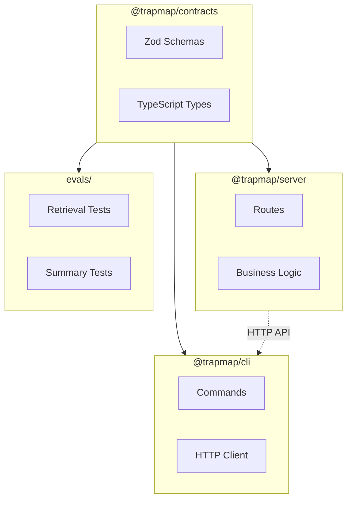

# TrapMap 包结构

本文档说明 TrapMap 各包的职责、接口和关键类型。

## 包概览

| 包 | 入口 | 职责 |
|----|------|------|
| `packages/cli` | `src/index.ts` | Commander.js CLI 客户端，用户交互终端入口 |
| `packages/server` | `src/index.ts` | Fastify API 服务器，业务逻辑编排 |
| `packages/contracts` | `src/index.ts` | 共享 Zod Schema 和 TypeScript 类型 |
| `packages/skills` | `trapmap-knowledge-workflow/SKILL.md` | 项目级 Skill 工作流与参考资料 |

---

## packages/contracts

共享 Schema 和类型定义，同时被 CLI 和 Server 导入。

### 导出域

| 域 | 文件 | 说明 |
|----|------|------|
| auth | `domain/auth.ts` | 登录、会话、访问密钥 Schema |
| team | `domain/team.ts` | 团队、成员 Schema |
| knowledge | `domain/knowledge.ts` | 知识条目生命周期 Schema |
| review | `domain/review.ts` | 审核决策 Schema |
| retrieval | `domain/retrieval.ts` | 检索查询/响应 Schema |
| operations | `domain/operations.ts` | 导入/导出 Schema |
| candidates | `domain/candidates.ts` | 异步摄取候选 Schema |
| artifacts | `domain/artifacts.ts` | Skill 工件 Schema |
| evals | `domain/evals/` | 评估相关 Schema |

### 关键类型

```typescript
// 检索响应
import { retrievalResponseSchema } from '@trapmap/contracts';

// 知识条目
import { knowledgeEntrySchema } from '@trapmap/contracts';

// 审核决策
import { reviewDecisionRequestSchema } from '@trapmap/contracts';
```

---

## packages/server

HTTP 路由、授权、持久化、审核编排、检索和审计记录。

> **Round 2 更新**：知识、工件、候选的持久化已迁移到 PostgreSQL 专用表。`DualWriteKnowledgeRepository`、`DualWriteCandidateRepository`、`DualWriteArtifactRepository` 已删除。路由层不再对 `store_snapshot` 进行业务读写（审查/衰减/维护等操作仍用于审计/索引等辅助目的，延后至各轮次处理）。
>
> **Round 8 更新**：命名规范已统一（`revision` → `revision_no`，`submitted_by` → `submitted_by_user_id`）。所有核心表已补齐外键约束。`store_snapshot` 仍用于用户、团队、成员、会话、访问密钥、审计等尚未结构化的域，这些域的迁移将在后续轮次完成。

### 持久化层

| 仓库 | 文件 | 存储后端 |
|------|------|----------|
| `KnowledgeRepository` | `lib/knowledge/repository.ts` | PG (`PgKnowledgeRepository`) 或 JSON (`InMemoryKnowledgeRepository`) |
| `ArtifactRepository` | `lib/artifacts/repository.ts` | PG (`PgArtifactRepository`) 或 JSON (`InMemoryArtifactRepository`) |
| `CandidateRepository` | `lib/candidates/repository.ts` | PG (`PgCandidateRepository`) 或 JSON (`InMemoryCandidateRepository`) |
| `UsageAnalyticsRepository` | `lib/analytics/repository.ts` | PG (`PgUsageAnalyticsRepository`) 或 InMemory (no-op) |

### 路由模块

| 文件 | 端点前缀 | 说明 |
|------|----------|------|
| `routes/auth.ts` | `/v1/auth` | 认证 |
| `routes/teams.ts` | `/v1/teams` | 团队管理 |
| `routes/members.ts` | `/v1/members` | 成员管理 |
| `routes/knowledge.ts` | `/v1/knowledge` | 知识条目 CRUD |
| `routes/review.ts` | `/v1/knowledge/review` | 审核工作流 |
| `routes/retrieval.ts` | `/v1/retrieval` | 检索（v1/v2/v3） |
| `routes/operations.ts` | `/v1/operations` | 导入/导出 |
| `routes/candidates.ts` | `/v1/candidates` | 异步摄取 |
| `routes/traps.ts` | `/v1/traps` | Trap 管理 |
| `routes/retrieval.ts` | `/v1/retrieval/skills/search-by-content` | Skill 内容检索 |

### 配置

```typescript
// src/config.ts
import { loadConfig } from './config.js';

const config = loadConfig();
```

---

## packages/cli

命令行接口，命令格式明确，shell 友好输出，支持可选 JSON 模式。

### 命令模块

| 命令 | 文件 | 说明 |
|------|------|------|
| `auth` | `commands/auth.ts` | 登录/登出 |
| `team` | `commands/team.ts` | 团队管理 |
| `member` | `commands/member.ts` | 成员管理 |
| `knowledge` | `commands/knowledge.ts` | 知识提交/查询 |
| `review` | `commands/review.ts` | 审核操作 |
| `retrieval` | `commands/retrieval.ts` | 检索命令 |
| `operations` | `commands/operations.ts` | 导入/导出 |
| `audit` | `commands/audit.ts` | 审计日志 |
| `trap` | `commands/trap.ts` | Trap 管理 |
| `skill` | `commands/skill.ts` | Skill 管理 |

### 输出模式

```bash
# 人类可读输出（默认）
pnpm --filter @trapmap/cli dev -- knowledge search "如何处理 N+1"

# JSON 模式（机器解析）
pnpm --filter @trapmap/cli dev -- knowledge search "如何处理 N+1" --json
```

### 状态管理

```typescript
// src/lib/config.ts
import { loadCliState } from './lib/config.js';

const cliState = await loadCliState();
const session = cliState.session;
```

---

## packages/skills

当前包含 `trapmap-knowledge-workflow`，用于规范 TrapMap 相关规划、检索、评审和经验沉淀流程。

```
trapmap-knowledge-workflow/
├── SKILL.md          # 入口文件：工作流定义和控制路径
├── agents/           # 子智能体定义
└── references/       # 参考资料（架构、API、数据模型等）
```

**控制路径**：SKILL.md 定义了知识条目的完整工作流——从需求分析、检索、评审到经验沉淀的每一步骤和决策点。

> 源码：`packages/skills/trapmap-knowledge-workflow/SKILL.md`

---

## 包依赖关系



**依赖说明:**
- `@trapmap/contracts` 被所有其他包依赖，定义共享 Schema 和类型
- `@trapmap/server` 依赖 contracts，提供 REST API
- `@trapmap/cli` 依赖 contracts 和 server (via HTTP)
- `evals/` 依赖 contracts 进行测试验证
