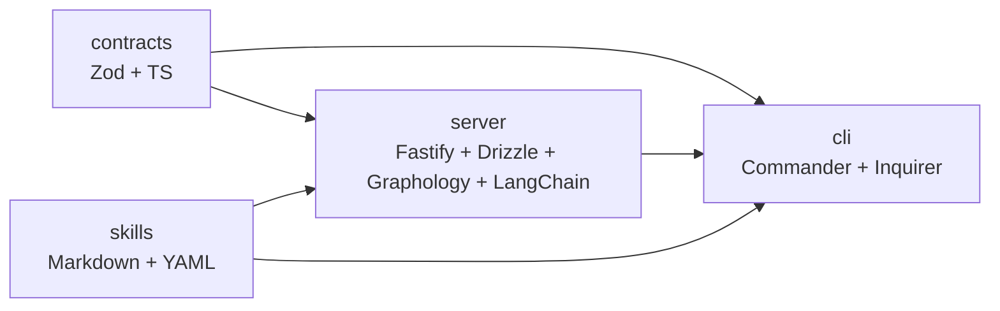

# TrapMap 包技术选型说明

本文只回答一个问题：TrapMap 为什么给每个包和其主要子包选择当前这套技术栈。包职责、入口文件和接口清单见 [PACKAGES.md](PACKAGES.md)。

## 覆盖范围

- pnpm workspace 包：`packages/contracts`、`packages/server`、`packages/cli`
- 仓库内可激活子包：`packages/skills/trapmap-knowledge-workflow`

## 统一基线

| 选型 | 适用范围 | 选择原因 |
|------|----------|----------|
| `pnpm workspace` | 全仓 | 只有 `cli`、`server`、`contracts` 三个运行时代码包，workspace 足够轻量；共享锁文件、共享依赖缓存、跨包链接简单，适合单仓内频繁联调。 |
| `TypeScript 5.x` | 全仓 | 项目同时有 HTTP API、CLI、Schema、评测和 Skill 工件元数据，类型系统可以把跨层约束提前到编译期暴露。 |
| `Node.js 20+` + `ESM` | 全仓 | 服务端、CLI 和评测都运行在同一运行时，避免双运行时成本；原生 ESM 配合 `tsx` 开发体验直接，适合现代 TS monorepo。 |
| `Vitest` | 全仓 | 既要做纯函数测试，也要做 CLI、HTTP、仓储和检索流程测试；Vitest 在这几类场景里启动快，和 ESM/TS 兼容成本低。 |
| `Biome` | 全仓 | 仓库里既有 TS 又有大量 Markdown/JSON，Biome 统一格式和静态检查，减少 ESLint + Prettier 的双工具维护。 |

## `packages/contracts`

`@trapmap/contracts` 是共享事实源，目标不是“多功能”，而是“低漂移”。因此它选择了最少但最硬的约束型技术栈。

| 子包/目录 | 当前选型 | 选择原因 |
|-----------|----------|----------|
| 包本体 | `TypeScript` + `Zod` | 该包同时服务于 CLI、Server 和评测。直接用 Zod 写 Schema，既能在运行时验证，也能导出 TS 类型，避免额外的 OpenAPI/codegen 往返。 |
| `src/domain/` | 按领域拆分的 Schema 模块 | `knowledge`、`retrieval`、`artifacts`、`team` 等域变化节奏不同，按领域拆分比按协议层拆分更稳，方便 server 和 cli 只依赖自己关心的契约面。 |
| `src/domain/evals/` | 独立子路径导出 `@trapmap/contracts/evals` | 评测需要额外 schema，但运行时主路径不一定需要。单独导出可以把评测契约和线上契约解耦，减少主入口噪音。 |
| `src/domain/parsing.ts`、`path-validation.ts` | 把解析/路径规则放在契约层 | Skill 工件导入导出涉及 frontmatter、路径安全和文件类型判断，这些规则属于“跨端共同真相”，放在 server 里会让 CLI 和评测各自复制一份。 |
| `gray-matter` | Frontmatter 解析 | Skill 工件天然以 `SKILL.md` + frontmatter 为边界对象，直接在契约层理解这类文本对象，比先转成 server 私有 DTO 再传播更直接。 |
| `mime-types` | 工件文件 MIME 推断 | 导入导出、激活和清单生成都要识别文件类型，这个能力靠近契约层更容易复用，也更便于测试输入输出形状。 |

### 为什么这里不做代码生成优先

TrapMap 现在的消费者几乎都在同一个 TypeScript monorepo 里。相比“先写 schema 文件，再生成 TS 类型和客户端”，直接维护 Zod 源码更短路径：

- 改一个 schema，CLI、Server、评测立刻同步。
- 类型和运行时校验来自同一份源，不需要对齐两套产物。
- 工件、frontmatter、路径验证这类非 HTTP 契约也能放进同一套约束里。

## `packages/server`

`@trapmap/server` 不是单纯的 CRUD API；它同时承载治理、检索、索引、异步处理和 Skill 工件生命周期，所以技术选型以“显式边界”和“可替换后端”为主。

| 子包/目录 | 当前选型 | 选择原因 |
|-----------|----------|----------|
| 包本体 | `Fastify` + `TypeScript` + `Zod` | 路由层需要高频 schema 校验、清晰插件边界和较低样板代码；Fastify 比更重的 IoC 框架更贴近当前薄路由、厚领域服务的实现方式。 |
| `src/bootstrap/` | 显式启动序列模块 | 仓库启动时要按顺序完成配置、仓储初始化、候选恢复、worker 启动、索引对账和生命周期订阅。用显式 `bootstrap` 模块比隐藏在框架生命周期里更容易定位依赖顺序。 |
| `src/routes/` | 薄路由 + 按域拆分 | TrapMap 的 HTTP 面很宽，`auth`、`knowledge`、`retrieval`、`operations`、`candidates` 都有自己的权限和请求形状。路由只处理边界问题，业务逻辑留在 `lib/`，便于协议演化时不把核心逻辑绑死在 Fastify 上。 |
| `src/routes/candidates/`、`src/routes/operations/` | 路由子包二次拆分 | 这两个域的端点数量和流程复杂度明显更高，继续下沉到子目录，可以避免单文件路由膨胀，也更贴近 CLI 命令族的组织方式。 |
| `src/lib/persistence/` + `drizzle/` | `pg` + `Drizzle ORM` + SQL 迁移 | 项目需要显式控制 PostgreSQL 结构化表、JSON 兼容缓存和迁移历史。Drizzle 更像“类型安全 SQL 构建层”，保留了 SQL 直觉，同时比全自动 ORM 更适合渐进迁移。 |
| `src/lib/persistence/schema/` | 按领域拆表 Schema | `auth`、`knowledge`、`artifacts`、`candidates`、`retrieval`、`queue` 拆开后，数据库事实源和业务域边界一致，后续 round 式迁移能局部推进。 |
| `src/lib/store/` 与 `create-store.ts` | PostgreSQL + JSON 文件双存储抽象 | 项目既要支持生产结构化存储，也要支持本地/测试低门槛启动。保留 JSON store 让原型和冒烟链路更轻，而 PG 仓储负责正式路径。 |
| `src/lib/ai/` | `@langchain/core` + `@langchain/openai` + 自建 provider 抽象 | 这里需要的不只是调一个模型，而是多 provider、embedding/chat 分离、模板覆盖、fallback 和缓存。LangChain 提供基础消息抽象，自建 provider 层保留足够控制力，避免业务逻辑直接绑死到单一 SDK。 |
| `src/lib/ai/cache/`、`src/lib/ai/dynamic/`、`src/lib/ai/providers/` | Prompt 缓存、动态注入、模板化 provider | Prompt 是核心产品逻辑的一部分，不能只靠黑盒 SDK。把缓存、模板和动态上下文分开，既利于评测，也利于替换模型供应商。 |
| `src/lib/indexing/` | 多索引适配层 | TrapMap 不是单通道搜索。索引层要同时处理语义、关键词、图结构和 Skill 工件相关事件，所以用适配器模式统一“建索引/重建/同步”接口。 |
| `src/lib/indexing/adapters/` | 向量、关键词、图适配器 | 检索后端天然异构，向量检索、BM25、图遍历的数据结构不同。拆成适配器后，召回层可以组合能力，而不需要知道底层如何存储。 |
| `src/lib/indexing/graph-lite/` | `graphology` 系列库 | GraphRAG-lite 需要图构建、遍历和 DAG 辅助能力。Graphology 的算法和数据结构足够直接，适合在应用层显式控制节点、边和投影，而不是引入一整套图数据库运行时。 |
| `src/lib/retrieval/` | 分阶段检索管线 | 这里被拆成 `recall`、`orchestration`、`scoring`、`response`、`capsules`、`graph-plan` 等子包，是因为 v1/v2/v3 检索策略并存。分阶段后可以替换单个阶段，不必重写整条链。 |
| `src/lib/cache/` | 轻量进程内 derived cache + 显式 invalidation | Retrieval read model 和 intent parsing 需要低延迟复用，但这些缓存不能成为真相来源。保留进程内 LRU/TTL 实现，同时把 invalidation 事件显式化，能在不引入外部缓存基础设施的前提下避免 stale retrieval 重新暴露被 suppression/deactivation 隐藏的内容。 |
| `src/lib/retrieval/capsules/` | Capsule 原生检索子包 | Skill 工件不是普通知识条目，检索结果还要带激活提示和客户端消费信息。单独拆 capsule 子包，能把工件检索和传统知识检索区分开。 |
| `src/lib/retrieval/orchestration/` | Channel/strategy 注册表 | 召回通道和检索策略都在持续演进，用注册表比写死 `if/else` 更利于实验和按版本路由。 |
| `src/lib/artifacts/`、`knowledge/`、`candidates/`、`feedback/`、`maintenance/`、`decay/` 等领域子包 | 领域模型 + repository/service 组合 | 这些目录的共同目标是把“治理规则”和“存储细节”从 HTTP 层剥离出来。每个域单独演进，能降低 round 式数据迁移时的连锁修改。 |
| `src/lib/artifacts/pg-repository/`、`src/lib/candidates/services/` | 子域继续下沉 | 当某个领域同时包含结构化写入、记录重建、事件派生或多步服务编排时，再拆一层子包可以避免“一个仓储文件包办全部职责”。 |
| `src/lib/lifecycle/`、`src/lib/queue/`、`src/lib/lifecycle/subscribers/` | 事件总线 + outbox + worker | 索引同步、候选恢复、状态推进不适合塞进同步请求链。显式事件和队列模型把最终一致性逻辑从 API 请求里解耦出来。 |
| `src/lib/governance/`、`audit/`、`auth/` | 政策与审计独立成包 | 权限、可见性、审计这些规则跨越多个业务域，独立成包可以让治理规则先于具体功能稳定下来。 |

### 为什么检索相关代码拆得这么细

这是当前仓库最“重”的技术面，也是最需要实验空间的部分。细拆并不是为了抽象而抽象，而是为了控制变化半径：

- 换召回通道时，不需要动评分和响应渲染。
- 换评分策略时，不需要改路由或索引器。
- Skill capsule 检索可以沿用编排层，但保留自己的结果装配逻辑。
- 图检索和向量检索可以并行演进，再由 orchestration 汇合。

## `packages/cli`

`@trapmap/cli` 的定位是“面向人和代理的终端边界”，不是把 server 逻辑再实现一遍。因此它的技术选型强调命令可发现性、输出稳定性和低耦合 HTTP 调用。

| 子包/目录 | 当前选型 | 选择原因 |
|-----------|----------|----------|
| 包本体 | `Commander.js` | TrapMap 命令面天然是多层子命令结构，如 `team`、`review`、`operations`、`skill`。Commander 的命令树、帮助文本和参数解析足够稳定，适合长期维护 CLI 表面。 |
| `@inquirer/prompts` | 交互式补充输入 | 某些流程适合显式 flag，某些流程适合交互确认。把交互能力限定在 prompts 层，而不是把 CLI 做成全屏 TUI，可以继续保持 shell 友好。 |
| `src/commands/` | 一命令域一文件 | 这里的组织方式直接镜像 server 端域边界，降低“看 CLI 找不到对应 API” 的成本，也让权限门控更清楚。 |
| `src/commands/operations/` | 面向复杂命令族的子包 | `operations` 下既有导入导出，也有激活、状态、迁移等多步流程；拆成子目录后，更适合把共享类型、编辑流程和状态查询放在一起维护。 |
| `src/lib/http.ts` | 自建轻量 HTTP 客户端 | 因为 contracts 已经在同仓共享，CLI 没必要再引入一层自动生成 SDK。轻量 client 更适合处理认证头、错误翻译和输出格式控制。 |
| `src/lib/output.ts`、`markdown-formatter.ts`、`output-profile.ts` | 输出渲染层独立 | 同一条命令既要给人读，也要给代理或脚本消费。把输出层抽出来，才能同时支持人类可读格式、JSON 模式和工具适配 profile。 |
| `src/lib/config.ts` | 本地状态文件管理 | 会话、当前团队、输出偏好属于 CLI 本地状态，不应该泄漏进 server 的领域模型。单独收口后，命令层可以保持无状态调用风格。 |
| `src/lib/activation-policy.ts`、`artifact-bundle.ts`、`skill-artifact-export.ts` | Skill 工件相关辅助库 | CLI 要承担“检索后激活到本地目录”的最后一跳，这和普通 CRUD 命令不同。将其留在专门辅助库里，避免污染通用 HTTP/输出代码。 |

### 为什么 CLI 没有做成本地业务内核

从 `src/index.ts` 可以看出，CLI 的主要职责是命令注册、权限可见性和调用 server API。这样做的原因很直接：

- 业务规则只保留一份，减少 CLI 和 server 双实现漂移。
- CLI 更容易服务人类终端、CI 脚本和代理三种调用方。
- 当检索、治理或工件规则变化时，只需要更新 server 和 contracts。

## `packages/skills`

`packages/skills` 不是 npm runtime package，而是仓库内“可被检索、审核、激活”的知识工件集合，因此它的技术选型以可读、可审、可裁剪为优先。

| 子包/目录 | 当前选型 | 选择原因 |
|-----------|----------|----------|
| `packages/skills/` | 文件系统目录而非 workspace runtime package | 这些内容的主要消费方式不是 `import`，而是被 TrapMap 检索、导出、激活到客户端技能目录。用普通目录比包装成 JS 库更符合分发形态。 |
| `trapmap-knowledge-workflow/` | `SKILL.md` 入口 + frontmatter | Skill 的第一消费者是智能体和人类审阅者，不是 Node 运行时。Markdown 入口可直接读、可 diff、可检索，也天然适合摘要和片段激活。 |
| `references/` | 长文说明拆分为引用材料 | Skill 主入口需要保持短而硬，长说明放到 `references/` 才能支持按需加载、节省上下文，并提升检索命中后的“下一步阅读”质量。 |
| `agents/` | YAML 子智能体配置 | 代理配置属于声明式元数据，YAML 对这类结构足够清晰，人工审核比嵌在 TS 代码里更直观。 |

### 为什么 Skill 不做成 TypeScript SDK

TrapMap 的 Skill 需要被不同客户端消费，包括能识别本地技能目录的代理工具和只会读取文本工件的系统。与其做成绑定 Node 运行时的 SDK，不如保持：

- 入口是纯文本，便于检索、审核和摘要。
- 资源目录可选择性激活，不必整包安装。
- 客户端只需要理解文件结构，不必共享同一语言运行时。

## 选型关系图

## 文档边界

- 如果你想看“每个包负责什么”，读 [PACKAGES.md](PACKAGES.md)。
- 如果你想看“按什么顺序读代码”，读 [guides/CODE_GUIDE.md](guides/CODE_GUIDE.md)。
- 如果你想看“数据库和检索为什么这么拆”，继续读 `docs/architecture/` 和 `docs/reference/` 下的专题文档。
