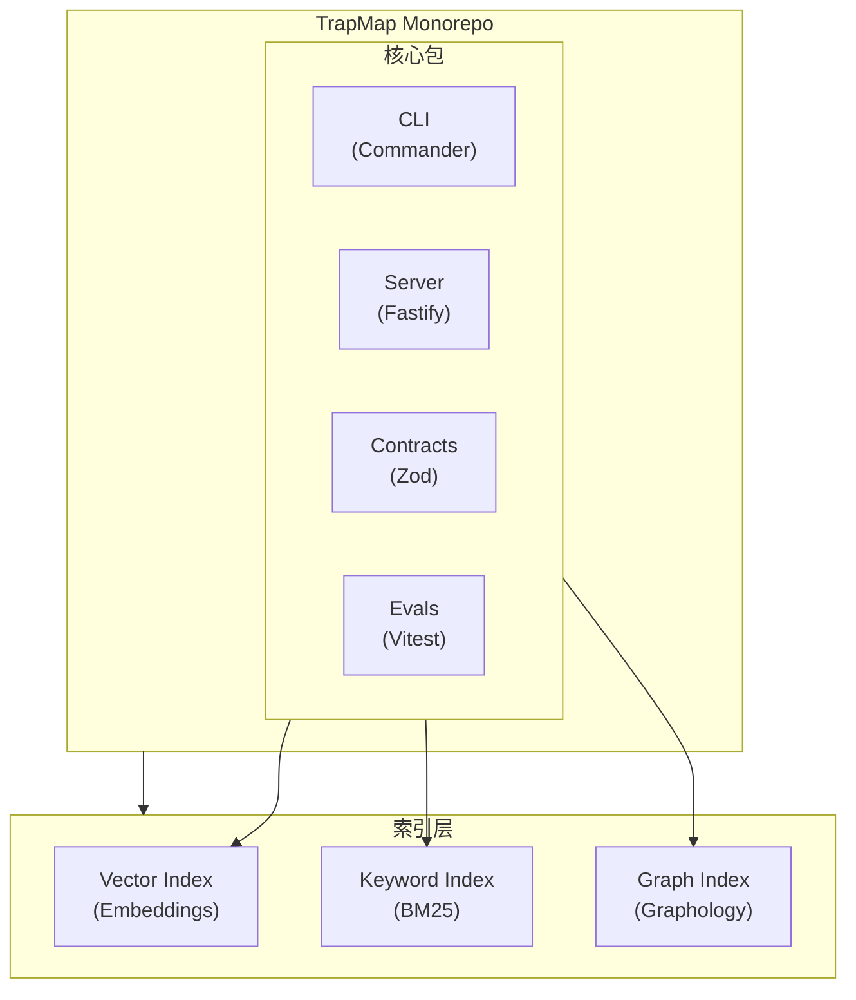

# TrapMap 文档

**基于 GraphRAG-Lite 检索的企业级知识共享平台**

TrapMap 是一个多智能体知识共享平台，专为跨团队的安全、受治理的知识交换而设计。它实现了完整的知识生命周期：提交 → 智能体审核 → 人工审核 → 审批 → 索引 → 检索。

## 系统架构



## 核心功能

### 知识生命周期
- **提交**：带 RBAC 的安全知识条目创建
- **智能体审核**：自动化重复检测、正确性风险评估
- **人工审核**：带备注的审批/拒绝，治理继承
- **审批**：状态转换与提交后索引
- **检索**：多版本搜索（v1/v2/v3），置信度感知路由

### 多适配器检索
| 版本 | 能力 |
|------|------|
| v1 | 基于条目：语义、混合、图辅助模式 |
| v2 | 原生胶囊检索，带激活提示 |
| v3 | GraphRAG-lite，带陷阱优先计划编译 |

### 异步摄取管道
- 候选提交与状态跟踪
- 指纹 + 语义重复检测
- 人工解决工作流
- 发布为陷阱或技能条目

## 技术栈

| 层级 | 技术 |
|------|------|
| 运行时 | Node.js 20+ (ESM) |
| 语言 | TypeScript 5.x |
| Web 框架 | Fastify 5.x |
| CLI | Commander.js 14.x |
| 验证 | Zod 4.x |
| AI 集成 | LangChain Core |
| 图 | graphology + graphology-dag |
| 向量搜索 | OpenAI embeddings |
| 数据库 | PostgreSQL + Drizzle ORM |
| JSON 存储（兼容回退） | 文件级（原子写入） |
| 测试 | Vitest |
| 包管理 | pnpm 10.x |
| 代码质量 | Biome |

## 快速开始

### 开发

```bash
# 安装依赖
pnpm install

# 配置环境
cp .env.example .env
# 编辑 .env，填入 OPENAI_API_KEY 和 TRAPMAP_SYSTEM_ADMIN_KEY

# 启动服务器
pnpm dev:server

# 另一个终端运行 CLI
pnpm dev:cli
```

### Docker 部署

```bash
cp .env.production.example .env
# 配置生产环境

docker compose up -d

# 健康检查
curl http://127.0.0.1:4000/health
```

### 评估

```bash
# 运行检索评估
pnpm eval:retrieval

# 运行摘要评估
pnpm eval:summary

# 运行所有 CI 评估
pnpm eval:ci
```

## 文档

### 新手入门
- [代码导读](guides/CODE_GUIDE.md) — 源码导航与建议阅读顺序
- [快速上手](guides/GETTING_STARTED.md) — 本地开发环境搭建
- [PostgreSQL 与 Graphology 上手](guides/PG_AND_GRAPHOLOGY.md) — 面向仓库实际代码的 `pg` / `graphology` 使用方式导读
- [客户端集成](guides/CLIENT_INTEGRATION.md) — Skill 工件结构、检索→激活流程、各客户端落地方式
- [数据模型](reference/DATA_MODEL.md) — 核心数据实体及关系
- [数据库表结构速查](reference/DATABASE_SCHEMA.md) — 56 张表快速参考、枚举值、外键关系
- [术语表](reference/GLOSSARY.md) — 项目专用术语解释
- [投稿指南](guides/CONTRIBUTING.md) — 代码规范和 PR 流程

### 测试与质量
- [测试指南](operations/TESTING.md) — 测试架构、运行方法和用例编写规范
- [CI/CD 流水线](operations/CI_CD.md) — GitHub Actions 流水线、评测质量门

### 待办模块
- [待办文档索引](todos/README.md) — 当前待推进议题与方案入口
- [Badcase 回流待办](todos/badcase-feedback-loop.md) — 线上失败样本如何沉淀为回归题
- [后端工程化优化计划](todos/backend-engineering-optimization-plan.md) — 队列、MQ、微服务化与观测演进方向

### 架构与 API
- [架构概览](../architecture.md) — 四层架构概览
- [架构详解](architecture/ARCHITECTURE.md) — 系统设计、流程图、模块划分
- [摄取与重复检测分层管线](architecture/components/INGESTION.md) — candidate normalize、exact lane、PostgreSQL trap+skill recall、queue dedupe、duplicate trace
- [System Truth Sources](reference/SYSTEM_TRUTH_SOURCES.md) — 架构事实、入口文件与文档参考规则
- [仓库目录结构](reference/REPO_STRUCTURE.md) — 根目录、packages、docs、evals、归档目录的权威布局规则
- [模块详解](architecture/MODULES.md) — 详细模块分解
- [API 参考](architecture/API.md) — 完整 API 列表
- [API 契约表面](reference/api-surface.md) — 端点 Schema 概览
- [CLI 参考](architecture/CLI.md) — CLI 命令全量参考
- [CLI 渲染适配层](architecture/RENDERING.md) — 多工具输出格式适配
- [数据流](architecture/FLOW.md) — 详细数据流图
- [数据类型串联图](architecture/DATA_TYPES_PIPELINE.md) — 核心数据类型流转路径与 GraphRAG-lite 图构建详解
- [入库预计算策略](architecture/PRECOMPUTATION.md) — 入库阶段预计算措施总览、API 请求清单与延迟对比
- [LLM 图提取改造计划](architecture/HYBRID_GRAPH_EXTRACTION.md) — 用 LLM 替代规则引擎的图构建 + 入库智能增强（进行中）
- [数据库表结构速查](reference/DATABASE_SCHEMA.md) — PostgreSQL 56 张表完整参考

### 部署与运维
- [部署指南](architecture/DEPLOYMENT.md) — Docker 部署详细步骤
- [故障排查](architecture/TROUBLESHOOTING.md) — 常见问题及解决方案
- [环境变量参考](operations/ENVIRONMENT.md) — 所有环境变量完整参考
- [性能指南](reference/PERFORMANCE.md) — 性能调优与瓶颈排查
- [安全指南](operations/SECURITY.md) — 安全架构、配置清单与最佳实践
- [Prompt Provider](operations/PROMPT_PROVIDERS.md) — 多 Provider 提示系统
- [Prompt 缓存](operations/PROMPT_CACHING.md) — 提示缓存策略

### 包结构
- [包结构说明](PACKAGES.md) — packages/cli、server、contracts、skills 各包职责与接口
- [包技术选型说明](PACKAGE_STACK_RATIONALE.md) — 解释各包及主要子包为什么选择当前技术栈

### 归档文档
- [归档文档](archived/) — 历史参考文档
- [归档实施计划](archived/archived-plans/) — 已完成和过时的设计计划，保留作历史参考

## 安全模型

### 安全等级（0-10）
条目有 `requiredLevel`；用户必须满足或超过该等级才能查看敏感知识。

### RBAC 权限
```typescript
knowledge:submit    // 提交新知识条目
knowledge:search   // 搜索和检索条目
knowledge:review   // 审批/拒绝提交
knowledge:update   // 编辑现有条目
knowledge:import   // 批量导入
knowledge:export   // 批量导出
audit:read         // 查看审计日志
team:create        // 创建团队
team:list          // 列出团队
team:select        // 切换活动团队
member:create      // 添加团队成员
member:update      // 修改成员角色
member:key:create  // 生成访问密钥
```

### 生命周期状态
```
draft → submitted → agent-pass/agent-rejected → approved/rejected → deactivated
```

## 项目结构

```
Trap-Map/
├── packages/
│   ├── cli/          # Commander.js CLI 客户端
│   ├── server/       # Fastify API 服务器
│   ├── contracts/    # 共享 Zod schema
│   └── skills/       # 项目级 Skill 工作流
├── evals/            # 评估数据集和运行器
│   ├── retrieval/   # 检索测试用例
│   ├── summary/     # 摘要评判检查
│   ├── graph-extraction/ # 图提取评测
│   ├── ingestion/   # 摄取评测
│   ├── fixtures/    # 测试数据
│   ├── baselines/   # 基线报告
│   └── scripts/     # 评测脚本
├── scripts/          # 部署脚本
├── docs/            # 文档
│   └── architecture/
├── docker-compose.yml
└── package.json     # pnpm workspace 根目录
```
