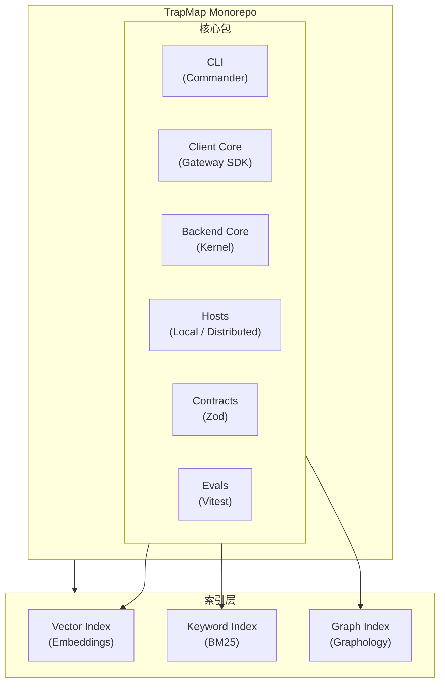

# TrapMap 文档

**TrapMap 文档索引与导航入口**

TrapMap 是面向 AI 编程工作流的知识、Trap 经验与 Skill 工件治理基础设施。本文档负责导航到项目中的权威说明，重点覆盖治理、检索、评测与按需激活相关材料。

## 当前整改主线

当前根计划为“light / heavy 后端构建目标与客户端选择”，状态为 `planned`。当前 active 执行入口统一维护在：

- 根索引：[`../plan.md`](../plan.md)
- 唯一 active mainline detail：[`todos/backend-build-targets-and-client-selection.md`](todos/backend-build-targets-and-client-selection.md)
- CI/testing truth source：[`reference/SYSTEM_TRUTH_SOURCES.md`](reference/SYSTEM_TRUTH_SOURCES.md)

除上列入口外，其余历史主线、closeout 细则和背景材料都不再构成并行 active workstream，只能作为 archived/background reference 使用。

已完成的 Agent Eval 主线现只保留为历史背景参考：

- 归档主线：[`archived/archived-plans/agent-eval-framework-evaluation-and-plan.md`](archived/archived-plans/agent-eval-framework-evaluation-and-plan.md)

上一轮“服务发现与可观测性升级”收口细则已完成并归档：

- closeout 归档：[`archived/archived-plans/active-closeout-and-followups.md`](archived/archived-plans/active-closeout-and-followups.md)
- 更早一轮“微服务平台能力增强细则”也已完成并归档：[`archived/archived-plans/microservice-platform-evolution-plan.md`](archived/archived-plans/microservice-platform-evolution-plan.md)

以下 NestJS / 服务演进内容仅保留为历史背景输入，不再作为当前根计划执行面；其他历史 todo/closeout 文档也只能被视为 background 或 deferred reference：

- 长期后端主线已冻结为 `Nest host + framework-free domain core + gradual service extraction`，Phases 1–3 已按此主线完成宿主、contract、模块化单体和服务拆分落地。
- `light` / `heavy` 只表示后端构建目标：`local-agent`、`team-monolith` -> `light`，`distributed` -> `heavy`。
- `light` 默认主入口终局冻结为 `packages/host-local/src/nest/**`；旧 Fastify 轻宿主入口已删除。
- `packages/host-local/src/nest/**` 继续承载 `Nest modular monolith` 主线。
- 运行模型固定为 `embedded/local-agent`、`team-monolith`、`distributed` 三档；`host-local/src/nest/**` 持有单体 bounded-context module graph，`host-distributed` 是分布式部署展开层。
- 六个 bounded context 已全部收口到 `backend-core/src/<context>/` 独立目录，`host-local/src/nest/app.module.ts` 注册六个 Nest module；旧 `src/modules/*.ts` compatibility facade 已删除。
- 第一批成熟服务样板 `knowledge-write + governance-review` 已完成 closeout；仓库级 owner matrix 和迁移窗口关闭条件已冻结。

Phase 4 数据、运维与退役收尾（历史主线，已冻结）：

- 冻结仓库级 owner matrix、迁移窗口关闭标准和可退役 compatibility shell 清单。
- 退役旧宿主与重复 transport/client，完成 truth source、测试矩阵、归档回写。
- 当前主线已把默认轻宿主切到 owner 清晰的 Nest 实现；candidate/review 默认写入口也已完成切换。该历史主线只保留为 owner matrix、compatibility shell 退役和 distributed 成熟度参考，不再作为当前根计划执行面。
- 详见 [`docs/archived/archived-plans/nestjs-service-evolution-04-data-runtime-and-cutover-archived.md`](archived/archived-plans/nestjs-service-evolution-04-data-runtime-and-cutover-archived.md)。

## 系统架构



> 说明：该图只展示运行时核心包；`packages/skills/` 属于项目级 Skill 工作流与参考资料，不在该简图中展开。

## 核心功能

### 知识生命周期
- **提交**：带 RBAC 的安全知识条目创建
- **智能体审核**：自动化重复检测、正确性风险评估
- **人工审核**：带备注的审批/拒绝，治理继承
- **审批**：状态转换与提交后索引
- **检索**：多版本搜索（v1/v2/v3），置信度感知路由

### 多适配器检索
| 版本 | 能力 |
|------|------|
| v1 | 基于条目：语义、混合、图辅助模式 |
| v2 | 原生胶囊检索，带激活提示 |
| v3 | GraphRAG-lite，带陷阱优先计划编译 |

### 异步摄取管道
- 候选提交与状态跟踪
- 指纹 + 语义重复检测
- 人工解决工作流
- 发布为陷阱或技能条目

## 技术栈

| 层级 | 技术 |
|------|------|
| 运行时 | Node.js 24+ (ESM) |
| 语言 | TypeScript 5.x |
| `light` 默认主入口终局 | NestJS（`packages/host-local/src/nest/**`），由 `@trapmap/host-local` 默认 `dev` / `start` / package export 提供 |
| Fastify rollback path | 已删除 |
| CLI | Commander.js 14.x |
| 验证 | Zod 4.x |
| AI 集成 | LangChain Core |
| 图 | graphology + graphology-dag |
| 向量搜索 | OpenAI embeddings |
| 数据库 | PostgreSQL + Drizzle ORM |
| 兼容回退 | JSON 文件存储 + `store_snapshot` 兼容层 |
| 测试 | Vitest |
| 包管理 | pnpm 10.x |
| 代码质量 | Biome |

## 快速开始

### 开发

```bash
# 安装依赖
pnpm install

# 配置环境
cp .env.example .env
# 编辑 .env，填入 OPENAI_API_KEY 和 TRAPMAP_SYSTEM_ADMIN_KEY

# 启动 local-agent
pnpm dev:local-agent

# 另一个终端运行 CLI
pnpm dev:cli
```

也可按 profile 启动其他形态：

```bash
pnpm dev -- team-monolith
pnpm dev -- gateway
pnpm dev -- candidate-worker
pnpm dev -- governance-worker
pnpm dev -- outbox-worker
```

根级开发命令现在优先通过 `pnpm dev -- <target>` 分发；旧别名 `pnpm dev:local-agent`、`pnpm dev:team-monolith`、`pnpm dev:distributed:*` 仍保留兼容。

### Docker 部署

```bash
cp .env.production.example .env
# 配置生产环境

docker compose up -d

# distributed gateway + workers
docker compose --profile distributed up -d

# distributed + optional RabbitMQ task transport
docker compose --profile distributed --profile mq up -d

# 健康检查
curl http://127.0.0.1:4000/health
```

默认 `docker compose up -d` 启动的 `server` service 现在实际运行 `packages/host-local/Dockerfile` 构建的 `team-monolith` light host。
`docker compose --profile distributed up -d` 会启动 `packages/host-distributed/Dockerfile` 构建的 `gateway`，并追加 `candidate-worker`、`governance-worker`、`outbox-worker`。

### 评估

```bash
# 运行 smoke 层级统一评测
pnpm eval -- smoke

# 运行 CI smoke tier baseline-aware eval
pnpm eval:ci

# 运行检索评估
pnpm eval -- retrieval

# 运行摘要评估
pnpm eval -- summary

# 运行 agent 路径规划评估
pnpm eval -- agent-planning --tier smoke

# 运行标签对齐评估
pnpm eval -- label-alignment --tier smoke --mode live

# 运行所有 CI 评估（默认 smoke；core 使用独立入口）
pnpm eval:ci

# 运行 CI core tier
pnpm eval:ci:core

# 运行仓库聚合 CI 本地脚本
pnpm run ci
```

## 文档

### 新手入门
- [代码导读](guides/CODE_GUIDE.md) — 源码导航与建议阅读顺序
- [快速上手](guides/GETTING_STARTED.md) — 本地开发环境搭建
- [文档治理指南](guides/DOCUMENTATION_GOVERNANCE.md) — `README` / `AGENTS` / `reference` 分层与回写规则
- [PostgreSQL 与 Graphology 上手](guides/PG_AND_GRAPHOLOGY.md) — 面向仓库实际代码的 `pg` / `graphology` 使用方式导读
- [客户端集成](guides/CLIENT_INTEGRATION.md) — Skill 工件结构、检索→激活流程、各客户端落地方式
- [Agent Eval Platform 集成](guides/AGENT_EVAL_PLATFORM_INTEGRATION.md) — aggregate runner 启用 `langfuse/json-archive` mirror、失败回退与关闭方式
- [微服务拆分验收清单](guides/MICROSERVICE_SPLIT_ACCEPTANCE_CHECKLIST.md) — 判断何时可以开始物理拆分 distributed 微服务
- [数据模型](reference/DATA_MODEL.md) — 核心数据实体及关系
- [数据库表结构速查](reference/DATABASE_SCHEMA.md) — 63 张表快速参考、枚举值、外键关系
- [术语表](reference/GLOSSARY.md) — 项目专用术语解释
- [投稿指南](guides/CONTRIBUTING.md) — 代码规范和 PR 流程

### 测试与质量
- [测试指南](operations/TESTING.md) — 测试架构、运行方法和用例编写规范
- [CI/CD 流水线](operations/CI_CD.md) — GitHub Actions 流水线、评测质量门

当前 CI/testing 命令真相以 `pnpm run ci`、`pnpm eval:smoke`、`pnpm eval:ci`、`pnpm eval:ci:core` 为准，具体语义由 `package.json` 与 `reference/SYSTEM_TRUTH_SOURCES.md` 冻结。

日常本地运行推荐改用 `pnpm eval -- <suite> ...`；兼容别名继续保留给现有文档、CI 和历史工作流。

deployment flexibility 最小验证矩阵：
- `pnpm test:observability-closeout`
- `pnpm test:observability-benchmark`
- `pnpm test:discovery-closeout`
- `pnpm test:distributed-closeout`
- `pnpm test:deployment-smoke`
- `pnpm test:runtime-foundations`
- `pnpm typecheck`
- 文档事实变更时补 `pnpm check:docs-drift`

### 待办模块
- [待办文档索引](todos/README.md) — 当前待推进议题与方案入口
- [微服务平台增强根计划](../plan.md) — 当前根级 closeout 索引；只链接唯一 active mainline detail，并保留归档/背景入口
- [微服务平台能力增强细则](archived/archived-plans/microservice-platform-evolution-plan.md) — 已归档的 Phase 0-4 closeout 细则；保留服务发现、内部 RPC、可观测性与资源治理的完成证据
- 当前 active execution surface 只承认 `todos/backend-build-targets-and-client-selection.md`；其余 todo 文档只能写成背景输入、deferred 落点或已完成 closeout 参考
- [健壮性与可扩展性收尾细则](archived/archived-plans/robustness-scalability-closeout-plan.md) — 已完成的上一轮 closeout 细则，保留作 truth source、observability 与 debug 收口背景参考
- 本轮 Phase 3/4 closeout 已冻结 badcase export 边界：route `debug` 仅用于 operator/debug 闭环，`scripts/export-badcase-to-eval.ts` 与 eval fixture 只消费 deterministic `draft`
- [数据埋点增强细则](archived/archived-plans/instrumentation-observability-plan.md) — 上一轮 observability 主线细则，现仅作为本轮问题池与审计背景输入，不再由根计划直接跟踪
- [轻重后端构建目标细则](archived/archived-plans/backend-build-targets-plan.md) — 轻重后端构建目标、兼容壳清理与客户端后端形态配置的冻结结论，已归档为背景参考
- [组件替换细则](archived/archived-plans/component-replacement-plan.md) — 成熟包替换的独立细则；根计划已切换，不再是当前主线
- [Badcase 回流待办](archived/archived-plans/badcase-feedback-loop.md) — 线上失败样本如何沉淀为回归题
- [后端工程化优化计划](archived/archived-plans/backend-engineering-optimization-plan.md) — 平台化 deferred 问题池；承接 MQ 产品化、监控平台、长期服务化与更重的平台工程议题
- 当前主线不再接受新的平行整改索引；若后续继续深入历史主题或平台化议题，必须转入当前 active mainline 显式链接的 deferred 落点
- [NestJS 目标架构冻结](archived/archived-plans/nestjs-service-evolution-00-target-architecture.md) — 长期目标、边界、保留与退役决策
- [NestJS 宿主与 contract 基础](archived/archived-plans/nestjs-service-evolution-01-host-and-contract-foundation-archived.md) — 首条 Nest 宿主主线与共享 contract 收口
- [NestJS 模块化单体切换](archived/archived-plans/nestjs-service-evolution-02-modular-monolith-cutover-archived.md) — 六个 bounded context、compatibility boundary 与机械迁移提示词
- [NestJS 服务拆分与异步化](archived/archived-plans/nestjs-service-evolution-03-service-extraction-and-async.md) — 服务 owner、异步边界与分布式验证
- [NestJS 数据与退役收尾](archived/archived-plans/nestjs-service-evolution-04-data-runtime-and-cutover-archived.md) — 数据 owner、运维面与旧宿主退役
- [Distributed 成熟度评估](archived/archived-plans/nestjs-service-evolution-distributed-maturity-assessment.md) — 当前 distributed 形态到底算过渡态还是成熟微服务，以及升级判据
- [成熟服务样板：Knowledge-Write + Governance-Review](archived/archived-plans/nestjs-service-evolution-knowledge-write-governance-review-pilot.md) — 第一批成熟服务样板的 owner、contract、测试门与 closeout
- [样板实施前检查表](archived/archived-plans/nestjs-service-evolution-knowledge-write-governance-review-preflight-checklist.md) — 开始迁移前先冻结边界、契约、测试入口与非目标
- [样板代码迁移任务列表](archived/archived-plans/nestjs-service-evolution-knowledge-write-governance-review-migration-tasklist.md) — 直接映射到具体包和文件的迁移任务清单
- [light / heavy 后端构建目标与客户端选择](todos/backend-build-targets-and-client-selection.md) — 当前后端构建目标、入口、验证与客户端配置主细则
- [成熟库替换评估](archived/archived-plans/library-replacement-evaluation.md) — 手写实现 vs 成熟库的评估决策与触发条件，已归档为背景参考

### 架构与 API
- [架构概览](../architecture.md) — 根入口级架构摘要，适合先建立整体心智模型
- [架构详解](architecture/ARCHITECTURE.md) — 系统设计、流程图、模块划分
- [摄取与重复检测分层管线](architecture/components/INGESTION.md) — candidate normalize、exact lane、PostgreSQL trap+skill recall、queue dedupe、duplicate trace
- [System Truth Sources](reference/SYSTEM_TRUTH_SOURCES.md) — 架构事实、入口文件与文档参考规则
- [仓库目录结构](reference/REPO_STRUCTURE.md) — 根目录、packages、docs、evals、归档目录的权威布局规则
- [模块详解](architecture/MODULES.md) — 详细模块分解
- [API 参考](architecture/API.md) — 完整 API 列表
- [API 契约表面](reference/api-surface.md) — 端点 Schema 概览
- [CLI 参考](architecture/CLI.md) — CLI 命令全量参考
- [CLI 渲染适配层](architecture/RENDERING.md) — 多工具输出格式适配
- [数据流](architecture/FLOW.md) — 详细数据流图
- [数据类型串联图](architecture/DATA_TYPES_PIPELINE.md) — 核心数据类型流转路径与 GraphRAG-lite 图构建详解
- [入库预计算策略](architecture/PRECOMPUTATION.md) — 入库阶段预计算措施总览、API 请求清单与延迟对比
- [LLM 图提取改造计划](architecture/HYBRID_GRAPH_EXTRACTION.md) — 用 LLM 替代规则引擎的图构建 + 入库智能增强（进行中）
- [可观测性架构](architecture/OBSERVABILITY.md) — 指标、日志、链路追踪三大支柱与 LGTM 栈设计
- [服务发现架构](architecture/SERVICE-DISCOVERY.md) — Consul 集成与 DNS 发现机制
- [数据库表结构速查](reference/DATABASE_SCHEMA.md) — PostgreSQL 63 张表完整参考

### 部署与运维
- [部署指南](architecture/DEPLOYMENT.md) — `local-agent` / `team-monolith` / `distributed` 三档部署入口与 `host-local` Nest 主线 / `host-distributed` 分布式展开层
- [故障排查](architecture/TROUBLESHOOTING.md) — 常见问题及解决方案
- [环境变量参考](operations/ENVIRONMENT.md) — 所有环境变量完整参考
- [可观测性运维指南](operations/OBSERVABILITY-OPERATIONS.md) — 采样策略、数据保留、资源限制与 SLO/SLI 目标
- [回归验证命令参考](operations/REGRESSION-COMMANDS.md) — PR 必跑、阶段完成验证与可观测性专项命令
- [性能指南](reference/PERFORMANCE.md) — 性能调优与瓶颈排查
- [安全指南](operations/SECURITY.md) — 安全架构、配置清单与最佳实践
- [Prompt Provider](operations/PROMPT_PROVIDERS.md) — 多 Provider 提示系统
- [Prompt 缓存](operations/PROMPT_CACHING.md) — 提示缓存策略

### 包结构
- [包结构说明](PACKAGES.md) — client-core、backend-core、hosts、cli、server、contracts、skills 各包职责与接口
- [包技术选型说明](PACKAGE_STACK_RATIONALE.md) — 解释各包及主要子包为什么选择当前技术栈

### 归档文档
- [归档文档](archived/) — 历史参考文档
- [归档实施计划](archived/archived-plans/) — 已完成和过时的设计计划，保留作历史参考（含 [Phase 0–3 阶段归档](archived/archived-plans/plan-2026-06-26-nestjs-phase0-to-phase3-archived.md) 和 [NestJS Phase 4 根索引归档](archived/archived-plans/plan-2026-06-26-nestjs-service-evolution-phase4-index-archived.md)）

## 安全模型

### 安全等级（0-10）
条目有 `requiredLevel`；用户必须满足或超过该等级才能查看敏感知识。

### RBAC 权限
```typescript
knowledge:submit    // 提交新知识条目
knowledge:search   // 搜索和检索条目
knowledge:review   // 审批/拒绝提交
knowledge:update   // 编辑现有条目
knowledge:import   // 批量导入
knowledge:export   // 批量导出
audit:read         // 查看审计日志
team:create        // 创建团队
team:list          // 列出团队
team:select        // 切换活动团队
member:create      // 添加团队成员
member:update      // 修改成员角色
member:key:create  // 生成访问密钥
```

### 生命周期状态（知识条目示意）
```
draft → submitted → agent-pass/agent-rejected → approved/rejected → deactivated
```

更完整的数据模型、状态枚举和路由差异请参考 [reference/DATA_MODEL.md](reference/DATA_MODEL.md) 与 [reference/api-surface.md](reference/api-surface.md)。

## 文档结构

```
docs/
├── README.md         # 本索引
├── guides/           # 上手、集成、贡献、代码阅读
├── operations/       # 测试、环境、CI/CD、安全、Provider 运行约定
├── architecture/     # 架构总览、模块、组件、API/CLI/部署说明
├── reference/        # 真相源、Schema、术语、目录规则、API 表面
├── plans/            # 历史长期设计参考；仅在根计划显式重新链接时恢复 active-reference 角色
├── todos/            # 当前根计划链接的阶段细则，以及待推进议题与提案
├── superpowers/      # Superpowers 生成的 specs/plans
└── archived/         # 历史归档文档
```
