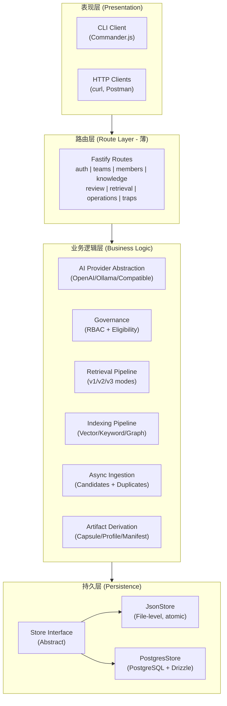
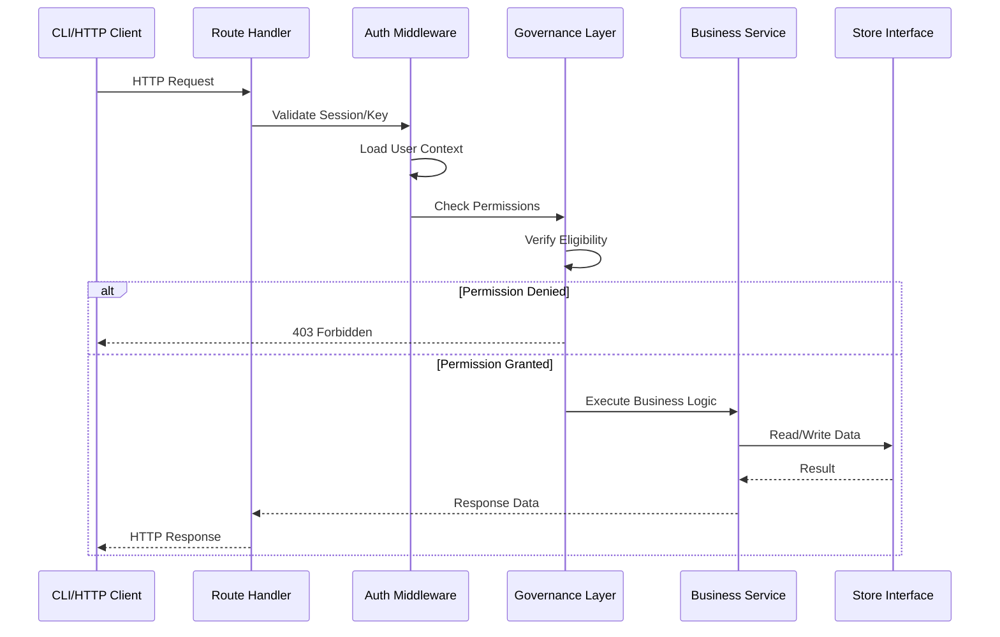

# TrapMap 架构

## 系统架构

### 分层架构

```
┌────────────────────────────────────────────────────────────────┐
│                     Presentation Layer (表现层)                  │
│  ┌─────────────────────┐        ┌─────────────────────────┐  │
│  │   CLI Client        │        │   HTTP Clients          │  │
│  │   (Commander.js)   │        │   (curl, Postman, etc.)  │  │
│  └─────────┬───────────┘        └───────────┬─────────────┘  │
└────────────┼────────────────────────────────┼────────────────┘
             │                                │
             ▼                                ▼
┌────────────────────────────────────────────────────────────────┐
│                      Route Layer (路由层 - 薄)                   │
│  ┌──────────────────────────────────────────────────────────┐ │
│  │  auth.ts | teams.ts | members.ts | knowledge.ts | review  │ │
│  │  retrieval.ts | operations.ts | candidates.ts | traps.ts   │ │
│  └─────────────────────────────┬────────────────────────────┘ │
└────────────────────────────────┼───────────────────────────────┘
                                 │
                                 ▼
┌────────────────────────────────────────────────────────────────┐
│                   Business Logic Layer (业务逻辑层)             │
│  ┌──────────────────────────────────────────────────────────┐ │
│  │  AI Provider Abstraction (OpenAI/Ollama/兼容)              │ │
│  │  Governance (RBAC + Eligibility)                        │ │
│  │  Retrieval Pipeline (v1/v2/v3 modes)                      │ │
│  │  Indexing Pipeline (Vector/Keyword/Graph adapters)      │ │
│  │  Async Ingestion (Candidates + Duplicate Detection)     │ │
│  │  Artifact Derivation (Capsule/Profile/Manifest)         │ │
│  │  Session Management                                      │ │
│  │  Audit Recording                                         │ │
│  └─────────────────────────────┬────────────────────────────┘ │
└────────────────────────────────┼───────────────────────────────┘
                                 │
                                 ▼
┌────────────────────────────────────────────────────────────────┐
│                      Persistence Layer (持久层)                  │
│  ┌──────────────────────────────────────────────────────────┐ │
│  │  Store Interface (抽象)                                   │ │
│  │  ├── JsonStore (文件级，原子写入)                         │ │
│  │  └── PostgresStore (PostgreSQL + Drizzle ORM)             │ │
│  └──────────────────────────────────────────────────────────┘ │
└────────────────────────────────────────────────────────────────┘
```

### 系统分层架构图（Mermaid）



### 请求生命周期流程图



## 模块划分

### 1. CLI 包 (`packages/cli`)

**职责**：所有用户交互的终端客户端

**命令**：
```
auth/          login, logout, session
team/          create, list, select
member/        create, update
knowledge/     submit, resubmit, inspect, list
trap/          trap 特定操作
retrieval/     search (v1, v2, v3), plan
review/        queue, approve, reject
operations/    import, export, edit
skill/         skill 操作
audit/         审计日志查看
```

**关键组件**：
- `config.ts` - CLI 状态管理（会话、团队、输出格式）
- `http.ts` - 带认证头注入的 HTTP 客户端
- `input.ts` - 用户输入处理（提示、选择）
- `output.ts` - 格式化输出（表格、JSON、ANSI 颜色）

### 2. Server 包 (`packages/server`)

**职责**：Fastify API 服务器，业务逻辑编排

**路由处理器**：
| 文件 | 端点类别 |
|------|---------|
| `auth.ts` | 认证（登录/登出/会话） |
| `teams.ts` | 团队 CRUD 和选择 |
| `members.ts` | 成员管理 |
| `access-keys.ts` | 访问密钥发放 |
| `traps.ts` | Trap 特定操作 |
| `knowledge.ts` | 知识 CRUD 和提交 |
| `review.ts` | 审核队列表和决策 |
| `retrieval.ts` | 搜索端点（v1, v2, v3） |
| `operations.ts` | 导入/导出，工件编辑 |
| `candidates.ts` | 异步摄取管道 |

**业务逻辑库**：
| 目录 | 用途 |
|------|------|
| `lib/ai/` | AI 提供商抽象 |
| `lib/artifacts/` | 工件派生 |
| `lib/candidates/` | 异步摄取管道 |
| `lib/governance/` | RBAC 和资格 |
| `lib/indexing/` | 多适配器索引 |
| `lib/retrieval/` | 检索管道 |
| `lib/persistence/` | 存储实现 |

### 3. Contracts 包 (`packages/contracts`)

**职责**：共享 Zod schema 和 TypeScript 类型

**领域 Schema**：
```
domain/
├── common.ts       # EntityId, SecurityLevel, Permission, LifecycleState
├── auth.ts         # 认证类型
├── team.ts         # Team, Member, AccessKey
├── knowledge.ts    # KnowledgeEntry, KnowledgeSubmission, KnowledgeRevision
├── artifacts.ts    # SkillArtifact, SkillCapsule, SkillProfile, ClientManifest
├── retrieval.ts    # RetrievalQuery, RetrievalResponse, CapsuleMatch
├── review.ts       # ReviewQueue, ReviewDecision
├── candidates.ts   # CandidateSubmission, DuplicateCase
└── plans.ts        # TrapFirstPlan, GraphPlan, PlanTrapNode
```

### 4. Evals 包 (`evals/`)

**职责**：评估数据集和自动化测试运行器

**结构**：
```
evals/
├── retrieval/      # 检索评估
│   ├── cases/     # 测试用例（smoke + core 层）
│   ├── runner.ts   # 评估运行器
│   └── README.md  # 评估标准
└── summary/       # 摘要评估
    ├── cases/     # 带 required/forbidden 的测试用例
    └── runner.ts  # 基于评判的运行器
```

## 技术细节

### AI 提供商抽象

```typescript
// 支持的提供商
type AIProvider = 'openai' | 'openai-compatible' | 'ollama'

// 提供商配置通过环境变量
AI_PROVIDER=openai
AI_BASE_URL=https://api.openai.com/v1  // 兼容提供商使用
AI_API_KEY=sk-...
AI_CHAT_MODEL=gpt-4o
AI_EMBEDDING_MODEL=text-embedding-3-small
```

`packages/server/src/lib/ai/` 中的抽象层标准化：
- 聊天补全（系统提示、消息、参数）
- Embeddings 生成（文本 → 向量）
- 流式响应

### 多适配器索引

```
┌─────────────────────────────────────────────────────┐
│              Indexing Pipeline (索引管道)            │
├─────────────────────────────────────────────────────┤
│  Entry State Change (条目状态变更)                   │
│  (submitted → approved)                            │
│           │                                        │
│           ▼                                        │
│  ┌─────────────────────┐                           │
│  │  Index State Record │                           │
│  │  (per-adapter sync) │                          │
│  └──────────┬──────────┘                           │
│             │                                      │
│    ┌────────┼────────┐                            │
│    ▼        ▼        ▼                            │
│ ┌──────┐ ┌──────┐ ┌──────┐                        │
│ │Vector│ │Keyword│ │Graph │                        │
│ │Adapter│ │Adapter│ │Adapter│                       │
│ └──────┘ └──────┘ └──────┘                        │
│    │        │        │                             │
│    └────────┼────────┘                             │
│             ▼                                      │
│  ┌─────────────────────┐                           │
│  │  Reconciliation    │  ← On startup (启动时)   │
│  │  (一致性检查)        │                           │
│  └─────────────────────┘                           │
└─────────────────────────────────────────────────────┘
```

**适配器**：
- **Vector**：OpenAI embeddings + 余弦相似度
- **Keyword**：BM25/基于分词的词法匹配
- **Graph**：Graphology DAG 用于关系扩展

### 检索管道

```
┌─────────────────────────────────────────────────────────────────┐
│                    Retrieval Pipeline (检索管道)                 │
├─────────────────────────────────────────────────────────────────┤
│                                                                 │
│  ┌─────────┐    ┌──────────┐    ┌─────────────────┐             │
│  │ Request │───▶│ Validate │───▶│ Auth Context    │             │
│  │ (Query) │    │ (Zod)    │    │ (Session+Team) │             │
│  └─────────┘    └──────────┘    └────────┬────────┘             │
│                                          │                      │
│                                          ▼                      │
│                              ┌─────────────────────┐            │
│                              │ Eligibility Filter  │            │
│                              │ (approval+team+level)│           │
│                              └──────────┬──────────┘            │
│                                         │                      │
│                                         ▼                      │
│                              ┌─────────────────────┐            │
│                              │   Mode Dispatch     │            │
│                              │ (semantic|hybrid|   │            │
│                              │  graph-assisted)   │            │
│                              └──────────┬─────────┘            │
│                                        │                       │
│       ┌───────────────────────────────┼───────────────────┐     │
│       ▼                               ▼                       ▼     │
│  ┌─────────┐                    ┌─────────┐            ┌────────┐│
│  │Semantic │                    │ Keyword │            │ Graph  ││
│  │Recall   │                    │ Recall  │            │Expand  ││
│  │         │                    │         │            │        ││
│  └────┬────┘                    └────┬────┘            └───┬────┘│
│       │                                │                    │     │
│       └────────────────────────┬────────┴────────────────────┘     │
│                                ▼                                    │
│                      ┌─────────────────┐                            │
│                      │  Merge + Rerank │                            │
│                      └────────┬────────┘                            │
│                               │                                     │
│                               ▼                                     │
│                      ┌─────────────────┐                            │
│                      │    Assembly    │                            │
│                      │ (buckets+      │                            │
│                      │  citations)    │                            │
│                      └────────┬────────┘                            │
│                               │                                     │
│              ┌────────────────┼────────────────┐                   │
│              ▼                ▼                ▼                   │
│       ┌───────────┐   ┌─────────────┐   ┌─────────────┐          │
│       │  Global   │   │  Project    │   │  Team       │          │
│       │Constraints│   │ Knowledge   │   │  Scope      │          │
│       └───────────┘   └─────────────┘   └─────────────┘          │
│                                                                 │
└─────────────────────────────────────────────────────────────────┘
```

### Trap 优先计划编译 (v3)

```
┌─────────────────────────────────────────────────────────────────┐
│              Trap-First Plan Compilation (陷阱优先计划编译)      │
├─────────────────────────────────────────────────────────────────┤
│                                                                 │
│  Query Input ──▶ ┌───────────┐                                 │
│                  │  GraphRAG │                                 │
│                  │  lite     │                                 │
│                  │  Wrapper  │                                 │
│                  └─────┬─────┘                                 │
│                        │                                        │
│                        ▼                                        │
│              ┌───────────────────┐                             │
│              │ Confidence-Aware  │                             │
│              │    Routing        │                             │
│              └─────────┬─────────┘                             │
│                        │                                        │
│           ┌───────────┴───────────┐                           │
│           ▼                       ▼                           │
│    ┌─────────────┐         ┌─────────────┐                    │
│    │   High      │         │    Low      │                    │
│    │ Confid-     │         │ Confid-     │                    │
│    │ ance Path   │         │ ance Fall-  │                    │
│    │             │         │ back        │                    │
│    └──────┬──────┘         └──────┬──────┘                    │
│           │                       │                            │
│           ▼                       ▼                            │
│    ┌─────────────┐         ┌─────────────┐                    │
│    │ Trap-First  │         │   Governed   │                    │
│    │ Plan        │         │   Retrieval │                    │
│    │ (typed edges│         │   Response  │                    │
│    │  + citations│         │   (v1/v2)  │                    │
│    └─────────────┘         └─────────────┘                    │
│                                                                 │
└─────────────────────────────────────────────────────────────────┘
```

### 异步摄取管道

```
┌─────────────────────────────────────────────────────────────────┐
│              Async Ingestion Pipeline (异步摄取管道)              │
├─────────────────────────────────────────────────────────────────┤
│                                                                 │
│  Candidate Submitted (候选提交)                                 │
│        │                                                        │
│        ▼                                                        │
│  ┌──────────────┐                                               │
│  │   Status:   │                                               │
│  │   received  │────── (async processing)                       │
│  └──────┬──────┘                                               │
│         │                                                        │
│         ▼                                                        │
│  ┌──────────────┐                                               │
│  │   Status:   │                                               │
│  │   queued    │                                               │
│  └──────┬──────┘                                               │
│         │                                                        │
│         ▼                                                        │
│  ┌──────────────┐                                               │
│  │   Status:   │                                               │
│  │  analyzing  │────── 指纹检查                                │
│  └──────┬──────┘       语义相似度检查                           │
│         │                    │                                  │
│         │         ┌─────────┴─────────┐                        │
│         │         ▼                   ▼                        │
│         │   ┌───────────┐      ┌───────────┐                   │
│         │   │ Duplicate│      │ Analysis  │                   │
│         │   │ Detected │      │Complete  │                   │
│         │   └─────┬────┘      └─────┬────┘                   │
│         │         │                  │                          │
│         │         │                  ▼                          │
│         │         │         ┌───────────────┐                    │
│         │         │         │  Status:      │                    │
│         │         │         │ready_for_rev  │                    │
│         │         │         └───────────────┘                   │
│         │         │                                               │
│         ▼         ▼                                               │
│  ┌─────────────────────────────────┐                           │
│  │      Reviewer Action            │                           │
│  │  POST /candidates/:id/manual-   │                           │
│  │  result { resolution: "merge"  │                           │
│  │  | "discard" | "keep_both" }    │                           │
│  └───────────────┬─────────────────┘                           │
│                  │                                              │
│                  ▼                                              │
│          ┌───────────────┐                                     │
│          │ Resolution    │                                     │
│          │ Applied       │                                     │
│          │ (publish/     │                                     │
│          │  merge)       │                                     │
│          └───────────────┘                                     │
│                                                                 │
└─────────────────────────────────────────────────────────────────┘
```

### 会话与认证

```
┌─────────────────────────────────────────────────────────────────┐
│              Session & Authentication Flow (会话认证流程)       │
├─────────────────────────────────────────────────────────────────┤
│                                                                 │
│  ┌─────────┐                                                    │
│  │  Login  │──▶ POST /v1/auth/login { username, password }     │
│  └────┬────┘         │                                        │
│       │                ▼                                        │
│       │         ┌─────────────┐                                 │
│       │         │  Validate   │                                 │
│       │         │ Credentials │                                 │
│       │         └──────┬──────┘                                 │
│       │                │                                        │
│       │         ┌──────▼──────┐                                 │
│       │         │  Create     │                                 │
│       │         │  Session    │                                 │
│       │         └──────┬──────┘                                 │
│       │                │                                        │
│       │                ▼                                        │
│       │         ┌─────────────┐                                 │
│       │         │  Set-Cookie │                                 │
│       │         │  + Return   │                                 │
│       │         │  Session     │                                 │
│       │         └─────────────┘                                 │
│       │                                                              │
│       ▼                                                              │
│  ┌─────────────┐                                                    │
│  │  Session    │◀── GET /v1/auth/session                           │
│  │  Check      │         │                                        │
│  └──────┬──────┘         │                                        │
│         │                ▼                                        │
│         │         ┌─────────────┐                                 │
│         │         │  Validate   │                                 │
│         │         │  Session ID │                                 │
│         │         └──────┬──────┘                                 │
│         │                │                                        │
│         │         ┌──────▼──────┐                                 │
│         │         │  Load User  │                                 │
│         │         │  Context    │                                 │
│         │         │  (team,     │                                 │
│         │         │  permissions│                                 │
│         │         │  level)     │                                 │
│         │         └─────────────┘                                 │
│         │                                                              │
│         ▼                                                              │
│  ┌─────────────┐                                                    │
│  │  RBAC       │──▶ Permission Check                               │
│  │  Middleware │      (knowledge:submit,                           │
│  └─────────────┘       knowledge:review, etc.)                      │
│                                                                 │
└─────────────────────────────────────────────────────────────────┘
```

## 持久化架构

### 存储接口

```typescript
interface Store {
  // 事务支持原子操作
  transact<T>(fn: (tx: Transaction) => T): Promise<T>;

  // 知识条目
  createKnowledgeEntry(entry: KnowledgeEntry): Promise<void>;
  getKnowledgeEntry(id: EntityId): Promise<KnowledgeEntry | null>;
  updateKnowledgeEntry(id: EntityId, updates: Partial<KnowledgeEntry>): Promise<void>;
  listKnowledgeEntries(query: PaginatedQuery): Promise<KnowledgeEntry[]>;

  // 团队
  createTeam(team: Team): Promise<void>;
  getTeam(id: EntityId): Promise<Team | null>;
  listTeams(): Promise<Team[]>;

  // ... etc
}
```

### JsonStore（开发）

```
.json data file
├── 原子写入（写入临时文件，然后重命名）
├── 并发访问的文件锁定
└── 启动时自动备份
```

### PostgresStore（生产）

```
PostgreSQL
├── Drizzle ORM schema
├── 连接池
├── ACID 事务
└── 常用查询的索引
```

## 环境配置

### 必需变量

| 变量 | 描述 |
|------|------|
| `OPENAI_API_KEY` | OpenAI API 密钥 |
| `TRAPMAP_SYSTEM_ADMIN_KEY` | 管理员密钥 |

### 可选变量

| 变量 | 默认值 | 描述 |
|------|--------|------|
| `TRAPMAP_DATABASE_URL` | (无) | PostgreSQL 连接字符串 |
| `TRAPMAP_DATA_FILE` | `.data/skill-shareer.json` | JSON 存储路径 |
| `HOST` | `0.0.0.0` | 服务器绑定主机 |
| `PORT` | `4000` | 服务器端口 |
| `AI_PROVIDER` | `openai` | AI 提供商类型 |
| `AI_BASE_URL` | (无) | 兼容提供商的 Base URL |
| `AI_API_KEY` | (无) | 兼容提供商的 API 密钥 |
| `AI_CHAT_MODEL` | `gpt-4o` | 聊天模型名称 |
| `AI_EMBEDDING_MODEL` | `text-embedding-3-small` | Embedding 模型名称 |

## 部署

### Docker Compose

```yaml
services:
  app:
    build: .
    ports:
      - "4000:4000"
    environment:
      - OPENAI_API_KEY=${OPENAI_API_KEY}
      - TRAPMAP_SYSTEM_ADMIN_KEY=${TRAPMAP_SYSTEM_ADMIN_KEY}
      - TRAPMAP_DATABASE_URL=postgresql://...
    depends_on:
      - postgres
    healthcheck:
      test: ["CMD", "curl", "-f", "http://localhost:4000/health"]
      interval: 30s
      timeout: 10s

  postgres:
    image: postgres:16
    environment:
      POSTGRES_DB: trapmap
      POSTGRES_USER: trapmap
      POSTGRES_PASSWORD: ${POSTGRES_PASSWORD}
    volumes:
      - postgres_data:/var/lib/postgresql/data
```

## 健康检查

```bash
curl http://localhost:4000/health
# 响应：
{
  "status": "ok",
  "product": "trapmap",
  "packages": ["cli", "server", "contracts"]
}
```
