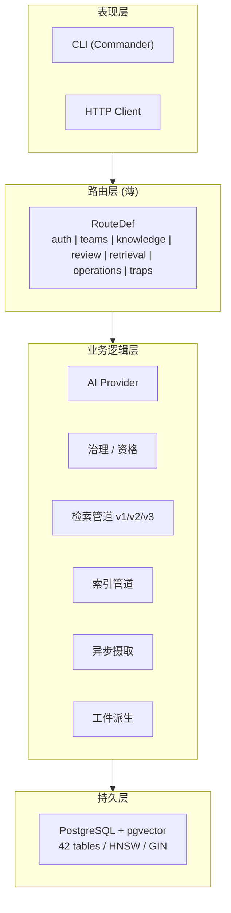
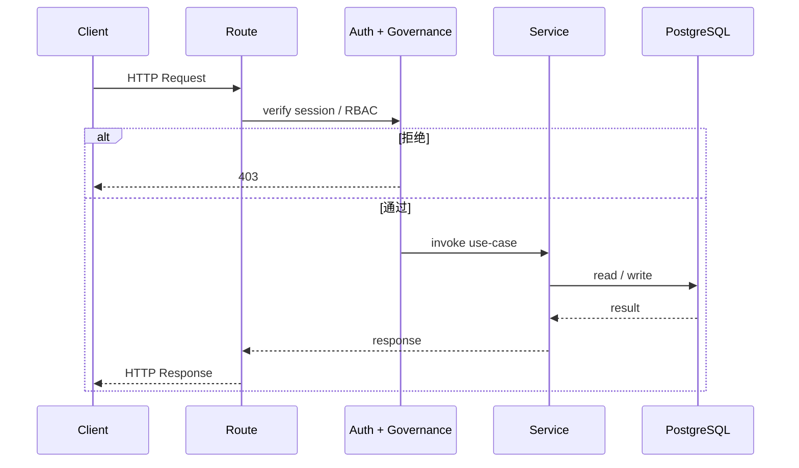

# TrapMap 架构

> 权威事实与防漂移规则见 [SYSTEM_TRUTH_SOURCES.md](../reference/SYSTEM_TRUTH_SOURCES.md)。

## 概览

TrapMap 是知识 / Trap 经验 / Skill 工件的治理与检索基础设施。当前唯一运行态是 **Nest 宿主 + 无框架领域内核 + 渐进式服务抽离**。

- **宿主**：`host-local`（light：`local-agent` / `team-monolith`）与 `host-distributed`（heavy：`distributed`）。代码分别在 `packages/host-local/src/nest/` 与 `packages/host-distributed/src/`。
- **内核**：`backend-core` 承载纯函数领域规则、端口契约、调用/运行时能力模型，零框架、零 DB 依赖。
- **服务**：6 个 bounded-context owner 各持一个 Drizzle baseline 与 PostgreSQL 投影，见下节。
- **契约**：共享类型与 Zod schema 在 `packages/contracts`，HTTP 以 `RouteDef` 工厂对外。
- **加速**：Go 读服务 `services/knowledge-read-go`（`TRAPMAP_READ_IMPL` 绞杀）与 `services/collection-mgmt-go` 仅在 distributed 中按需启用。

运行档：`embedded/local-agent → team-monolith → distributed` 三档；`gateway` 是宿主拥有的统一外部适配层。

## 有界上下文（6）

| Context | Owner 包 | 职责 |
|---|---|---|
| `identity-access` | `service-identity-access` | auth / team / member / access-key / session |
| `knowledge-write` | `service-knowledge-write` | 知识 / Trap 写、生命周期、索引副作用 |
| `knowledge-read` | `service-knowledge-read` (+ Go) | 检索读模型、召回、图查询、经验基因检索 |
| `governance-review` | `service-governance-review` | 审核队列、冲突、decay/maintenance 编排 |
| `candidate-ingestion` | `service-candidate-ingestion` | 候选提交、去重、异步摄取 |
| `job-runtime` | `service-job-runtime` | task queue / outbox / worker / workflow_runs |

> 六上下文目录见 `packages/backend-core/src/<context>/{domain,application,module.ts,index.ts}`；宿主通过 `app.module.ts` 注册六个 Nest module，经 `create<X>RouteDefs` 消费各 service 的 RouteDef。

## HTTP 路由（薄层）

- 新路由在对应 service 以 `create<X>RouteDefs(deps)` 声明 `RouteDef`，由 `createNestAdapter` / `createFastifyAdapter` 消费（唯一框架导入落点 `packages/backend-core/src/http/adapters/`）。
- Controller 不重写业务逻辑，仅注入 Port / service-assembly factory。
- 错误信封：`{ code, message, kind, requestId, traceId?, details? }`；`401` 停留在 guard 层。

## 持久化

- **权威**：PostgreSQL 16 + pgvector，42 张表（`packages/db/src/schema/` 为唯一真源，镜像见 [DATABASE_SCHEMA.md](../reference/DATABASE_SCHEMA.md)）。
- **分区**：每个 service owner 各持一个 `drizzle/` baseline；distributed 按 `identity-access → knowledge-write → candidate-ingestion → governance-review → job-runtime → knowledge-read` 顺序执行。
- **检索索引**：`knowledge_embeddings` / `capsule_embeddings` / `experience_gene_embeddings` 为 HNSW 向量表；`knowledge_search_documents` 为 `tsvector + GIN`；`capsules.keywordTokens` 等低频字段为 `jsonb + GIN`。
- **PG-first**：不引入新的 JSON 文件存储主路径；未声明 PG 的本地开发可使用内存实现，仅用于测试。

## 启动顺序

宿主统一编排（`packages/host-local/src/nest/main.ts` / `packages/host-distributed/src/`）：

1. **Repositories** — 执行 Drizzle 迁移、建 `repos` 聚合、确保 HNSW 索引、注册 graph channel
2. **Candidate Recovery** — 重排队中断候选
3. **Workers** — 启动 PG task worker（仅 PG 模式）
4. **Graph Reconciliation** — 对账图索引
5. **Lifecycle** — 注册 domain event 订阅、启动 outbox worker（仅 PG 模式）

约束：`Repos` 先于 `Candidate Recovery` 与 `Workers`；启动顺序属基础设施，不归任何领域服务所有。

运行时状态：`queueWorker` / `outboxWorker` 在 JSON 回退下为 `not-configured`；PG 下为 `running | remote | degraded`；graph fail-open 时 `readiness = degraded`。

## 分层视图





## 模块划分

| 层 | 包 | 说明 |
|---|---|---|
| Apps | `apps/cli`, `apps/web-panel`, `apps/mcp`, `apps/light`, `apps/distributed` | thin assembly；`light`/`distributed` 仅组装宿主，`cli`/`web-panel`/`mcp` 经 `client-core` 走 gateway HTTP |
| Hosts | `packages/host-local`, `packages/host-distributed` | 宿主装配、transport、provider wiring、health/ready |
| Services | `service-*` (6 + cron) | owner-local schema + RouteDef + application 接线 |
| Core | `packages/backend-core`, `packages/contracts`, `packages/client-core`, `packages/db`, `packages/assembly` | 内核契约、共享类型、聚合装配 |

依赖方向：`Apps/Hosts → Services → Core`；`Services` 之间不直接依赖，经 `backend-core` 端口契约协作。

## 可观测性与服务发现

- **可观测性**：`OBSERVABILITY.md`（OTel + Prometheus/Tempo/Loki/Grafana）。`local-agent` 可选/降级为 console，`distributed` 必需全量。
- **服务发现**：`SERVICE-DISCOVERY.md`（Consul）。`local-agent` 不需要，`team-monolith` 可选，`distributed` 必需。
- Compose：见 `docker-compose.yml` 与 `docker-compose.observability.yml`，配置在 `config/`。

## 健康检查

```bash
curl http://127.0.0.1:4000/health
curl http://127.0.0.1:4000/ready   # readiness=not-ready 时 503
```

返回包含 `liveness/readiness`、`requestContext`、`dependencies { database, queueWorker, graphQuery }`、`memory`、`uptimeSeconds`。API-only 实例对 `queueWorker` 可报告 `remote` 而不视为不健康。

## 配置与部署

- 宿主配置见 `packages/host-local/src/nest/config/config.ts` 与 `packages/host-distributed/src/config/service-config.ts`。
- 部署指南见 [DEPLOYMENT.md](DEPLOYMENT.md)。
- 历史路径不再赘述；追溯见 `docs/archived/`。

