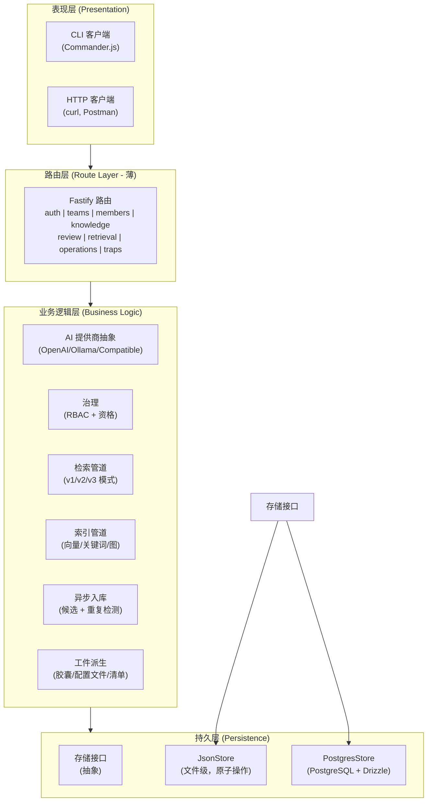
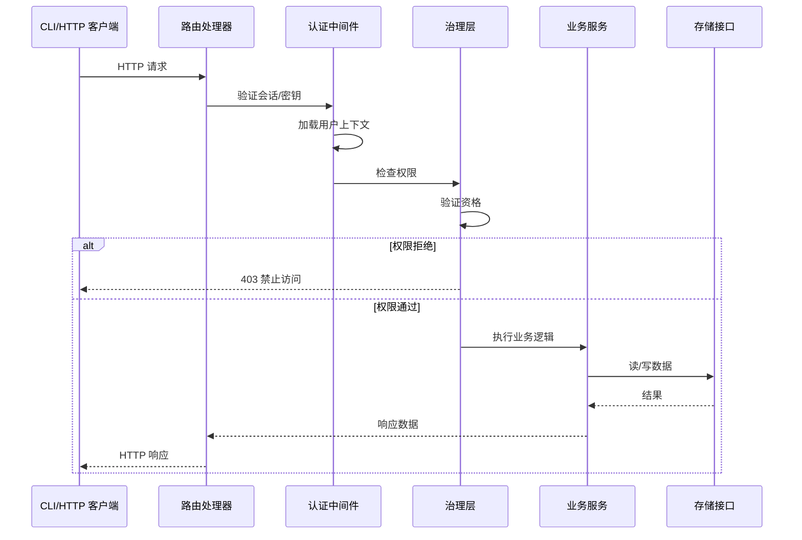
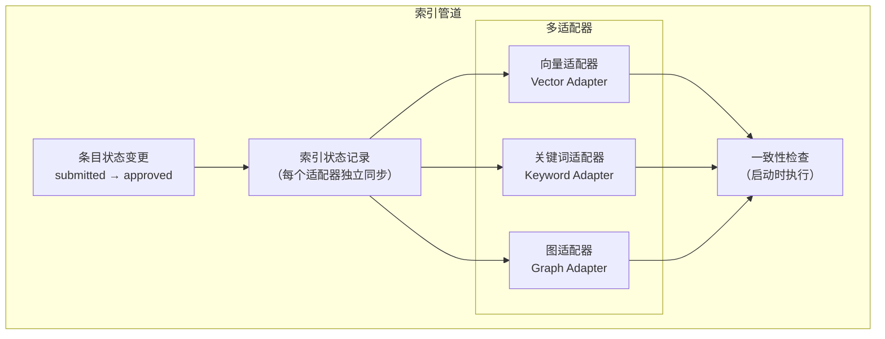
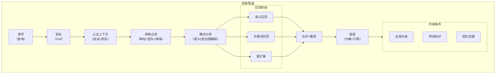
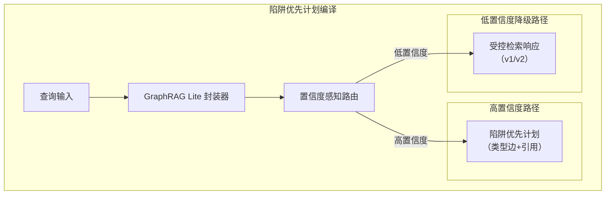
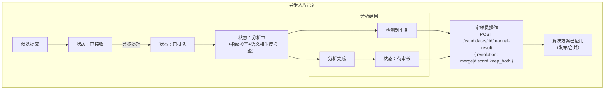
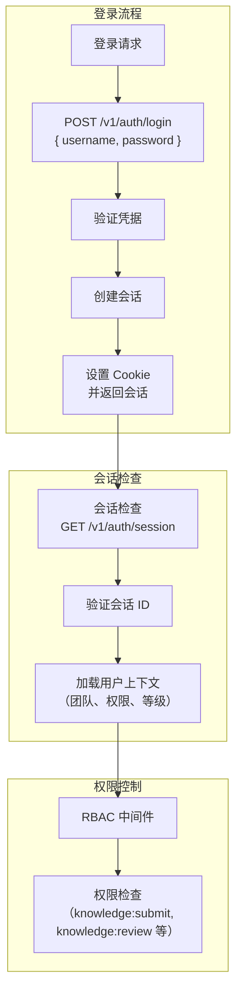
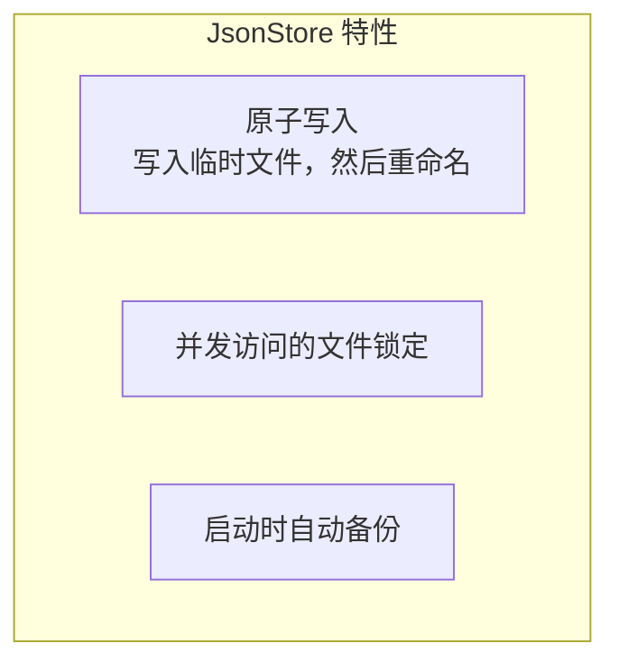
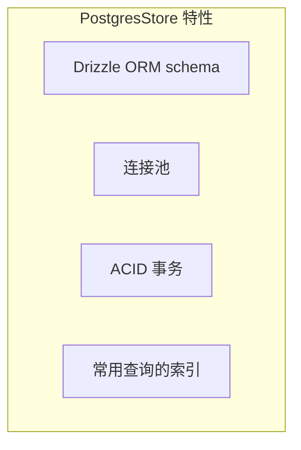

# TrapMap 架构

> 权威的事实来源和防漂移守卫规则见 [SYSTEM_TRUTH_SOURCES.md](../reference/SYSTEM_TRUTH_SOURCES.md)。

## 系统架构

## 持久化演进边界

Round 0 已对数据库现代化方案完成基线冻结，后续架构演进遵守以下约定：

- 业务主事实进入 PostgreSQL 结构化主表与历史/事件表。
- `store_snapshot` 仅保留给尚未迁移的兼容域，不再是 PG 主读路径用于身份/审计域。
- 双写兼容层只允许短期存在，必须在后续轮次停止双写并删除旧层。
- 检索索引、embedding、capsule、profile、manifest、usage rollup 属于派生层，不得反向成为业务真相。

> 权威的迁移状态记录见 [docs/reference/DATA_MODEL.md](../reference/DATA_MODEL.md)。`store_snapshot` 当前仅作为兼容层，不再接纳新的核心业务主路径。

当前收敛状态：

- Knowledge / Artifact / Candidate / Task Queue 已由 PostgreSQL 主表和 migration 驱动。
- Team / User / Member / Session / AccessKey 及部分辅助域已通过 PostgreSQL 结构化表承载主读写路径。
- 应用启动负责执行 migration，不负责为核心领域动态建表。

### 启动序列

应用启动由 `packages/server/src/bootstrap/run-startup-sequence.ts` 统一编排，严格按以下顺序执行：

1. **Repositories** (`bootstrap-repositories.ts`) — 运行 Drizzle 迁移、创建所有 flat props repo 和统一 `repos` 对象、确保 HNSW 向量索引、注册 graph channel
2. **Candidate Recovery** (`bootstrap-candidate-recovery.ts`) — 查找并重新排队中断的候选（JSON + PG 双路径）
3. **Workers** (`bootstrap-workers.ts`) — 创建并启动 PostgreSQL task worker（仅 PG 模式）
4. **Graph Reconciliation** (`bootstrap-graph-reconciliation.ts`) — 对账图索引
5. **Lifecycle** (`bootstrap-lifecycle.ts`) — 注册 domain event 订阅者、启动 outbox worker（仅 PG 模式）

关键约束：Repos 必须先于 Candidate Recovery 和 Workers 初始化，因为两者依赖 `repos.candidate`。

### 系统分层架构图



### 请求生命周期流程图



## 模块划分

### 1. CLI 包 (`packages/cli`)

**职责**：所有用户交互的终端客户端

**命令**：
```
auth/          login, logout, session
team/          create, list, select
member/        create, update
knowledge/     submit, resubmit, inspect, list
trap/          trap 特定操作
retrieval/     search (v1, v2, v3), plan
review/        queue, approve, reject
operations/    import, export, edit
skill/         skill 操作
audit/         审计日志查看
```

**关键组件**：
- `config.ts` - CLI 状态管理（会话、团队、输出格式）
- `http.ts` - 带认证头注入的 HTTP 客户端
- `input.ts` - 用户输入处理（提示、选择）
- `output.ts` - 格式化输出（表格、JSON、ANSI 颜色）

### 2. Server 包 (`packages/server`)

**职责**：Fastify API 服务器，业务逻辑编排

**路由处理器**：
| 文件 | 端点类别 |
|------|---------|
| `auth.ts` | 认证（登录/登出/会话） |
| `teams.ts` | 团队 CRUD 和选择 |
| `members.ts` | 成员管理 |
| `access-keys.ts` | 访问密钥发放 |
| `traps.ts` | Trap 特定操作（通过共享应用服务） |
| `knowledge.ts` | 知识 CRUD 和提交（通过共享应用服务） |
| `review.ts` | 审核队列表和决策 |
| `retrieval.ts` | 搜索端点（v1, v2, v3） |
| `operations.ts` | 导入/导出，工件编辑 |
| `candidates.ts` | 异步摄取管道 |

**知识/Trap 应用服务**：`knowledge.ts` 和 `traps.ts` 的提交/重提/取代工作流委托给 `lib/knowledge/application-service.ts`。路由 → 应用服务 → 仓库 的分层确保 knowledge 和 trap 路由共享相同的持久化语义，消除了此前 trap 路由缺失治理/生命周期持久化的正确性问题。

**业务逻辑库**：
| 目录 | 用途 |
|------|------|
| `lib/ai/` | AI 提供商抽象 |
| `lib/artifacts/` | 工件派生 |
| `lib/candidates/` | 异步摄取管道 |
| `lib/governance/` | RBAC 和资格 |
| `lib/indexing/` | 多适配器索引 |
| `lib/knowledge/` | 知识应用服务（submit/resubmit/supersede）、仓库接口和 PG 实现 |
| `lib/retrieval/` | 检索管道 |
| `lib/persistence/` | 存储实现 |

### 3. Contracts 包 (`packages/contracts`)

**职责**：共享 Zod schema 和 TypeScript 类型

**领域 Schema**：
```
domain/
├── common.ts       # EntityId, SecurityLevel, Permission, LifecycleState
├── auth.ts         # 认证类型
├── team.ts         # Team, Member, AccessKey
├── knowledge.ts    # KnowledgeEntry, KnowledgeSubmission, KnowledgeRevision
├── artifacts.ts    # SkillArtifact, SkillCapsule, SkillProfile, ClientManifest
├── retrieval.ts    # RetrievalQuery, RetrievalResponse, CapsuleMatch
├── review.ts       # ReviewQueue, ReviewDecision
├── candidates.ts   # CandidateSubmission, DuplicateCase
└── plans.ts        # TrapFirstPlan, GraphPlan, PlanTrapNode
```

### 4. Evals 包 (`evals/`)

**职责**：评估数据集和自动化测试运行器

**结构**：
```
evals/
├── retrieval/      # 检索评估
│   ├── cases/     # 测试用例（smoke + core 层）
│   ├── runner.ts   # 评估运行器
│   └── README.md  # 评估标准
└── summary/       # 摘要评估
    ├── cases/     # 带 required/forbidden 的测试用例
    └── runner.ts  # 基于评判的运行器
```

## 技术细节

### AI 提供商抽象

```typescript
// 支持的提供商
type AIProvider = 'openai' | 'openai-compatible' | 'ollama'

// 提供商配置通过环境变量
AI_PROVIDER=openai
AI_BASE_URL=https://api.openai.com/v1  // 兼容提供商使用
AI_API_KEY=sk-...
AI_CHAT_MODEL=gpt-4o
AI_EMBEDDING_MODEL=text-embedding-3-small
```

`packages/server/src/lib/ai/` 中的抽象层标准化：
- 聊天补全（系统提示、消息、参数）
- Embeddings 生成（文本 → 向量）
- 流式响应

### 多适配器索引



**适配器**：
- **Vector**：OpenAI embeddings + 余弦相似度
- **Keyword**：BM25/基于分词的词法匹配
- **Graph**：Graphology DAG 用于关系扩展

### 检索管道



### 陷阱优先计划编译 (v3)



### 异步摄取管道



### 会话与认证



## 持久化架构

### 存储接口

```typescript
interface Store {
  // 事务支持原子操作
  transact<T>(fn: (tx: Transaction) => T): Promise<T>;

  // 知识条目
  createKnowledgeEntry(entry: KnowledgeEntry): Promise<void>;
  getKnowledgeEntry(id: EntityId): Promise<KnowledgeEntry | null>;
  updateKnowledgeEntry(id: EntityId, updates: Partial<KnowledgeEntry>): Promise<void>;
  listKnowledgeEntries(query: PaginatedQuery): Promise<KnowledgeEntry[]>;

  // 团队
  createTeam(team: Team): Promise<void>;
  getTeam(id: EntityId): Promise<Team | null>;
  listTeams(): Promise<Team[]>;

  // ... etc
}
```

### JsonStore（开发）



### PostgresStore（生产）



## 环境配置

### 必需变量

| 变量 | 描述 |
|------|------|
| `OPENAI_API_KEY` | OpenAI API 密钥 |
| `TRAPMAP_SYSTEM_ADMIN_KEY` | 管理员密钥 |

### 可选变量

| 变量 | 默认值 | 描述 |
|------|--------|------|
| `TRAPMAP_DATABASE_URL` | (无) | PostgreSQL 连接字符串 |
| `TRAPMAP_DATA_FILE` | `.data/skill-shareer.json` | JSON 存储路径 |
| `HOST` | `0.0.0.0` | 服务器绑定主机 |
| `PORT` | `4000` | 服务器端口 |
| `AI_PROVIDER` | `openai` | AI 提供商类型 |
| `AI_BASE_URL` | (无) | 兼容提供商的 Base URL |
| `AI_API_KEY` | (无) | 兼容提供商的 API 密钥 |
| `AI_CHAT_MODEL` | `gpt-4o` | 聊天模型名称 |
| `AI_EMBEDDING_MODEL` | `text-embedding-3-small` | Embedding 模型名称 |

## 部署

### Docker Compose

```yaml
services:
  app:
    build: .
    ports:
      - "4000:4000"
    environment:
      - OPENAI_API_KEY=${OPENAI_API_KEY}
      - TRAPMAP_SYSTEM_ADMIN_KEY=${TRAPMAP_SYSTEM_ADMIN_KEY}
      - TRAPMAP_DATABASE_URL=postgresql://...
    depends_on:
      - postgres
    healthcheck:
      test: ["CMD", "curl", "-f", "http://localhost:4000/health"]
      interval: 30s
      timeout: 10s

  postgres:
    image: postgres:16
    environment:
      POSTGRES_DB: trapmap
      POSTGRES_USER: trapmap
      POSTGRES_PASSWORD: ${POSTGRES_PASSWORD}
    volumes:
      - postgres_data:/var/lib/postgresql/data
```

## 健康检查

```bash
curl http://localhost:4000/health
# 响应：
{
  "status": "ok",
  "product": "trapmap",
  "packages": ["cli", "server", "contracts"]
}
```
