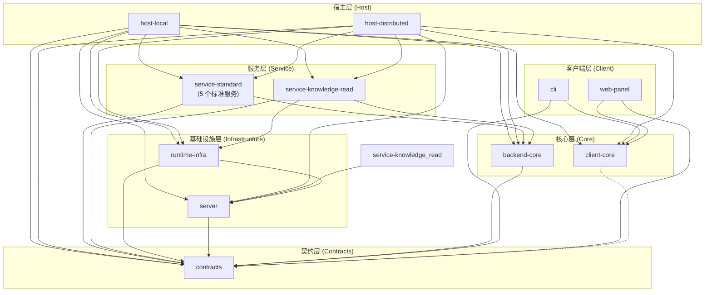

# 架构边界守护

> 本文档是 TrapMap 项目架构边界检测的权威说明。边界规则的实施配置见仓库根目录 [`.fallowrc.json`](../../.fallowrc.json)。

## 概述

TrapMap 项目使用 [fallow](https://github.com/fallow-rs/fallow) 进行架构边界检测。fallow 基于静态导入分析，自动守护六边形架构的依赖方向原则，确保包之间的依赖关系不会违反预定义的 zone 规则。

边界检测集成在 CI 流水线中，任何违反规则的 PR 都会被自动拦截。开发者也可以在本地运行检查，在提交前发现和修复边界违规。

## Zone 定义

项目共定义 11 个 zone，每个 zone 对应一组文件路径模式，由 `.fallowrc.json` 的 `boundaries.zones` 字段声明：

| Zone | 包路径 | 角色 |
|------|--------|------|
| `contracts` | `packages/contracts/src/**` | 共享契约层（Zod schema、TypeScript 类型），最底层叶子节点，不依赖任何其他 zone |
| `client-core` | `packages/client-core/src/**` | 客户端核心（无依赖的纯客户端逻辑），提供 HTTP gateway SDK、会话管理、错误模型 |
| `backend-core` | `packages/backend-core/src/**` | 六边形架构内核（domain/application/ports/use-cases），框架无关，承载运行时能力模型、端口接口、用例模式、bounded-context 模块 |
| `server` | `packages/server/src/**` | Fastify 兼容层和基础设施适配器（persistence/repos/cache/AI/indexing），承载迁移期兼容壳与既有实现面 |
| `runtime-infra` | `packages/runtime-infra/src/**` | 运行时基础设施桥接层（Drizzle/PG 适配器），提供共享的 store/repo 组装、异步传输接线、AI provider 引导等 |
| `service-standard` | `packages/service-identity-access/src/**`、`packages/service-candidate-ingestion/src/**`、`packages/service-governance-review/src/**`、`packages/service-job-runtime/src/**`、`packages/service-knowledge-write/src/**` | 标准服务装配包（identity-access、candidate-ingestion、governance-review、job-runtime、knowledge-write），只依赖 `backend-core` + `contracts` |
| `service-knowledge-read` | `packages/service-knowledge-read/src/**` | 知识读取服务（特殊：额外依赖 `server` + `runtime-infra`），见下方已知例外说明 |
| `host-local` | `packages/host-local/src/**` | 本地宿主组合根（NestJS 光主机），为 `local-agent` 和 `team-monolith` profile 装配所有服务 |
| `host-distributed` | `packages/host-distributed/src/**` | 分布式宿主组合根（完整微服务宿主），为 `distributed` profile 装配所有服务 |
| `cli` | `packages/cli/src/**` | CLI 客户端界面（Commander.js），消费 `client-core` |
| `web-panel` | `packages/web-panel/src/**` | Web 管理面板，消费 `client-core` |

## 依赖方向规则

下图展示允许的依赖方向（箭头表示"允许依赖"），从高层到低层：



简化依赖层次：

```
host-* → service-* → backend-core → contracts
host-* → server → contracts
host-* → runtime-infra → server → contracts
cli → client-core → (none)
web-panel → client-core → (none)
```

### 关键约束

1. `contracts` 是最底层叶子节点，不依赖任何其他 zone
2. `client-core` 不依赖 `backend-core` 或任何服务端包
3. `backend-core` 只依赖 `contracts`，不依赖任何服务或宿主包
4. `server` 只依赖 `contracts`
5. `runtime-infra` 依赖 `contracts` 和 `server`
6. 标准服务包（`service-standard`）只依赖 `backend-core` 和 `contracts`，服务包之间不直接依赖
7. `cli` 和 `web-panel` 只依赖 `client-core` 和 `contracts`，不依赖任何服务端包
8. 宿主包（`host-local`、`host-distributed`）是最高层组合根，可以依赖所有下游 zone

## 已知例外

### service-knowledge-read 对 server 和 runtime-infra 的依赖

`service-knowledge-read` zone 额外允许依赖 `server` 和 `runtime-infra`，这是一个 **有意为之（intentional）** 的设计决定。

**原因**：知识读取服务（retrieval read model）需要基础设施层的检索/查询能力，包括：

- 检索管道的索引查询适配器（向量召回、关键词召回、图扩展）
- 读取侧缓存和投影查询的存储实现
- Graph query backend 的适配连接

这是 CQRS 模式中读侧的典型特征：读侧服务需要直接访问基础设施层的查询优化能力，而写侧服务只需要通过端口抽象与基础设施交互。此例外已在 `.fallowrc.json` 的 `service-knowledge-read` zone 规则中显式声明。

## 使用指南

### 运行边界检查

查看当前项目所有已注册的 zone 及其边界规则：

```bash
pnpm exec fallow list --boundaries
```

### 检查违规

对当前分支与目标分支（通常是 `main`）进行边界审计：

```bash
pnpm exec fallow audit --base main
```

此命令会分析当前分支相对于 `main` 分支的所有变更文件的导入路径，报告任何违反 zone 规则的依赖关系。

### Pre-commit 自动检查

项目配置了 pre-commit hook，在每次 `git commit` 时自动运行 fallow 边界检查。如果检测到违规，提交会被阻止，需要先修复边界问题再重新提交。

### CI 门禁

CI 流水线中配置了 fallow 边界检查步骤。PR 合并前会自动运行 `fallow audit`，任何边界违规都会导致 CI 失败，阻止合并。

## Intentional Coupling Patterns

The coupling audit (Phase 0.6) identified several patterns that violate strict layering but are accepted as intentional. These are documented below for future maintainers and for tracking against the open-debt register.

### Category A: PostgresStore `instanceof` Pattern (Medium Severity)

**Location**: 20+ files across `packages/server/src/lib/` (recall-coordinator.ts, search-v2.ts, skill-lookup.ts, etc.)

**Pattern**: Orchestration code uses `instanceof PostgresStore` to extract a `Pool` from the Store interface.

**Why intentional**: All affected files reside within the `server` zone (infrastructure code). The `SkillShareStore` abstraction does not expose `getPool()`, so callers must use an instanceof check to access the underlying connection pool. This is contained within a single architectural layer.

**Tech debt**: Should be resolved by introducing a port-level "database pool access" abstraction (e.g. a `PoolProvider` interface) so that instanceof checks are no longer needed.

**Status**: Known debt, deferred to future refactoring.

### Category B: service-knowledge-read Deep Coupling (High Severity)

**Location**: `packages/service-knowledge-read/src/` (server internals now mostly concentrated behind local read-side seam default assembly and a small set of runtime types)

**Pattern**: Despite the zone-level CQRS exception documented above, `service-knowledge-read` still depends on server internals for parts of the read path. Retrieval-core business files now consume package-local `retrievalInfra` and `knowledgeReadSupportInfra` seams instead of importing recall/scoring/governance/cache/prompt internals directly, but default seam assembly and a few host/runtime types still depend on server-owned modules.

**Why intentional**: The CQRS read-side requires access to retrieval pipeline internals for query optimization. This exception was an explicit architectural decision.

**Tech debt**: The coupling grew beyond the original CQRS read-side scope into wholesale duplication of server internals. The first two closeout batches reduced the deepest retrieval-core and read-side helper imports to local seams, but the remaining server-backed default assembly should still be migrated to stable port interfaces that expose only the query capabilities the read-side needs.

**Status**: Known debt, tracked in open-debt register.

### Category C: Drizzle Schema Imports in Recall Channels (Low Severity)

**Location**: `pg-keyword.ts`, capsule repositories

**Pattern**: Recall channels import Drizzle schema directly for raw SQL queries instead of going through repository abstractions.

**Why intentional**: These files are within the `server` zone. For performance-critical query paths, direct schema access is acceptable to avoid abstraction overhead on hot retrieval paths.

**Status**: Acceptable, documented for awareness.

### Category D: Concrete Graph Backend Factory in Recall (Low Severity)

**Location**: `graph-assisted.ts`

**Pattern**: Imports `createMemoryGraphQueryBackend` as a fallback when no graph backend is configured.

**Why intentional**: Within the `server` zone, this provides graceful degradation -- retrieval continues to function without a graph backend rather than failing.

**Status**: Acceptable.

---

## 添加新 Zone 指南

当项目引入新的包并需要添加架构边界保护时，按以下步骤操作：

### 1. 在 `.fallowrc.json` 中添加 zone 定义

在 `boundaries.zones` 数组中添加新条目：

```json
{
  "name": "new-zone-name",
  "patterns": ["packages/new-package/src/**"]
}
```

### 2. 添加依赖规则

在 `boundaries.rules` 数组中添加该 zone 的允许依赖：

```json
{
  "from": "new-zone-name",
  "allow": ["backend-core", "contracts"]
}
```

`allow` 数组列出该 zone 允许导入的其他 zone 名称。留空数组 `[]` 表示不依赖任何其他 zone（叶子节点）。

### 3. 更新宿主包的允许依赖

如果新包需要被宿主包消费，需要在 `host-local` 和 `host-distributed` 的 `allow` 数组中添加新 zone。

### 4. 更新入口文件

如果新包有独立的入口文件，将其添加到 `.fallowrc.json` 的 `entry` 数组中：

```json
"entry": [
  "...",
  "packages/new-package/src/index.ts"
]
```

### 5. 更新本文档

在本文件的 Zone 定义表中添加新条目，并在依赖方向图中体现新的依赖关系。
