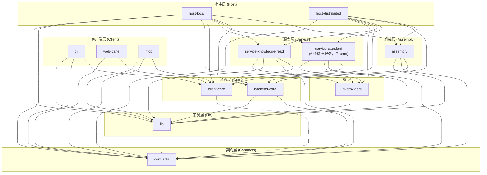

# 架构边界守护

> 本文档是 TrapMap 项目架构边界检测的权威说明。边界规则的实施配置见仓库根目录 [`.fallowrc.json`](../../.fallowrc.json)。

## 概述

TrapMap 项目使用 [fallow](https://github.com/fallow-rs/fallow) 进行架构边界检测。fallow 基于静态导入分析，自动守护六边形架构的依赖方向原则，确保包之间的依赖关系不会违反预定义的 zone 规则。

边界检测集成在 CI 流水线中，任何违反规则的 PR 都会被自动拦截。开发者也可以在本地运行检查，在提交前发现和修复边界违规。

## Zone 定义

项目共定义 14 个 zone，每个 zone 对应一组文件路径模式，由 `.fallowrc.json` 的 `boundaries.zones` 字段声明：

| Zone | 包路径 | 角色 |
|------|--------|------|
| `contracts` | `packages/contracts/src/**` | 共享契约层（Zod schema、TypeScript 类型），最底层叶子节点，不依赖任何其他 zone |
| `lib` | `packages/lib/src/**` | 共享纯函数工具层（时间/异步/字符串/数组/哈希工具），type-only 依赖 `contracts`（复用 `Sha256Hex` 等类型） |
| `persistence-schema` | `packages/persistence-schema/src/**` | 中立 Drizzle schema 层，只承载物理表定义与无状态列工厂，依赖 `contracts` |
| `client-core` | `packages/client-core/src/**` | 客户端核心（无依赖的纯客户端逻辑），提供 HTTP gateway SDK、会话管理、错误模型 |
| `ai-providers` | `packages/ai-providers/src/**` | 共享 AI 服务层：provider factory、prompt 模板、LLM 工具；只依赖 `lib`（type-only 可依赖 `contracts`） |
| `backend-core` | `packages/backend-core/src/**` | 六边形架构内核：`src/<context>/domain` 纯规则层（零框架、零 DB）+ `application/ports/use-cases` + `src/http/`（框架中立 RouteDef 路由契约与 Nest/Fastify 双 adapter）。承载运行时能力模型、端口接口、用例模式、bounded-context 模块 |
| `assembly` | `packages/assembly/src/**` | 统一组装中心：cordis Context 封装 + 能力节点注册表 + TS 组合器 + 生命周期/退出控制 + startupChecks + 拓扑/契约校验；只依赖 backend-core/contracts/lib；被 host-*/apps 消费 |
| `service-standard` | `packages/service-identity-access/src/**`、`packages/service-candidate-ingestion/src/**`、`packages/service-governance-review/src/**`、`packages/service-job-runtime/src/**`、`packages/service-knowledge-write/src/**`、`packages/service-cron/src/**` | 标准服务装配包（identity-access、candidate-ingestion、governance-review、job-runtime、knowledge-write、cron），只依赖 `backend-core` + `contracts`（可经 `ai-providers` 消费共享 AI 层） |
| `service-knowledge-read` | `packages/service-knowledge-read/src/**` | 知识读取服务，拥有 read-model、retrieval 与 graph projection owner surface |
| `host-local` | `packages/host-local/src/**` | 本地宿主库包（NestJS 光主机），为 `local-agent` 和 `team-monolith` profile 提供装配；可执行组装中心在 `apps/light` |
| `host-distributed` | `packages/host-distributed/src/**` | 分布式宿主库包（完整微服务宿主），为 `distributed` profile 提供装配；可执行组装中心在 `apps/distributed` |
| `cli` | `apps/cli/src/**` | CLI 客户端界面（Commander.js），消费 `client-core` |
| `web-panel` | `apps/web-panel/src/**` | Web 管理面板，消费 `client-core` |
| `mcp` | `apps/mcp/src/**` | MCP server 协议封装层（thin 协议封装），只经 `client-core` 的 gateway HTTP API 访问后端 |

## 判断类节点契约落点（D8）

判断类能力（intent-recognition / dedup-strategy / conflict-trigger / artifact-derivation / label-alignment / channel-merge）按契约优先（D8）组织，边界固定：

- **契约落点**（跨包共享，禁止在实现/装配处重定义）：端口接口 `packages/backend-core/src/ports/` 下六个 `<node>-ports.ts` 文件（零框架、零宿主依赖，`intent-ports.ts` / `dedup-ports.ts` / `conflict-ports.ts` / `artifact-derivation-ports.ts` / `label-alignment-ports.ts` / `channel-merge-ports.ts`）；节点配置 schema `packages/contracts/src/domain/judgment.ts`；契约注册表（`ContractDescriptor` + `verify`）`packages/assembly/src/contracts/judgment-contracts.ts`（assembly zone 内，只依赖 cordis + zod）。
- **实现落点**：rule 实现放对应 service 包（`service-knowledge-read/src/intent-recognition/`、`service-candidate-ingestion/src/dedup-strategy/`、`service-governance-review/src/conflict-trigger/`、`service-knowledge-write/src/artifact-derivation/` 与 `label-alignment/`、`service-knowledge-read/src/channel-merge/`）；llm/hybrid 变体同包扩展。
- **装配落点**：判断类节点描述符（`defineNode` + `implements` 契约 id + `configSchema`）放 host 包（`host-local/src/nest/runtime/assembly/nodes/judgment-nodes.ts`、`host-distributed/src/assembly/nodes/judgment-nodes.ts`），经 `createAssembly({ contracts: judgmentContracts })` 由 startupChecks 校验。
- **行为不变约束**：rule 默认实现 = 现状逻辑（包装层无业务改动）；契约单测共享固定样例断言集（`backend-core/src/testing/judgment-fixtures.ts`）。
- **消费方调用点（2026-08-16 迁移完成）**：四个有生产调用点的节点已改经 D8 port 消费——`searchKnowledge` 模式选择经 `intentRecognition` port、`graphAssistedHybridRecall` 图融合经 `channelMerge` port、`processCandidate` 去重检测经 `dedupStrategy` port、双宿主 governance composition 经 `conflictTrigger` port（rule 默认 = 现状逻辑，行为不变）；宿主在装配 seam（host-local `host-runtime.ts`、host-distributed 各 server 工厂）注入 rule 实例，llm/hybrid 变体可在该 seam 替换。artifact-derivation / label-alignment 尚无生产调用点，随 llm 变体收编评审。

## apps/ 组装中心边界

`apps/` 下的组装中心（`apps/light`、`apps/distributed`、`apps/migration`、`apps/cli`、`apps/web-panel`、`apps/mcp`）是顶层 pnpm workspace 中的 thin assembly 落点；其中 `apps/light`、`apps/distributed`、`apps/migration` 不构成独立 zone（fallow 未单独约束），`apps/cli` / `apps/web-panel` / `apps/mcp` 各自构成独立客户端封装 zone（见上表）：

- `apps/light` / `apps/distributed` 只做宿主装配：`apps/light` 消费 `@trapmap/host-local` 的 `start()` API，`apps/distributed` 消费 `@trapmap/host-distributed` 子路径导出的各 `start<X>Service()` API 与依赖注入，暴露可执行入口。
- 组装中心**禁止新增业务逻辑**：不得承载 domain 规则、路由声明、端口实现或 repository 行为；业务判断必须留在 `backend-core` 的 `domain/` 纯规则层或各 service 包的 owner 接线中。
- `apps/cli` / `apps/web-panel` 的依赖方向与 zone 规则不变（见下方 `cli` / `web-panel` 条目），仅代码落点从 `packages/` 迁至 `apps/`。
- `apps/migration` 只承载迁移作业装配，禁止混入业务查询或服务组装。

## 依赖方向规则

下图展示允许的依赖方向（箭头表示"允许依赖"），从高层到低层：



简化依赖层次：

```
host-* → assembly → backend-core → contracts
host-* / service-* → ai-providers → lib → contracts
assembly → backend-core / contracts / lib
cli → client-core → (none)
web-panel → client-core → (none)
mcp → client-core / lib → contracts
service-* / host-local / cli → lib → contracts
```

**zone 实现说明：** `assembly` zone 已由平行代码分支 `feat/assembly-core` 写入 `.fallowrc.json`（zone `assembly`、patterns `packages/assembly/src/**`、rule `assembly → [backend-core, contracts, lib]`、并在 `host-local` / `host-distributed` 的 allow 列表加入 `assembly`、entry 加入 `packages/assembly/src/index.ts`）。

### 关键约束

1. `contracts` 是最底层叶子节点，不依赖任何其他 zone
2. `client-core` 不依赖 `backend-core` 或任何服务端包
3. `backend-core` 只依赖 `contracts` 与 `lib`（`.fallowrc.json` 的 allow 列表另有 `persistence-schema` 但当前无消费方），不依赖任何服务或宿主包；外部框架依赖（`fastify`、`@nestjs/*`）只允许出现在 `src/http/adapters/`（测试接缝 `src/testing/` 除外），不得扩散到 `domain/`、`application/`、`ports/`、`use-cases/`；`backend-core → lib` 依赖仅限纯函数工具消费（如 cron 封装），不得引入框架
4. 标准服务包（`service-standard`，含 `service-cron` 共 6 个）只依赖 `backend-core`、`contracts`、`lib` 与 `ai-providers`，服务包之间不直接依赖
5. `cli` 和 `web-panel` 只依赖 `client-core`、`contracts`（`cli` 另可依赖 `lib`），不依赖任何服务端包；代码落点现为 `apps/cli/src/**`、`apps/web-panel/src/**`；`mcp` zone（`apps/mcp/src/**`）同属客户端封装层，只依赖 `client-core`、`contracts`、`lib`，禁止导入任何 `service-*` / `host-*` 包
6. 宿主包（`host-local`、`host-distributed`）是最高层组合根，可以依赖所有下游 zone；其可执行组装中心在 `apps/light`、`apps/distributed`，仅做 thin assembly，不得新增业务逻辑
7. `lib` 是共享工具叶子，type-only 依赖 `contracts`，不依赖任何服务/宿主/框架代码；`contracts` 不得反向依赖 `lib`
8. `ai-providers` 是独立 zone（2026-08 纳入 fallow）：作为共享 AI 服务层只依赖 `lib`（type-only 可依赖 `contracts`），被 `service-standard`、`service-knowledge-read` 与两个宿主消费；不得依赖任何服务/宿主包
9. `assembly` 是组装层 zone（2026-08-16 引入，实现于 `.fallowrc.json`）：只依赖 `backend-core` / `contracts` / `lib`，被 `host-local` / `host-distributed` 消费；`assembly` 只做装配与校验（cordis Context 封装 + 能力节点注册表 + TS 组合器 + 生命周期/退出控制 + startupChecks + 拓扑/契约校验），禁止承载业务逻辑

## backend-core 内部结构（domain 纯规则层 + http RouteDef 层）

2026-08 maintainability-rework 后，`backend-core` 内部出现两个对维护者重要的固定结构，不构成新 zone（仍属 `backend-core` 单 zone）：

- **domain 纯规则层**：`packages/backend-core/src/<context>/domain/` 是六个有界上下文真实承载规则的位置（lifecycle/policy/conflict/dedup/retrieval 等），只允许纯函数与零框架/零 DB 依赖，并配套单元测试。`service-*` 的 pg-ports 只保留 SQL + 行映射；宿主与 infrastructure 层禁止新增业务判断。
- **http RouteDef 层**：`packages/backend-core/src/http/route-contract.ts` 定义框架中立的 `RouteDef` 契约（method/path/Zod schema/handler + canonical error envelope）；`src/http/adapters/{nest.ts,fastify.ts}` 是生产代码唯一的框架导入落点（测试接缝 `src/testing/` 除外）。各 service 包以 `create<X>RouteDefs(deps)` 工厂声明路由，host-local Nest 经 `createNestAdapter`、host-distributed gateway 与各 Fastify 服务经 `createFastifyAdapter` 消费同一份 RouteDef，宿主内禁止手写重复路由实现。

## 已知例外

### host-local transitional composition

`packages/runtime-infra` 已在 2026-07-25 删除（Wave-10）。host-local 可以在自身 composition 中暂时通过迁移期接缝调用必要能力；这不是可复用 service package，其他 services 不得通过 concrete import 获得该能力。

## 使用指南

### 运行边界检查

查看当前项目所有已注册的 zone 及其边界规则：

```bash
pnpm exec fallow list --boundaries
```

### 检查违规

对当前分支与目标分支（通常是 `main`）进行边界审计：

```bash
pnpm exec fallow audit --base main
```

此命令会分析当前分支相对于 `main` 分支的所有变更文件的导入路径，报告任何违反 zone 规则的依赖关系。

### Pre-commit 自动检查

项目配置了 pre-commit hook，在每次 `git commit` 时自动运行 fallow 边界检查。如果检测到违规，提交会被阻止，需要先修复边界问题再重新提交。

### CI 门禁

CI 流水线中配置了 fallow 边界检查步骤。PR 合并前会自动运行 `fallow audit`，任何边界违规都会导致 CI 失败，阻止合并。

## Intentional Coupling Patterns

The coupling audit (Phase 0.6) identified several patterns that violate strict layering but are accepted as intentional. These are documented below for future maintainers and for tracking against the open-debt register.

### Category A: Structural Store Pool Seam (Medium Severity)

**Location**: `packages/host-local/src/nest/runtime/store-pool.ts`（Wave-10 迁移后位置）and the remaining compatibility orchestration/runtime callers.

**Pattern**: Orchestration/runtime code now uses structural `getStorePool(...)` or `typeof store.getPool === 'function'` seams to extract a `Pool` from the Store interface instead of checking `instanceof PostgresStore`.

**Why intentional**: The concrete-class checks on active production paths were closed in the 2026-07-10 targeted cleanup, but the store abstraction still does not model pool access as a first-class port. A narrow structural seam is currently the least-coupled way to let infrastructure/runtime code reach PostgreSQL-only capabilities while keeping read-side and route code off concrete `PostgresStore` imports.

**Tech debt**: Should still converge on a port-level pool capability abstraction so that even structural `getPool` probing can shrink or disappear from higher-level orchestration code.

**Status**: Concrete `instanceof PostgresStore` checks are no longer expected on active production paths. Remaining debt is the intentional structural seam, tracked in the open-debt register.

### Category B: service-knowledge-read Deep Coupling (High Severity)

**Location**: `packages/service-knowledge-read/src/` (historically concentrated behind local read-side seam default assembly; now expected to stay on stable seams)

**Pattern**: `service-knowledge-read` historically depended on server internals for parts of the read path. Its owner-local read path no longer uses the retired shared-infrastructure package; any remaining server compatibility dependency is migration debt, not a zone exception.

**Why intentional**: The CQRS read-side requires query-time infrastructure seams for retrieval optimization. Those are now owner-local or host-composed; no service may import another service's concrete implementation to obtain them.

**Tech debt**: Earlier closeout batches removed the deepest retrieval-core and read-side helper imports. The remaining task is removal of the compatibility server/store shell, alongside the narrower structural pool seam residual.

**Status**: Known debt, tracked in open-debt register.
Regression evidence: any production import of a deleted package (`@trapmap/server` or `@trapmap/runtime-infra`) from service-knowledge-read is a boundary regression.

### Category C: Drizzle Schema Imports in Recall Channels (Low Severity)

**Location**: `pg-keyword.ts`, capsule repositories

**Pattern**: Recall channels import Drizzle schema directly for raw SQL queries instead of going through repository abstractions.

**Why intentional**: These files are within the service-knowledge-read recall layer. For performance-critical query paths, direct schema access is acceptable to avoid abstraction overhead on hot retrieval paths.

**Status**: Acceptable, documented for awareness.

### Category D: Concrete Graph Backend Factory in Recall (Low Severity)

**Location**: `graph-assisted.ts`

**Pattern**: Imports `createMemoryGraphQueryBackend` as a fallback when no graph backend is configured.

**Why intentional**: Within the service-knowledge-read retrieval layer, this provides graceful degradation -- retrieval continues to function without a graph backend rather than failing.

**Status**: Acceptable.

## Wave-2 boundary closeout

The 2026-07-16 Wave-2 closeout keeps the dependency direction above unchanged. `packages/contracts/src/domain/retrieval-projection.ts` contains the pure retrieval projection/read-model helpers, while `packages/contracts/src/domain/retrieval-fixtures.ts` contains deterministic fixture builders. The `service-knowledge-read` packages consume those contracts helpers without importing one another's implementation zones; service-specific normalization and remediation remain local.

The new-only audit at commit `b3374307` reports zero introduced boundary violations, dead-code findings, complexity findings, or duplication groups. The audit still reports inherited complexity and duplication separately; those inherited totals are not new Wave-2 regressions.

---

## 添加新 Zone 指南

当项目引入新的包并需要添加架构边界保护时，按以下步骤操作：

### 1. 在 `.fallowrc.json` 中添加 zone 定义

在 `boundaries.zones` 数组中添加新条目：

```json
{
  "name": "new-zone-name",
  "patterns": ["packages/new-package/src/**"]
}
```

### 2. 添加依赖规则

在 `boundaries.rules` 数组中添加该 zone 的允许依赖：

```json
{
  "from": "new-zone-name",
  "allow": ["backend-core", "contracts"]
}
```

`allow` 数组列出该 zone 允许导入的其他 zone 名称。留空数组 `[]` 表示不依赖任何其他 zone（叶子节点）。

### 3. 更新宿主包的允许依赖

如果新包需要被宿主包消费，需要在 `host-local` 和 `host-distributed` 的 `allow` 数组中添加新 zone。

### 4. 更新入口文件

如果新包有独立的入口文件，将其添加到 `.fallowrc.json` 的 `entry` 数组中：

```json
"entry": [
  "...",
  "packages/new-package/src/index.ts"
]
```

### 5. 更新本文档

在本文件的 Zone 定义表中添加新条目，并在依赖方向图中体现新的依赖关系。
