# 数据类型串联图

本文档以流程图形式展示 TrapMap 核心数据类型如何在系统中串联，标注每个环节涉及的具体 Zod Schema 类型。

> 与 `DATA_MODEL.md` 的区别：本文档侧重**数据流转路径**和**环节标注**，而非实体定义。
> 与 `FLOW.md` 的区别：本文档覆盖**三条主线**（入库、检索、生命周期），并明确每个阶段的数据类型。

## 主线一：提交 → 审核 → 发布（Ingestion Pipeline）

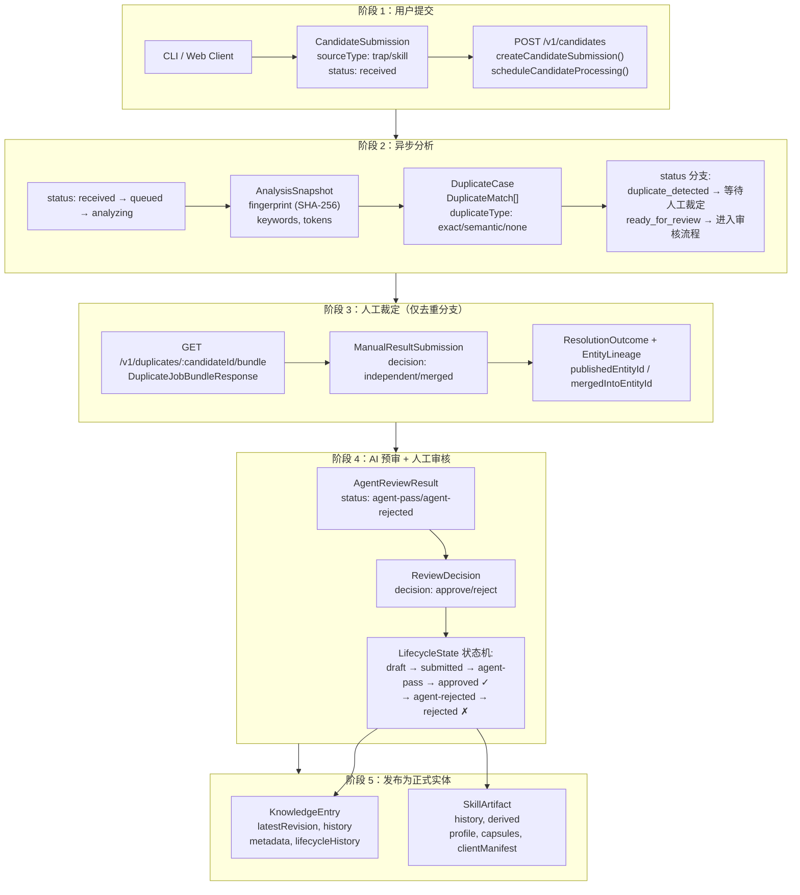

## 主线二：检索 → 返回（Retrieval Pipeline）

```mermaid
flowchart TB
    subgraph V1["v1 传统知识条目检索"]
        A1["RetrievalQuery<br/>seed, filters, mode<br/>includeRefinement, includeSummary"]
        A2["POST /v1/retrieval/search<br/>searchKnowledge()"]
        A3["RetrievalResponse<br/>globalConstraints[], projectKnowledge[]<br/>refinementSummary, summary"]
        A4["RetrievalCitation<br/>source, snippet, scores<br/>recallChannels"]
        
        A1 --> A2
        A2 --> A3
        A3 --> A4
    end

    subgraph V2["v2 胶囊优先检索"]
        B1["RetrievalV2Query<br/>seed（唯一必填）"]
        B2["POST /v2/retrieval/search<br/>searchKnowledgeV2()"]
        B3["RetrievalV2ResponseWithHints<br/>capsules[], profileHints[]<br/>activationHints[]"]
        B4["CapsuleMatch<br/>capsuleId, artifactId<br/>content, situation, problem, goal<br/>contextualPrefix (可选)<br/>score = problem×0.30 + situation×0.21<br/>+ goal×0.17 + keyword×0.17<br/>+ context×0.15, × stackPathBoost<br/>reason, conflicts"]
        
        B1 --> B2
        B2 --> B3
        B3 --> B4
    end

    subgraph 技能查找["SKED 按内容搜索 Skill 工件"]
        C1["SkillLookupQuery<br/>text, maxResults"]
        C2["POST /v1/skills/search-by-content<br/>searchSkillsByContent()"]
        C3["SkillLookupResponse<br/>matches: SkillLookupResultItem[]"]
        
        C1 --> C2
        C2 --> C3
    end

    subgraph V3["v3 GraphRAG-lite 计划检索"]
        D1["GraphPlanSearchQuery<br/>rawPlanQuery"]
        D2["POST /v1/retrieval/graph-plan<br/>searchKnowledgeGraphPlan()<br/>compileTrapFirstPlan()"]
        D3["TrapFirstPlan<br/>trapNodes[], edges[]<br/>blockerEvidence[]"]
        D4["RoutingTrace<br/>selectedMode, routeFamily<br/>routingReason, confidenceScore"]
        
        D1 --> D2
        D2 --> D3
        D2 --> D4
    end
```

## 主线三：反馈 → 衰减 → 维护（Lifecycle Management）

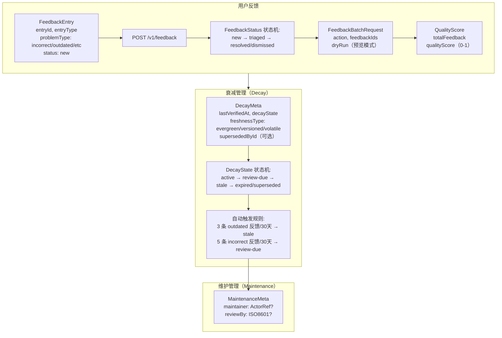

## 全局关系图

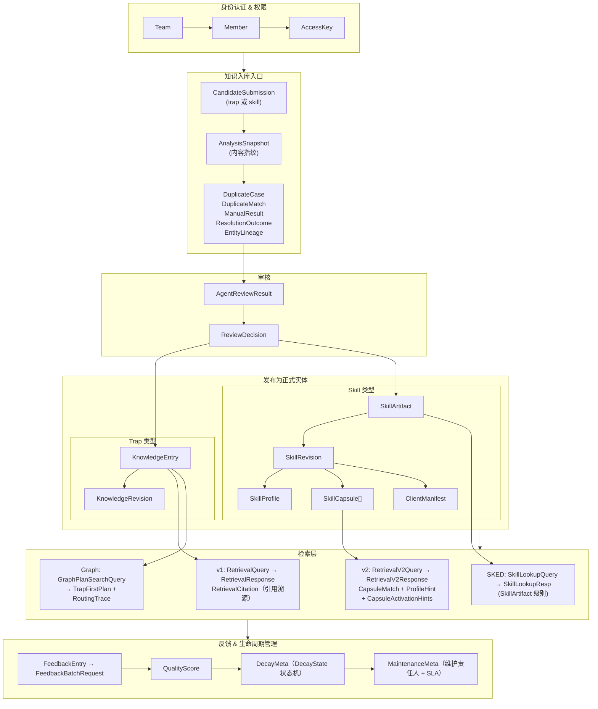

## 关键串联点总结

| 串联点 | 涉及类型 | 说明 |
|--------|---------|------|
| **入口** | `CandidateSubmission` → `CandidatePayload` | 所有知识（trap/skill）都先作为候选提交 |
| **去重** | `AnalysisSnapshot` → `DuplicateCase` → `DuplicateMatch` | 分析后与已有实体比对 |
| **人工裁定** | `ManualResultSubmission` → `ResolutionOutcome` → `EntityLineage` | 决定独立发布还是合并 |
| **审核** | `AgentReviewResult` → `ReviewDecision` → `LifecycleState` | AI 预审 + 人工审核 |
| **发布（trap）** | → `KnowledgeEntry` + `KnowledgeRevision` | 知识条目，带版本历史 |
| **发布（skill）** | → `SkillArtifact` → `SkillProfile` / `SkillCapsule` / `ClientManifest` | 技能工件，派生三种产物。Capsule 支持可选的 `contextualPrefix`（Contextual Enrichment，见 ARTIFACTS.md） |
| **检索 v1** | `RetrievalQuery` → `RetrievalResponse` + `RetrievalCitation` | 条目级检索 |
| **检索 v2** | `RetrievalV2Query` → `CapsuleMatch` + `ProfileHint` + `ActivationHints` | 胶囊级检索 |
| **检索 v3** | `GraphPlanSearchQuery` → `TrapFirstPlan` + `RoutingTrace` | GraphRAG-lite 图计划检索 |
| **反馈** | `FeedbackEntry` → `QualityScore` → `DecayMeta` → `MaintenanceMeta` | 反馈驱动衰减和维护 |

---

## 附录 A：GraphRAG-lite 图构建与检索详解

本节详细说明 TrapMap 内部 GraphRAG-lite 图的构建方式、节点/边类型、数据插入更新流程，以及 v1 和 v3 检索管道如何使用图结构。

> 注意：本文档中的"图"均指 **TrapMap 内部域图**（存储于 `StoreData.graphIndexDocuments[]`），而非 `graphify-out/` 中的代码知识图。

### A.1 图数据结构

#### 节点类型（GraphNodeKind）

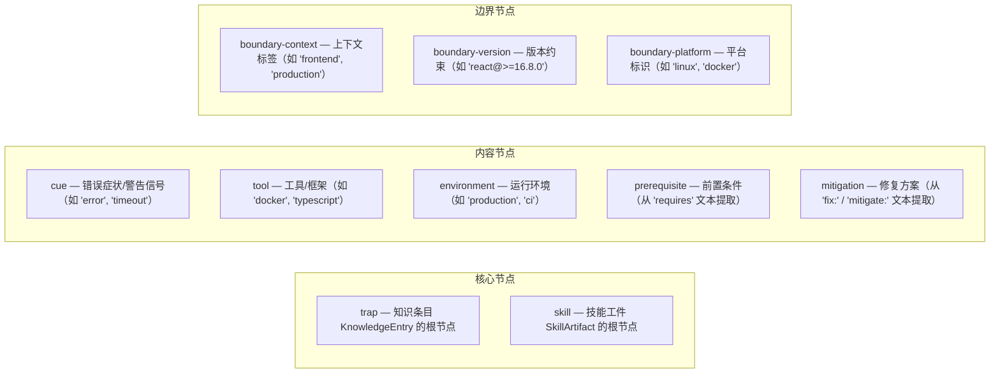

#### 边类型（GraphRelationType）与强度（GraphRelationStrength）

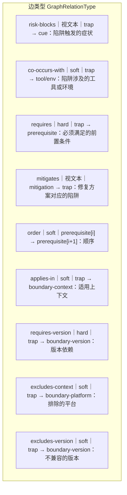

强度判定规则（LLM 驱动 + 规则 fallback）：

| 路径 | 规则 |
|------|------|
| **主路径（LLM 提取）** | LLM 直接输出 hard/soft，语义理解否定句和句级作用域。例如 "does NOT require X" 不生成 requires 边；"must" 仅影响当前句的边 |
| **requires / prerequisite** | 始终 hard |
| **risk-blocks** | 文本含 "must/blocked/requires/mandatory" 时 hard，否则 soft |
| **mitigates** | 文本含 "to mitigate ... must" 模式时 hard，否则 soft |
| **requires-version** | 始终 hard |
| **其余** | soft |

> 硬边参与 DAG 环路检测（仅 requires, risk-blocks, requires-version + strength=hard）

#### 持久化记录（GraphIndexDocumentRecord）

```
GraphIndexDocumentRecord {
  id:          "graphdoc_trap_{sourceId}_r{revision}"
  sourceType:  "trap" | "skill"
  sourceId:    来源实体 ID（entryId 或 artifactId）
  revision:    来源修订号
  contentHash: SHA-256(nodes + edges)
  teamId:      null | teamId
  scope:       "global" | "team"
  requiredLevel: 安全等级
  nodes:       GraphNodeRecord[]
  edges:       GraphEdgeRecord[]
}
```

每个 `GraphIndexDocumentRecord` 按 `{sourceType, sourceId}` 做 upsert —— 同一来源只保留最新修订。

### A.2 图构建流程（数据插入与更新）

图构建由**生命周期状态变更**触发，统一走 `syncKnowledgeIndex()` 管道。

#### A.2.1 管道总览

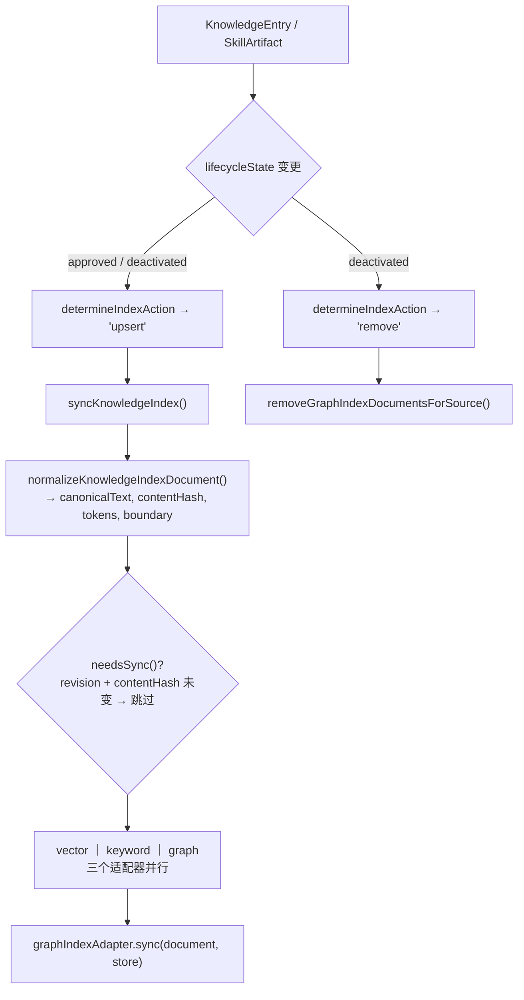

#### A.2.2 Trap 侧图构建（详细流程）

以一条 KnowledgeEntry 为例说明完整的图构建过程。提取由**两阶段 LLM** 驱动（详见 `HYBRID_GRAPH_EXTRACTION.md`），规则引擎保留为 fallback。

**示例输入**：
```
KnowledgeEntry:
  id: "entry-001"
  shortcut: "Docker build fails with COPY error in multi-stage Dockerfile"
  detail: "When using multi-stage Dockerfile with COPY --from, the build
           fails with 'cannot copy' error. To fix: ensure source path
           exists in the referenced stage. Requires: Docker 17.05+"
  labels: ["docker", "build", "ci"]
  boundary:
    context: ["ci", "production"]
    versions: [{package: "docker", range: ">=17.05.0"}]
    exclusions: [{kind: "platform", description: "windows"}]
```

**构建流程（LLM 主路径）**：

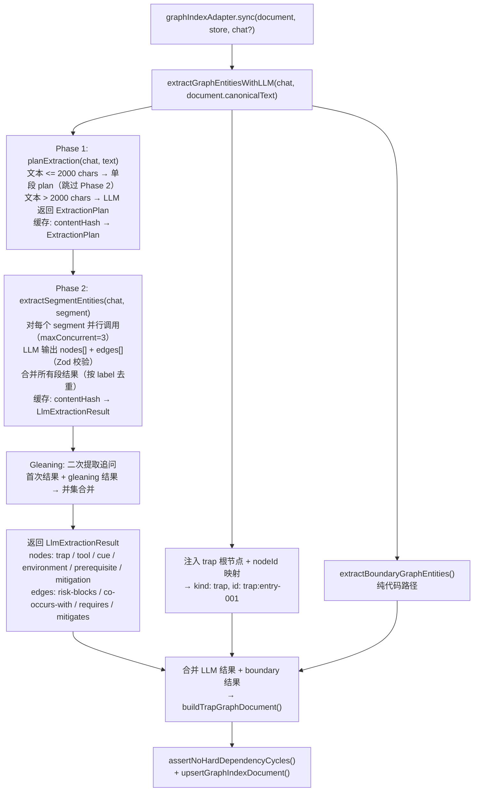

LLM 不可用时的降级路径：LLM 失败 → 缓存命中 → 使用缓存 → 无缓存 → `extractTrapGraphEntities()` 规则引擎 fallback

**LLM 提取的优势**（相比规则引擎）：
- 理解否定句："does NOT require X" 不会生成 requires 边
- 句级作用域：单个 "must" 仅影响当前句的边
- 识别新技术：无需维护关键词列表即可识别 Cloudflare Workers、Turbopack 等
- 更精确的症状/工具分类：语义理解替代子串匹配

**生成的图文档**（LLM 结果经过 nodeId 映射 + boundary 合并后）：

```
GraphIndexDocumentRecord {
  id: "graphdoc_trap_entry-001_r1"
  sourceType: "trap"
  nodes: [
    { id: "trap:entry-001",                kind: "trap" },
    { id: "tool:docker",                   kind: "tool" },
    { id: "cue:error",                     kind: "cue" },
    { id: "cue:fail",                      kind: "cue" },
    { id: "env:ci",                        kind: "environment" },
    { id: "env:production",                kind: "environment" },
    { id: "env:docker-17.05",              kind: "environment" },
    { id: "prereq:docker-17.05+",          kind: "prerequisite" },
    { id: "mit:ensure-source-path-...",     kind: "mitigation" },
    { id: "boundary-ctx:ci",               kind: "boundary-context" },
    { id: "boundary-ctx:production",       kind: "boundary-context" },
    { id: "boundary-ver:docker@>=17.05.0", kind: "boundary-version" },
    { id: "boundary-plat:windows",         kind: "boundary-platform" },
  ]
  edges: [
    { src: "trap:entry-001", tgt: "cue:error",     type: "risk-blocks",      strength: "hard" },
    { src: "trap:entry-001", tgt: "cue:fail",       type: "risk-blocks",      strength: "hard" },
    { src: "trap:entry-001", tgt: "tool:docker",    type: "co-occurs-with",   strength: "soft" },
    { src: "trap:entry-001", tgt: "env:ci",         type: "co-occurs-with",   strength: "soft" },
    { src: "trap:entry-001", tgt: "env:production", type: "co-occurs-with",   strength: "soft" },
    { src: "trap:entry-001", tgt: "prereq:docker-17.05+", type: "requires",  strength: "hard" },
    { src: "mit:ensure-...",  tgt: "trap:entry-001", type: "mitigates",      strength: "soft" },
    { src: "trap:entry-001", tgt: "boundary-ctx:ci",        type: "applies-in",       strength: "soft" },
    { src: "trap:entry-001", tgt: "boundary-ctx:production", type: "applies-in",      strength: "soft" },
    { src: "trap:entry-001", tgt: "boundary-ver:docker@>=17.05.0", type: "requires-version", strength: "hard" },
    { src: "trap:entry-001", tgt: "boundary-plat:windows",  type: "excludes-context", strength: "soft" },
  ]
}
```

**持久化前环路检测**：

```
store.transact(data => {
  existingDocs = data.graphIndexDocuments.filter(d => d != current)
  existingDocs.push(candidateDoc)

  projectHardDependencyGraph(existingDocs)   ← 仅保留
    ├─ relationType ∈ {requires, risk-blocks, requires-version}
    └─ strength == "hard"

  hasCycle(dag)?  → throw "hard dependency cycle detected"

  upsertGraphIndexDocument(data, candidateDoc)  ← 按 sourceType+sourceId 覆盖
})
```

#### A.2.3 Skill 侧图构建

Skill 图构建使用与 Trap 侧相同的 LLM 提取入口 `extractGraphEntitiesWithLLM()`，但数据来源不同：

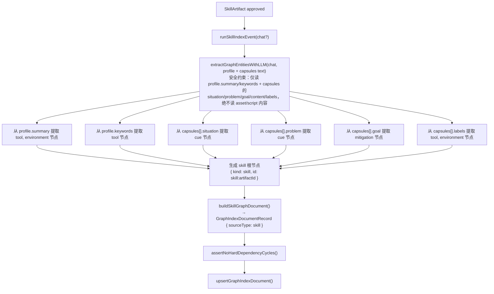

LLM 不可用时：退化为 `extractSkillGraphPrimitives()` 规则引擎（关键词匹配 + 正则提取），保持向后兼容。

#### A.2.4 启动时一致性对账

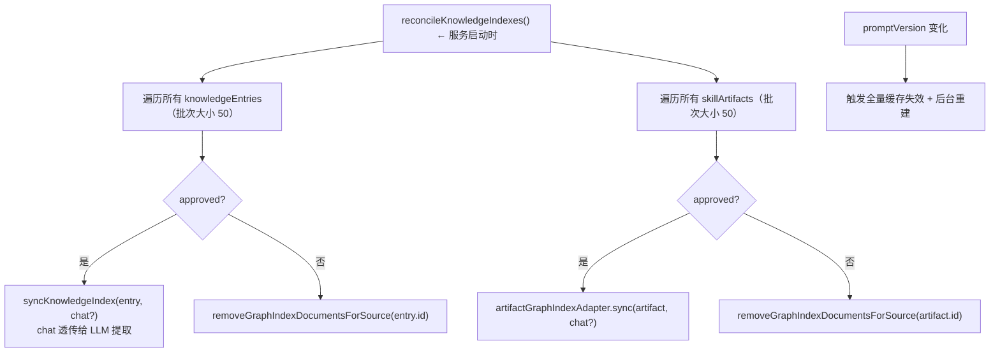

### A.3 查询时图组装

检索时将所有 `GraphIndexDocumentRecord` 组装为 graphology 有向多重图：

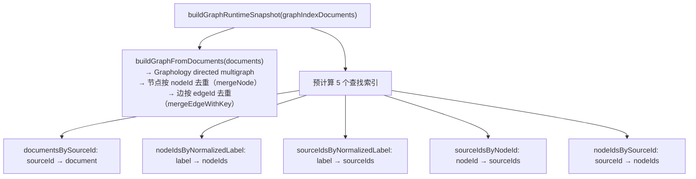

**示例**：上文 entry-001 + 另一条 entry-002（含 "docker timeout in CI"）组装后：

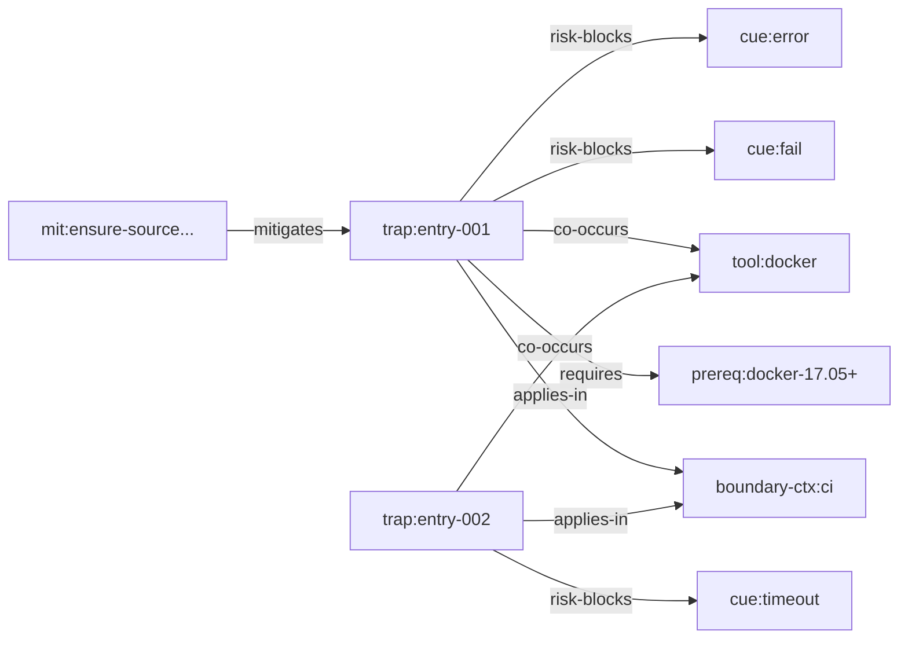

查找索引示例：

| 索引 | 键 | 值 |
|------|----|----|
| `nodeIdsByNormalizedLabel` | `"docker"` | `{"tool:docker"}` |
| `sourceIdsByNodeId` | `"tool:docker"` | `{"entry-001", "entry-002"}` |
| `sourceIdsByNormalizedLabel` | `"error"` | `{"entry-001"}` |

### A.4 v1 Graph-Assisted 检索详解

v1 将图作为**辅助通道**（权重 20%），与语义通道和关键词通道并行后融合。

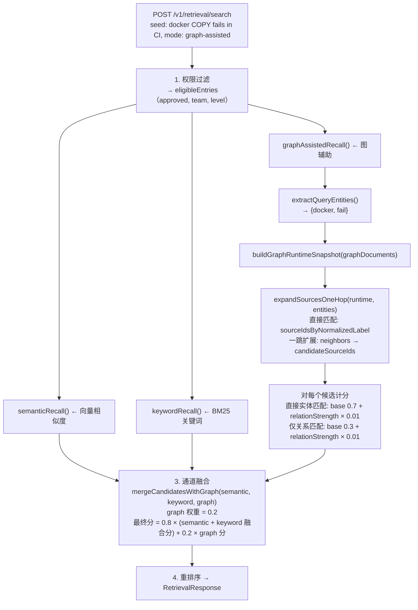

**图在 v1 中的作用示意**：

| 通道 | entry-001 | entry-002 | entry-003 | entry-005 |
|------|-----------|-----------|-----------|-----------|
| 语义通道 | 0.85 | — | 0.72 | 0.61 |
| 关键词通道 | 0.90 | 0.78 | — | — |
| 图通道 | 0.73（直接匹配 docker + fail = 2 项） | 0.30（仅通过 tool:docker 邻居关系连接） | — | — |
| **融合后** | **0.844**（图提升） | **0.684**（图小幅提升） | **0.576** | **0.488** |

### A.5 v3 Graph Plan 检索详解

v3 将图作为**主干机制**，构建结构化执行计划（TrapFirstPlan），而非简单评分列表。

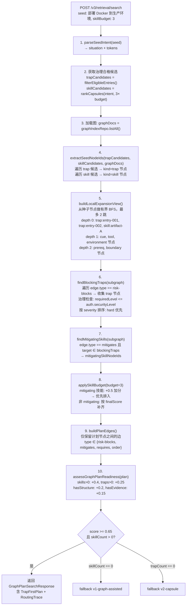

**v3 输出的 TrapFirstPlan 可视化**：

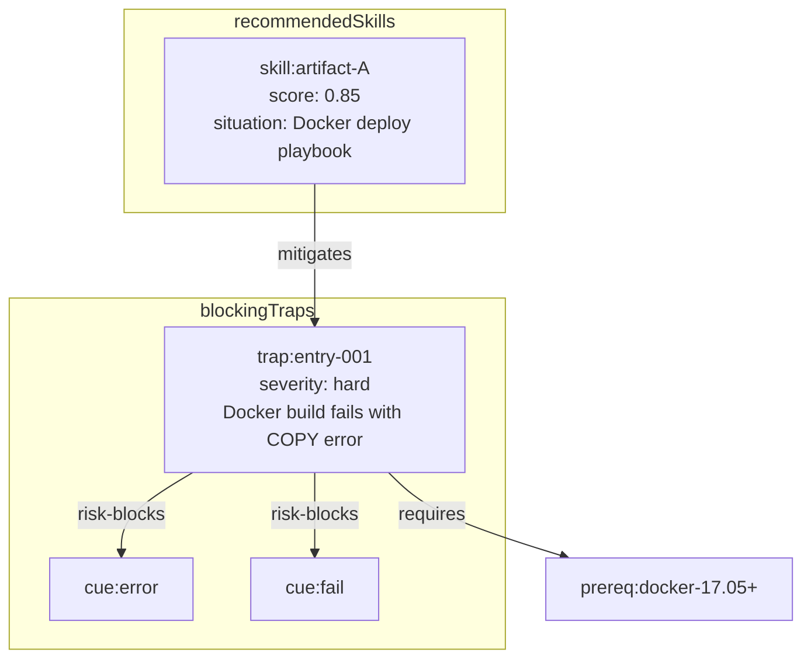

| 边 | 源 | 目标 | 类型 | 强度 |
|----|----|----|------|------|
| 1 | trap:entry-001 | cue:error | risk-blocks | hard |
| 2 | trap:entry-001 | cue:fail | risk-blocks | hard |
| 3 | skill:artifact-A | trap:entry-001 | mitigates | soft |
| 4 | trap:entry-001 | prereq:docker-17.05+ | requires | hard |

### A.6 v1 vs v3 图使用对比

| 维度 | v1 Graph-Assisted | v3 Graph Plan |
|------|-------------------|---------------|
| 图的角色 | 辅助通道（20% 权重） | 主干机制（决定计划结构） |
| 扩展深度 | 1 跳（expandSourcesOneHop） | 有界 BFS 最多 2 跳（buildLocalExpansionView） |
| 输出格式 | 评分条目列表（RecallCandidate[]） | TrapFirstPlan（结构化计划，含 traps + skills + edges） |
| 数据源 | KnowledgeEntry only | KnowledgeEntry + SkillArtifact |
| 边类型使用 | 所有边类型参与遍历 | 仅 risk-blocks, mitigates, requires, order 参与计划 |
| Skill 集成 | 无（仅条目级） | mitigating skill +0.5 加分，有 skill budget（默认 3） |
| 置信度评估 | 无 | 显式评分: skills(0.4) + traps(0.25) + structure(0.2) + evidence(0.15) |
| 降级策略 | 本身就是降级目标 | score < 0.65 → fallback v2-capsule 或 v1-graph |
| 评分方式 | 直接匹配 0.7 + 关系匹配 0.3 + 关系强度 × 0.01 | 图结构决定计划；置信度阈值 0.65 |
| 环路保护 | 共享同一套 DAG 检测 | 共享同一套 DAG 检测 |

### A.7 关键源文件索引

| 职责 | 文件路径 |
|------|---------|
| 节点/边类型定义 | `packages/server/src/lib/indexing/graph-lite/documents.ts` |
| graphology 组装与扩展 | `packages/server/src/lib/indexing/graph-lite/graphology.ts` |
| 文档 CRUD | `packages/server/src/lib/indexing/graph-lite/store.ts` |
| GraphIndexRepository 接口 | `packages/server/src/lib/graph-index/repository.ts` |
| **LLM 实体提取（主路径）** | **`packages/server/src/lib/indexing/graph-lite/llm-extract.ts`** |
| **LLM 提取缓存** | **`packages/server/src/lib/indexing/graph-lite/llm-cache.ts`** |
| Trap 实体提取（规则引擎 fallback） | `packages/server/src/lib/retrieval/recall/graph-extract.ts` |
| **LLM 重复判定** | **`packages/server/src/lib/candidates/llm-dedup.ts`** |
| **LLM 冲突判定** | **`packages/server/src/lib/conflict/llm-conflict.ts`** |
| **图提取 Zod Schema** | **`packages/contracts/src/domain/graph-extraction.ts`** |
| 边界约束提取 | `packages/server/src/lib/indexing/boundary-extract.ts` |
| Skill 实体提取 | `packages/server/src/lib/indexing/skill-events.ts` |
| Trap 图适配器 | `packages/server/src/lib/indexing/adapters/graph.ts` |
| Skill 图适配器 | `packages/server/src/lib/indexing/adapters/artifact-graph.ts` |
| 图文档构建器 | `packages/server/src/lib/indexing/adapters/graph-builders.ts` |
| 索引管道编排 | `packages/server/src/lib/indexing/pipeline.ts` |
| v1 图辅助召回 | `packages/server/src/lib/retrieval/recall/graph-assisted.ts` |
| v1 召回协调器 | `packages/server/src/lib/retrieval/orchestration/recall-coordinator.ts` |
| v3 计划编译器 | `packages/server/src/lib/retrieval/graph-plan/plan-compiler.ts` |
| v3 搜索入口 | `packages/server/src/lib/retrieval/graph-plan/graph-plan-search.ts` |

> **LLM 图提取架构详解**见 [`HYBRID_GRAPH_EXTRACTION.md`](HYBRID_GRAPH_EXTRACTION.md)。

## 相关文档

- [数据模型定义](../reference/DATA_MODEL.md) - 实体字段详情
- [数据流图](FLOW.md) - 知识提交和检索的详细流程
- [异步摄取管道](components/INGESTION.md) - CandidateSubmission 处理细节
- [知识生命周期](components/KNOWLEDGE_LIFECYCLE.md) - 状态机转换详情
- [检索系统](components/RETRIEVAL.md) - v1/v2/v3 检索算法详情
- [工件系统](components/ARTIFACTS.md) - SkillArtifact 派生详情
- [GraphRAG-lite 检索](GRAPH_RETRIEVAL.md) - 图检索系统完整文档
- [LLM 图提取架构](HYBRID_GRAPH_EXTRACTION.md) - 两阶段 LLM 图实体提取、重复/冲突检测增强
