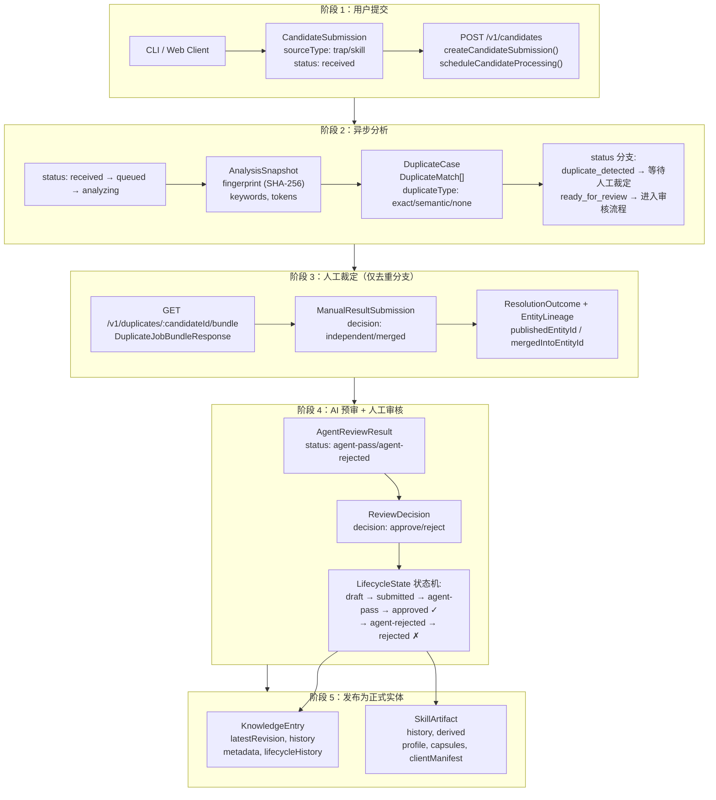
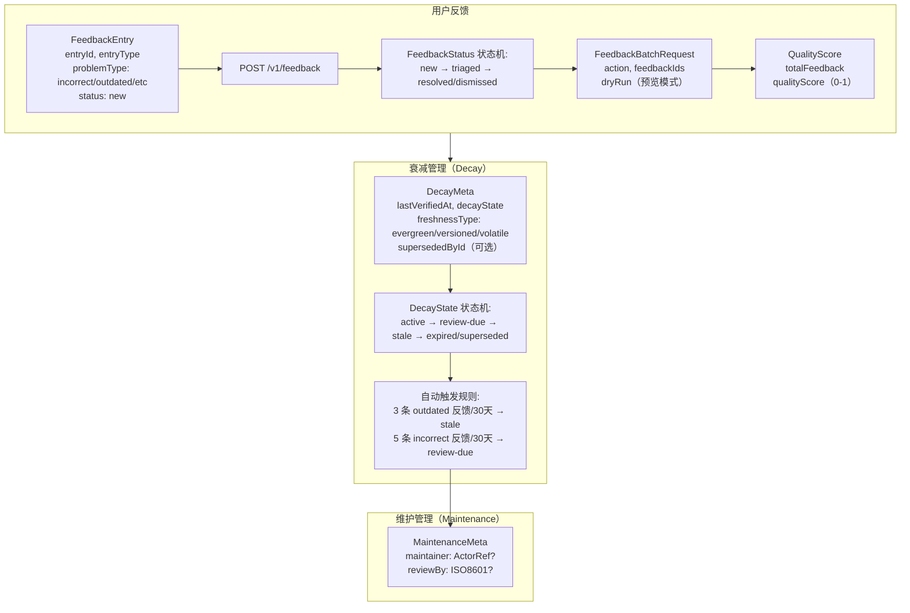
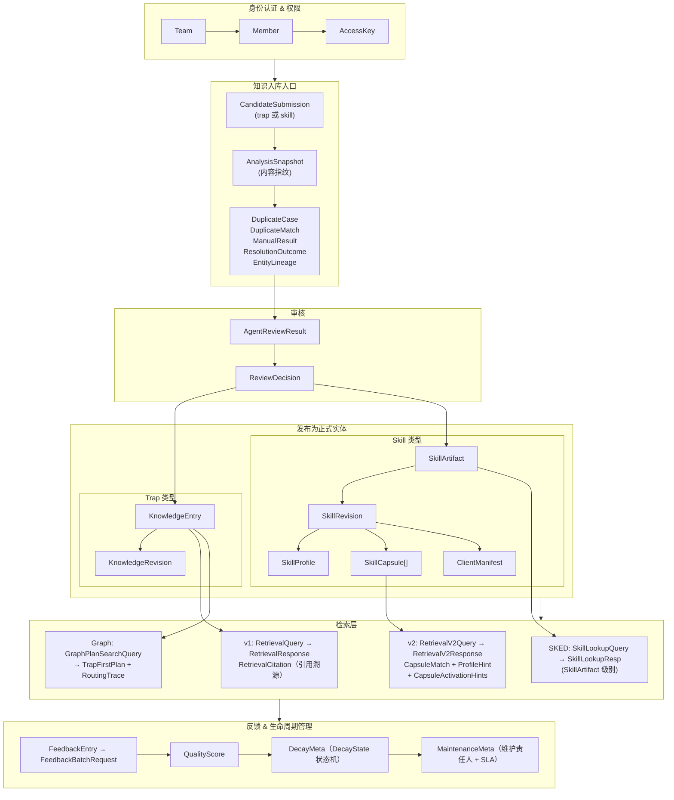

# 数据类型串联图

本文档以流程图形式展示 TrapMap 核心数据类型如何在系统中串联，标注每个环节涉及的具体 Zod Schema 类型。

> 与 `DATA_MODEL.md` 的区别：本文档侧重**数据流转路径**和**环节标注**，而非实体定义。
> 与 `FLOW.md` 的区别：本文档覆盖**三条主线**（入库、检索、生命周期），并明确每个阶段的数据类型。

## 主线一：提交 → 审核 → 发布（Ingestion Pipeline）

## 主线二：检索 → 返回（Retrieval Pipeline）

```mermaid
flowchart TB
    subgraph V1["v1 传统知识条目检索"]
        A1["RetrievalQuery<br/>seed, filters, mode<br/>includeRefinement, includeSummary"]
        A2["POST /v1/retrieval/search<br/>searchKnowledge()"]
        A3["RetrievalResponse<br/>globalConstraints[], projectKnowledge[]<br/>refinementSummary, summary"]
        A4["RetrievalCitation<br/>source, snippet, scores<br/>recallChannels"]
        
        A1 --> A2
        A2 --> A3
        A3 --> A4
    end

    subgraph V2["v2 胶囊优先检索"]
        B1["RetrievalV2Query<br/>seed（唯一必填）"]
        B2["POST /v2/retrieval/search<br/>searchKnowledgeV2()"]
        B3["RetrievalV2ResponseWithHints<br/>capsules[], profileHints[]<br/>activationHints[]"]
        B4["CapsuleMatch<br/>capsuleId, artifactId<br/>content, situation, problem, goal<br/>score, reason, conflicts"]
        
        B1 --> B2
        B2 --> B3
        B3 --> B4
    end

    subgraph 技能查找["SKED 按内容搜索 Skill 工件"]
        C1["SkillLookupQuery<br/>text, maxResults"]
        C2["POST /v1/skills/search-by-content<br/>searchSkillsByContent()"]
        C3["SkillLookupResponse<br/>matches: SkillLookupResultItem[]"]
        
        C1 --> C2
        C2 --> C3
    end

    subgraph V3["v3 GraphRAG-lite 计划检索"]
        D1["GraphPlanSearchQuery<br/>rawPlanQuery"]
        D2["POST /v1/retrieval/graph-plan<br/>searchKnowledgeGraphPlan()<br/>compileTrapFirstPlan()"]
        D3["TrapFirstPlan<br/>trapNodes[], edges[]<br/>blockerEvidence[]"]
        D4["RoutingTrace<br/>selectedMode, routeFamily<br/>routingReason, confidenceScore"]
        
        D1 --> D2
        D2 --> D3
        D2 --> D4
    end
```

## 主线三：反馈 → 衰减 → 维护（Lifecycle Management）

## 全局关系图

## 关键串联点总结

| 串联点 | 涉及类型 | 说明 |
|--------|---------|------|
| **入口** | `CandidateSubmission` → `CandidatePayload` | 所有知识（trap/skill）都先作为候选提交 |
| **去重** | `AnalysisSnapshot` → `DuplicateCase` → `DuplicateMatch` | 分析后与已有实体比对 |
| **人工裁定** | `ManualResultSubmission` → `ResolutionOutcome` → `EntityLineage` | 决定独立发布还是合并 |
| **审核** | `AgentReviewResult` → `ReviewDecision` → `LifecycleState` | AI 预审 + 人工审核 |
| **发布（trap）** | → `KnowledgeEntry` + `KnowledgeRevision` | 知识条目，带版本历史 |
| **发布（skill）** | → `SkillArtifact` → `SkillProfile` / `SkillCapsule` / `ClientManifest` | 技能工件，派生三种产物 |
| **检索 v1** | `RetrievalQuery` → `RetrievalResponse` + `RetrievalCitation` | 条目级检索 |
| **检索 v2** | `RetrievalV2Query` → `CapsuleMatch` + `ProfileHint` + `ActivationHints` | 胶囊级检索 |
| **反馈** | `FeedbackEntry` → `QualityScore` → `DecayMeta` → `MaintenanceMeta` | 反馈驱动衰减和维护 |

## 相关文档

- [数据模型定义](../reference/DATA_MODEL.md) - 实体字段详情
- [数据流图](FLOW.md) - 知识提交和检索的详细流程
- [异步摄取管道](components/INGESTION.md) - CandidateSubmission 处理细节
- [知识生命周期](components/KNOWLEDGE_LIFECYCLE.md) - 状态机转换详情
- [检索系统](components/RETRIEVAL.md) - v1/v2/v3 检索算法详情
- [工件系统](components/ARTIFACTS.md) - SkillArtifact 派生详情
