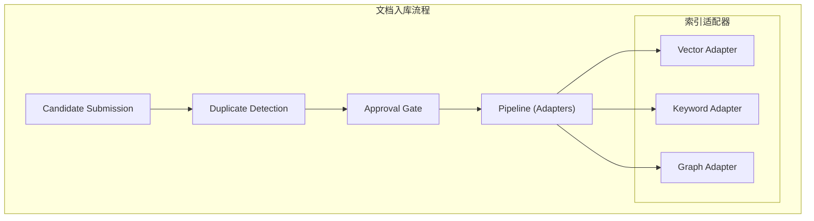
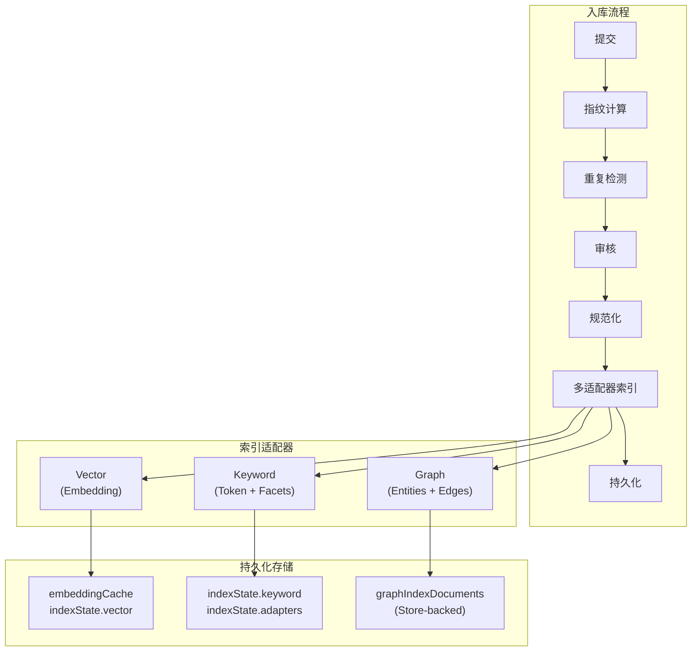

# 文档入库流程详解

本文档描述 TrapMap 知识条目从提交到持久化的完整入库流程，包括内容规范化、Embedding 生成、图实体关联、重复检测和持久化策略。

> **历史说明**：本文档中的 `packages/server（Wave-10 已删除）` 路径指向已删除的实现（Wave-10）。入库流程已迁移至 `packages/service-candidate-ingestion` 和 `packages/service-knowledge-write`。概念描述仍然适用。

## 整体流程概览



入库流程分为两个阶段：
1. **候选提交阶段**：用户提交候选 → 重复检测 → 等待审核
2. **索引构建阶段**：审核通过 → 内容规范化 → 多适配器并行索引 → 持久化

---

## 一、候选提交与重复检测

### 1.1 提交流程

候选提交通过 `processCandidate`（`packages/server（Wave-10 已删除）/src/lib/candidates/processor.ts`）函数处理，经历五个阶段：

| 阶段 | 状态变更 | 说明 |
|------|----------|------|
| 1. 排队 | `received` → `queued` | 进入处理队列 |
| 2. 分析 | `queued` → `analyzing` | 开始分析 |
| 3. 指纹计算 | - | 计算内容指纹和关键词 |
| 4. 重复检测 | - | 与已有条目比对 |
| 5. 结果 | → `duplicate_detected` 或 `ready_for_review` | 标记结果 |

### 1.2 指纹计算

指纹计算在 `computeCandidateFingerprint`（`packages/server（Wave-10 已删除）/src/lib/candidates/fingerprint.ts`）中完成，为每个候选生成三个维度的标识：

**Trap 类型条目：**
```typescript
// 指纹 = SHA-256(shortcut + detail + sorted labels)
fingerprint = createHash('sha256')
  .update(`${shortcut}\n${detail}\n${sortedLabels}`)
  .digest('hex')

// 关键词 = 大写短语 + 引号内容 + 代码标识符
keywords = extractKeywords(fullText)

// Token = 小写分词，过滤长度 < 3 的词
tokens = tokenize(fullText)  // 按 [^a-z0-9]+ 分割
```

**Skill 类型条目：**
```typescript
// 指纹 = SHA-256(title + summary + keywords + sorted file hashes)
fingerprint = createHash('sha256')
  .update(parts.join('\n'))
  .digest('hex')
```

### 1.3 重复检测算法

重复检测在 `detectDuplicates`（`packages/server（Wave-10 已删除）/src/lib/candidates/detector.ts`）中实现，采用 **Jaccard 预筛 + LLM 语义判定** 两阶段管道：

```typescript
// 阶段 1: Jaccard 预筛（快速，确定性）
function overlapScore(candidateTokens, entryTokens): number {
  let shared = 0
  for (const token of candidateTokens) {
    if (entryTokens.has(token)) shared += 1
  }
  return shared / union.size  // 交集 / 并集
}

// 阶段 2: LLM 语义判定（chat.isConfigured 时启用）
async function judgeDuplicateWithLLM(chat, candidate, existing):
  → { isDuplicate, confidence, overlapType: 'exact'|'semantic'|'none', reasoning }
  isDuplicate=true && confidence >= 0.8 → 标记为 duplicate
  LLM 未配置或失败 → 退化为纯 Jaccard
```

**判定阈值：**
| 匹配类型 | 阈值 | 说明 |
|----------|------|------|
| `exact` | 指纹完全一致 | 内容完全相同 |
| `high-overlap` | ≥ 0.72 | 高度重叠 |
| `semantic-similar` | ≥ 0.38 | Jaccard 预筛阈值 |

检测范围覆盖所有 `lifecycleState === 'approved'` 的知识条目和技能工件，按相似度降序排列，最多保留前 10 个匹配。LLM 判定能识别 Jaccard 漏检的同义词场景（如 "deploy docker" vs "ship docker"）。

---

## 二、索引管道（Pipeline）

审核通过后，条目进入索引管道。管道由 `syncKnowledgeIndex`（`packages/server（Wave-10 已删除）/src/lib/indexing/pipeline.ts`）函数驱动。

### 2.1 生命周期门控

管道首先检查条目的生命周期状态：

```typescript
const isApproved = entry.lifecycleState === 'approved'
const isDeactivated = entry.lifecycleState === 'deactivated'

if (isDeactivated || !isApproved) {
  // 非激活或未审核的条目：清除所有索引状态
  entry.indexState = null
  return
}
```

### 2.2 内容规范化

规范化在 `normalizeKnowledgeIndexDocument`（`packages/server（Wave-10 已删除）/src/lib/indexing/normalize.ts`）中完成，生成 `NormalizedIndexDocument`：

```typescript
// 1. 构建规范文本（canonical text）
canonicalText = `${shortcut}\n${detail}\n${labels.join(' ')}`.trim()

// 2. 生成 Token（小写、去重）
tokens = tokenize(canonicalText)  // 按 [^a-z0-9]+ 分割

// 3. 计算内容哈希（SHA-256）
contentHash = createHash('sha256').update(canonicalText).digest('hex')
```

规范化文档包含以下字段：
- `entryId`, `teamId`, `scope`, `requiredLevel` - 治理元数据
- `canonicalText` - 规范文本
- `tokens` - 规范化 Token 数组
- `contentHash` - 内容哈希（用于变更检测和幂等性）
- `revision` - 条目修订版本号（`history.length`）
- `boundary` - 边界约束（上下文、版本、平台）

### 2.3 适配器扇出

管道将规范化文档扇出到所有注册的适配器：

```typescript
for (const adapter of registry.all()) {
  const result = await adapter.sync(normalizedDocument)
  entry.indexState.adapters[adapter.kind] = updateAdapterState(...)
}
```

**幂等性保证：** 每个适配器通过 `contentHash` + `revision` 判断是否需要重新同步：

```typescript
function needsSync(adapterState, normalizedDocument): boolean {
  if (adapterState.contentHash !== normalizedDocument.contentHash) return true
  if (adapterState.revision !== normalizedDocument.revision) return true
  return false
}
```

---

## 三、Embedding 向量索引

### 3.1 向量适配器

向量适配器在 `vectorIndexAdapter.sync`（`packages/server（Wave-10 已删除）/src/lib/indexing/adapters/vector.ts`）中实现：

```typescript
async sync(document: NormalizedIndexDocument): Promise<IndexSyncResult> {
  // 使用规范文本生成 Embedding
  const vector = await generateEmbedding(document.canonicalText)
  
  return {
    adapterKind: 'vector',
    success: true,
    payload: vector,  // 返回向量供管道填充 embeddingCache
  }
}
```

### 3.2 切片策略

TrapMap 的 Embedding 生成**不使用传统的文档切片策略**，而是采用**整条目标范文本**作为输入：

```typescript
// 规范文本 = shortcut + detail + labels（全部合并）
canonicalText = `${entry.shortcut}\n${entry.detail}\n${entry.labels.join(' ')}`.trim()

// 直接对整个规范文本生成 Embedding
vector = await generateEmbedding(canonicalText)
```

**设计理由：**
- TrapMap 的知识条目本身是短文本（shortcut ≤ 280 字符，detail 通常几百字符）
- 整条文本保留了语义完整性，避免切片导致的上下文丢失
- 通过 Token 索引和图索引补充细粒度检索能力

### 3.3 Embedding 提供者

Embedding 生成支持多级提供者回退，在 `embeddings.ts`（`packages/server（Wave-10 已删除）/src/lib/embeddings.ts`）中实现：

| 优先级 | 提供者 | 条件 | 维度 |
|--------|--------|------|------|
| 1 | Global Provider | 通过 `setGlobalEmbeddingsProvider()` 设置 | 自定义 |
| 2 | OpenAI | `OPENAI_API_KEY` 已配置 | 1536 (`text-embedding-3-small`) |
| 3 | Fallback | 无外部提供者时 | 384（确定性向量） |

**Fallback 策略：** 当没有配置外部 Embedding 服务时，使用基于 Token 的确定性哈希生成 384 维向量：
- 每个 Token（长度 > 2 的词）映射到 6 个维度（3 正 + 3 负）
- 共享 Token 的文本在相同维度上有重叠，产生更高的余弦相似度
- 不相关文本的符号混合，产生接近零的相似度
- 最终归一化为单位长度，适用于余弦相似度计算

### 3.4 持久化

向量结果持久化到两个位置：

```typescript
// 1. indexState.adapters.vector（新格式）
entry.indexState.adapters.vector = {
  status: 'synced',
  revision: document.revision,
  contentHash: document.contentHash,
  lastSyncedAt: nowIso(),
}

// 2. embeddingCache（向后兼容）
entry.embeddingCache = {
  textHash: document.contentHash,
  vector,          // 实际向量数组
  createdAt: nowIso(),
  revision: document.revision,
}
```

---

## 四、关键词索引

### 4.1 关键词适配器

关键词适配器在 `keywordIndexAdapter.sync`（`packages/server（Wave-10 已删除）/src/lib/indexing/adapters/keyword.ts`）中实现：

```typescript
async sync(document: NormalizedIndexDocument): Promise<IndexSyncResult> {
  const keywordState: PersistedKeywordState = {
    tokens: document.tokens,  // 全局 Token
    fieldTokens: {
      shortcut: document.tokens.filter(t => document.shortcut.toLowerCase().includes(t)),
      detail: document.tokens.filter(t => document.detail.toLowerCase().includes(t)),
      labels: document.tokens.filter(t => document.labels.some(l => l.toLowerCase().includes(t))),
    },
    boundaryFacets: buildBoundaryFacetIndex(document.boundary),
  }
  
  return { adapterKind: 'keyword', success: true, payload: keywordState }
}
```

### 4.2 字段级 Token 索引

关键词索引按字段分离 Token，支持查询时的针对性匹配：

| 字段 | Token 来源 | 用途 |
|------|-----------|------|
| `shortcut` | 规范文本中出现在 shortcut 的 Token | 标题匹配 |
| `detail` | 规范文本中出现在 detail 的 Token | 详情匹配 |
| `labels` | 规范文本中出现在 labels 的 Token | 标签匹配 |

### 4.3 边界 Facet 索引

`boundaryFacets` 从条目的边界约束中提取结构化索引：

```typescript
// 边界约束包含：
boundary.context       // 适用上下文：["frontend", "production"]
boundary.versions      // 版本约束：[{package: "react", range: ">=16.8.0"}]
boundary.exclusions    // 排除项：[{kind: "platform", description: "..."}]
```

---

## 五、图实体关联建立

图索引是 TrapMap 的核心特色，通过规则提取将知识条目转化为结构化图数据。

### 5.1 图适配器流程

图适配器在 `graphIndexAdapter.sync`（`packages/server（Wave-10 已删除）/src/lib/indexing/adapters/graph.ts`）中实现，经历三个步骤：

```
NormalizedDocument
       │
       ├──▶ extractGraphEntitiesWithLLM(chat?, text)  ──▶ LLM 两阶段提取: nodes + edges
       │     (无规则引擎 fallback；LLM 不可用时返回空抽取结果)
       │
       ├──▶ extractBoundaryGraphEntities() ──▶ 边界节点和边
       │
       └──▶ merge + buildTrapGraphDocument() ──▶ 图文档
                │
                ├──▶ assertNoHardDependencyCycles()  ──▶ 环验证
                │
                └──▶ upsertGraphIndexDocument()  ──▶ 持久化
```

### 5.2 Trap 实体提取

实体提取在 `extractGraphEntitiesWithLLM`（`packages/server（Wave-10 已删除）/src/lib/indexing/graph-lite/llm-extract.ts`）中实现，采用**两阶段 LLM 提取**：

**两阶段 LLM 提取**（详见 `HYBRID_GRAPH_EXTRACTION.md`）：
1. **Phase 1（切分策略）**：长文本（>2000 字符）经 LLM 规划分为多个 segment
2. **Phase 2（并行提取）**：每个 segment 并行调用 LLM 提取实体和关系（maxConcurrent=3）
3. **Gleaning**：二次追问提取遗漏的实体和关系
4. **缓存**：contentHash + promptVersion 两层缓存，避免重复调用

**节点类型（Node Kinds）：**

| 节点类型 | 提取来源 | 示例 ID |
|----------|---------|---------|
| `trap` | 条目 shortcut | `trap:entry-123` |
| `cue` | LLM 语义理解症状/错误 | `cue:error`, `cue:timeout` |
| `tool` | LLM 识别工具/框架 | `tool:npm`, `tool:docker` |
| `environment` | LLM 识别运行环境 | `env:production`, `env:node-18` |
| `prerequisite` | LLM 识别前置条件 | `prereq:install-dependencies` |
| `mitigation` | LLM 识别修复方案 | `mit:clear-cache` |

**关系类型（Relation Types）：**

| 关系 | 方向 | 强度 | 说明 |
|------|------|------|------|
| `risk-blocks` | trap → cue | hard/soft | LLM 判定触发强度 |
| `co-occurs-with` | trap → tool/env | soft | 陷阱涉及的工具/环境 |
| `requires` | trap → prerequisite | hard | LLM 理解否定句（"does NOT require" 不提取） |
| `mitigates` | mitigation → trap | hard/soft | LLM 判定修复强制性 |
| `order` | prereq → prereq | soft | 前置条件顺序 |

**强度判定**：LLM 直接输出 hard/soft，语义理解否定句和句级作用域。

### 5.3 边界实体提取

边界提取在 `extractBoundaryGraphEntities`（`packages/server（Wave-10 已删除）/src/lib/indexing/boundary-extract.ts`）中实现：

| 边界类型 | 节点类型 | 关系类型 | 强度 |
|----------|---------|----------|------|
| 上下文标签 | `boundary-context` | `applies-in` | soft |
| 版本约束 | `boundary-version` | `requires-version` | hard |
| 平台排除 | `boundary-platform` | `excludes-context` | soft |
| 版本排除 | `boundary-version` | `excludes-version` | soft |

### 5.4 环验证

在持久化前，管道验证硬边不会引入依赖环：

```typescript
// 加载现有图文档（排除当前条目的当前修订）
const existingDocs = data.graphIndexDocuments.filter(
  d => !(d.sourceType === 'trap' && d.sourceId === entryId && d.revision === revision)
)

// 添加候选文档
existingDocs.push(candidateDoc)

// 验证无硬边依赖环
assertNoHardDependencyCycles(existingDocs)  // 有环则抛出异常
```

### 5.5 图文档持久化

图文档通过 `upsertGraphIndexDocument`（`packages/server（Wave-10 已删除）/src/lib/indexing/graph-lite/store.ts`）持久化：

```typescript
interface GraphIndexDocumentRecord {
  id: string              // graphdoc_trap_{entryId}_r{revision}
  sourceType: 'trap' | 'skill'
  sourceId: string        // 条目 ID
  revision: number
  contentHash: string     // 节点和边的 SHA-256 哈希
  nodes: GraphNodeRecord[]
  edges: GraphEdgeRecord[]
  evidence: string        // 审计追踪
  createdAt: string
  updatedAt: string
}
```

---

## 六、持久化与存储

### 6.1 存储结构

所有索引状态持久化到 `KnowledgeRecord` 对象：

```typescript
interface KnowledgeRecord {
  id: string
  shortcut: string
  detail: string
  labels: string[]
  lifecycleState: 'pending' | 'approved' | 'deactivated'
  history: RevisionRecord[]
  
  // 索引状态
  indexState: KnowledgeIndexStateRecord | null
  embeddingCache: EmbeddingCacheRecord | null
}

interface KnowledgeIndexStateRecord {
  contentHash: string
  normalizedAt: string
  adapters: {
    vector: AdapterSyncState
    keyword: KeywordAdapterSyncState  // 包含 persistedState
    graph: AdapterSyncState
  }
}
```

### 6.2 幂等性保证

整个入库流程支持幂等操作：

| 层级 | 幂等依据 | 效果 |
|------|---------|------|
| Pipeline | `contentHash` + `revision` | 跳过未变更的适配器 |
| Vector | `contentHash` + `revision` | 跳过未变更的 Embedding |
| Keyword | `contentHash` + `revision` | 跳过未变更的 Token |
| Graph | `contentHash` + `revision` | 跳过未变更的图文档 |

### 6.3 协调（Reconciliation）

`reconcileKnowledgeIndexes`（`packages/server（Wave-10 已删除）/src/lib/indexing/pipeline.ts`）函数用于批量修复索引状态：

```typescript
// 分批处理（默认 50 条/批）
for (let i = 0; i < knowledgeEntries.length; i += batchSize) {
  const batch = knowledgeEntries.slice(i, i + batchSize)
  
  for (const entry of batch) {
    if (!isApproved) {
      // 移除索引
      entry.indexState = null
    } else if (needsSync) {
      // 重新同步
      await syncKnowledgeIndex(...)
    }
  }
  
  // 内存优化：提示 GC
  if (global.gc) global.gc()
}
```

---

## 七、流程总结



**关键设计原则：**
1. **生命周期驱动**：只有 `approved` 状态的条目才会被索引
2. **幂等性**：通过 `contentHash` + `revision` 保证重复操作安全
3. **多通道索引**：向量（语义）+ 关键词（精确）+ 图（结构）互补
4. **LLM 驱动提取**：图实体提取由 LLM 语义理解驱动，规则引擎保留为 fallback（详见 `HYBRID_GRAPH_EXTRACTION.md`）
5. **向后兼容**：保留 `embeddingCache` 等旧格式，支持渐进迁移
