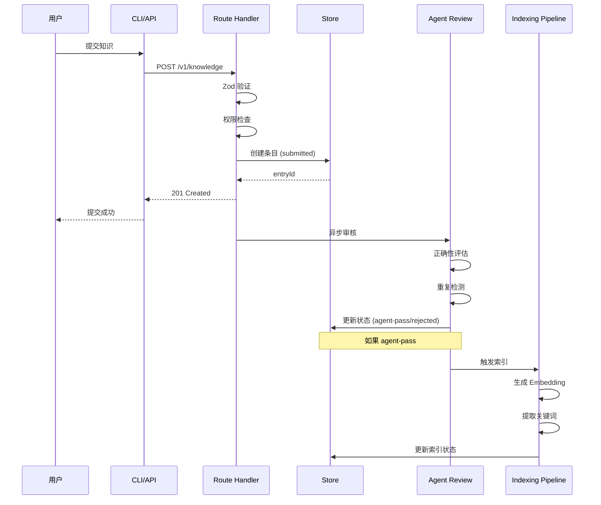
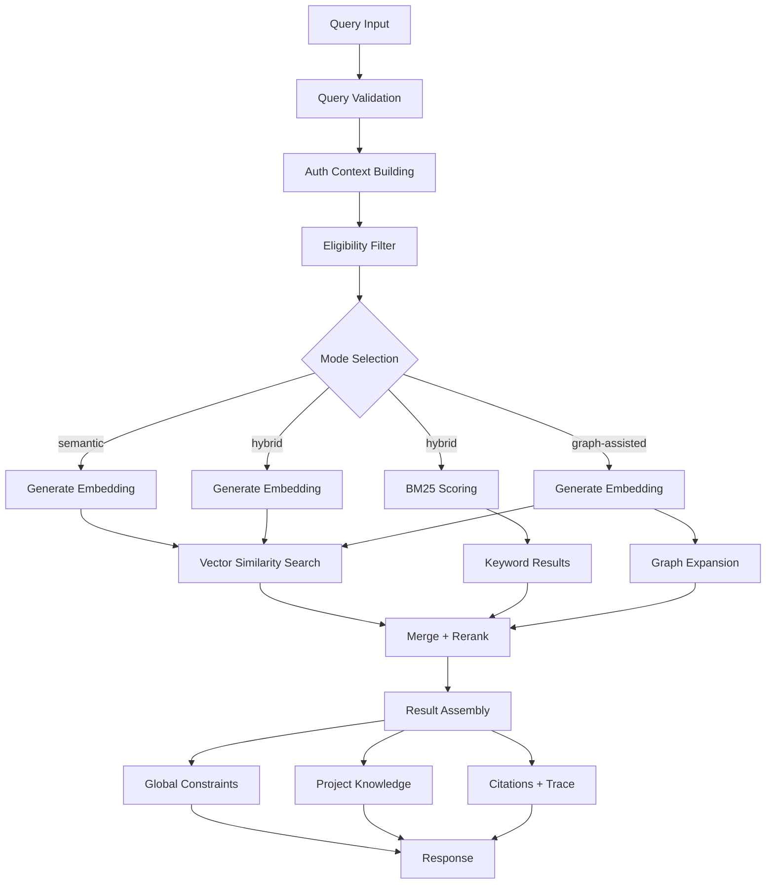
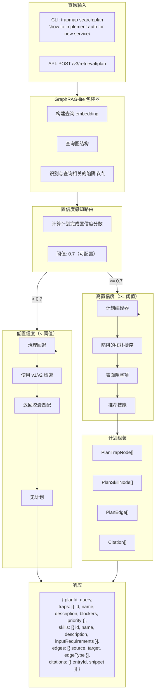
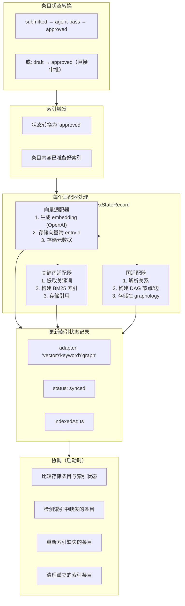

# TrapMap 数据流图

## 1. 知识提交流程

```mermaid
flowchart TB
    subgraph UserInput["用户输入"]
        CLI["CLI: trapmap knowledge submit\n--title '...' --content '...'"]
        API["API: POST /v1/knowledge"]
    end
    
    subgraph Validation["输入验证 (Zod)"]
        Title["title: 必填, 非空"]
        Content["content: 必填, 非空"]
        Format["format: 可选, 默认 'markdown'"]
        RequiredLevel["requiredLevel: 可选, 默认 0"]
    end
    
    subgraph Auth["授权检查"]
        Session["有效会话"]
        Permission["权限: knowledge:submit"]
        Team["团队成员身份（团队作用域）"]
    end
    
    subgraph DupCheck["重复检测（可选）"]
        Fingerprint["指纹匹配"]
        Semantic["语义相似度检查"]
        DupReturn["如果发现重复则返回"]
    end
    
    subgraph StoreTx["存储事务"]
        CreateEntry["创建 KnowledgeEntry\nlifecycleState: 'submitted'"]
        RecordActor["记录 submittedBy 参与者"]
        AssignId["分配 EntityId (UUID v4)"]
        SetTime["设置 createdAt/updatedAt"]
    end
    
    subgraph Audit["审计事件记录"]
        AuditEvent["event: 'knowledge.submitted'"]
        AuditFields["actorId, teamId, entryId, timestamp"]
    end
    
    subgraph AgentReview["智能体审核（异步）"]
        Correctness["正确性风险评估"]
        DupRecheck["重复重新检查"]
        StateTransform["转换: submitted → agent-pass 或 agent-rejected"]
    end
    
    subgraph Indexing["提交后索引"]
        VectorEmb["向量 embedding\n（agent-pass 或 approved 时）"]
        KeywordExtract["关键词提取"]
        GraphRelation["图关系"]
        UpdateIndex["更新 KnowledgeIndexStateRecord"]
    end
    
    subgraph Response["响应"]
        RespBody["{ id, title, lifecycleState: 'submitted', createdAt }"]
    end

    UserInput --> Validation
    Validation --> Auth
    Auth --> DupCheck
    DupCheck --> StoreTx
    StoreTx --> Audit
    Audit --> AgentReview
    AgentReview --> Indexing
    Indexing --> Response
```



### 知识提交流程（Mermaid）



## 2. 检索查询流程 (v1 语义)

```mermaid
flowchart TB
    subgraph QueryInput["查询输入"]
        CLIQuery["CLI: trapmap search\n\"how to configure auth\"\n--mode semantic"]
        APIQuery["API: POST /v1/retrieval/search"]
    end
    
    subgraph Validation["查询验证 (Zod)"]
        Query["query: 必填, 非空"]
        Mode["mode: 'semantic' | 'hybrid' | 'graph-assisted'"]
        Limit["limit: 可选, 默认 10"]
        Filter["filter: 可选"]
    end
    
    subgraph AuthContext["认证上下文构建"]
        Session["验证会话 cookie/token"]
        LoadUser["加载用户实体及权限"]
        GetTeam["获取活动团队（如果有）"]
        GetLevel["获取用户安全等级"]
    end
    
    subgraph Eligibility["资格过滤"]
        Approval["approvalStatus: 'approved'（检索必需）"]
        TeamFilter["teamId: 用户的团队或全局条目"]
        LevelCheck["requiredLevel: user.level >= entry.requiredLevel"]
    end
    
    subgraph ModeSelection["模式分支"]
        SemanticMode["模式：语义检索"]
        HybridMode["模式：混合检索"]
        GraphMode["模式：图辅助检索"]
    end
    
    subgraph SearchExecution["搜索执行"]
        Embedding["生成 embedding\n(OpenAI)"]
        VectorSearch["向量相似度搜索"]
        BM25["BM25 关键词评分"]
        GraphExpand["图扩展\n(graphology DAG)"]
    end
    
    subgraph MergeAssembly["合并与组装"]
        Merge["合并+重排\n- 分数归一化\n- 去重\n- 相关性排序"]
        Assembly["组装\n- 全局分桶\n- 项目分桶\n- 引用\n- 路由追踪"]
    end
    
    subgraph Constraints["约束应用"]
        Global["全局约束已应用"]
        Project["项目知识已限定范围"]
    end

    QueryInput --> Validation
    Validation --> AuthContext
    AuthContext --> Eligibility
    Eligibility --> ModeSelection
    ModeSelection --> SemanticMode
    ModeSelection --> HybridMode
    ModeSelection --> GraphMode
    SemanticMode --> Embedding
    HybridMode --> Embedding
    HybridMode --> BM25
    GraphMode --> Embedding
    Embedding --> VectorSearch
    VectorSearch --> Merge
    BM25 --> Merge
    GraphMode --> GraphExpand
    GraphExpand --> Merge
    Merge --> Assembly
    Assembly --> Global
    Assembly --> Project
```

### 检索查询流程（Mermaid）



## 3. 审核决策流程

```mermaid
flowchart TB
    subgraph ReviewerInput["审核者输入"]
        CLIReview["CLI: trapmap review approve\n<entryId> [--notes '...']"]
        APIReview["API: POST /v1/knowledge/review"]
    end
    
    subgraph Validation["请求验证"]
        EntryId["entryId: 必填, 有效的 EntityId"]
        Decision["decision: 必填, 'approved' | 'rejected'"]
        Notes["notes: 可选, 拒绝时必填"]
    end
    
    subgraph SessionRBAC["会话 & RBAC 检查"]
        Session["有效会话"]
        Permission["权限: knowledge:review"]
        LevelCheck["安全等级 >= 条目 requiredLevel"]
    end
    
    subgraph EntryValidation["条目验证"]
        EntryExists["条目存在"]
        ReviewableState["条目处于可审核状态\n（submitted, agent-pass）"]
        NotReviewed["条目尚未被审核"]
    end
    
    subgraph StoreTx["存储事务"]
        CreateReview["创建 ReviewRecord"]
        UpdateState["更新 entry.lifecycleState\napproved 或 rejected"]
        SetReviewer["设置 entry.approvedBy/rejectedBy"]
        AppendHistory["追加到 entry.reviewHistory"]
        UpdateTime["更新 entry.updatedAt"]
    end
    
    subgraph Audit["审计事件记录"]
        AuditEvent["event: 'knowledge.reviewed'"]
        AuditFields["actorId, entryId, decision, notes"]
    end
    
    subgraph PostIndex["提交后索引（如果批准）"]
        VectorIndex["添加到向量索引"]
        KeywordIndex["添加到关键词索引"]
        GraphIndex["添加到图索引（关系）"]
        UpdateIndexState["更新所有适配器的索引状态"]
    end
    
    subgraph Response["响应"]
        RespBody["{ entryId, lifecycleState,\nreviewedBy, reviewedAt }"]
    end

    ReviewerInput --> Validation
    Validation --> SessionRBAC
    SessionRBAC --> EntryValidation
    EntryValidation --> StoreTx
    StoreTx --> Audit
    Audit --> PostIndex
    PostIndex --> Response
```



## 4. 异步摄取管道流程

```mermaid
flowchart TB
    subgraph Submission["候选提交"]
        PostCandidate["POST /v1/candidates\n{ content, source, submittedBy }"]
    end
    
    subgraph ReceivedState["状态：已接收"]
        CreateCandidate["创建 CandidateSubmission\nstatus: 'received'"]
        AssignEntityId["分配 EntityId"]
        RecordMeta["记录 submittedAt, submittedBy"]
    end
    
    subgraph BackgroundProcessor["后台处理器（异步）"]
        PickUp["拾取 status: 'received' 的候选项"]
        UpdateQueued["更新状态为 'queued'"]
        Enqueue["加入处理队列"]
    end
    
    subgraph ProcessingStage["处理阶段"]
        UpdateAnalyzing["更新状态为 'analyzing'"]
        GenFingerprint["生成指纹（内容的哈希）"]
        GenEmbedding["生成 embedding（用于语义相似度）"]
        CheckFingerprint["检查与现有条目的指纹匹配"]
        CheckSemantic["检查与现有条目的语义相似度"]
    end
    
    subgraph AnalysisResult["分析结果"]
        DuplicateDetected["检测到重复\n- similarity > 阈值\n- matchType: fingerprint 或 semantic\n- status: duplicate_detected"]
        AnalysisComplete["分析完成\n- 唯一内容\n- status: ready_for_review"]
    end
    
    subgraph ReviewerAction["需要审核者操作"]
        GetBundle["GET /v1/duplicates/:candidateId/bundle"]
        ShowDup["显示候选和重复项"]
        AllowResolve["允许人工解决"]
    end
    
    subgraph ManualResolve["人工解决"]
        PostResolve["POST /v1/candidates/:id/manual-result"]
        Resolution["{ resolution: 'merge' | 'discard' | 'keep_both' }"]
        Merge["merge: 合并内容, 发布为单个条目"]
        Discard["discard: 拒绝候选"]
        KeepBoth["keep_both: 将两者都发布为独立条目"]
    end
    
    subgraph ResolutionApplied["解决方案已应用"]
        StatusResolved["status: 'resolved'"]
        CreateEntry["创建 trap 或 skill 条目（如果是发布）"]
        LinkLineage["通过 EntityLineage 链接候选到实体"]
        RecordDuplicateCase["在 DuplicateCase 中记录解决方案"]
    end

    Submission --> ReceivedState
    ReceivedState --> BackgroundProcessor
    BackgroundProcessor --> ProcessingStage
    ProcessingStage --> DuplicateDetected
    ProcessingStage --> AnalysisComplete
    DuplicateDetected --> ReviewerAction
    AnalysisComplete --> ReviewerAction
    ReviewerAction --> ManualResolve
    ManualResolve --> ResolutionApplied
```



## 5. 陷阱优先计划编译流程 (v3)



## 6. 会话认证流程


## 7. 索引管道流程



## 8. 工件派生流程（阶段 12+）

```mermaid
flowchart TB
    subgraph SourceArtifact["带源文件的 SkillArtifact"]
        ArtifactData["{ name, version, sourceFiles: [{ path, content }], scope, level }"]
    end
    
    subgraph DerivationRequest["派生请求"]
        PostDerive["POST /v1/operations/artifacts/:id/derive"]
        Outputs["{ outputs: ['profile', 'capsules', 'manifest'] }"]
    end
    
    subgraph ProfileDerivation["配置文件派生"]
        AISummary["AI 汇总源文件"]
        ExtractKeywords["提取关键词（AI 或规则）"]
        CreateProfile["创建 SkillProfile { distilledText, keywords }"]
    end
    
    subgraph CapsuleExtraction["胶囊提取"]
        ChunkFiles["将源文件分块为逻辑单元"]
        PerChunk["对每个块:\n- 精炼为可操作内容\n- 生成激活提示（阶段 15）\n- 创建 SkillCapsule"]
        SetInherited["设置 governanceInherited: true"]
    end
    
    subgraph ManifestGeneration["清单生成"]
        ExtractMeta["从工件提取元数据"]
        ParseFeatures["从源解析功能"]
        ParseRequirements["从源解析需求"]
        CreateManifest["创建 ClientManifest"]
    end
    
    subgraph StoreIndex["存储和索引"]
        UpdateArtifact["用派生输出更新工件"]
        IndexCapsules["索引胶囊（向量 + 关键词 + 图）"]
        RecordAudit["记录派生审计事件"]
    end

    SourceArtifact --> DerivationRequest
    DerivationRequest --> ProfileDerivation
    ProfileDerivation --> AISummary
    AISummary --> ExtractKeywords
    ExtractKeywords --> CreateProfile
    CreateProfile --> CapsuleExtraction
    CapsuleExtraction --> ChunkFiles
    ChunkFiles --> PerChunk
    PerChunk --> SetInherited
    SetInherited --> ManifestGeneration
    ManifestGeneration --> ExtractMeta
    ExtractMeta --> ParseFeatures
    ParseFeatures --> ParseRequirements
    ParseRequirements --> CreateManifest
    CreateManifest --> StoreIndex
    StoreIndex --> UpdateArtifact
    UpdateArtifact --> IndexCapsules
    IndexCapsules --> RecordAudit
```


