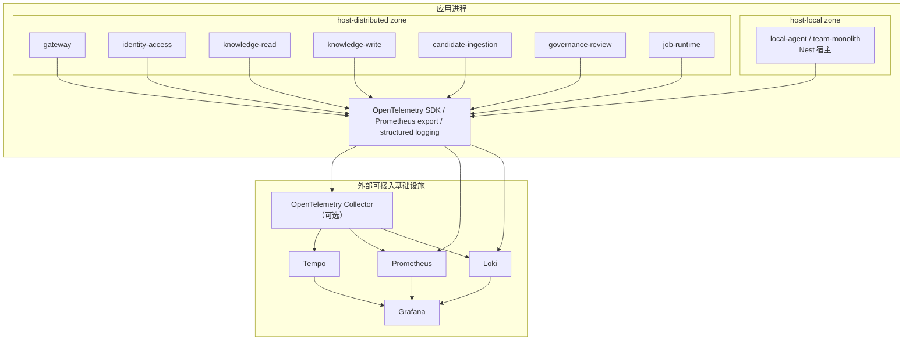

# 可观测性架构

> 本文档定义 TrapMap 可观测性的目标架构，并记录当前仓库已经冻结的接入边界。可观测性相关术语、契约和环境变量以源码、contracts 以及 [`docs/reference/SYSTEM_TRUTH_SOURCES.md`](../reference/SYSTEM_TRUTH_SOURCES.md) 为准。

## 概述

TrapMap 采用 OpenTelemetry 作为统一遥测接缝，目标上可对接 Tempo、Prometheus、Loki、Grafana 和可选的 OpenTelemetry Collector。当前仓库已经落地的事实不是“完整 LGTM 平台”，而是三条稳定接缝：

- `packages/server` 负责 Fastify compatibility shell 的 `/metrics`、启动期 OTel bootstrap 和 shutdown。
- `packages/host-local/src/nest/observability/` 负责 light 宿主的 OTel、Prometheus、Loki 和对应 adapter。
- `packages/host-distributed/src/shared/telemetry.ts` 负责 distributed internal hop 的 traceparent/span 传播，以及 OTLP traces/metrics 导出。

设计原则：

- **单一术语源**：指标、追踪、日志、健康状态、service/profile 命名统一复用现有 truth source。
- **宿主拥有接线**：`backend-core` 只定义 port，不拥有具体 SDK、exporter 或 logger 实现。
- **渐进接入**：当前先冻结 request metrics、internal hop tracing 和结构化日志，再由外部环境决定是否接入 LGTM / Collector。
- **关闭语义优先**：总开关使用 `OTEL_DISABLED`，而不是过时的 `OTEL_ENABLED`。

## 当前仓库事实

| 归属 | 当前事实 | 权威来源 |
|---|---|---|
| Fastify compatibility shell | `packages/server/src/app.ts` 和 `packages/server/src/bootstrap/run-startup-sequence.ts` 负责 startup 阶段的 OTel 初始化、`/metrics` 暴露和 shutdown | `packages/server/src/app.ts`、`packages/server/src/bootstrap/run-startup-sequence.ts` |
| light 宿主 | `packages/host-local/src/nest/observability/` 提供 `OtelService`、`PrometheusService`、`LokiService`，并通过 adapter 暴露给 `backend-core` ports | `packages/host-local/src/nest/observability/*.ts` |
| distributed 宿主 | `packages/host-distributed/src/shared/telemetry.ts` 负责 internal hop span、OTLP endpoint、service.name 拼接和 trace 传播 | `packages/host-distributed/src/shared/telemetry.ts` |
| 共享契约 | 健康状态、可观测性配置和 telemetry ports 分别由 `packages/contracts/src/domain/health.ts`、`packages/contracts/src/domain/observability-config.ts`、`packages/backend-core/src/ports/telemetry-ports.ts` 定义 | contracts 与 backend-core 源码 |

## 目标架构总览



## 组件职责

### 应用侧遥测

| 组件 | 当前职责 |
|---|---|
| `packages/server/src/bootstrap/bootstrap-otel.ts` | Fastify compatibility shell 的 OTel SDK 启动，按 profile 决定是否接 OTLP exporter |
| `packages/host-local/src/nest/observability/otel.service.ts` | Nest 宿主的 OTel SDK 生命周期管理 |
| `packages/host-local/src/nest/observability/prometheus.service.ts` | `prom-client` 指标注册、收集和文本导出 |
| `packages/host-local/src/nest/observability/loki.service.ts` | `LOKI_HOST` 存在时追加 Loki transport；否则继续 stdout JSON |
| `packages/host-distributed/src/shared/telemetry.ts` | distributed internal hop span、OTLP trace/metric exporter 和 traceparent 透传 |

`backend-core` 通过 `MetricsPort`、`TracingPort`、`LoggingPort` 三个 port 暴露遥测能力，domain / application 层只通过这些接口声明需求，不直接依赖 SDK。

### Collector 与 LGTM 栈

Tempo、Prometheus、Loki、Grafana 和 Collector 在当前仓库里只冻结为接入边界，不提供完整的仓库内编排资产。可以把它们理解为“外部基础设施”，而不是当前代码仓库已经完整拥有的部署组件。

### 结构化日志

日志格式要求保持 JSON 结构化，并优先带上以下上下文：

- `timestamp`
- `level`
- `message`
- `requestId`
- `traceId`
- `service`

`packages/server/src/lib/runtime/request-context.ts` 和 distributed gateway/internal-client 继续承担 request / trace header 的传播职责，不在文档中发明第二套 header 命名。

## 与现有架构的集成

### 分层归属

| 层 | 集成方式 |
|---|---|
| `backend-core` | 只定义 `MetricsPort`、`TracingPort`、`LoggingPort`，不包含具体实现 |
| `host-local` | 装配 observability modules，把 port 桥接到 `prom-client`、OpenTelemetry 和 Nest Logger |
| `host-distributed` | 装配 distributed internal hop 的 tracing / metrics seam，负责 owner-aware service.name |
| `server` | 保留 compatibility shell 的 startup 顺序、`/metrics` 导出和 request-context 接缝 |

### 当前 light 宿主目录

```text
packages/host-local/src/nest/observability/
  index.ts
  otel.module.ts
  otel.service.ts
  prometheus.module.ts
  prometheus.service.ts
  loki.module.ts
  loki.service.ts
  metrics-port.adapter.ts
  tracing-port.adapter.ts
  logging-port.adapter.ts
```

## 部署 profile 差异

| 能力 | `local-agent` | `team-monolith` | `distributed` |
|---|---|---|---|
| OTel 总开关 | `OTEL_DISABLED=true` 时完全关闭 | 同左 | 同左 |
| traces | 可保持 no-op 或最小本地接线 | 宿主可接入 OTLP endpoint | `packages/host-distributed/src/shared/telemetry.ts` 负责 internal hop spans 和 OTLP traces |
| metrics | 可直接暴露 `/metrics` | `/metrics` + 外部 Prometheus scrape | hop metrics + 外部 scrape 或 OTLP 接入 |
| logs | stdout JSON | stdout JSON，配置 `LOKI_HOST` 时追加 Loki transport | stdout JSON，继续复用 trace/request headers |
| Collector / LGTM | 不要求 | 外部可选 | 外部可选；当前仓库只冻结接入边界 |

## 配置策略

当前实现以 `OTEL_DISABLED` 的关闭语义为准，而不是 `OTEL_ENABLED` 的开启语义。

| 环境变量 | 默认值 | 说明 |
|---|---|---|
| `OTEL_DISABLED` | `false` | 总开关；为 `true` 时，`packages/server`、`host-local`、`host-distributed` 都跳过 OTel SDK 初始化 |
| `OTEL_EXPORTER_OTLP_ENDPOINT` | `http://localhost:4318` | OTLP exporter 端点 |
| `OTEL_SAMPLE_RATE` | `0.1`（server startup） / `1`（distributed telemetry 未显式设置时） | traces 采样率。当前不同宿主有各自默认值，文档不得写回过时的 `OTEL_SAMPLING_RATE` |
| `TRAPMAP_METRICS_ENABLED` | `true`（host-local） | 是否启用 `prom-client` 指标收集与文本导出 |
| `TRAPMAP_DEPLOYMENT_PROFILE` | `local-agent` | 决定当前宿主 profile，影响 observability wiring 的默认姿态 |
| `SERVICE_NAME` | `trapmap` | host-local 的 service.name 来源；distributed 宿主内部会拼接为 `trapmap-${serviceName}` |
| `LOKI_HOST` | 空 | host-local 配置后追加 Loki transport；未配置时只输出 stdout JSON |

当前推荐语义：

- `local-agent`：不需要遥测时显式设置 `OTEL_DISABLED=true`；需要指标时可单独暴露 `/metrics`
- `team-monolith`：沿用 host-local observability modules，按部署环境决定是否接入 OTLP / Loki
- `distributed`：由 distributed 宿主负责 internal hop trace 传播、OTLP endpoint 接线和 service-name 区分

## 健康检查三探针模型

TrapMap 对外暴露三个探针端点，继续遵循统一 contract：

| 端点 | 语义 | 失败时行为 |
|---|---|---|
| `/live` | 进程是否存活 | 进程应被重启 |
| `/ready` | 是否可以接收流量 | 从负载均衡摘除 |
| `/health` | 综合状态快照 | 不直接影响流量路由，但提供细粒度诊断 |

`packages/contracts/src/domain/health.ts` 定义了 `healthStatusSchema` 与 `dependencyStatusSchema`。可观测性体系增强这些端点，但不替代它们。

### 依赖状态聚合

- Fastify compatibility shell 通过 `packages/server/src/lib/runtime/runtime-metadata.ts` 暴露 runtime snapshot
- light 宿主通过 `LifecycleManager` 和 `HealthController` 聚合 `HealthCheckResult[]`
- distributed 宿主继续复用相同的 health contract，不在服务发现或 tracing 文档里发明第二套状态命名

## Phase 1A 已冻结的接缝

Phase 1A 已经在代码中冻结了以下内容：

- `packages/backend-core/src/ports/telemetry-ports.ts`：`MetricsPort`、`TracingPort`、`LoggingPort`
- `packages/backend-core/src/ports/lifecycle-ports.ts`：`LifecycleManager`、`HealthCheckRegistrar`、`HealthCheck`
- `packages/contracts/src/domain/health.ts`：统一的健康状态 schema
- `packages/contracts/src/domain/observability-config.ts`：可观测性配置 schema 与 feature flags

这意味着 secondary docs 可以描述“当前已有的可观测性接缝”，但不能把 Collector、完整 dashboard/alert/SLO 平台、日志保留期或 richer monitoring platform 写成仓库内已经完成的事实。

## 标签基数

当前指标标签必须保持低基数：

- HTTP 方法、状态类、route family、service name、owner surface 使用有限枚举
- `route` 使用参数化路径，而不是原始 URL
- 不使用用户 ID、请求 ID、trace ID 之类的动态值作为 Prometheus 标签

`packages/server/src/lib/runtime/metrics.ts` 和 `packages/host-local/src/nest/observability/prometheus.service.ts` 是当前标签命名与导出规则的事实源。

## 非目标

当前阶段明确不做：

- 不把 `OTEL_ENABLED`、`OTEL_SAMPLING_RATE` 一类旧变量重新写回文档
- 不把仓库描述成已经内置完整 Collector / Grafana / Loki / Tempo 部署资产
- 不在 `backend-core` domain 层引入具体 SDK 依赖
- 不发明第二套 runtime/profile/service/health 术语
