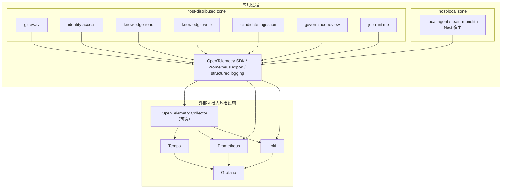

# 可观测性架构

> 本文档定义 TrapMap 可观测性的目标架构，并记录当前仓库已经冻结的接入边界。可观测性相关术语、契约和环境变量以源码、contracts 以及 [`docs/reference/SYSTEM_TRUTH_SOURCES.md`](../reference/SYSTEM_TRUTH_SOURCES.md) 为准。

## 概述

TrapMap 采用 OpenTelemetry 作为统一遥测接缝，目标上可对接 Tempo、Prometheus、Loki、Grafana 和可选的 OpenTelemetry Collector。当前仓库已经落地的事实不是“完整 LGTM 平台”，而是三条稳定接缝：

- `packages/host-local/src/nest/observability/` 负责 light 宿主的 `/metrics`、OTel bootstrap、Prometheus、Loki 和对应 adapter。
- `packages/host-distributed/src/shared/telemetry.ts` 负责 distributed internal hop 的 traceparent/span 传播，以及 OTLP traces/metrics 导出。

> `/metrics`、OTel bootstrap 与 shutdown 由 `host-local` 持有。

设计原则：

- **单一术语源**：指标、追踪、日志、健康状态、service/profile 命名统一复用现有 truth source。
- **宿主拥有接线**：`backend-core` 只定义 port，不拥有具体 SDK、exporter 或 logger 实现。
- **渐进接入**：当前先冻结 request metrics、internal hop tracing 和结构化日志，再由外部环境决定是否接入 LGTM / Collector。
- **关闭语义优先**：总开关使用 `OTEL_DISABLED`，而不是过时的 `OTEL_ENABLED`。

## 当前仓库事实

| 归属 | 当前事实 | 权威来源 |
|---|---|---|
| ~~Fastify compatibility shell~~ | **已删除**。`/metrics`、OTel 初始化和 shutdown 现由 `host-local` 持有 | `packages/host-local/src/nest/observability/*.ts` |
| light 宿主 | `packages/host-local/src/nest/observability/` 提供 `OtelService`、`PrometheusService`、`LokiService`，并通过 adapter 暴露给 `backend-core` ports | `packages/host-local/src/nest/observability/*.ts` |
| distributed 宿主 | `packages/host-distributed/src/shared/telemetry.ts` 负责 internal hop span、OTLP endpoint、service.name 拼接和 trace 传播 | `packages/host-distributed/src/shared/telemetry.ts` |
| 共享契约 | 健康状态、可观测性配置和遥测 policy 分别由 `packages/contracts/src/domain/health.ts`、`packages/contracts/src/domain/observability-config.ts`、`packages/contracts/src/domain/observability.ts` 定义 | contracts 源码 |

## 目标架构总览



## 组件职责

### 应用侧遥测

| 组件 | 当前职责 |
|---|---|
| `packages/host-local/src/nest/observability/otel.service.ts` | Nest 宿主的 OTel SDK 生命周期管理 |
| `packages/host-local/src/nest/observability/prometheus.service.ts` | `prom-client` 指标注册、收集和文本导出 |
| `packages/host-local/src/nest/observability/loki.service.ts` | `LOKI_HOST` 存在时追加 Loki transport；否则继续 stdout JSON |
| `packages/host-local/src/nest/observability/sentry.service.ts` | 可选 Sentry 错误智能适配器；`SENTRY_DSN` 为空时 no-op |
| `packages/host-local/src/nest/observability/langfuse.service.ts` | 可选 Langfuse LLM observation NestJS 服务；凭证缺失时 no-op |
| `packages/host-local/src/nest/observability/langfuse-sink.ts` | Langfuse sink 工厂；vendor-neutral wrapper 与 host-local SDK 的桥接 |
| `packages/host-distributed/src/shared/telemetry.ts` | distributed internal hop span、OTLP trace/metric exporter 和 traceparent 透传 |
| distributed 宿主 | 可选 Sentry 适配器未实现；Sentry 错误智能适配器当前仅由 host-local 提供，`SENTRY_DSN` 为空时 no-op |

`backend-core` 通过 `MetricsPort`、`TracingPort`、`LoggingPort` 三个 port 暴露遥测能力，domain / application 层只通过这些接口声明需求，不直接依赖 SDK。

### Sentry 错误智能适配器（可选）

Sentry 适配器提供 actionable error 聚合能力，作为 OTel traces/metrics 的补充：

| 属性 | 值 |
|---|---|
| 启用条件 | `SENTRY_DSN` 非空 |
| 初始化位置 | `packages/host-local/src/nest/observability/sentry.service.ts`（Nest 模块）；distributed 宿主的函数式适配器未实现 |
| 配置验证 | `packages/contracts/src/domain/observability-config.ts` 中的 `validateSentryPolicy` |
| 隐私策略 | `sendDefaultPii=false`；`beforeSend` 递归剥离 headers、cookies、request body、敏感 query、prompt/knowledge 内容和 secrets |
| 捕获策略 | 仅捕获 5xx、内部异常、terminal async failure；抑制 4xx/auth/validation |
| 降级策略 | SDK 初始化失败、传输失败均不影响原始请求或任务完成路径 |
| safe tags | `service`、`environment`、`deployment_profile`、`owner_surface`、`failure_classification`、`request_id`、`trace_id`、`operation_id` |

设计约束：

- Sentry 不是第二条 traces/metrics 管线；它只聚合 actionable errors。
- `backend-core` 和领域包不直接依赖 `@sentry/node`；SDK 只在 host composition root 中动态导入。
- Sentry 配置契约由 `@trapmap/contracts` 持有，两个 host 使用相同的 `validateSentryPolicy` 确保语义一致。

### Langfuse Runtime LLM Observation（可选）

Langfuse 适配器提供可选的 LLM/embedding 生成运行时观测能力，作为 OTel traces/metrics 的补充：

| 属性 | 值 |
|---|---|
| 启用条件 | `LANGFUSE_ENABLED` 非 `false` 且三个凭证（`LANGFUSE_BASE_URL`、`LANGFUSE_PUBLIC_KEY`、`LANGFUSE_SECRET_KEY`）齐全 |
| 初始化位置 | `packages/host-local/src/nest/observability/langfuse-sink.ts`（组合边界 sink）、`packages/host-local/src/nest/observability/langfuse.service.ts`（Nest 模块） |
| 配置验证 | `packages/contracts/src/domain/observability-config.ts` 中的 `validateLangfusePolicy` |
| Vendor-neutral wrapper | `packages/ai-providers/src/observability.ts` — 不依赖 `langfuse` SDK，只接收注入的 `LlmObservationSink` |
| Host-owned SDK sink | `langfuse-sink.ts` 在 host-local 可观测性边界内动态导入 `langfuse` SDK |
| 隐私策略 | 默认 `strict` 模式：只发送 metadata、长度、哈希；不发送 raw prompts、outputs、vectors、credentials |
| 关联字段 | 与 OTel/Sentry 共享 `traceId`、`requestId`、`operationId`；通过 `ObservationCorrelationContext` getter 从 AsyncLocalStorage 动态解析 |
| Eval platform mirror | 已有，通过 `--platform langfuse` 在 eval aggregate runner 中启用 |
| 降级策略 | SDK 初始化失败、sink 传输失败、flush 超时均不影响原始请求或任务完成路径 |

设计约束：

- `packages/ai-providers` 不直接依赖 `langfuse` SDK；SDK 只在 host composition root 中动态导入。
- 配置契约由 `@trapmap/contracts` 持有，两个 host 使用相同的 `validateLangfusePolicy` 确保语义一致。
- Bounded flush timeout（默认 5000ms，范围 100-60000）防止 Langfuse 不可用时挂起。
- Correlation context 通过 getter 函数在观测时动态解析，而非在组合时静态注入。

### Collector 与 LGTM 栈

Tempo、Prometheus、Loki、Grafana 和 Collector 在当前仓库里只冻结为接入边界，不提供完整的仓库内编排资产。可以把它们理解为“外部基础设施”，而不是当前代码仓库已经完整拥有的部署组件。

### 结构化日志

日志格式要求保持 JSON 结构化，并优先带上以下上下文：

- `timestamp`
- `level`
- `message`
- `requestId`
- `traceId`
- `service`

`packages/host-local/src/nest/runtime/request-context.service.ts` 和 `packages/host-distributed/src/gateway/internal-client.ts` 承担 request / trace header 的传播职责，不在文档中发明第二套 header 命名。

### 关联上下文 contract

`packages/contracts/src/domain/observability.ts` 是关联字段、W3C `traceparent` 校验和字段可见性的唯一来源；`packages/contracts/src/domain/log-schema.ts` 是结构化日志字段与 Loki label 白名单的唯一来源。两者均通过 `packages/contracts/src/index.ts` 聚合导出。

| 字段 | 语义 | 可见性 |
|---|---|---|
| `requestId` | 单个入口请求的稳定标识；保留有效 `x-request-id`，缺失时由宿主已有 fallback 生成 | public-additive |
| `traceparent` | 仅接受 W3C version `00` 的有效 trace context | internal-only transport |
| `traceId` | 从有效 `traceparent` 提取的 32 位 trace ID，不接受独立输入 | public-additive |
| `operationId` | 可跨同步和异步边界延续的稳定业务操作标识 | internal-only |
| `causationId` | 直接触发当前操作的事件或操作标识 | internal-only |
| `service` | 产生记录或操作的服务名 | internal-only |
| `ownerSurface` | 对该 observability surface 负责的已注册边界 | internal-only |

`operationId` 与 `causationId` 不属于公开 API 的 additive fields，当前阶段也不会写入新的响应 header。它们只从已定义的内部 header `x-trapmap-operation-id` 和 `x-trapmap-causation-id` 读取，缺失时保持 `undefined`。所有关联 ID 只可进入 JSON 日志 body；Loki labels 始终严格限于 `service`、`environment`、`level`。

host-local Nest 宿主按标准规则解析 request context：有效 request ID 原样保留，非法或不完整 `traceparent` 按缺失处理；host-local 使用传入的 Fastify ID 作为既有 fallback。distributed 宿主在 internal hop 中创建 span 并传播 `traceparent`，由 `packages/host-distributed/src/shared/telemetry.ts` 持有。

## 与现有架构的集成

### 分层归属

| 层 | 集成方式 |
|---|---|
| `backend-core` | 只定义 `MetricsPort`、`TracingPort`、`LoggingPort`，不包含具体实现 |
| `host-local` | 装配 observability modules，把 port 桥接到 `prom-client`、OpenTelemetry 和 Nest Logger；可选 Sentry 适配器 |
| `host-distributed` | 装配 distributed internal hop 的 tracing / metrics seam，负责 owner-aware service.name；可选 Sentry 适配器 |
| `旧兼容层` | **已删除**。`/metrics`、OTel 初始化和 shutdown 现由 `host-local` 持有 |

### 当前 light 宿主目录

```text
packages/host-local/src/nest/observability/
  index.ts
  otel.module.ts
  otel.service.ts
  prometheus.module.ts
  prometheus.service.ts
  loki.module.ts
  loki.service.ts
  sentry.module.ts
  sentry.service.ts
  langfuse.module.ts
  langfuse.service.ts
  langfuse-sink.ts
  metrics-port.adapter.ts
  tracing-port.adapter.ts
  logging-port.adapter.ts
  http-metrics.middleware.ts
```

## 部署 profile 差异

| 能力 | `local-agent` | `team-monolith` | `distributed` |
|---|---|---|---|
| OTel 总开关 | `OTEL_DISABLED=true` 时完全关闭 | 同左 | 同左 |
| traces | 可保持 no-op 或最小本地接线 | 宿主可接入 OTLP endpoint | `packages/host-distributed/src/shared/telemetry.ts` 负责 internal hop spans 和 OTLP traces |
| metrics | 可直接暴露 `/metrics` | `/metrics` + 外部 Prometheus scrape | hop metrics + 外部 scrape 或 OTLP 接入 |
| logs | stdout JSON | stdout JSON，配置 `LOKI_HOST` 时追加 Loki transport | stdout JSON，继续复用 trace/request headers |
| Collector / LGTM | 不要求 | 外部可选 | 外部可选；当前仓库只冻结接入边界 |

## 配置策略

当前实现以 `OTEL_DISABLED` 的关闭语义为准，而不是 `OTEL_ENABLED` 的开启语义。

| 环境变量 | 默认值 | 说明 |
|---|---|---|
| `OTEL_DISABLED` | `false` | 总开关；为 `true` 时，`host-local`、`host-distributed` 都跳过 OTel SDK 初始化 |
| `OTEL_EXPORTER_OTLP_ENDPOINT` | `http://localhost:4318` | OTLP exporter 端点 |
| `OTEL_SAMPLE_RATE` | `1`（仅 `host-distributed` 读取；`host-local` 使用 SDK 默认 AlwaysOn sampler） | traces 采样率。仅 distributed 宿主通过 `TraceIdRatioBasedSampler` 读取此变量；`host-local` 不配置 sampler |
| `TRAPMAP_METRICS_ENABLED` | `true`（host-local） | 是否启用 `prom-client` 指标收集与文本导出 |
| `TRAPMAP_DEPLOYMENT_PROFILE` | `local-agent` | 决定当前宿主 profile，影响 observability wiring 的默认姿态 |
| `SERVICE_NAME` | `trapmap` | host-local 的 service.name 来源；distributed 宿主内部会拼接为 `trapmap-${serviceName}` |
| `LOKI_HOST` | 空 | host-local 配置后追加 Loki transport；未配置时只输出 stdout JSON |

当前推荐语义：

- `local-agent`：不需要遥测时显式设置 `OTEL_DISABLED=true`；需要指标时可单独暴露 `/metrics`
- `team-monolith`：沿用 host-local observability modules，按部署环境决定是否接入 OTLP / Loki
- `distributed`：由 distributed 宿主负责 internal hop trace 传播、OTLP endpoint 接线和 service-name 区分

## 健康检查三探针模型

TrapMap 对外暴露三个探针端点，继续遵循统一 contract：

| 端点 | 语义 | 失败时行为 |
|---|---|---|
| `/live` | 进程是否存活 | 进程应被重启 |
| `/ready` | 是否可以接收流量 | 从负载均衡摘除 |
| `/health` | 综合状态快照 | 不直接影响流量路由，但提供细粒度诊断 |

`packages/contracts/src/domain/health.ts` 定义了 `healthStatusSchema` 与 `dependencyStatusSchema`。可观测性体系增强这些端点，但不替代它们。

### 依赖状态聚合

- light 宿主通过 `LifecycleManager` 和 `HealthController` 聚合 `HealthCheckResult[]`，暴露 runtime snapshot
- distributed 宿主继续复用相同的 health contract，不在服务发现或 tracing 文档里发明第二套状态命名

## 已冻结的接缝

以下接缝已在代码中冻结：

- `packages/contracts/src/domain/observability-config.ts`：OTel/Sentry/Langfuse 配置 policy（`observabilityConfigSchema`、`validateOtelPolicy`）
- `packages/contracts/src/domain/observability.ts`：traceparent 解析、路由 family 归一、脱敏字段规则
- `packages/backend-core/src/ports/lifecycle-ports.ts`：`LifecycleManager`、`HealthCheckRegistrar`、`HealthCheck`
- `packages/contracts/src/domain/health.ts`：统一的健康状态 schema
- `packages/contracts/src/domain/observability-config.ts`：可观测性配置 schema 与 feature flags

这意味着 secondary docs 可以描述“当前已有的可观测性接缝”，但不能把 Collector、完整 dashboard/alert/SLO 平台、日志保留期或 richer monitoring platform 写成仓库内已经完成的事实。

## 标签基数

当前指标标签必须保持低基数：

- HTTP 方法、状态类、route family、service name、owner surface 使用有限枚举
- `route` 使用参数化路径，而不是原始 URL
- 不使用用户 ID、请求 ID、trace ID 之类的动态值作为 Prometheus 标签

`packages/host-local/src/nest/observability/prometheus.service.ts` 是当前标签命名与导出规则的事实源。

## 非目标

## Distributed acceptance correlation

distributed acceptance 使用真实 HTTP hop 验证 request/trace correlation、canonical `409`/`503`/`504`、deadline、有限 retry 与幂等 replay。operator 排障以 request、W3C `traceparent`、operation/causation 与 owner surface 为关联键；没有数据的 pool、queue/outbox、projection 或 follow-up 字段必须输出 `unknown`，不可使用零值伪装健康状态。

当前阶段明确不做：

- 不把 `OTEL_ENABLED`、`OTEL_SAMPLING_RATE` 一类旧变量重新写回文档
- 不把仓库描述成已经内置完整 Collector / Grafana / Loki / Tempo 部署资产
- 不在 `backend-core` domain 层引入具体 SDK 依赖
- 不发明第二套 runtime/profile/service/health 术语
