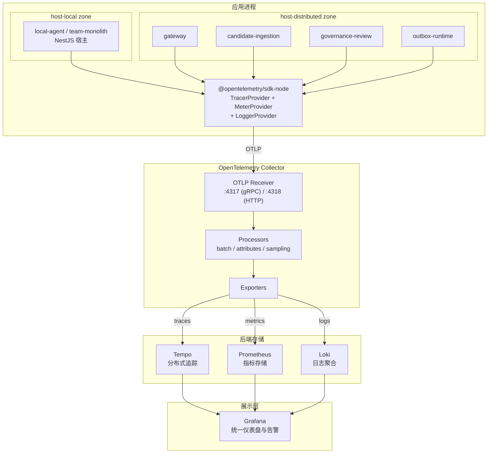

# 可观测性架构

> 本文档定义 TrapMap 可观测性的目标架构，覆盖指标（metrics）、日志（logs）和链路追踪（traces）三大支柱。当前阶段为架构冻结，尚未全量实现；后续落地以本文档为权威参考。

## 概述

TrapMap 采用 LGTM 栈（Loki、Grafana、Tempo、Prometheus）+ OpenTelemetry 作为可观测性基础设施。应用侧通过 OpenTelemetry SDK 统一采集三大信号，经 exporter 推送至后端存储，最终由 Grafana 提供统一查询与告警面板。

设计原则：

- **统一采集**：所有信号通过 OpenTelemetry SDK 采集，不维护多套 agent
- **渐进落地**：先 trace、再 metrics、最后 logs，每一步都可独立验证
- **profile 感知**：`local-agent` 可降级为 console/noop，`distributed` 走全量管线
- **零侵入业务**：采集逻辑只在 host 层与 infrastructure 层装配，不进入 `backend-core` domain/application

## 架构总览



## 组件职责

### OpenTelemetry SDK（应用侧）

| 信号 | SDK 组件 | 采集内容 |
|------|---------|---------|
| Traces | `@opentelemetry/sdk-trace-node` | HTTP 请求 span、数据库查询 span、队列消费 span、AI 调用 span |
| Metrics | `@opentelemetry/sdk-metrics` | 请求延迟直方图、错误率计数器、队列深度 gauge、连接池使用率 |
| Logs | `@opentelemetry/sdk-logs` | 结构化应用日志，自动关联 traceId/spanId |

自动注入的 instrumentation：

- `@opentelemetry/instrumentation-http`：HTTP 请求/响应
- `@opentelemetry/instrumentation-fastify`：Fastify 路由层
- `@opentelemetry/instrumentation-pg`：PostgreSQL 查询
- `@opentelemetry/instrumentation-amqp`：RabbitMQ 操作（仅 `distributed` 使用 RabbitMQ task transport 时）

自定义 span 和指标：

- `knowledge.submit`、`knowledge.review`、`candidate.process` 等业务操作 span
- `retrieval.query.duration`、`retrieval.cache.hit_rate`、`queue.task.processing_time` 等业务指标
- 通过 `backend-core` 的 port 接口注入 span context，不侵入 domain 逻辑

### OpenTelemetry Collector

Collector 作为可选的中间聚合层，承担：

- **协议转换**：统一接收 OTLP，按目标后端需要的协议导出
- **批处理**：减少后端写入压力
- **属性注入**：添加 `service.name`、`deployment.environment`、`service.version` 等标准资源属性
- **采样**：对高吞吐 trace 执行尾部采样，降低存储开销

在 `local-agent` 和 `team-monolith` profile 中，Collector 是可选的；SDK 可直接向后端 exporter 输出。在 `distributed` profile 中，Collector 是标准基础设施组件。

### Tempo（链路追踪）

| 项目 | 说明 |
|------|------|
| 职责 | 存储和查询分布式 trace |
| 协议 | 接收 OTLP，暴露 Grafana 数据源接口 |
| 关联 | 通过 `traceId` 关联跨服务请求；与 Loki 和 Prometheus 通过 exemplar 桥接 |
| 保留 | 默认 7 天，可通过配置调整 |

典型查询场景：

- 追踪一次 `candidate.submit` 从 gateway 到 candidate-ingestion worker 的全链路
- 定位某次 `retrieval.search` 的慢查询瓶颈（向量召回 vs 关键词召回 vs 图扩展）
- 查看跨 context 调用的依赖图

### Prometheus（指标）

| 项目 | 说明 |
|------|------|
| 职责 | 时序指标存储与告警规则评估 |
| 协议 | 拉取模式（scrape）或远程写入（remote write） |
| 指标来源 | OpenTelemetry Collector 导出，或应用直接暴露 `/metrics` 端点 |
| 关联 | 通过 exemplar 与 Tempo trace 关联 |

核心指标分组：

| 分组 | 指标示例 |
|------|---------|
| HTTP | `http_request_duration_seconds`, `http_requests_total` |
| 数据库 | `db_query_duration_seconds`, `db_pool_active_connections` |
| 队列 | `queue_depth`, `queue_task_duration_seconds`, `queue_dead_letter_total` |
| 业务 | `knowledge_entries_total`, `candidates_pending_total`, `review_queue_depth` |
| 运行时 | `process_cpu_seconds_total`, `process_resident_memory_bytes` |

### Loki（日志）

| 项目 | 说明 |
|------|------|
| 职责 | 聚合和查询结构化日志 |
| 协议 | 接收 OTLP 或 Loki push API |
| 关联 | 通过 `traceId` 标签与 Tempo 双向跳转 |
| 保留 | 默认 14 天，可通过配置调整 |

日志格式要求：

- JSON 结构化输出，包含 `timestamp`、`level`、`message`、`traceId`、`spanId`、`requestId`、`service`
- `packages/server/src/lib/runtime/request-context.ts` 已提供 `requestId`/`traceId` 上下文，日志中间件直接消费
- `LOG_RAG_ENABLED`、`LOG_USER_OPS_ENABLED` 等开关继续控制领域日志的采集范围

### Grafana（可视化）

| 项目 | 说明 |
|------|------|
| 职责 | 统一查询、仪表盘、告警 |
| 数据源 | Tempo、Prometheus、Loki |
| 面板 | 运行状态概览、服务级别 SLI/SLO、队列深度趋势、错误率分布 |

预置仪表盘：

- **系统概览**：各服务实例的请求量、错误率、延迟 P50/P95/P99
- **检索性能**：retrieval query 的分阶段耗时（语义召回、关键词召回、图扩展、合并重排）
- **异步管道**：candidate 处理队列深度、任务处理耗时、dead letter 趋势
- **基础设施**：数据库连接池、Redis 缓存命中率、Neo4j 查询延迟

## 与现有架构的集成

### Nest 模块集成

可观测性逻辑按六边形架构分层：

| 层 | 集成方式 |
|---|---|
| `backend-core` | 定义 `ObservabilityPort`（trace context propagation、metrics recording 接口），domain/application 层通过 port 声明观测需求，不直接依赖 SDK |
| `host-local` | 装配 `ObservabilityModule`（NestJS module），将 OTel SDK 初始化、auto-instrumentation 注册、exporter 配置注入为全局 provider |
| `host-distributed` | 同上，额外配置 Collector endpoint 与多实例 service.name 区分 |
| `server` | 兼容壳层继续使用现有 `request-context.ts` 的 requestId/traceId 传播，不引入新的观测耦合 |

`ObservabilityModule`（目标 Nest module 结构）：

```
packages/host-local/src/nest/observability/
├── observability.module.ts     # NestJS module 定义
├── otel.provider.ts            # OTel SDK 初始化与生命周期管理
├── trace.interceptor.ts        # 自动 span 创建拦截器
├── metrics.controller.ts       # /metrics 端点（Prometheus 格式）
└── health.instrumentation.ts   # 健康检查指标注入
```

### 与现有 health/ready 端点的关系

现有的 `/health` 和 `/ready` 端点（由 `packages/server/src/lib/runtime/runtime-metadata.ts` 提供）继续作为 liveness/readiness 探针，不被替代。可观测性体系在这些端点之上叠加：

- `/health` 的 `dependencies` 输出可被 Prometheus 采集为 gauge 指标
- `readiness` 状态变化可触发 Grafana 告警
- `requestContext.traceHeader` 字段说明当前实例使用的 trace 传播头约定

## 部署 Profile 差异

| 能力 | `local-agent` | `team-monolith` | `distributed` |
|------|--------------|-----------------|---------------|
| Traces | console exporter（开发时查看） | OTLP → Tempo 或 console | OTLP → Collector → Tempo |
| Metrics | `/metrics` 端点可选暴露 | `/metrics` 端点 + Prometheus scrape | Collector 聚合 + Prometheus |
| Logs | stdout JSON | stdout JSON → Loki（可选） | OTLP → Collector → Loki |
| Collector | 不要求 | 可选 | 必需基础设施 |
| Grafana | 不要求 | 可选 | 标准部署组件 |

`local-agent` 场景下，开发者可通过 `OTEL_TRACES_EXPORTER=console` 在终端直接查看 span 输出，无需任何后端基础设施。`team-monolith` 在 Docker Compose 部署中可选择性加入 Grafana + Prometheus + Loki 的 compose profile。`distributed` 将这些作为标准基础设施组件包含在 compose 中。

## 配置策略

所有可观测性配置通过环境变量控制，遵循 TrapMap 现有的 `TRAPMAP_` / `OTEL_` 前缀约定：

| 环境变量 | 默认值 | 说明 |
|---------|-------|------|
| `OTEL_ENABLED` | `false` | 总开关，关闭时所有 SDK 组件为 noop |
| `OTEL_SERVICE_NAME` | `trapmap` | 服务名称，注册到 OTel resource |
| `OTEL_EXPORTER_OTLP_ENDPOINT` | `http://localhost:4318` | OTLP exporter 端点 |
| `OTEL_TRACES_EXPORTER` | `otlp` | traces 导出方式：`otlp` / `console` / `none` |
| `OTEL_METRICS_EXPORTER` | `otlp` | metrics 导出方式：`otlp` / `prometheus` / `console` / `none` |
| `OTEL_LOGS_EXPORTER` | `otlp` | logs 导出方式：`otlp` / `console` / `none` |
| `OTEL_SAMPLING_RATE` | `1.0` | traces 采样率（0.0 ~ 1.0） |
| `OTEL_RESOURCE_ATTRIBUTES` | (无) | 额外 resource 属性，如 `deployment.environment=staging` |
| `TRAPMAP_METRICS_ENABLED` | `false` | 是否暴露 `/metrics` Prometheus 端点 |
| `TRAPMAP_METRICS_PATH` | `/metrics` | Prometheus scrape 端点路径 |

部署 profile 自动设置推荐默认值：

- `local-agent`：`OTEL_ENABLED=true`, `OTEL_TRACES_EXPORTER=console`, 其余 `none`
- `team-monolith`：`OTEL_ENABLED=true`, exporter 按实际基础设施配置
- `distributed`：`OTEL_ENABLED=true`, 全部走 OTLP exporter，`OTEL_SAMPLING_RATE=0.1`（默认 10% 采样）

## 健康检查集成

可观测性体系增强（不替代）现有的 health/readiness 检查：

| 端点 | 当前职责 | 可观测性增强 |
|------|---------|------------|
| `/health` | liveness 探针 | 输出中增加 `observability.enabled`、`observability.exporterStatus` 字段 |
| `/ready` | traffic readiness | 当 OTel exporter 连续失败超过阈值时，`readiness` 可降级为 `degraded` |
| `/metrics` | 新增 | Prometheus 格式指标端点，包含标准 `up`、`process_*`、`http_*` 指标 |

Collector 自身的健康检查独立于应用进程，由 Docker/Kubernetes 的基础设施探针管理。

## Phase 1A 集成骨架

Phase 1A 在 `host-local` NestJS 宿主中落地了可观测性集成的最小可运行骨架，覆盖三大支柱的 port 抽象层、健康检查 contract、feature flag 配置 schema 和 host-local adapter 模式。

### Telemetry Port 抽象层

`packages/backend-core/src/ports/telemetry-ports.ts` 定义了三个 host-agnostic port 接口，将可观测性能力从 domain/application 层解耦：

| Port | 职责 | 关键方法 |
|------|------|---------|
| `MetricsPort` | 计数器、gauge、直方图记录与 Prometheus 格式导出 | `incrementCounter()`, `setGauge()`, `observeHistogram()`, `renderMetrics()` |
| `TracingPort` | 分布式追踪 span 生命周期管理 | `startSpan()`, `getCurrentTraceId()`, `shutdown()` |
| `LoggingPort` | 结构化日志（info/warn/error/debug）与子 logger 派生 | `info()`, `warn()`, `error()`, `debug()`, `child()` |

`SpanHandle` 作为 span 的生命周期句柄，暴露 `end()`、`setAttribute()`、`recordError()` 三个方法。

Domain/application 层通过这些 port 声明可观测性需求，不直接依赖 `prom-client`、`@opentelemetry/api` 或任何具体日志库。

### Health Check Contract

`packages/contracts/src/domain/health.ts` 定义了统一的健康状态 schema：

- `healthStatusSchema`：顶层 `/health` 端点响应结构，包含 `status`、`readiness`、`liveness`、`dependencies`、`deployment` 等字段
- `dependencyStatusSchema`：单个依赖项的状态（`healthy` / `degraded` / `unhealthy` / `unknown`）

`packages/backend-core/src/ports/lifecycle-ports.ts` 定义了健康检查注册与执行的 port 抽象：

- `HealthCheckRegistrar`：注册健康检查探针
- `HealthCheck`：单个探针的 `check()` 方法，返回 `HealthCheckResult`
- `LifecycleManager`：协调生命周期阶段（`init` / `ready` / `shutting-down` / `stopped`）与健康检查执行

### Feature Flags 与配置 Schema

`packages/contracts/src/domain/observability-config.ts` 定义了两个 Zod schema：

- `observabilityConfigSchema`：Consul 地址、OTel endpoint、Loki URL、Prometheus 开关、metrics 前缀等运行时配置
- `featureFlagsSchema`：`metricsEnabled`、`tracingEnabled`、`loggingEnabled`、`serviceDiscoveryEnabled` 四个布尔开关

这些 schema 由 host 层（`packages/host-local/src/nest/config/`）在启动时解析环境变量并注入 NestJS `ConfigService`，不进入 `backend-core` domain 层。

### Host-Local Adapter 模式

`packages/host-local/src/nest/observability/` 目录下提供了三个 NestJS adapter，将 backend-core port 桥接到具体实现：

| Adapter | 实现的 Port | 桥接目标 |
|---------|-----------|---------|
| `MetricsPortAdapter` | `MetricsPort` | `PrometheusService`（`prom-client`） |
| `TracingPortAdapter` | `TracingPort` | `OtelService`（`@opentelemetry/sdk-node`） |
| `LoggingPortAdapter` | `LoggingPort` | NestJS 内置 `Logger` |

关键设计：

- **Profile 感知**：`OtelService` 根据 `TRAPMAP_DEPLOYMENT_PROFILE` 选择 exporter（`local-agent` 用 console，其他用 OTLP）
- **优雅降级**：`TracingPortAdapter` 在 OTel SDK 不可用时返回 `NoOpSpanHandle`；`MetricsPortAdapter` 在 metric 未注册时静默跳过
- **动态导入**：`OtelService` 和 `LokiService` 使用动态 `import()` 避免在禁用时加载大型依赖
- **Feature flag 控制**：`OTEL_DISABLED=true` 完全跳过 SDK 初始化；`TRAPMAP_METRICS_ENABLED=false` 禁用指标收集

### NestJS 模块装配

可观测性相关模块在 `packages/host-local/src/nest/app.module.ts` 中装配：

```
HealthModule
├── PrometheusModule → PrometheusService (prom-client)
├── LifecycleModule → LifecycleManagerService (生命周期 + 健康检查聚合)
└── HealthController → /health, /ready, /live, /metrics

OtelModule → OtelService (OpenTelemetry SDK bootstrap)
LokiModule → LokiService (winston + Loki transport)
ConsulModule → ConsulService (服务注册/发现/KV)
```

`HealthController` 调用 `LifecycleManagerService.runHealthChecks()` 聚合所有已注册的 `HealthCheck` 探针结果，映射为 `HealthStatus` contract 返回。

## 标签基数（Label Cardinality）

所有指标的标签均来自有限枚举或静态值，不存在用户 ID、请求 ID、带路径参数的 URL 等高基数标签。

### Runtime Metrics（`packages/server/src/lib/runtime/metrics.ts`）

| 指标 | 标签 | 基数来源 | 预估上限 |
|------|------|---------|---------|
| `trapmap_runtime_http_requests_total` | `method`, `status_class`, `route_family`, `service_name`, `owner_surface` | HTTP 方法（~7 种）、状态类（4 种：2xx/3xx/4xx/5xx）、路由族（有限枚举，由业务定义）、服务名（部署实例数）、所有者表面（当前固定 `runtime-seam`） | < 200 |
| `trapmap_runtime_request_duration_ms` | 同上 | 同上 | < 200 |
| `trapmap_runtime_executions_total` | `dependency_name`, `failure_classification`, `service_name`, `owner_surface`, `route_family` | 依赖名称（代码中注册的有限依赖）、失败分类（4 种：success/timeout/retryable-async-failure/permanent-failure） | < 100 |
| `trapmap_runtime_retries_total` | `dependency_name`, `service_name`, `owner_surface` | 同上 | < 50 |
| `trapmap_runtime_db_operations_total` | `service_name`, `operation`, `outcome`, `owner_surface` | 操作类型（有限枚举，如 insert/update/select/delete）、结果（2 种：success/failure） | < 50 |
| `trapmap_runtime_db_operation_duration_ms` | 同上 | 同上 | < 50 |
| `trapmap_async_queue_backlog` | `dependency_name`, `service_name` | 依赖名称（有限枚举） | < 20 |
| `trapmap_async_outbox_backlog` | `dependency_name`, `service_name` | 同上 | < 20 |
| `trapmap_async_stale_workers` | `dependency_name`, `service_name` | 同上 | < 20 |
| `trapmap_async_queue_operations_total` | `service_name`, `queue_kind`, `operation`, `outcome`, `owner_surface` | 队列类型（2 种：task/outbox）、操作（4 种：enqueue/claim/complete/fail）、结果（2 种） | < 50 |
| `trapmap_async_queue_operation_duration_ms` | 同上 | 同上 | < 50 |
| `trapmap_runtime_internal_hops_total` | `service_name`, `target_service`, `transport`, `status_class`, `owner_surface` | 传输方式（2 种：http/rpc）、目标服务（部署实例数） | < 100 |
| `trapmap_runtime_internal_hop_duration_ms` | 同上 | 同上 | < 100 |

### Host-Local Metrics（`packages/host-local/src/nest/observability/prometheus.service.ts`）

| 指标 | 标签 | 基数来源 | 预估上限 |
|------|------|---------|---------|
| `trapmap_http_requests_total` | `method`, `route`, `status_code` | HTTP 方法（~7 种）、路由模式（使用参数化路径如 `/candidates/:id`，非原始 URL）、状态码（有限枚举） | < 100 |
| `trapmap_http_request_duration_seconds` | `method`, `route` | 同上（不含 status_code） | < 50 |
| `trapmap_active_connections` | 无 | 无标签 | 1 |

### 安全确认

- **无高基数风险**：所有标签值均为有限枚举（HTTP 方法、状态类、服务名、依赖名、操作类型等），不存在动态生成的 ID 或原始 URL 路径
- `route` 标签使用参数化路径模板（如 `/candidates/:id`）而非实际 URL，避免路径参数爆炸
- `dependency_name` 来自代码中显式注册的依赖列表，不会无限增长
- `owner_surface` 当前为固定值 `runtime-seam`，基数为 1

### 注意事项

- 如果未来新增指标，需在此表中登记标签定义与预估基数
- Prometheus 默认 `max_samples_per_scrape` 为 5000 万；按当前标签设计，单实例 scrape 数据量远低于此限制
- 如 `dependency_name` 或 `route_family` 的枚举值增长超过 100，应重新评估是否需要聚合

## 非目标

当前阶段明确不做：

- 不引入商业 APM 产品（Datadog、New Relic）作为默认方案
- 不为 `backend-core` domain 层引入 SDK 依赖；domain 层只通过 port 接口声明观测需求
- 不在 `local-agent` 中强制要求 Grafana/Prometheus/Loki 基础设施
- 不实现自定义 metrics 聚合或自建时序数据库
- 不把 trace context 传播到 CLI 客户端（CLI 不是可观测性的观测对象）
