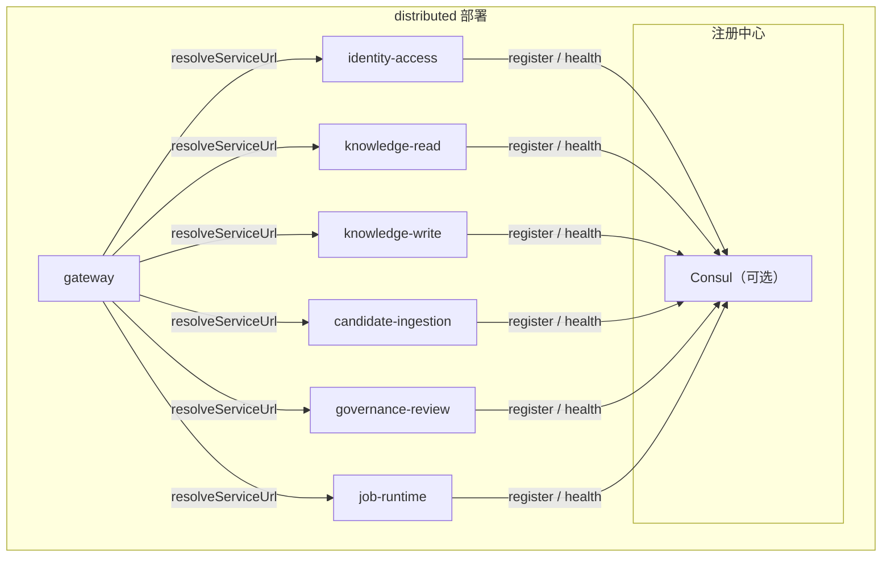

# 服务发现架构

> 本文档定义 TrapMap 服务发现的目标架构，并记录当前仓库已经冻结的接缝。服务注册、动态发现和静态 URL 回退的事实以 `packages/host-local`、`packages/host-distributed` 和 `packages/backend-core` 的源码为准。

## 概述

当前仓库中的服务发现由三部分组成：

- `packages/backend-core/src/ports/discovery-ports.ts`：定义 `DiscoveryPort`、`ServiceRegistration`、`DiscoveredService`
- `packages/host-local/src/nest/service-discovery/`：拥有 Consul client、注册、注销、KV 和 health check 接线
- `packages/host-distributed/src/config/service-config.ts` 与 `packages/host-distributed/src/gateway/discovery-resolver.ts`：拥有 distributed 默认 URL、Docker DNS 默认值以及 discovery 失败后的静态回退

三种部署 profile 的语义：

- `local-agent`：单进程，不涉及网络级服务发现
- `team-monolith`：单实例部署，可选接入 Consul，但不是前提
- `distributed`：多进程部署，当前验证基线是“显式 `TRAPMAP_*_URL` 覆盖 + Docker DNS 默认值 + 可选 dynamic discovery overlay”

设计原则：

- **宿主拥有接线**：`backend-core` 只定义 port，不拥有注册中心实现
- **静态回退优先存在**：dynamic discovery 失败时，gateway 必须回退到静态 URL
- **沿用现有 health contract**：服务发现复用现有 `/health` / `/ready` 语义
- **不扩成第二套命名**：service、profile、runtime、host 命名统一复用 truth source

## 目标架构总览



## 当前仓库事实

| 归属 | 当前事实 | 权威来源 |
|---|---|---|
| 注册/注销 | Consul 注册实现真实位于 `packages/host-local/src/nest/service-discovery/consul.service.ts`，而不是 `packages/host-distributed/src/service-discovery/` | `packages/host-local/src/nest/service-discovery/*.ts` |
| distributed 默认地址 | `packages/host-distributed/src/config/service-config.ts` 负责 `localhost` 默认值、Docker DNS 默认值与 `TRAPMAP_*_URL` 覆盖 | `packages/host-distributed/src/config/service-config.ts` |
| gateway 解析器 | `DiscoveryResolver` 先尝试动态发现，再回退到静态 URL | `packages/host-distributed/src/gateway/discovery-resolver.ts` |
| 健康契约 | 统一复用 `packages/contracts/src/domain/health.ts` 与现有 `/health` 输出 | `packages/contracts/src/domain/health.ts`、宿主 health 代码 |

## Consul 的职责

### 服务注册中心

Consul 作为可选注册中心时，维护当前活跃实例列表。每个服务实例在启动后注册，在退出前注销。

当前注册字段的语义与 `ServiceRegistration` 一致：

| 字段 | 说明 |
|---|---|
| `id` | 实例唯一标识 |
| `name` | 逻辑服务名，例如 `knowledge-write` |
| `address` | 服务对外可达地址 |
| `port` | 服务端口 |
| `check` | HTTP 健康检查配置 |
| `meta` | 版本、环境等扩展元数据 |

### 健康检查

Consul 健康检查继续复用现有 HTTP health contract，而不是额外引入一套服务发现专属探针。

当前典型映射：

| TrapMap 健康状态 | Consul 语义 |
|---|---|
| `liveness: "alive"` 且 `readiness: "ready"` | `passing` |
| `liveness: "alive"` 且 `readiness: "degraded"` | `warning` |
| `liveness: "dead"` 或连接失败 | `critical` |

### KV

KV 只作为可选的运行时配置增强层，不替代环境变量。当前代码已经冻结的核心事实仍然是：

- distributed 默认 URL 由 `TRAPMAP_*_URL` 或 profile 默认值提供
- Consul 不可用时，gateway 仍然可以靠静态 URL 继续工作

## 注册与注销归属

### 注册时机

当前仓库中，注册逻辑的真实归属在 `packages/host-local/src/nest/service-discovery/`：

```text
packages/host-local/src/nest/service-discovery/
  consul.module.ts
  consul.service.ts
  index.ts
```

启动顺序：

1. Nest module graph 初始化
2. `ConsulService.onModuleInit()` 读取 `CONSUL_ENABLED`、`CONSUL_HOST`、`CONSUL_PORT`
3. 如果 Consul 可用且允许自动注册，则构造 `ServiceRegistration`
4. 发送注册请求并开始 health checks

### 注销时机

关闭顺序：

1. 应用进入 graceful shutdown
2. `ConsulService.onModuleDestroy()` 被调用
3. 如果实例已注册且 Consul 仍可达，则发送 deregister

## distributed 解析与回退

### 默认 URL 解析

`packages/host-distributed/src/config/service-config.ts` 是 distributed 默认服务地址的事实源。当前默认逻辑服务包括：

- `gateway`
- `identity-access`
- `knowledge-read` (Node, legacy) / `knowledge-read-go` (`:4101`, Go, strangler target)
- `knowledge-write`
- `candidate-ingestion`
- `governance-review`
- `job-runtime`
- `go-accelerator` (`:4100`, compute-only, distributed-only)
- `knowledge-read-go` (`:4101`, read owns PG 只读 + recall/ranking/assembly/cache, `TRAPMAP_READ_IMPL` 控制)

当前已验证的 Docker DNS 默认名：

| 逻辑服务 | Docker DNS 默认名 |
|---|---|
| `gateway` | `gateway` |
| `identity-access` | `identity-access` |
| `knowledge-read` | `knowledge-read` |
| `knowledge-write` | `knowledge-write` |
| `candidate-ingestion` | `candidate-worker` |
| `governance-review` | `governance-worker` |
| `job-runtime` | `outbox-worker` |
| `go-accelerator` | `go-accelerator` |
| `knowledge-read-go` | `knowledge-read-go` |

### 动态发现

`packages/host-distributed/src/gateway/discovery-resolver.ts` 的规则很简单：

1. 如果存在 dynamic discovery backend，则先尝试解析 healthy 实例
2. 如果解析失败、抛错或服务名未知，则回退到静态 URL
3. 静态 URL 来自 `InternalServiceUrls`

这意味着当前 distributed 主线的事实不是“必须有注册中心才能运行”，而是“有可选的动态发现增强层，但没有它也必须稳定运行”。

### 负载均衡

当前阶段只冻结简单轮询语义：

- 单实例：直接命中唯一实例
- 多实例：轮询
- 动态发现失败：立即回退到静态 URL

## Go 服务健康与发现契约（2026-09-01 新增）

- `services/knowledge-read-go` 暴露 `GET /health` / `GET /ready` / `GET /v1/health` / `POST /v1/knowledge/read` / `GET /metrics`（`prometheus` + `slog`，`chi`，`pgx read-only` + `hashicorp/lru + singleflight`，`TRAPMAP_READ_IMPL=off|shadow|dual|go`）
- `services/go-accelerator` 保留 `GET /health` / `GET /ready`，`retrieval/ranking` 已 `410 Gone + X-Deprecated`
- 网关 `packages/host-distributed/src/gateway/routes.ts` 的 `GET /health` / `GET /ready` 聚合 `knowledge-read-go` 与 `go-accelerator` 的探活（800ms 超时，`breakerStatesSnapshot`），`distributed` 下缺失或 `warning/critical` 记为 `degraded`（503）
- `docker-compose.yml` 中两者均为 `profiles: ["distributed"]`，`host-local` 零 Go 依赖（`fallow ignorePatterns`），Consul 可选注册同其余服务一致
- 契约见 `packages/contracts/src/domain/knowledge-read-go.ts` → `contracts/json-schema/knowledge-read-go/*` → `services/knowledge-read-go/pkg/api/types.go`（`json.RawMessage` for `unknown`，`finite` 校验）

## 配置策略

| 环境变量 | 默认值 | 说明 |
|---|---|---|
| `CONSUL_ENABLED` | `false` | 是否启用 Consul-backed discovery / registration |
| `CONSUL_HOST` | `localhost` | Consul host |
| `CONSUL_PORT` | `8500` | Consul HTTP API 端口 |
| `SERVICE_NAME` | `trapmap` | host-local Consul 注册使用的服务名 |
| `PORT` | `4000` | host-local Consul 注册使用的端口 |
| `INSTANCE_ID` | `process.pid` | host-local 实例 ID 来源 |
| `TRAPMAP_SERVICE_NAME` | `gateway` | distributed 进程自身的逻辑服务名 |
| `TRAPMAP_SERVICE_PORT` | 各服务默认端口 | distributed 进程监听端口 |
| `TRAPMAP_SERVICE_ADVERTISE_HOST` | 按 profile 推导 | distributed 对外宣告 host；`distributed` 下优先使用 Docker DNS 名 |
| `TRAPMAP_GATEWAY_URL` 等 `TRAPMAP_*_URL` | 按 profile 推导 | distributed gateway 与各 owner service 的静态回退 URL |
| `TRAPMAP_DEPLOYMENT_PROFILE` | `local-agent` | 决定默认解析模式是 `localhost-defaults` 还是 `docker-dns` |

## 与现有架构的关系

### 健康检查复用

服务发现继续复用现有 health contract：

- `packages/contracts/src/domain/health.ts` 定义 schema
- 宿主 `/health` 输出继续作为注册中心 health check 的事实来源
- 不为 discovery 文档再发明第二套 status 命名

### 内部通信复用

dynamic discovery 只改变“目标地址如何获得”，不会改变：

- 内部 HTTP / RPC payload
- `InvocationError` 分类
- auth / header / timeout 语义

## 成熟度与 L3 entry criteria

当前 `distributed` 的服务发现成熟度与 `docs/architecture/DEPLOYMENT.md` 保持一致：`Level 2 / transitional-microservice + L3 verification pending`。

- **Level 2 已交付**：显式 `TRAPMAP_*_URL` 覆盖 + Docker DNS 默认值（`packages/host-distributed/src/config/service-config.ts`）+ 可选 `DiscoveryResolver` 动态发现叠加 + 静态回退；Consul 仅为可选注册/注销层（`packages/host-local/src/nest/service-discovery/`）。
- **Level 3 entry criteria（CLI-gated，待 live 验证）**：
  1. **kind smoke**：`k8s/base/*.yaml` 的 Kubernetes Service（gateway/identity-access/knowledge-* 等）经 `kubectl apply --dry-run=client --validate=true` 校验，`kind` 集群内 `kubectl wait --for=condition=Ready pod --all -n trapmap --timeout=180s` 通过，且各 Deployment `/ready` 200（验证 plumbing：`pnpm exec tsx scripts/verify-l3-platform.ts --check k8s-probes`）。
  2. **Service 网格验证**：无需引入 Service Mesh 作为 L3 前提；L3 仅要求当前 Docker DNS ↔ k8s Service 名映射一致性在 kind 内可达（`DISTRIBUTED_INTERNAL_HOSTS` → k8s Service 名等价），证据见 `scripts/verify-l3-platform.ts --check service-discovery`。
  3. **回退不变性**：dynamic discovery 不可用时 gateway 仍回退到静态 URL 的语义在 L3 下保持（`DiscoveryResolver` fail-open），由 `pnpm test:discovery-closeout` 覆盖，live kind 下复核。
- **晋升规则**：仅在上述 kind smoke 与回退不变性均获 live 证据后，方可将本文件与 `DEPLOYMENT.md` 的成熟度同步晋升至 `Level 3 / operationally-verified`，否则保持 Level 2 + pending 并保留 `scripts/verify-l3-platform.ts` 的离线 plumbing。

## 非目标

当前阶段明确不做：

- 不把 `packages/host-distributed` 写成当前注册实现的 owner
- 不把 Consul 写成 distributed 运行的唯一前提
- 不把 Kubernetes Service、Service Mesh 或跨数据中心发现写成当前事实
- 不替代 `TRAPMAP_*_URL` + Docker DNS 这条已验证基线
- 不以 L3 文档晋升替代 live kind 验证；`kubectl wait --for=condition=Ready` 的 Ready 证据为必要门槛
