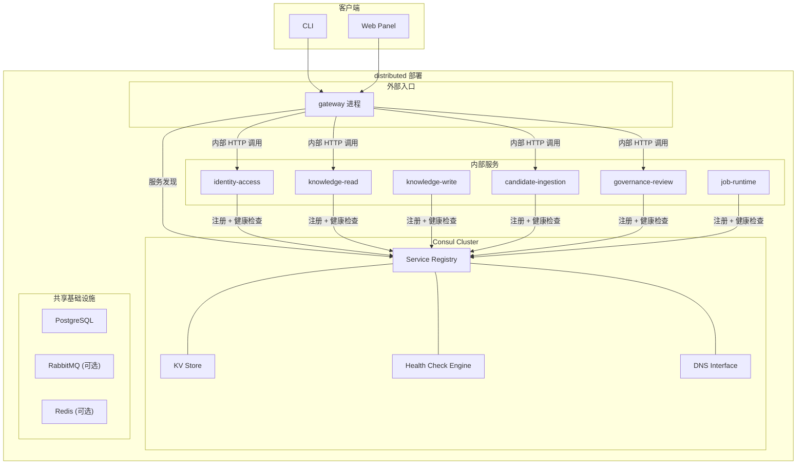
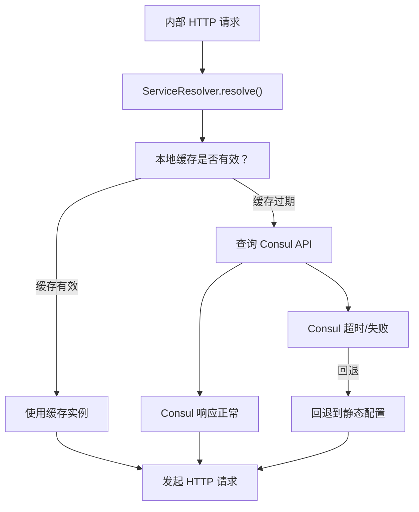

# 服务发现架构

> 本文档定义 TrapMap 服务发现的目标架构，以 Consul 为注册中心，覆盖服务注册、健康检查、动态发现和故障回退。当前阶段为架构冻结，尚未全量实现；后续落地以本文档为权威参考。

## 概述

TrapMap 的三个部署 profile 对服务发现有不同需求：

- `local-agent`：单进程，不涉及服务发现
- `team-monolith`：单实例部署，服务发现为可选增强
- `distributed`：多进程/多实例部署，服务发现为必需基础设施

服务发现的目标是让 distributed 形态下的 gateway 能够动态定位内部服务（candidate-ingestion、governance-review、knowledge-read 等），同时保持 `local-agent` 和 `team-monolith` 的零依赖运行。

设计原则：

- **渐进引入**：`local-agent` 不感知，`team-monolith` 可选，`distributed` 标准依赖
- **故障回退**：Consul 不可用时回退到静态配置或本地缓存
- **零侵入 domain**：服务发现只在 host 层装配，不进入 `backend-core`
- **复用现有 health 端点**：Consul 健康检查复用 `/health` 或 `/ready` 端点

## 架构总览



## Consul 职责

### 服务注册中心

Consul 作为唯一的服务注册中心，维护当前活跃的服务实例列表。每个 TrapMap 内部服务在启动时向 Consul 注册自身，在关闭时主动注销。

注册信息：

| 字段 | 来源 | 示例 |
|------|------|------|
| `ServiceName` | bounded context 名称 | `candidate-ingestion` |
| `ServiceId` | `${serviceName}-${instanceId}` | `candidate-ingestion-abc123` |
| `Address` | 进程绑定的 host | `10.0.1.5` |
| `Port` | 进程监听端口 | `4001` |
| `Tags` | profile + version | `["distributed", "v1.2.3"]` |
| `Meta` | 扩展元数据 | `{"runtimeMode": "worker", "serviceUnit": "candidate"}` |

### 健康检查

Consul 对每个注册的服务实例执行健康检查。复用 TrapMap 已有的 HTTP 健康端点：

```json
{
  "check": {
    "id": "candidate-ingestion-health",
    "name": "HTTP health check",
    "http": "http://10.0.1.5:4001/health",
    "interval": "10s",
    "timeout": "3s",
    "deregister_critical_service_after": "60s"
  }
}
```

健康状态映射：

| TrapMap `/health` 状态 | Consul 状态 | 说明 |
|----------------------|------------|------|
| `liveness: "alive"` + `readiness: "ready"` | `passing` | 实例健康，接收流量 |
| `liveness: "alive"` + `readiness: "degraded"` | `warning` | 实例可服务但降级 |
| `liveness: "dead"` 或连接失败 | `critical` | 实例不可用，Consul 将从服务列表中移除 |

对于 worker 类型的进程（candidate-worker、governance-worker、outbox-worker），健康检查 URL 使用各自的 HTTP status 端点而非 gateway 的 `/health`。如果 worker 进程不暴露 HTTP 端口，则使用 TTL 类型的健康检查，由进程主动向 Consul 报告存活状态。

### KV Store

Consul KV 存储用于：

| 用途 | Key 示例 | 说明 |
|------|---------|------|
| 运行时配置 | `config/trapmap/task-transport` | 动态配置，无需重启实例 |
| 功能开关 | `features/neo4j-graph-enabled` | 运行时切换可选功能 |
| 服务元数据 | `services/candidate-ingestion/config` | 服务级别的运行时参数 |

KV 变更通过 Consul watch 机制通知订阅方，实现配置的热更新。KV 不替代环境变量作为主要配置源，仅用于需要运行时变更的场景。

### DNS Interface

Consul 提供 DNS 接口（默认端口 8600），支持通过标准 DNS 查询获取服务地址：

```
candidate-ingestion.service.consul  →  10.0.1.5:4001
candidate-ingestion.service.consul  →  10.0.1.6:4001  (多实例时轮询)
```

DNS 接口主要供外部工具或不支持 Consul API 的系统使用。TrapMap 应用内部优先使用 HTTP API 进行服务发现。

## 服务注册与注销

### 注册时机（Module Init）

服务在 NestJS 模块初始化完成后向 Consul 注册。当前注册逻辑位于 `packages/host-local/src/nest/service-discovery/`，由 `ConsulModule` / `ConsulService` 负责：

```
packages/host-local/src/nest/
├── service-discovery/
│   ├── consul.module.ts     # NestJS module 定义
│   ├── consul.service.ts    # 注册、注销、发现与健康检查逻辑
│   └── index.ts
```

注册流程：

1. 进程启动，NestJS module graph 初始化
2. `ConsulService.onModuleInit()` 被调用
3. 读取当前进程的 `serviceName`、`address`、`port`、`tags`
4. 向 Consul 发送注册请求（HTTP API: `PUT /v1/agent/service/register`）
5. Consul 开始对该实例执行健康检查
6. 健康检查首次通过后，实例出现在服务发现结果中

### 注销时机（Module Destroy）

进程关闭时主动从 Consul 注销，避免残留不健康的实例：

1. NestJS 收到 `SIGTERM` / `SIGINT` 信号
2. 触发 graceful shutdown：停止接收新请求，等待进行中的请求完成
3. `ConsulService.onModuleDestroy()` 被调用
4. 向 Consul 发送注销请求（HTTP API: `PUT /v1/agent/service/deregister/:serviceId`）
5. 进程退出

配合 Consul 的 `deregister_critical_service_after: "60s"` 配置，即使进程异常退出未执行注销，Consul 也会在 60 秒后自动清理。

## 动态发现与负载均衡

### 服务发现流程

gateway 通过 `ServiceResolver` 查询目标服务的可用实例：

1. 调用方发起内部 HTTP 调用，例如 `serviceResolver.resolve("candidate-ingestion")`
2. `ServiceResolver` 查询 Consul healthy 实例列表（HTTP API: `GET /v1/health/service/:name?passing=true`）
3. 从 healthy 实例中按负载均衡策略选择一个
4. 返回 `{ host, port }`，调用方发起 HTTP 请求

### 本地缓存

为避免每次内部调用都查询 Consul，`ServiceResolver` 维护本地缓存：

| 参数 | 默认值 | 说明 |
|------|-------|------|
| 缓存 TTL | 10 秒 | 缓存过期后下次查询触发 Consul 刷新 |
| 刷新间隔 | 5 秒 | 后台定时刷新 healthy 实例列表（可选） |
| 最大缓存条目 | 100 | 缓存的服务实例数量上限 |

缓存刷新使用 Consul blocking query（长轮询），在实例列表变更时立即返回，兼顾实时性和性能。

### 负载均衡策略

当前阶段使用简单的轮询（round-robin）策略：

- 单实例场景：直接选择唯一实例
- 多实例场景：轮询分配请求
- 失败重试：请求失败时跳过当前实例，尝试下一个

后续可根据需要引入加权轮询、最少连接等策略，但当前阶段不做。

## 部署 Profile 差异

| 能力 | `local-agent` | `team-monolith` | `distributed` |
|------|--------------|-----------------|---------------|
| Consul | 不需要 | 可选 | 必需 |
| 服务注册 | 不涉及 | 不涉及（单实例） | 所有内部服务注册 |
| 服务发现 | 不涉及 | 不涉及 | gateway 动态发现内部服务 |
| 健康检查 | 仅应用层 `/health` | 应用层 `/health` | Consul 健康检查 + 应用层 `/health` |
| KV Store | 不使用 | 可选 | 运行时配置分发 |
| DNS | 不使用 | 不使用 | 可选，供外部工具 |

### local-agent

单进程部署，所有 bounded context 在同一进程内。不涉及网络级别的服务发现。内部模块间调用为直接函数调用，不经过 HTTP。Consul 完全不参与。

### team-monolith

单实例部署，所有服务在同一进程内。不强制要求 Consul。如果部署环境中已有 Consul（例如共享基础设施），可以注册自身以获得统一的服务目录视图，但这不是功能前提。

### distributed

多进程部署，每个内部服务（candidate-ingestion、governance-review 等）独立运行。Consul 是标准基础设施组件：

- 每个内部服务进程启动时向 Consul 注册
- gateway 通过 Consul 发现内部服务地址
- 如果目标是将 gateway 的内部 HTTP 调用从静态 URL 切换到 Consul 动态发现

## 配置策略

| 环境变量 | 默认值 | 说明 |
|---------|-------|------|
| `CONSUL_ENABLED` | `false` | 服务发现总开关 |
| `CONSUL_HOST` | `localhost` | Consul agent 地址 |
| `CONSUL_PORT` | `8500` | Consul HTTP API 端口 |
| `CONSUL_SERVICE_NAME` | 进程对应的服务名 | 注册到 Consul 的服务名称 |
| `CONSUL_SERVICE_ID` | `${name}-${随机后缀}` | 实例唯一标识 |
| `CONSUL_TAGS` | (无) | 额外标签，逗号分隔 |
| `CONSUL_HEALTH_CHECK_INTERVAL` | `10s` | 健康检查间隔 |
| `CONSUL_HEALTH_CHECK_TIMEOUT` | `3s` | 健康检查超时 |
| `CONSUL_DEREGISTER_AFTER` | `60s` | critical 状态后自动注销延迟 |
| `CONSUL_CACHE_TTL` | `10` | 服务发现结果缓存 TTL（秒） |
| `CONSUL_KV_PREFIX` | `config/trapmap` | KV Store key 前缀 |

当前 `distributed` 的默认服务地址仍通过显式环境变量配置（如 `TRAPMAP_IDENTITY_ACCESS_URL`、`TRAPMAP_CANDIDATE_WORKER_URL`），这是已验证的基线。Consul 动态发现作为增强接入，不会移除静态配置支持。

## 故障模式与回退

### Consul 不可用



回退层级：

| 优先级 | 回退源 | 条件 |
|-------|-------|------|
| 1 | Consul healthy 实例 | Consul 可用且有 healthy 实例 |
| 2 | 本地缓存 | Consul 不可用但缓存未过期 |
| 3 | 静态配置（环境变量） | Consul 不可用且缓存过期 |
| 4 | 启动失败 | 以上全部失败且配置不允许降级 |

### 实例故障

- **单实例故障**：Consul 健康检查检测到 `critical`，从服务列表移除。gateway 下次查询不会获取该实例。
- **多实例部分故障**：Consul 只返回 healthy 实例，故障实例被自动隔离。如果所有实例都 critical，触发静态配置回退。
- **网络分区**：Consul 使用 Raft 共识协议处理分区。少数派分区中的实例可能暂时无法注册/注销，但不会影响多数派侧的服务发现。

### 健康检查误判

当应用进程存活但 Consul 健康检查失败（例如网络抖动导致 Consul agent 判定超时）：

- 实例短暂从服务列表移除
- Consul 会在下次检查通过后自动恢复
- `deregister_critical_service_after` 防止实例无限停留在 critical 状态
- 应用侧继续正常处理已建立的连接，不影响进行中的请求

## 与现有架构的关系

### 复用现有 health 端点

Consul 健康检查复用 `packages/server/src/lib/runtime/runtime-metadata.ts` 提供的 `/health` 端点。该端点已包含：

- `liveness`：进程存活状态
- `readiness`：依赖就绪状态
- `dependencies`：数据库、队列 worker、graph backend 的运行状态

Consul 不需要额外的健康检查逻辑，直接 HTTP GET 这些端点即可。

### 复用现有 deployment resolution

现有的 `ResolvedRuntimeDeployment`（由 `profile + preset + runtimeMode + serviceUnit` 解析而来）继续作为进程身份的事实源。Consul 注册时的 `serviceName`、`tags`、`meta` 直接从 `ResolvedRuntimeDeployment` 中提取，不引入新的身份定义。

### 复用现有内部通信

`packages/host-distributed` 当前已有的内部 HTTP hop 机制（gateway 到各内部服务的 HTTP 调用）保持不变。Consul 服务发现只是把这些调用的目标地址从静态配置改为动态发现，通信协议和 payload 格式都不变。

## 非目标

当前阶段明确不做：

- 不引入 Kubernetes Service 或 Service Mesh（Istio/Linkerd）作为当前默认方案
- 不为 `local-agent` 和 `team-monolith` 强制引入 Consul 依赖
- 不在 `backend-core` 中引入服务发现依赖；服务发现只在 host 层装配
- 不实现 Consul Connect（service mesh sidecar）
- 不实现跨数据中心的服务发现（当前所有实例在同一数据中心）
- 不替代 PostgreSQL 作为主要持久化底座的角色
- 不把 Consul KV 作为主要配置源（环境变量优先）
