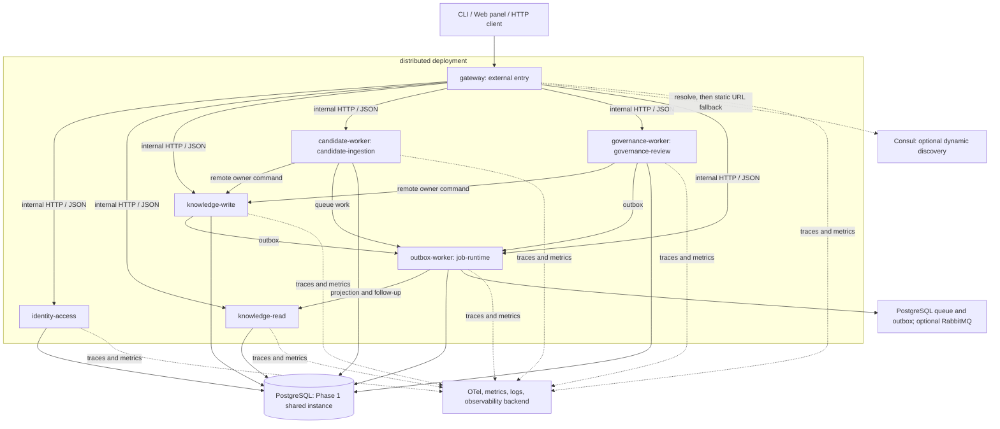
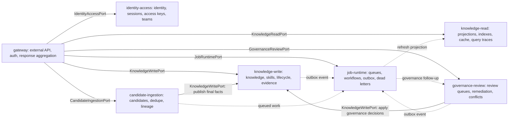
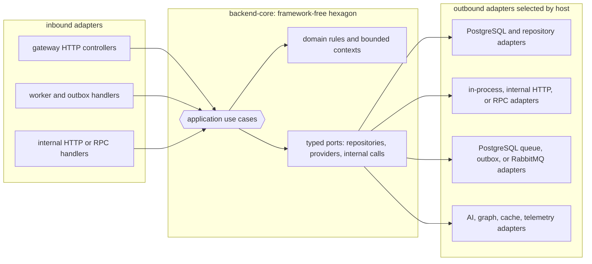

# 服务边界

> 由运行时重组与服务演进计划冻结。本文档定义服务角色、权威所有权、内部通信契约以及服务间交互规则。

## 状态

- 阶段：Phase 1（逻辑边界已定义；物理进程分离渐进推进）
- 执行里程碑：仓库当前已经有六个真实的 `service-*` 包：`packages/service-identity-access`、`packages/service-knowledge-read`、`packages/service-knowledge-write`、`packages/service-candidate-ingestion`、`packages/service-governance-review`、`packages/service-job-runtime`

## 服务清单

| 服务 | 包 | 限界上下文 |
|---|---|---|
| `gateway` | 由 `host-local` / `host-distributed` 组装，无独立包 | 外部 API 表面、请求聚合 |
| `identity-access` | `packages/service-identity-access` | 认证、会话、访问密钥、成员关系、团队、RBAC |
| `knowledge-read` | `packages/service-knowledge-read` | 检索、读投影、查询追踪、读缓存 |
| `knowledge-write` | `packages/service-knowledge-write` | 知识 / 陷阱 / 技能 / 生命周期 / 维护 / 衰减写入 |
| `candidate-ingestion` | `packages/service-candidate-ingestion` | 候选接收、规范化、去重、状态推进 |
| `governance-review` | `packages/service-governance-review` | 审查队列、工作台、冲突解决、补救 |
| `job-runtime` | `packages/service-job-runtime` | 任务队列、工作流运行、outbox 调度、共享任务 |

## 服务定义

### `gateway`

**用途**：所有客户端（CLI、Web、外部集成）的唯一外部入口。

**职责**：

- 保持 API 表面稳定
- 将请求路由到合适的 owner service
- 统一认证、错误映射、header 传播和聚合响应
- 暴露必要的 health / readiness / operator surfaces

**不包含**：

- 不拥有业务领域状态
- 不直接写入任何领域权威表
- 不把内部服务边界泄露给外部客户端

### `identity-access`

**用途**：集中式认证、身份和访问控制。

**实现状态**：已实现为 `packages/service-identity-access`。`packages/host-distributed` 只作为薄宿主适配器，`packages/server` 不是权威 owner。

**职责**：

- 登录、会话创建、会话验证
- access key 生成、验证、撤销
- 团队与成员关系管理
- RBAC 决策和 actor 解析

**权威表**：认证、会话、访问密钥、用户、团队、成员关系

### `knowledge-read`

**用途**：优化的读路径，用于检索、搜索和查询分析。

**实现状态**：已实现为 `packages/service-knowledge-read`。`packages/host-distributed` 只负责装配与传输接线，`packages/server` 不是权威 owner。

**职责**：

- 检索查询执行
- 查询追踪和分析
- 读投影与搜索索引维护
- 读侧缓存管理
- 通过自有派生 entry projection 提供 `knowledge-entry:getById` / `knowledge-entry:listMine`

**权威表**：无。该服务只写派生读模型和索引状态。

### `knowledge-write`

**用途**：知识领域的权威写路径。

**实现状态**：已实现为 `packages/service-knowledge-write`。

**职责**：

- 知识、陷阱、技能、生命周期、维护、衰减相关写入
- 生命周期事件发出
- cache / projection invalidation 触发

**权威表**：知识条目、标签、边界、修订、生命周期事件、技能制品、衰减、证据、反馈等写事实

### `candidate-ingestion`

**用途**：新候选项的异步接收与处理管道。

**实现状态**：`packages/service-candidate-ingestion` 是六个真实 `service-*` 包之一。`packages/host-distributed` 只消费它，`packages/server` 不是权威候选 owner。

**职责**：

- 候选接收与规范化
- 重复检测预处理
- 状态推进与人工 / 自动解决结果记录
- 实体谱系追踪

**权威表**：candidate 及其分析、解决结果、重复匹配、谱系相关表

**关键约束**：当候选项需要落成正式知识事实时，必须通过远程 `KnowledgeWritePort` 委托给 `knowledge-write`；不得保留本地 knowledge repo fallback。

### `governance-review`

**用途**：人在回路的审查工作流和冲突解决。

**实现状态**：已实现为 `packages/service-governance-review`。

**职责**：

- 审查队列与工作台状态管理
- 冲突解决工作流
- 补救队列与反馈驱动治理流程
- 治理态读模型

**权威表**：审查队列、工作台、冲突解决、补救相关治理状态

**关键约束**：治理决策必须通过远程 `KnowledgeWritePort` 委托最终聚合变更，不能保留本地 knowledge fallback。

### `job-runtime`

**用途**：共享的异步执行基底。

**职责**：

- task queue / workflow runs / outbox 调度
- 重试、退避、回收、死信
- 共享异步任务执行

**权威表**：`task_queue`、`workflow_runs`、`domain_event_outbox` 以及处理状态

## 内部通信

### 端口优先

所有跨服务通信都通过 `backend-core` ports 进行。端口负责冻结：

- 请求 / 响应 shape
- timeout / cancel 预期
- 错误分类
- trace / request header 传播

### 端口清单

| 端口 | 提供者 | 消费者 |
|---|---|---|
| `IdentityAccessPort` | `identity-access` | gateway、其他所有服务 |
| `KnowledgeReadPort` | `knowledge-read` | gateway |
| `KnowledgeWritePort` | `knowledge-write` | gateway、candidate-ingestion、governance-review |
| `CandidateIngestionPort` | `candidate-ingestion` | gateway |
| `GovernanceReviewPort` | `governance-review` | gateway |
| `JobRuntimePort` | `job-runtime` | gateway、其他所有服务 |

### 同步调用

- `gateway` -> `identity-access`
- `gateway` -> `knowledge-read`
- `gateway` -> `knowledge-write`
- `gateway` -> `candidate-ingestion`
- `gateway` -> `governance-review`
- `governance-review` -> `knowledge-write`
- `candidate-ingestion` -> `knowledge-write`

### 异步调用

- `knowledge-write` -> outbox -> `job-runtime` -> `knowledge-read`
- `knowledge-write` -> outbox -> `job-runtime` -> `governance-review`
- `candidate-ingestion` -> queue -> `job-runtime`
- `governance-review` -> outbox -> `job-runtime`

## 架构总览

### `distributed` 运行时部署拓扑

下图描述当前 `distributed` profile 的运行时基线，而不是已经完成独立数据库、强制注册中心或自治编排的平台目标。gateway 始终保留静态 URL 回退；Consul 仅为可选的动态发现增强层。

### 逻辑调用与领域所有权

实线表示同步端口调用；虚线表示通过 outbox、队列或工作流传递的异步工作。每个服务只能写入自己拥有的状态，跨边界写入必须委托给 owner。

### 六边形架构：端口与适配器

当前后端采用“端口优先”的六边形架构：`backend-core` 保持框架无关的领域规则、应用用例与端口契约；宿主和服务包只负责把 HTTP、worker、数据库、消息与远程调用等具体适配器接到这些端口。换言之，业务内核不依赖 Nest、Fastify、PostgreSQL 或 RabbitMQ，部署 profile 只改变适配器选择，不改变领域所有权。

`host-local` 与 `host-distributed` 拥有适配器组装和进程启动；`service-*` 包是 distributed transport/process entry 的薄组装层。跨服务调用继续通过 `backend-core` 中的 typed port 表达，不能由 adapter 绕过 owner 直接写入对方领域状态。

### 传输接缝

默认同步传输是内部 HTTP / JSON。当前 Phase 2 只对 `knowledge-write` owner hop 冻结了可选 RPC 接缝。

Current RPC pilot scope（当前 RPC 试点范围）：

- `governance-review` -> `knowledge-write`
- `candidate-ingestion` -> `knowledge-write`

当前试点约束：

- 宿主选择传输方式，service 包只依赖 `backend-core` ports
- 必须保持相同的 timeout、trace 传播和 `InvocationError` 映射
- 如果远程 owner 返回 `404`、`409`、`503`、`timeout` 或其他错误，调用方必须暴露真实失败语义，不能本地伪写
- 试点不把 Connect RPC、gRPC、Protobuf 写成当前仓库已经接受的正式 truth surface

## 所有权模型

### 权威所有权

| 领域 | owner | 规则 |
|---|---|---|
| 认证 / 会话 / 访问密钥 | `identity-access` | 只有它可以写身份事实 |
| 用户 / 团队 / 成员关系 | `identity-access` | 只有它可以写身份状态 |
| 知识 / 陷阱 / 技能 | `knowledge-write` | 只有它可以写知识领域状态 |
| 生命周期 / 衰减 / 维护 | `knowledge-write` | 只有它可以写生命周期状态 |
| 候选 / 重复 / 谱系 | `candidate-ingestion` | 只有它可以写候选工作流状态 |
| 审查队列 / 补救 | `governance-review` | 只有它可以写治理状态 |
| 任务队列 / 工作流 / outbox | `job-runtime` | 只有它可以写运行时基础设施状态 |
| 投影 / 搜索索引 | `knowledge-read` | 只写派生状态 |

### 通信规则

1. 禁止跨服务直接写入对方权威表。
2. 禁止 `candidate-ingestion` 或 `governance-review` 在 owner hop 失败时本地回退写 knowledge 表。
3. 禁止循环同步调用。
4. 所有同步调用都必须有 timeout 和失败策略。
5. 异步事件必须按 owner 定义的顺序和幂等规则处理。

## 物理进程映射

### 轻量宿主

在 `local-agent` / `team-monolith` 下，七个逻辑服务可以由同一宿主进程内组装。当前默认主线是 `packages/host-local`；`packages/server` 只保留 Fastify compatibility shell 与 shared runtime/status seam。

### `distributed` 当前基线

`packages/host-distributed/src/config/service-config.ts` 是默认地址和 Docker DNS 名称的事实源：

| 物理进程 / DNS 名 | 逻辑服务 |
|---|---|
| `gateway` | `gateway` |
| `identity-access` | `identity-access` |
| `knowledge-read` | `knowledge-read` |
| `knowledge-write` | `knowledge-write` |
| `candidate-worker` | `candidate-ingestion` |
| `governance-worker` | `governance-review` |
| `outbox-worker` | `job-runtime` |

这记录的是当前 distributed 基线，不等于“已经完成更高等级的平台自治”。服务发现平台化、注册中心默认化和更成熟的编排仍属于后续专题。

## 参考资料

- [目标架构](TARGET_ARCHITECTURE.md)
- [部署指南](DEPLOYMENT.md)
- [系统权威事实源](../reference/SYSTEM_TRUTH_SOURCES.md)
