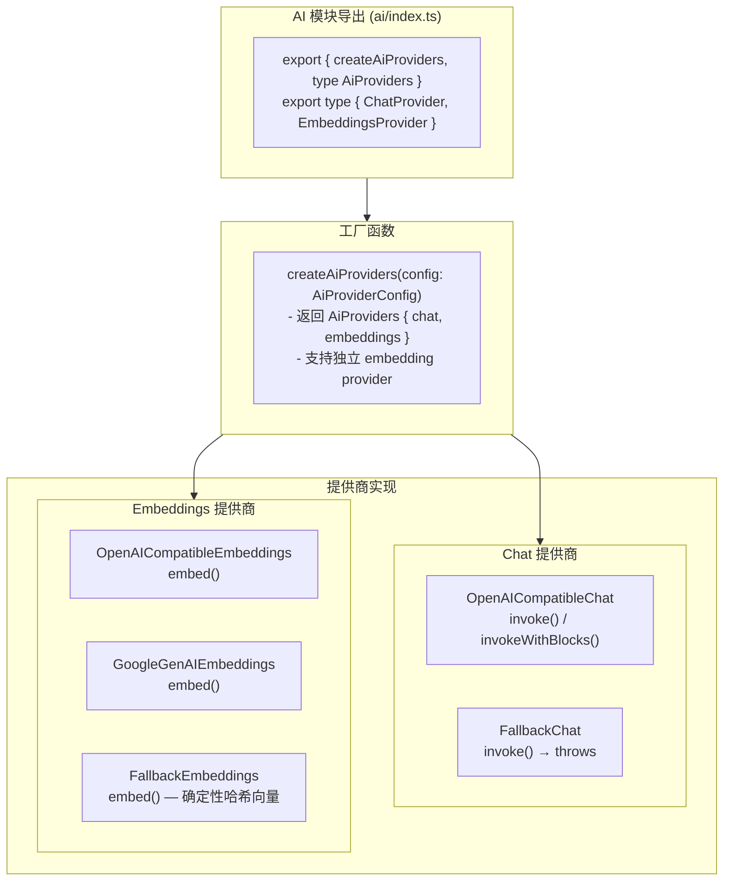

# AI 提供商抽象层 (AI Provider Abstraction)

## 概述

AI 提供商抽象层为 TrapMap 提供统一的 AI 接口，支持多种 AI 提供商（OpenAI、OpenAI 兼容接口、Ollama、Google GenAI）。这使得系统可以在不改变业务逻辑的情况下切换 AI 提供商。当无 API key 时自动降级到 `fallback` 模式（确定性哈希向量）。

所有提供商实现均基于 `@langchain/openai` 的 `ChatOpenAI` 和 `OpenAIEmbeddings`，通过动态懒加载（`await import()`）避免非 fallback 模式下的包加载开销。详见 [依赖分析](DEPENDENCY_ANALYSIS.md)。

## 支持的提供商

| 提供商 | 类型 | 默认 Chat 模型 | 默认 Embedding 模型 | 适用场景 |
|--------|------|----------------|---------------------|----------|
| OpenAI | API | gpt-4o-mini | text-embedding-3-small | 生产环境 |
| OpenAI-Compatible | API | (必须指定) | (必须指定) | 自托管模型 |
| Ollama | 本地 | llama3 | nomic-embed-text | 本地开发/隐私 |
| Google GenAI | API | gemini-2.0-flash | text-embedding-004 | Google AI Studio |
| Fallback | 内置 | (无) | 确定性哈希向量 | 无 API key 时的降级模式 |

## 架构



## 接口定义

### 核心接口

```typescript
// ai/types.ts
interface EmbeddingsProvider {
  readonly provider: string;
  readonly isConfigured: boolean;
  embed(text: string): Promise<number[]>;
}

interface ChatProvider {
  readonly provider: string;
  readonly isConfigured: boolean;
  invoke(systemPrompt: string, userMessage: string): Promise<string>;
  invokeWithBlocks?(blocks: PromptBlock[], userMessage: string): Promise<string>;
}

interface AiProviders {
  embeddings: EmbeddingsProvider;
  chat: ChatProvider;
}
```

### 配置接口

```typescript
// ai/provider-config.ts
interface AiProviderConfig {
  readonly provider: AiProviderType;  // 'openai' | 'openai-compatible' | 'ollama' | 'google-genai' | 'fallback'
  readonly baseUrl: string;
  readonly apiKey: string;
  readonly chatModel: string;
  readonly embeddingModel: string;
  readonly isConfigured: boolean;
  /** Path to a JSON prompt template override file */
  readonly promptTemplateFile: string | null;
  /** Embedding provider config if different from primary */
  readonly embeddingProvider?: {
    readonly provider: AiProviderType;
    readonly baseUrl: string;
    readonly apiKey: string;
    readonly model: string;
    readonly isConfigured: boolean;
  };
}
```

---

## OpenAI 提供商

### 实现

OpenAI 和 OpenAI 兼容提供商共享同一套实现类，通过 `baseUrl` 区分：

```typescript
// ai/providers.ts
export class OpenAICompatibleChat implements ChatProvider {
  readonly provider: string;
  readonly isConfigured: boolean;
  private impl: import('@langchain/openai').ChatOpenAI | null = null;
  private readonly chatConfig: AiProviderConfig;

  constructor(config: AiProviderConfig) {
    this.provider = config.provider;
    this.isConfigured = config.isConfigured;
    this.chatConfig = config;
  }

  private async ensureImpl(): Promise<import('@langchain/openai').ChatOpenAI> {
    if (!this.impl) {
      const { ChatOpenAI } = await import('@langchain/openai');
      this.impl = new ChatOpenAI({
        modelName: this.chatConfig.chatModel,
        apiKey: this.chatConfig.apiKey,
        timeout: 30_000,
        configuration: { baseURL: this.chatConfig.baseUrl },
      });
    }
    return this.impl;
  }

  async invoke(systemPrompt: string, userMessage: string): Promise<string> {
    const impl = await this.ensureImpl();
    const { HumanMessage, SystemMessage } = await import('@langchain/core/messages');
    const result = await impl.invoke([
      new SystemMessage(systemPrompt),
      new HumanMessage(userMessage),
    ]);
    return typeof result.content === 'string' ? result.content : String(result.content);
  }
}

export class OpenAICompatibleEmbeddings implements EmbeddingsProvider {
  readonly provider: string;
  readonly isConfigured: boolean;
  private impl: import('@langchain/openai').OpenAIEmbeddings | null = null;
  private readonly embConfig: AiProviderConfig;

  constructor(config: AiProviderConfig) {
    this.provider = config.provider;
    this.isConfigured = config.isConfigured;
    this.embConfig = config;
  }

  private async ensureImpl(): Promise<import('@langchain/openai').OpenAIEmbeddings> {
    if (!this.impl) {
      const { OpenAIEmbeddings } = await import('@langchain/openai');
      this.impl = new OpenAIEmbeddings({
        modelName: this.embConfig.embeddingModel,
        apiKey: this.embConfig.apiKey,
        timeout: 30_000,
        configuration: { baseURL: this.embConfig.baseUrl },
      });
    }
    return this.impl;
  }

  async embed(text: string): Promise<number[]> {
    const impl = await this.ensureImpl();
    return impl.embedQuery(text);
  }
}
```

### 配置

```bash
# .env
AI_PROVIDER=openai
OPENAI_API_KEY=sk-proj-...
AI_CHAT_MODEL=gpt-4o-mini
AI_EMBEDDING_MODEL=text-embedding-3-small
```

---

## OpenAI 兼容提供商

OpenAI 兼容提供商与 OpenAI 提供商共享 `OpenAICompatibleChat` 和 `OpenAICompatibleEmbeddings` 类（见上文）。区别在于 `config.baseUrl` 指向自定义端点。

### 配置

```bash
# .env
AI_PROVIDER=openai-compatible
AI_BASE_URL=https://api.myai.example.com/v1
AI_API_KEY=your-api-key
AI_CHAT_MODEL=custom-model
AI_EMBEDDING_MODEL=custom-embedding-model
```

### 常用兼容服务

| 服务 | 端点示例 |
|------|----------|
| Azure OpenAI | `https://YOUR_RESOURCE.openai.azure.com/v1` |
| LM Studio | `http://localhost:8080/v1` |
| LocalAI | `http://localhost:8080/v1` |
| vLLM | `http://localhost:8000/v1` |

---

## Ollama 提供商

Ollama 的 `/v1/*` 端点与 OpenAI 兼容，因此复用 `OpenAICompatibleChat` 和 `OpenAICompatibleEmbeddings`，无需独立实现。

### 配置

```bash
# .env
AI_PROVIDER=ollama
AI_BASE_URL=http://localhost:11434/v1
AI_CHAT_MODEL=llama3
AI_EMBEDDING_MODEL=nomic-embed-text
```

### Ollama 模型安装

```bash
# 安装模型
ollama pull llama3
ollama pull mistral
ollama pull nomic-embed-text

# 验证安装
ollama list
```

---

## 工厂函数

```typescript
// ai/providers.ts
import type { AiProviders, ChatProvider, EmbeddingsProvider } from './types.js';

/**
 * Create AI providers from configuration.
 * Returns live providers when configured, otherwise deterministic fallbacks.
 *
 * Supports separate embedding provider via config.embeddingProvider.
 * This allows using Ollama for embeddings while using another provider for chat.
 */
export function createAiProviders(config: AiProviderConfig): AiProviders {
  if (config.provider === 'fallback') {
    return {
      embeddings: new FallbackEmbeddings(),
      chat: new FallbackChat(),
    };
  }

  // Create embeddings provider based on provider type
  const createEmbeddingsProvider = (cfg: AiProviderConfig): EmbeddingsProvider => {
    if (cfg.provider === 'google-genai') {
      return new GoogleGenAIEmbeddings(cfg);
    }
    return new OpenAICompatibleEmbeddings(cfg);
  };

  // Use separate embedding provider if configured
  if (config.embeddingProvider?.isConfigured) {
    const embConfig: AiProviderConfig = {
      provider: config.embeddingProvider.provider,
      baseUrl: config.embeddingProvider.baseUrl,
      apiKey: config.embeddingProvider.apiKey,
      chatModel: '',
      embeddingModel: config.embeddingProvider.model,
      isConfigured: true,
      promptTemplateFile: null,
    };
    return {
      embeddings: createEmbeddingsProvider(embConfig),
      chat: new OpenAICompatibleChat(config),
    };
  }

  return {
    embeddings: createEmbeddingsProvider(config),
    chat: new OpenAICompatibleChat(config),
  };
}
```

### 提供商检测逻辑

```typescript
// ai/provider-config.ts — resolveProviderType()
// 1. AI_PROVIDER 显式设置 → 使用该值
// 2. OPENAI_API_KEY 存在 → openai（向后兼容）
// 3. GEMINI_API_KEY 存在 → google-genai
// 4. 否则 → fallback（确定性哈希向量，无需 API key）
```

---

## 使用示例

### 在服务中使用

```typescript
import { createAiProviders, loadAiProviderConfig } from './ai/index.js';

const config = loadAiProviderConfig();
const { chat, embeddings } = createAiProviders(config);

// Chat
const response = await chat.invoke(
  'You are a helpful assistant.',
  'Explain GraphRAG in simple terms.'
);
console.log(response);

// Embeddings
const vector = await embeddings.embed('How to implement OAuth2 authentication');
console.log(`Generated ${vector.length}-dimensional embedding`);
```

### 独立 Embedding Provider

```bash
# 使用 Ollama 做 embeddings，OpenAI 做 chat
AI_PROVIDER=openai
OPENAI_API_KEY=sk-proj-...
EMBEDDING_PROVIDER=ollama
EMBEDDING_BASE_URL=http://localhost:11434/v1
EMBEDDING_MODEL=nomic-embed-text
```

---

## 错误处理

### Fallback 行为

当无 API key 时，工厂函数返回：

- `FallbackEmbeddings`：确定性哈希向量（384 维），用于本地/CI 环境
- `FallbackChat`：调用时抛出 `Error('No AI chat provider configured')`

### LangChain 内置重试

`ChatOpenAI` 和 `OpenAIEmbeddings` 实例化时未显式配置 `maxRetries`，依赖 LangChain 默认重试策略。超时设置为 30 秒。
