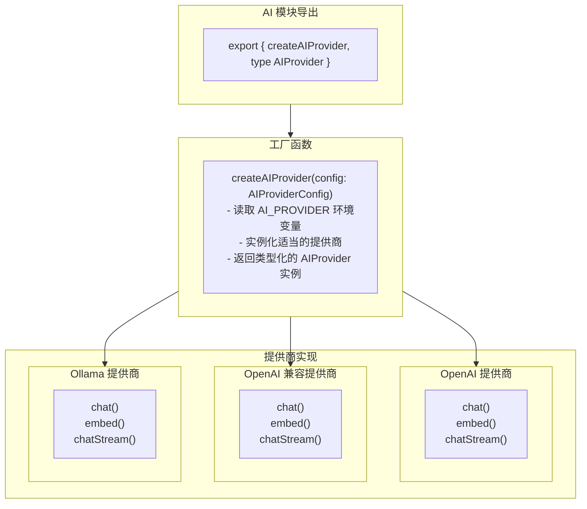

# AI 提供商抽象层 (AI Provider Abstraction)

## 概述

AI 提供商抽象层为 TrapMap 提供统一的 AI 接口，支持多种 AI 提供商（OpenAI、OpenAI 兼容接口、Ollama）。这使得系统可以在不改变业务逻辑的情况下切换 AI 提供商。

## 支持的提供商

| 提供商 | 类型 | 模型 | 适用场景 |
|--------|------|------|----------|
| OpenAI | API | GPT-4o, GPT-4-turbo, GPT-3.5-turbo | 生产环境 |
| OpenAI-Compatible | API | 任何 OpenAI-compatible API | 自托管模型 |
| Ollama | 本地 | Llama2, Mistral, etc. | 本地开发/隐私 |

## 架构



## 接口定义

### 核心接口

```typescript
interface AIProvider {
  // Chat completions
  chat(
    messages: ChatMessage[],
    options?: ChatOptions
  ): Promise<ChatResponse>;
  
  // Streaming chat completions
  chatStream(
    messages: ChatMessage[],
    options?: ChatOptions
  ): AsyncIterable<StreamingChunk>;
  
  // Embeddings generation
  embed(texts: string[]): Promise<EmbeddingResponse>;
  
  // Provider name for logging/debugging
  readonly providerName: string;
  
  // Check if provider is healthy
  healthCheck(): Promise<boolean>;
}

interface ChatMessage {
  role: 'system' | 'user' | 'assistant';
  content: string;
  name?: string;
}

interface ChatOptions {
  model?: string;
  temperature?: number;
  maxTokens?: number;
  topP?: number;
  stop?: string[];
  functions?: FunctionDefinition[];
}

interface ChatResponse {
  content: string;
  model: string;
  usage: {
    promptTokens: number;
    completionTokens: number;
    totalTokens: number;
  };
  finishReason: 'stop' | 'length' | 'function_call' | 'content_filter';
}

interface EmbeddingResponse {
  embeddings: number[][];
  model: string;
  usage: {
    promptTokens: number;
    totalTokens: number;
  };
}
```

### 配置接口

```typescript
interface AIProviderConfig {
  provider: 'openai' | 'openai-compatible' | 'ollama';
  
  // API Configuration
  apiKey?: string;
  baseUrl?: string;
  
  // Model Configuration
  chatModel?: string;
  embeddingModel?: string;
  
  // Optional Configuration
  timeout?: number;
  maxRetries?: number;
}
```

---

## OpenAI 提供商

### 实现

```typescript
import OpenAI from 'openai';
import type { AIProvider, ChatMessage, ChatOptions } from './types';

export class OpenAIProvider implements AIProvider {
  readonly providerName = 'openai';
  
  private client: OpenAI;
  private chatModel: string;
  private embeddingModel: string;
  
  constructor(config: AIProviderConfig) {
    this.client = new OpenAI({
      apiKey: config.apiKey,
      timeout: config.timeout,
      maxRetries: config.maxRetries
    });
    
    this.chatModel = config.chatModel || 'gpt-4o';
    this.embeddingModel = config.embeddingModel || 'text-embedding-3-small';
  }
  
  async chat(
    messages: ChatMessage[],
    options: ChatOptions = {}
  ): Promise<ChatResponse> {
    const response = await this.client.chat.completions.create({
      model: options.model || this.chatModel,
      messages: messages as OpenAI.Chat.ChatCompletionMessageParam[],
      temperature: options.temperature ?? 0.7,
      max_tokens: options.maxTokens,
      top_p: options.topP,
      stop: options.stop,
      functions: options.functions as OpenAI.Chat.ChatCompletionFunctions[] | undefined
    });
    
    const choice = response.choices[0];
    return {
      content: choice.message.content || '',
      model: response.model,
      usage: {
        promptTokens: response.usage?.prompt_tokens || 0,
        completionTokens: response.usage?.completion_tokens || 0,
        totalTokens: response.usage?.total_tokens || 0
      },
      finishReason: choice.finish_reason as ChatResponse['finishReason']
    };
  }
  
  async *chatStream(
    messages: ChatMessage[],
    options: ChatOptions = {}
  ): AsyncIterable<StreamingChunk> {
    const stream = await this.client.chat.completions.create({
      model: options.model || this.chatModel,
      messages: messages as OpenAI.Chat.ChatCompletionMessageParam[],
      temperature: options.temperature ?? 0.7,
      max_tokens: options.maxTokens,
      stream: true
    });
    
    for await (const chunk of stream) {
      yield {
        content: chunk.choices[0]?.delta?.content || '',
        done: chunk.choices[0]?.finish_reason !== undefined
      };
    }
  }
  
  async embed(texts: string[]): Promise<EmbeddingResponse> {
    const response = await this.client.embeddings.create({
      model: this.embeddingModel,
      input: texts
    });
    
    return {
      embeddings: response.data.map(d => d.embedding),
      model: response.model,
      usage: {
        promptTokens: response.usage?.prompt_tokens || 0,
        totalTokens: response.usage?.total_tokens || 0
      }
    };
  }
  
  async healthCheck(): Promise<boolean> {
    try {
      await this.client.models.list();
      return true;
    } catch {
      return false;
    }
  }
}
```

### 配置

```bash
# .env
AI_PROVIDER=openai
OPENAI_API_KEY=sk-proj-...
AI_CHAT_MODEL=gpt-4o
AI_EMBEDDING_MODEL=text-embedding-3-small
```

---

## OpenAI 兼容提供商

### 实现

```typescript
export class OpenAICompatibleProvider implements AIProvider {
  readonly providerName = 'openai-compatible';
  
  private client: OpenAI;
  private baseUrl: string;
  private chatModel: string;
  private embeddingModel: string;
  
  constructor(config: AIProviderConfig) {
    if (!config.baseUrl) {
      throw new Error('baseUrl required for openai-compatible provider');
    }
    
    this.baseUrl = config.baseUrl;
    this.chatModel = config.chatModel || 'gpt-4o';
    this.embeddingModel = config.embeddingModel || 'text-embedding-3-small';
    
    this.client = new OpenAI({
      apiKey: config.apiKey || 'dummy',
      baseURL: config.baseUrl,
      timeout: config.timeout
    });
  }
  
  // Similar implementation to OpenAIProvider
  // but uses custom baseUrl
}
```

### 配置

```bash
# .env
AI_PROVIDER=openai-compatible
AI_BASE_URL=https://api.myai.example.com/v1
AI_API_KEY=your-api-key
AI_CHAT_MODEL=custom-model
AI_EMBEDDING_MODEL=custom-embedding-model
```

### 常用兼容服务

| 服务 | 端点示例 |
|------|----------|
| Azure OpenAI | `https://YOUR_RESOURCE.openai.azure.com/v1` |
| LM Studio | `http://localhost:8080/v1` |
| LocalAI | `http://localhost:8080/v1` |
| vLLM | `http://localhost:8000/v1` |

---

## Ollama 提供商

### 实现

```typescript
import type { AIProvider, ChatMessage, ChatOptions } from './types';

export class OllamaProvider implements AIProvider {
  readonly providerName = 'ollama';
  
  private baseUrl: string;
  private chatModel: string;
  private embeddingModel: string;
  
  constructor(config: AIProviderConfig) {
    this.baseUrl = config.baseUrl || 'http://localhost:11434';
    this.chatModel = config.chatModel || 'llama2';
    this.embeddingModel = config.embeddingModel || 'nomic-embed-text';
  }
  
  async chat(
    messages: ChatMessage[],
    options: ChatOptions = {}
  ): Promise<ChatResponse> {
    const response = await fetch(`${this.baseUrl}/api/chat`, {
      method: 'POST',
      headers: { 'Content-Type': 'application/json' },
      body: JSON.stringify({
        model: options.model || this.chatModel,
        messages: messages.map(m => ({
          role: m.role,
          content: m.content
        })),
        stream: false,
        options: {
          temperature: options.temperature ?? 0.7,
          num_predict: options.maxTokens
        }
      })
    });
    
    if (!response.ok) {
      throw new Error(`Ollama API error: ${response.statusText}`);
    }
    
    const data = await response.json();
    
    return {
      content: data.message.content,
      model: data.model,
      usage: {
        promptTokens: data.prompt_eval_count || 0,
        completionTokens: data.eval_count || 0,
        totalTokens: (data.prompt_eval_count || 0) + (data.eval_count || 0)
      },
      finishReason: 'stop'
    };
  }
  
  async *chatStream(
    messages: ChatMessage[],
    options: ChatOptions = {}
  ): AsyncIterable<StreamingChunk> {
    const response = await fetch(`${this.baseUrl}/api/chat`, {
      method: 'POST',
      headers: { 'Content-Type': 'application/json' },
      body: JSON.stringify({
        model: options.model || this.chatModel,
        messages: messages.map(m => ({
          role: m.role,
          content: m.content
        })),
        stream: true
      })
    });
    
    if (!response.ok) {
      throw new Error(`Ollama API error: ${response.statusText}`);
    }
    
    const reader = response.body?.getReader();
    const decoder = new TextDecoder();
    
    if (!reader) throw new Error('No response body');
    
    while (true) {
      const { done, value } = await reader.read();
      if (done) break;
      
      const chunk = decoder.decode(value);
      const lines = chunk.split('\n').filter(Boolean);
      
      for (const line of lines) {
        try {
          const data = JSON.parse(line);
          yield {
            content: data.message?.content || '',
            done: data.done
          };
        } catch {
          // Skip invalid JSON lines
        }
      }
    }
  }
  
  async embed(texts: string[]): Promise<EmbeddingResponse> {
    const embeddings: number[][] = [];
    
    for (const text of texts) {
      const response = await fetch(`${this.baseUrl}/api/embeddings`, {
        method: 'POST',
        headers: { 'Content-Type': 'application/json' },
        body: JSON.stringify({
          model: this.embeddingModel,
          prompt: text
        })
      });
      
      if (!response.ok) {
        throw new Error(`Ollama embeddings error: ${response.statusText}`);
      }
      
      const data = await response.json();
      embeddings.push(data.embedding);
    }
    
    return {
      embeddings,
      model: this.embeddingModel,
      usage: {
        promptTokens: 0,
        totalTokens: 0
      }
    };
  }
  
  async healthCheck(): Promise<boolean> {
    try {
      const response = await fetch(`${this.baseUrl}/api/tags`);
      return response.ok;
    } catch {
      return false;
    }
  }
}
```

### 配置

```bash
# .env
AI_PROVIDER=ollama
AI_BASE_URL=http://localhost:11434
AI_CHAT_MODEL=llama2
AI_EMBEDDING_MODEL=nomic-embed-text
```

### Ollama 模型安装

```bash
# 安装模型
ollama pull llama2
ollama pull mistral
ollama pull nomic-embed-text

# 验证安装
ollama list
```

---

## 工厂函数

```typescript
import { OpenAIProvider } from './openai';
import { OpenAICompatibleProvider } from './openai-compatible';
import { OllamaProvider } from './ollama';
import type { AIProvider, AIProviderConfig } from './types';

export function createAIProvider(config?: AIProviderConfig): AIProvider {
  const effectiveConfig = config || {
    provider: process.env.AI_PROVIDER as AIProviderConfig['provider'] || 'openai',
    apiKey: process.env.OPENAI_API_KEY || process.env.AI_API_KEY,
    baseUrl: process.env.AI_BASE_URL,
    chatModel: process.env.AI_CHAT_MODEL,
    embeddingModel: process.env.AI_EMBEDDING_MODEL,
    timeout: 60000,
    maxRetries: 3
  };
  
  switch (effectiveConfig.provider) {
    case 'openai':
      return new OpenAIProvider(effectiveConfig);
    
    case 'openai-compatible':
      return new OpenAICompatibleProvider(effectiveConfig);
    
    case 'ollama':
      return new OllamaProvider(effectiveConfig);
    
    default:
      throw new Error(`Unknown AI provider: ${effectiveConfig.provider}`);
  }
}
```

---

## 使用示例

### 在服务中使用

```typescript
import { createAIProvider } from './index';

const ai = createAIProvider();

// Chat
const chatResponse = await ai.chat([
  { role: 'system', content: 'You are a helpful assistant.' },
  { role: 'user', content: 'Explain GraphRAG in simple terms.' }
]);

console.log(chatResponse.content);

// Embeddings
const embedResponse = await ai.embed([
  'How to implement OAuth2 authentication',
  'JWT token validation best practices'
]);

console.log(`Generated ${embedResponse.embeddings.length} embeddings`);

// Streaming
for await (const chunk of ai.chatStream([
  { role: 'user', content: 'Write a Python script to validate JWT tokens' }
])) {
  process.stdout.write(chunk.content);
}
```

### 在 LangChain 中使用

```typescript
import { ChatOpenAI } from 'langchain/openai';
import { OpenAIEmbeddings } from 'langchain/embeddings/openai';

// Create LangChain instances from our provider
const chatModel = new ChatOpenAI({
  modelName: 'gpt-4o',
  temperature: 0.7,
  callbacks: []
});

const embeddings = new OpenAIEmbeddings({
  modelName: 'text-embedding-3-small'
});
```

---

## 错误处理

### 重试机制

```typescript
async function withRetry<T>(
  operation: () => Promise<T>,
  maxRetries: number = 3
): Promise<T> {
  let lastError: Error;
  
  for (let attempt = 0; attempt < maxRetries; attempt++) {
    try {
      return await operation();
    } catch (error) {
      lastError = error as Error;
      
      // Don't retry on certain errors
      if (error instanceof RateLimitError ||
          error instanceof AuthenticationError) {
        throw error;
      }
      
      // Exponential backoff
      if (attempt < maxRetries - 1) {
        await sleep(Math.pow(2, attempt) * 1000);
      }
    }
  }
  
  throw lastError;
}
```

### 错误类型

```typescript
class AIProviderError extends Error {
  constructor(
    message: string,
    public provider: string,
    public statusCode?: number
  ) {
    super(message);
    this.name = 'AIProviderError';
  }
}

class RateLimitError extends AIProviderError {
  constructor(provider: string, public retryAfterMs?: number) {
    super('Rate limit exceeded', provider, 429);
    this.name = 'RateLimitError';
  }
}

class AuthenticationError extends AIProviderError {
  constructor(provider: string) {
    super('Authentication failed', provider, 401);
    this.name = 'AuthenticationError';
  }
}

class ModelNotFoundError extends AIProviderError {
  constructor(provider: string, public model: string) {
    super(`Model not found: ${model}`, provider, 404);
    this.name = 'ModelNotFoundError';
  }
}
```
