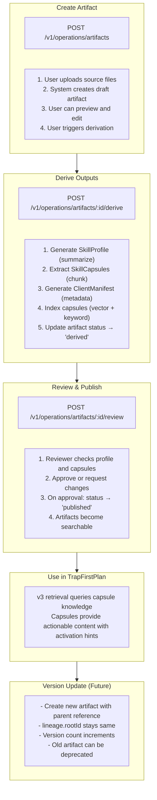
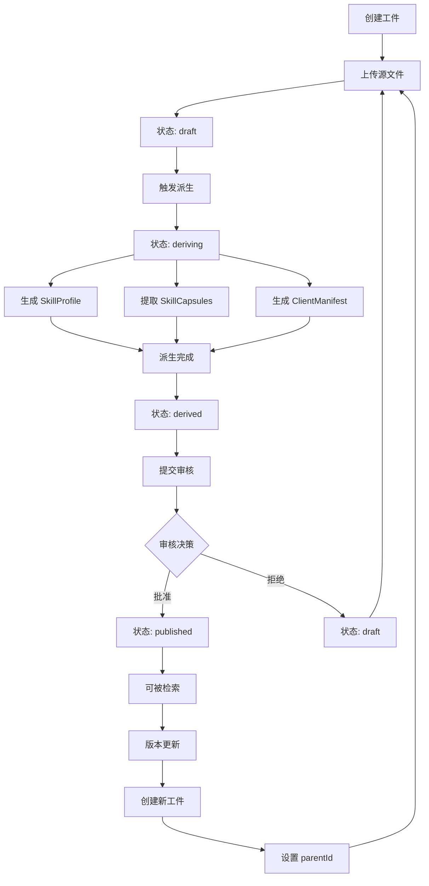
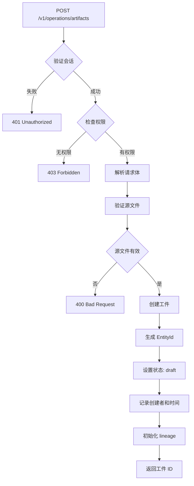
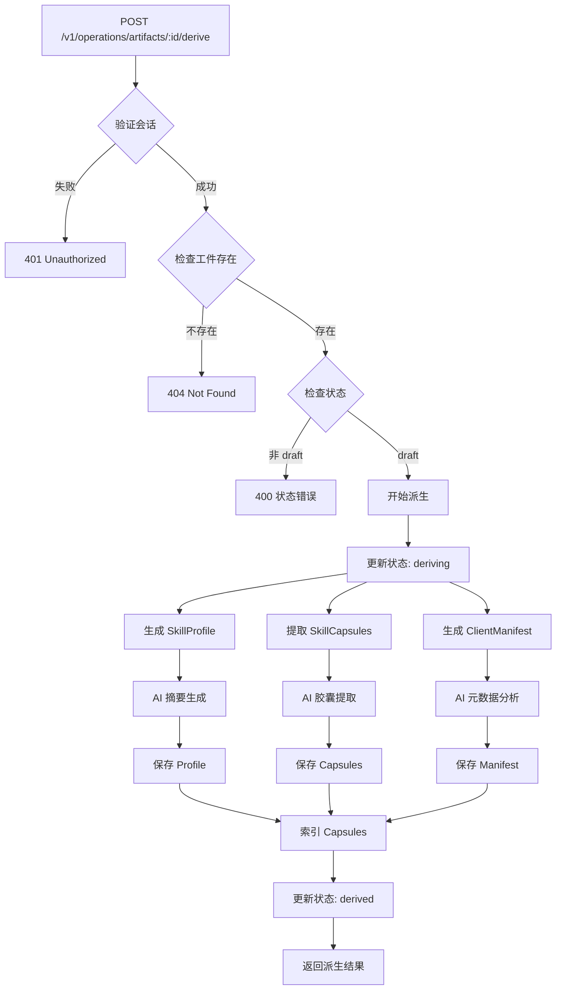
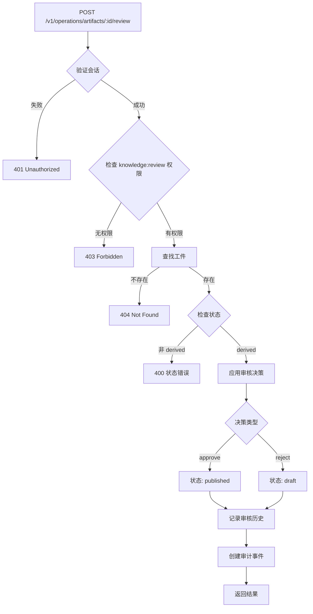
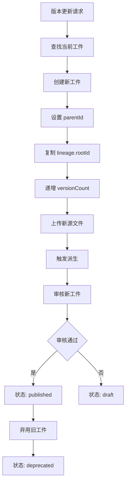

# 工件系统 (Artifact System)

## 概述

工件系统是 TrapMap 的技能管理组件，负责管理技能工件（SkillArtifact）及其派生产物：配置文件（SkillProfile）、胶囊（SkillCapsule）和客户端清单（ClientManifest）。

## 架构概览

```
┌─────────────────────────────────────────────────────────────────────────┐
│                    Artifact System Architecture                        │
├─────────────────────────────────────────────────────────────────────────┤
│                                                                         │
│  ┌─────────────────────────────────────────────────────────────────┐   │
│  │                    SkillArtifact                                  │   │
│  │  (Immutable revision with source files)                           │   │
│  │                                                                    │   │
│  │  sourceFiles: SourceFile[]  ──────────────────────────────┐       │   │
│  │  name, version, scope, level                    │                │   │
│  │                                                    │                │   │
│  │                                       ┌──────────▼──────────┐      │   │
│  │                                       │   Derivation       │      │   │
│  │                                       │   Process         │      │   │
│  │                                       └──────────┬──────────┘      │   │
│  │                                                  │                 │   │
│  │                    ┌────────────────────────────┼────────────────┐ │   │
│  │                    ▼                            ▼                ▼ │   │
│  │  ┌──────────────────┐  ┌─────────────────┐  ┌─────────────────┐ │   │
│  │  │  SkillProfile    │  │  SkillCapsule[] │  │ ClientManifest │ │   │
│  │  │  (Distilled text)│  │  (Actionable    │  │ (Metadata for  │ │   │
│  │  │  + Keywords     │  │   knowledge)     │  │  client use)    │ │   │
│  │  └──────────────────┘  └─────────────────┘  └─────────────────┘ │   │
│  │                                                                    │   │
│  └─────────────────────────────────────────────────────────────────┘   │
│                                                                         │
└─────────────────────────────────────────────────────────────────────────┘
```

---

## 核心概念

### SkillArtifact (技能工件)

技能的 immutable 版本，包含源文件：

```typescript
interface SkillArtifact {
  id: EntityId;
  name: string;
  version: string;  // Semantic version
  sourceFiles: SourceFile[];
  
  // Derived outputs (populated after derivation)
  profile?: SkillProfile;
  capsules?: SkillCapsule[];
  clientManifest?: ClientManifest;
  
  // Governance
  scope: 'global' | 'project' | 'team';
  requiredLevel: SecurityLevel;
  
  // Metadata
  createdAt: string;
  createdBy: ActorRef;
  lineage: ArtifactLineage;
  
  // Status
  status: 'draft' | 'derived' | 'published' | 'deprecated';
}

interface SourceFile {
  path: string;
  content: string;
  language?: string;
  size: number;
}

interface ArtifactLineage {
  parentId?: EntityId;      // Parent artifact (if version update)
  rootId: EntityId;          // Root artifact
  versionCount: number;      // Total versions
}
```

### SkillProfile (配置文件)

工件的压缩文本表示，用于快速摘要：

```typescript
interface SkillProfile {
  id: EntityId;
  artifactId: EntityId;
  distilledText: string;  // AI-generated summary
  keywords: string[];
  extractedAt: string;
}
```

### SkillCapsule (技能胶囊)

可操作的知识单元：

```typescript
interface SkillCapsule {
  id: EntityId;
  artifactId: EntityId;
  name: string;
  content: string;  // Distilled, actionable content
  
  // Activation hint (Phase 15)
  activationHint?: string;
  
  // Governance
  governanceInherited: boolean;
  
  // Indexing
  indexedAt?: string;
  embeddingVector?: number[];
}
```

### ClientManifest (客户端清单)

供客户端使用的元数据：

```typescript
interface ClientManifest {
  id: EntityId;
  artifactId: EntityId;
  metadata: {
    name: string;
    version: string;
    description: string;
    capabilities: string[];
    requirements: string[];
    inputs: ParameterDefinition[];
    outputs: ParameterDefinition[];
  };
  compatibility?: {
    minTrapMapVersion?: string;
    requiredScopes?: string[];
  };
}

interface ParameterDefinition {
  name: string;
  type: 'string' | 'number' | 'boolean' | 'object' | 'array';
  description: string;
  required: boolean;
  default?: unknown;
}
```

---

## 工作流程

### 工件生命周期流程



### Mermaid 流程图

#### 工件生命周期



#### 创建工件流程



#### 派生过程



#### 审核和发布流程



#### 版本更新



---

## API 端点

| 端点 | 方法 | 描述 | 权限 |
|------|------|------|------|
| `/v1/operations/artifacts` | POST | 创建工件 | knowledge:submit |
| `/v1/operations/artifacts/:id` | GET | 获取工件详情 | knowledge:search |
| `/v1/operations/artifacts/:id/derive` | POST | 触发派生 | knowledge:submit |
| `/v1/operations/artifacts/:id/review` | POST | 审核工件 | knowledge:review |
| `/v1/operations/artifacts/:id/history` | GET | 获取工件历史 | knowledge:search |
| `/v1/retrieval/skills/search-by-content` | POST | 搜索胶囊 | knowledge:search |

---

## 审计事件

工件系统产生的审计事件：

```typescript
type ArtifactAuditEvent =
  | { type: 'artifact.created'; actorId: EntityId; artifactId: EntityId }
  | { type: 'artifact.derived'; artifactId: EntityId }
  | { type: 'artifact.published'; actorId: EntityId; artifactId: EntityId }
  | { type: 'artifact.deprecated'; actorId: EntityId; artifactId: EntityId }
  | { type: 'artifact.reviewed'; actorId: EntityId; artifactId: EntityId; decision: string };
```

---

## 派生过程 (Derivation)

### 配置文件派生

```typescript
async function deriveProfile(
  artifact: SkillArtifact,
  ai: AIProvider
): Promise<SkillProfile> {
  // Combine all source files
  const combinedContent = artifact.sourceFiles
    .map(f => `// ${f.path}\n${f.content}`)
    .join('\n\n');
  
  // Generate summary using AI
  const response = await ai.chat([
    {
      role: 'system',
      content: `You are a skilled technical writer. Summarize the following code/skill 
      into a concise profile (2-3 paragraphs). Include:
      1. What it does
      2. Key capabilities
      3. Usage patterns
      
      Also extract 5-10 keywords that describe this skill.`
    },
    {
      role: 'user',
      content: combinedContent
    }
  ]);
  
  // Parse response to extract summary and keywords
  const { summary, keywords } = parseProfileResponse(response.content);
  
  return {
    id: generateEntityId(),
    artifactId: artifact.id,
    distilledText: summary,
    keywords,
    extractedAt: new Date().toISOString()
  };
}
```

### 胶囊提取

```typescript
async function extractCapsules(
  artifact: SkillArtifact,
  ai: AIProvider,
  options: { maxCapsules?: number; chunkSize?: number } = {}
): Promise<SkillCapsule[]> {
  const capsules: SkillCapsule[] = [];
  
  for (const sourceFile of artifact.sourceFiles) {
    // Split into logical chunks
    const chunks = splitIntoChunks(sourceFile.content, options.chunkSize || 2000);
    
    for (const chunk of chunks) {
      // Generate capsule content
      const response = await ai.chat([
        {
          role: 'system',
          content: `You are a technical documentation expert. Transform the following 
          code snippet into an actionable knowledge capsule.
          
          The capsule should:
          1. Have a clear, descriptive name
          2. Contain distilled, actionable content
          3. Include an activation hint (when to use this)
          
          Format as JSON: { "name": "...", "content": "...", "activationHint": "..." }`
        },
        {
          role: 'user',
          content: chunk.content
        }
      ]);
      
      const capsuleData = JSON.parse(response.content);
      
      capsules.push({
        id: generateEntityId(),
        artifactId: artifact.id,
        name: capsuleData.name,
        content: capsuleData.content,
        activationHint: capsuleData.activationHint,
        governanceInherited: true  // Inherits from artifact
      });
      
      // Respect max capsules limit
      if (options.maxCapsules && capsules.length >= options.maxCapsules) {
        return capsules;
      }
    }
  }
  
  return capsules;
}

function splitIntoChunks(content: string, maxSize: number): Array<{ content: string; metadata: object }> {
  const chunks: Array<{ content: string; metadata: object }> = [];
  
  // Simple split by lines (could be smarter based on language)
  const lines = content.split('\n');
  let currentChunk: string[] = [];
  let currentSize = 0;
  
  for (const line of lines) {
    if (currentSize + line.length > maxSize && currentChunk.length > 0) {
      chunks.push({
        content: currentChunk.join('\n'),
        metadata: { startLine: chunks.length * maxSize }
      });
      currentChunk = [];
      currentSize = 0;
    }
    currentChunk.push(line);
    currentSize += line.length;
  }
  
  if (currentChunk.length > 0) {
    chunks.push({
      content: currentChunk.join('\n'),
      metadata: { startLine: chunks.length * maxSize }
    });
  }
  
  return chunks;
}
```

### 清单生成

```typescript
async function generateManifest(
  artifact: SkillArtifact,
  ai: AIProvider
): Promise<ClientManifest> {
  const sourceContent = artifact.sourceFiles
    .map(f => f.content)
    .join('\n');
  
  const response = await ai.chat([
    {
      role: 'system',
      content: `Analyze the following code and generate a client manifest JSON.
      
      Extract:
      1. name, version, description
      2. capabilities (what it can do)
      3. requirements (what it needs)
      4. inputs (parameters)
      5. outputs (return values)
      
      Format as JSON matching this schema:
      {
        "name": string,
        "version": string,
        "description": string,
        "capabilities": string[],
        "requirements": string[],
        "inputs": [{ name, type, description, required, default }],
        "outputs": [{ name, type, description }]
      }`
    },
    {
      role: 'user',
      content: sourceContent
    }
  ]);
  
  const manifestData = JSON.parse(response.content);
  
  return {
    id: generateEntityId(),
    artifactId: artifact.id,
    metadata: {
      name: manifestData.name || artifact.name,
      version: manifestData.version || artifact.version,
      description: manifestData.description,
      capabilities: manifestData.capabilities || [],
      requirements: manifestData.requirements || [],
      inputs: manifestData.inputs || [],
      outputs: manifestData.outputs || []
    }
  };
}
```

---

## 治理继承

派生产物自动继承治理属性：

```typescript
interface GovernanceInheritance {
  scope: artifact.scope;
  requiredLevel: artifact.requiredLevel;
}

function inheritGovernance(
  artifact: SkillArtifact
): GovernanceInheritance {
  return {
    scope: artifact.scope,
    requiredLevel: artifact.requiredLevel
  };
}

// Applied during extraction
const capsule: SkillCapsule = {
  // ...
  governanceInherited: true,
  // Actual governance comes from parent artifact
  // No separate requiredLevel - derived from artifact
};
```

---

## API 端点

### 创建工件

```bash
POST /v1/operations/artifacts
Content-Type: multipart/form-data

# Or JSON:
{
  "name": "OAuth2 Implementation",
  "version": "1.0.0",
  "sourceFiles": [
    { "path": "src/auth.ts", "content": "..." }
  ],
  "scope": "global",
  "requiredLevel": 2
}
```

### 派生

```bash
POST /v1/operations/artifacts/:artifactId/derive
{
  "outputs": ["profile", "capsules", "manifest"],
  "options": {
    "maxCapsules": 10,
    "chunkSize": 2000
  }
}
```

### 获取详情

```bash
GET /v1/operations/artifacts/:artifactId
GET /v1/operations/artifacts/:artifactId/history
```

### 审核

```bash
POST /v1/operations/artifacts/:artifactId/review
{
  "decision": "approved" | "rejected",
  "notes": "..."
}
```

### 搜索胶囊

```bash
POST /v1/retrieval/skills/search-by-content
{
  "query": "authentication setup",
  "limit": 5
}
```

---

## 胶囊检索

胶囊通过 v2 检索系统被使用：

```typescript
interface CapsuleSearchResult {
  capsuleId: EntityId;
  artifactId: EntityId;
  artifactName: string;
  name: string;
  content: string;
  activationHint?: string;
  score: number;
}

// v2 capsule retrieval response
interface CapsuleRetrievalResponse {
  query: string;
  mode: 'capsule-native';
  capsules: CapsuleSearchResult[];
  trace: {
    provider: string;
    confidence: number;
  };
}
```

---

## 存储

### PostgreSQL Schema

```typescript
// Artifacts table
export const artifacts = pgTable('skill_artifacts', {
  id: uuid('id').primaryKey(),
  name: text('name').notNull(),
  version: text('version').notNull(),
  sourceFiles: jsonb('source_files').notNull(),
  
  // Derived outputs
  profileId: uuid('profile_id').references(() => profiles.id),
  capsules: jsonb('capsules').default([]),
  manifestId: uuid('manifest_id').references(() => manifests.id),
  
  // Governance
  scope: text('scope').notNull(),
  requiredLevel: integer('required_level').notNull(),
  
  // Metadata
  createdAt: timestamp('created_at').notNull(),
  createdBy: jsonb('created_by').notNull(),
  lineage: jsonb('lineage').notNull(),
  
  // Status
  status: text('status').notNull().default('draft')
});

export const profiles = pgTable('skill_profiles', {
  id: uuid('id').primaryKey(),
  artifactId: uuid('artifact_id').references(() => artifacts.id),
  distilledText: text('distilled_text').notNull(),
  keywords: text('keywords').array().notNull(),
  extractedAt: timestamp('extracted_at').notNull()
});

export const capsuleVectors = pgTable('capsule_vectors', {
  capsuleId: uuid('capsule_id').primaryKey(),
  artifactId: uuid('artifact_id').references(() => artifacts.id),
  embeddingVector: vector('embedding_vector', { dimensions: 1536 }).notNull(),
  indexedAt: timestamp('indexed_at').notNull()
});

export const manifests = pgTable('client_manifests', {
  id: uuid('id').primaryKey(),
  artifactId: uuid('artifact_id').references(() => artifacts.id),
  metadata: jsonb('metadata').notNull(),
  compatibility: jsonb('compatibility')
});
```
