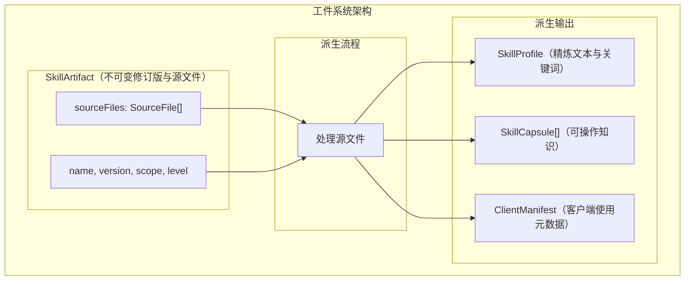
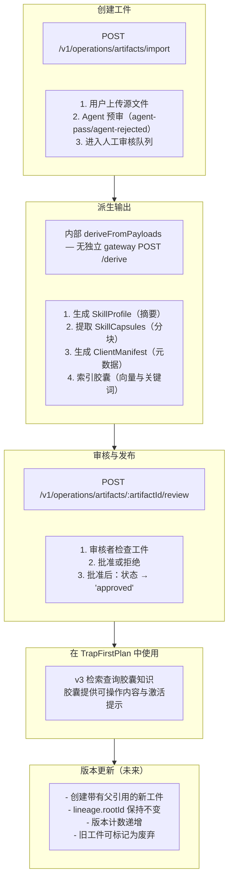
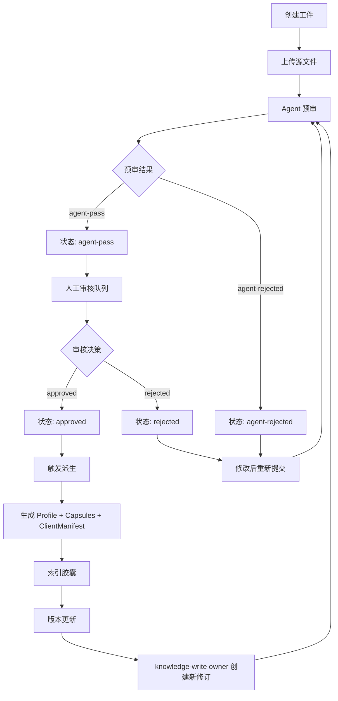
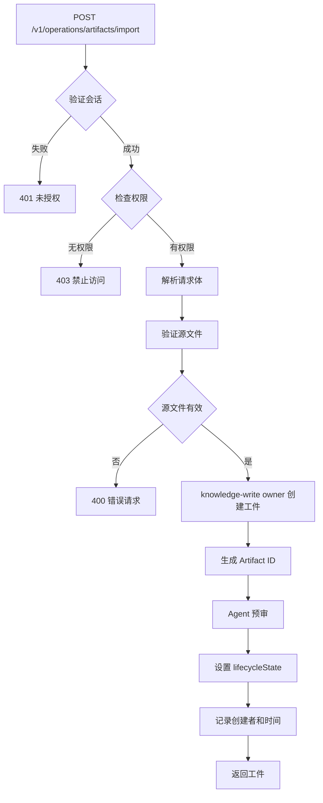
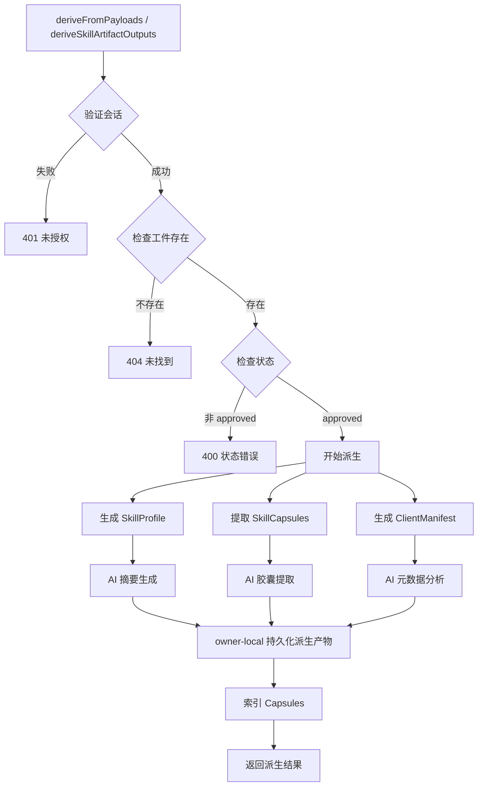
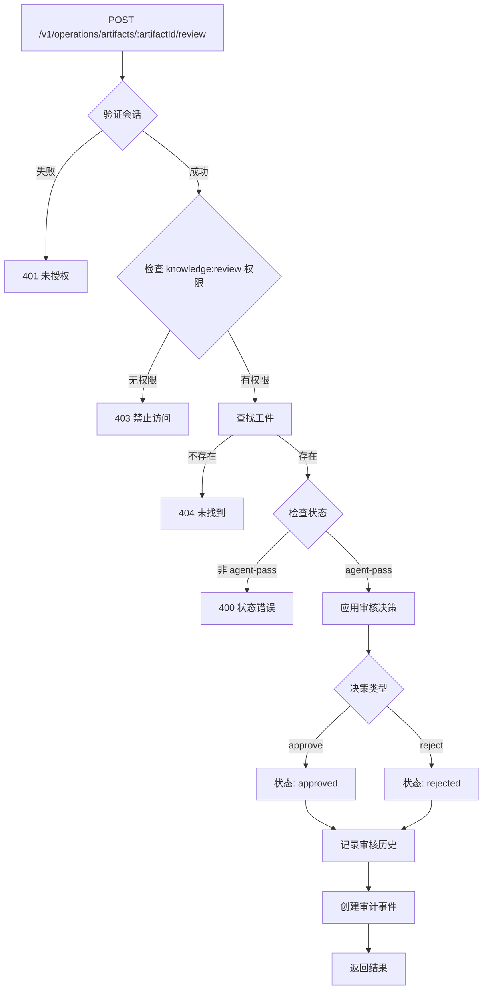
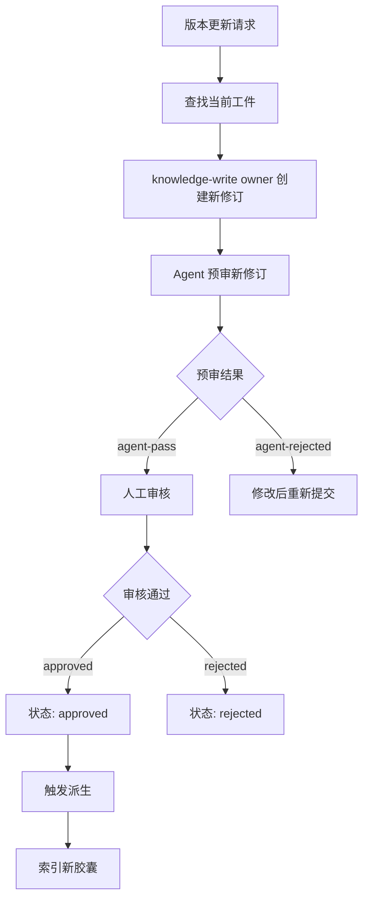

# 工件系统 (Artifact System)

> **历史说明**：`packages/server（Wave-10 已删除）` 已于 Wave-10 删除（提交 `a66d94e6`）。本文档中的 `packages/server（Wave-10 已删除）` 路径指向已删除的实现，概念描述仍然适用但路径已不存在。详见 `docs/archived/archived-plans/compatibility-shell-retirement-runtime-infra-ownership.md`。

## 概述

工件系统是 TrapMap 的技能管理组件，负责管理技能工件（SkillArtifact）及其派生产物：配置文件（SkillProfile）、胶囊（SkillCapsule）和客户端清单（ClientManifest）。

## 架构概览



---

## 核心概念

### SkillArtifact (技能工件)

技能的不可变修订版本聚合，包含源文件元数据和派生产物。使用修订历史（`history`）管理版本，而非单一 `version` 字段：

```typescript
// 实际定义见 store/types 中的 SkillArtifactRecord
interface SkillArtifactRecord {
  id: string;
  teamId: string | null;
  scope: 'global' | 'project';
  labels: string[];
  title: string;
  slug: string;
  requiredLevel: number;
  lifecycleState: LifecycleState;  // 复用知识条目的生命周期状态枚举
  ownerUserId: string;
  latestRevision: SkillArtifactRevisionRecord;
  history: SkillArtifactRevisionRecord[];  // 所有修订版本
  metadata: SkillArtifactMetadataRecord;
  agentReview: AgentReviewRecord;
  reviewHistory: SkillArtifactReviewDecisionRecord[];
  reviewNotes: SkillArtifactReviewNoteRecord[];
  lifecycleHistory: SkillArtifactLifecycleEventRecord[];
  decayMeta: unknown | null;
  evidenceMeta: unknown | null;
  maintenanceMeta: unknown | null;
  boundary: unknown | null;
  createdAt: string;
  updatedAt: string;
}

// 修订版本记录（包含派生产物）
interface SkillArtifactRevisionRecord {
  revision: number;
  sourceHash: string;
  files: Array<{
    path: string;
    kind: 'skill-markdown' | 'reference' | 'asset' | 'script';
    sha256: string;
    sizeBytes: number;
    mediaType: string;
    source: string;
    includeInDerivation: boolean;
    activationOnly: boolean;
  }>;
  submittedAt: string;
  submittedByUserId: string;
  scriptDescriptors: ScriptDescriptor[];
  derived: {
    profile: DerivedProfile | null;
    capsules: DerivedCapsule[];
    clientManifest: DerivedClientManifest | null;
    sourceHash: string;
    derivedAt: string;
  } | null;
}
```

### SkillProfile (配置文件)

工件的压缩文本表示，用于快速摘要。派生时存储在修订版本的 `derived.profile` 字段中：

```typescript
// 实际类型见 store/types/artifact-records.ts
interface DerivedSkillProfileRecord {
  artifactId: string;
  revision: number;
  sourceHash: string;
  title: string;
  description?: string;
  summary: string;
  keywords: string[];
  labels?: string[];
  prerequisites?: string[];
  referencePaths: string[];
  contentHash: string;
}
```

### SkillCapsule (技能胶囊)

可操作的知识单元。派生时存储在修订版本的 `derived.capsules` 数组中：

```typescript
// 实际类型见 store/types/artifact-records.ts
interface DerivedSkillCapsuleRecord {
  capsuleId: string;
  artifactId: string;
  revision: number;
  sourcePaths: string[];
  content: string;           // 精炼的可操作内容
  situation: string;         // 场景描述
  problem: string;           // 问题描述
  goal: string;              // 目标描述
  errorText: string | null;  // 错误文本
  contextualPrefix?: string; // 上下文丰富前缀（Phase B）
  labels: string[];
  scope: 'global' | 'project';
  requiredLevel: number;
}
```

### ClientManifest (客户端清单)

供客户端使用的激活元数据。派生时存储在修订版本的 `derived.clientManifest` 字段中：

```typescript
// 实际类型见 store/types/artifact-records.ts
interface ClientManifestRecord {
  artifactId: string;
  revision: number;
  references: ClientManifestReferenceRecord[];
  assets: ClientManifestAssetRecord[];
  scripts: ClientManifestScriptRecord[];
  sourceHash: string;
}

interface ClientManifestReferenceRecord {
  path: string;
  sha256: string;
  sizeBytes: number;
  mediaType: string;
}

interface ClientManifestAssetRecord {
  path: string;
  sha256: string;
  sizeBytes: number;
  mediaType: string;
}

interface ClientManifestScriptRecord {
  path: string;
  sha256: string;
  capability: string;
  argsSchemaSummary: string;
  sideEffectSummary: string;
  defaultPolicy: StoredScriptActivationPolicy;
}
```

---

## 工作流程

### 工件生命周期流程



### Mermaid 流程图

#### 工件生命周期



#### 创建工件流程



#### 派生过程（内部 derive，无独立 gateway 端点）



#### 审核和发布流程



#### 版本更新



---

## API 端点

| 端点 | 方法 | 描述 | 权限 |
|------|------|------|------|
| `/v1/operations/artifacts/review-queue` | GET | 查看审核队列 | knowledge:review |
| `/v1/operations/artifacts/:artifactId/review` | POST | 审核工件 | knowledge:review |
| `/v1/operations/artifacts/:artifactId/edit` | POST | 编辑工件 | knowledge:submit |
| `/v1/operations/artifacts/:artifactId/history` | GET | 获取工件历史 | knowledge:search |
| `/v1/operations/artifacts/activate` | POST | 激活工件 | knowledge:export |
| `/v1/operations/artifacts/:artifactId/deactivate` | POST | 停用工件 | knowledge:update |
| `/v1/operations/artifacts/export` | POST | 导出工件 | knowledge:export |
| `/v1/operations/artifacts/import` | POST | 导入工件 | knowledge:import |
| `/v1/retrieval/skills/search-by-content` | POST | 按内容搜索技能 | knowledge:search |

---

## 审计事件

工件系统产生的审计事件：

```typescript
type ArtifactAuditEvent =
  | { type: 'artifact.created'; actorId: EntityId; artifactId: EntityId }
  | { type: 'artifact.derived'; artifactId: EntityId }
  | { type: 'artifact.published'; actorId: EntityId; artifactId: EntityId }
  | { type: 'artifact.deprecated'; actorId: EntityId; artifactId: EntityId }
  | { type: 'artifact.reviewed'; actorId: EntityId; artifactId: EntityId; decision: string };
```

---

## 派生过程 (Derivation)

### 派生 helpers

兼容 shell 只保留无状态派生 helpers，不保留 artifact 写入或统一的 derive-and-apply seam：

- `deriveSkillArtifactOutputs()`：从 legacy revision 元数据确定性地生成 client manifest；它不读取文件正文。
- `deriveFromPayloads()`：从 owner 提供的文件 payload 生成检索级 profile、capsules 与 client manifest，可选地使用 AI 上下文丰富。

写入、审核和生命周期更新由 `service-knowledge-write` 的 owner-local PostgreSQL ports 负责；读取投影由 `ArtifactReadProjection` 提供。派生 helper 不承诺所有 approved artifact 均已有 derived 输出，读取方必须将缺失或空 capsules 视为可恢复的派生状态。

### 底层派生函数

兼容 shell 保留两个可独立调用的派生实现：

1. **`deriveSkillArtifactOutputs()`**：从修订版本记录派生（纯确定性，无 AI 调用）
2. **`deriveFromPayloads()`**：从实际文件内容派生（支持可选 AI 上下文丰富）

```typescript
// artifacts/derive.ts
function deriveSkillArtifactOutputs(
  artifact: SkillArtifactRecord,
  revision: SkillArtifactRevisionRecord,
): DerivedArtifactOutputs {
  // 1. 从 derivation-eligible 文件（SKILL.md + references/）计算 sourceHash
  // 2. buildSkillProfile() — 从标签和文件元数据构建摘要
  // 3. buildSkillCapsules() — 生成知识胶囊（继承治理属性）
  // 4. buildClientManifest() — 组装 references/assets/scripts 元数据
  return { profile, capsules, clientManifest, sourceHash, derivedAt };
}
```

### 配置文件派生

```typescript
// artifacts/derive.ts — buildSkillProfile()（内部函数）
function buildSkillProfile(
  artifact: SkillArtifactRecord,
  revision: SkillArtifactRevisionRecord,
  sourceHash: string,
): DerivedSkillProfileRecord | null {
  // 仅处理 SKILL.md + references/ 文件（T-12-09, T-12-10）
  // 从 artifact.labels 提取关键词
  // 从文件路径提取 referencePaths
  // 使用文件 sha256 的组合哈希作为 contentHash
  return { artifactId, revision, sourceHash, title, summary, keywords, labels, prerequisites, referencePaths, contentHash };
}
```

### 胶囊提取

```typescript
// artifacts/derive.ts — buildSkillCapsules()（内部函数）
function buildSkillCapsules(
  artifact: SkillArtifactRecord,
  revision: SkillArtifactRevisionRecord,
  sourceHash: string,
): DerivedSkillCapsuleRecord[] {
  // 仅处理 SKILL.md + references/ 文件（T-12-09, T-12-10）
  // 胶囊继承 artifact 的 scope 和 requiredLevel（T-12-11）
  // 使用确定性 capsuleId（基于 artifactId:revision:sourceHash:index）
  return [{ capsuleId, artifactId, revision, sourcePaths, content, situation, problem, goal, errorText, labels, scope, requiredLevel }];
}
```

### 清单生成

```typescript
// artifacts/derive.ts — buildClientManifest()（内部函数）
function buildClientManifest(
  artifact: SkillArtifactRecord,
  revision: SkillArtifactRevisionRecord,
  sourceHash: string,
): ClientManifestRecord | null {
  // 从 references/, assets/, scripts/ 文件构建元数据
  // scripts 使用 revision.scriptDescriptors（T-12-10: 仅元数据，无内容）
  return { artifactId, revision, references, assets, scripts, sourceHash };
}
```

### 检索级派生（Phase 14）

`deriveFromPayloads()` 从实际文件内容派生，支持可选的 AI 上下文丰富：

```typescript
// artifacts/derive.ts
async function deriveFromPayloads(
  payloads: ArtifactFilePayloadRecord[],
  context: PayloadDerivationContext,  // 包含可选 chat?: ChatProvider
): Promise<DerivedArtifactOutputs> {
  // 1. 解析 SKILL.md frontmatter（标题、标签）
  // 2. 提取 Situation/Problem/Goal 章节
  // 3. 构建摘要和关键词
  // 4. 可选：调用 enrichCapsules() 生成 contextualPrefix
  return { profile, capsules, clientManifest, sourceHash, derivedAt };
}
```

### 上下文丰富 (Contextual Enrichment)

基于 Anthropic Contextual Retrieval 策略，为每个 Capsule 生成上下文前缀（`contextualPrefix`），显著提升检索效果。

**模块**: `packages/server（Wave-10 已删除）/src/lib/artifacts/contextual-enrichment.ts`

**两阶段处理流程**：

1. **阶段 1 — 生成 Capsule 清单**: 将完整文档发送给 LLM，输出结构化 JSON 清单（`CapsuleManifest`），描述每个 Capsule 的标题、描述、来源和标签。超过 8000 字符的文档会自动截断以减少 token 消耗。
2. **阶段 2 — 并发生成上下文前缀**: 为清单中每个 Capsule 生成 ≤300 字符的上下文前缀。使用 prompt cache 优化（文档内容在前部共享），并发处理。单次 LLM 调用失败时自动重试（指数退避，最多 2 次重试）。

```typescript
// 阶段 1: 生成清单
const manifest = await generateCapsuleManifest(chat, documentTitle, labels, documentContent);
// manifest: { documentTitle, documentLabels, capsules: CapsuleManifestItem[] }

// 阶段 2: 并发生成前缀（带重试）
const results = await generateCapsuleContents(chat, documentTitle, labels, documentContent, manifest.capsules);
// results: { capsuleIndex, contextualPrefix }[]

// Fallback（LLM 不可用时）
const prefix = buildFallbackPrefix(documentTitle, sourceType, sourcePath);
```

**关键类型**:

```typescript
interface CapsuleManifestItem {
  capsuleIndex: number;
  title: string;
  description: string;
  contentScope: string;
  sourceType: 'skill-main' | 'reference';
  sourcePath: string;
  tags: string[];
}

// 性能监控指标
interface EnrichmentMetrics {
  totalCapsules: number;       // 处理的 Capsule 总数
  llmSuccessCount: number;     // LLM 成功生成的数量
  cacheHitCount: number;       // 缓存命中的数量
  fallbackCount: number;       // 使用 fallback 的数量
  manifestGenerated: boolean;  // 清单是否成功生成
  durationMs: number;          // 总耗时（毫秒）
}
```

**派生流程集成**: `deriveFromPayloads()` 接受可选的 `chat?: ChatProvider` 参数。传入时，生成 Capsule 后自动调用 `enrichCapsules()` 添加 `contextualPrefix`。未传入时保持向后兼容（无 `contextualPrefix`）。支持 `ContextualEnrichmentCache` 缓存 LLM 结果。

**Feature Flag (D-4)**: `enrichmentEnabled` 选项提供显式开关控制。设为 `false` 时完全跳过 LLM 调用，Capsule 保持无 `contextualPrefix` 状态。默认行为：有 `chat` 参数时启用。

---

派生产物自动继承治理属性：

```typescript
// 治理继承在 deriveSkillArtifactOutputs() 中实现
// 每个派生 Capsule 继承 artifact 的 scope 和 requiredLevel
const capsule: DerivedSkillCapsuleRecord = {
  // ...
  scope: artifact.scope,
  requiredLevel: artifact.requiredLevel,
};
```

---

## API 端点详情

### 编辑工件

```bash
POST /v1/operations/artifacts/:artifactId/edit
```

### 获取历史

```bash
GET /v1/operations/artifacts/:artifactId/history
```

### 审核

```bash
POST /v1/operations/artifacts/:artifactId/review
{
  "decision": "approved" | "rejected",
  "notes": "..."
}
```

### 搜索胶囊

```bash
POST /v1/retrieval/skills/search-by-content
{
  "text": "authentication setup",
  "maxResults": 5
}
```

---

## 胶囊检索

胶囊通过 v2 检索系统被使用：

```typescript
interface CapsuleSearchResult {
  capsuleId: EntityId;
  artifactId: EntityId;
  artifactName: string;
  name: string;
  content: string;
  activationHint?: string;
  score: number;
}

// v2 capsule retrieval response
interface CapsuleRetrievalResponse {
  query: string;
  mode: 'capsule-native';
  capsules: CapsuleSearchResult[];
  trace: {
    provider: string;
    confidence: number;
  };
}
```

---

## 存储

## Experience Gene 派生资产

Experience Gene 是 trap 与 skill artifact/capsule 的派生控制资产，不是新的编辑真相源。Gene 只能由 approved、未被 remediation 抑制的 source revision/unit 派生；`solidified` 后进入独立检索投影，truth source 修订、下线或治理收紧时通过 immutable `staled` event 失效。

- **Owner**：knowledge-write 拥有 derivation、lifecycle events 和 PostgreSQL aggregate；knowledge-read 只消费 ready projections。
- **Lineage**：aggregate 保存 source kind/id/revision/hash、derivation unit、generator/prompt version；append-only events 回答 validation、rejection、solidification、stale/deprecated 状态变化。
- **Retrieval projection**：keyword tsvector 与 pgvector embedding 均是可重建派生表；search 结果只暴露 public Gene fields，不暴露 prompt、validator internals、index error 或 raw source body。
- **Activation**：`POST /v1/retrieval/genes/search` 返回一条 primary Gene 和最多三条 distinct-source avoid warnings。CLI 渲染 `<strategy-gene>`；MCP 返回 structured response。

### PostgreSQL 表

工件通过 `PgArtifactRepository`（`artifacts/pg-repository/index.ts`）持久化到 PostgreSQL，使用原始 SQL 查询（非 Drizzle ORM）。主要表：

| 表名 | 用途 |
|------|------|
| `skill_artifacts` | 工件主表（id, team_id, scope, labels, title, slug, required_level, lifecycle_state, owner_user_id, latest_revision, metadata, agent_review, review_history, review_notes, lifecycle_history, decay_meta, evidence_meta, maintenance_meta, boundary, created_at, updated_at） |
| `skill_artifact_revisions` | 修订版本表（revision, source_hash, files, submitted_at, submitted_by_user_id, script_descriptors, derived） |
| `skill_artifact_maintenance_assignments` | 维护分配表 |

### 仓库接口

```typescript
// artifacts/repository.ts
interface ArtifactRepository {
  nextId(): Promise<string>;
  insert(artifact: SkillArtifactRecord): Promise<void>;
  getById(artifactId: string): Promise<SkillArtifactRecord | null>;
  updateLifecycle(artifactId: string, newState: LifecycleState, context): Promise<void>;
  appendRevision(artifactId: string, revision: SkillArtifactRevisionRecord): Promise<void>;
  updateRevisionDerived(artifactId: string, revision: number, derived): Promise<void>;
  appendLifecycleEvent(artifactId: string, event): Promise<void>;
  listByFilter(filter): Promise<SkillArtifactRecord[]>;
  updateGovernance(artifactId: string, governance): Promise<void>;
}
```

工厂函数 `createArtifactRepository()` 按是否有 PG pool 选择 `PgArtifactRepository` 或 `InMemoryArtifactRepository`。
