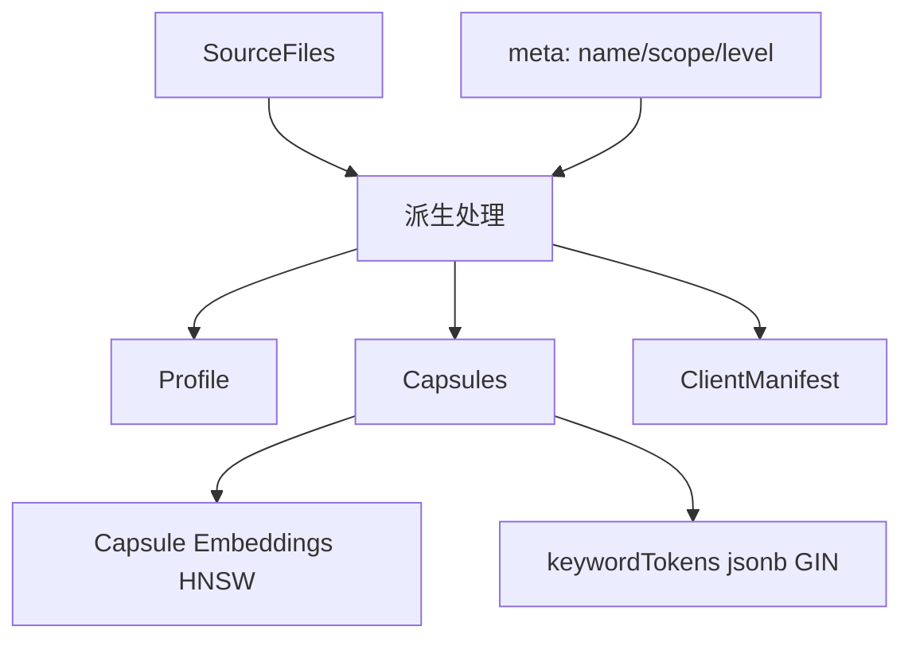

# 工件系统

> 真源：`packages/service-knowledge-write/src/artifact-derivation/` 与 `packages/db/src/schema/artifacts.ts`；契约见 `packages/contracts/src/domain/artifacts.ts`。

## 概述

工件系统管理 Skill 工件（`SkillArtifact`）及其派生产物：配置（`SkillProfile`）、胶囊（`SkillCapsule`）、客户端清单（`ClientManifest`）与修订历史。

## 模型

```
SkillArtifact (聚合根: id, teamId, scope, labels, title, slug, lifecycleState, owner, history)
 ├─ artifact_revisions (history: SourceFile[] + derived 缓存)
 ├─ skill_artifact_files + skill_artifact_script_descriptors (结构化事实源)
 ├─ skill_artifact_profiles / capsules / capsule_embeddings / client_manifests / manifest_items (派生事实源)
 └─ skill_artifact_agent_reviews / artifact_lifecycle_events (治理事实源)
```

`skill_artifacts` / `artifact_revisions` 上的 JSONB 为兼容缓存，结构化子表为事实源（详见 `docs/plans/round4-cross-table-consistency-plan.md`）。



## 派生管线

1. **入库**：候选经 `candidate-ingestion` 入队，去重/审核后进入 `knowledge-write`。
2. **派生**：`artifact-derivation` 从修订的 `SourceFile` 生成 `Profile / Capsules / Manifest`。
3. **索引**：capsule → `keywordTokens` + `embedding` 幂等 upsert（`capsuleId + contentHash`）；`verifyCapsuleIndexHealth` 对账。
4. **治理**：lifecycle 变更写 `artifact_lifecycle_events`；agent review 写 `skill_artifact_agent_reviews`。

## 生命周期

`draft → pending_review → approved → active → deprecated` 等状态在 `artifact_lifecycle_events` 中审计；`latestRevision` 指向当前生效修订，`history` 保留全量。

## 检索关联

- 胶囊经 `capsule_embeddings` (HNSW) 与 `capsules.keywordTokens` (GIN) 暴露给 `service-knowledge-read` 的 v2 通道。
- 上下文丰富（`contextualPrefix`）在派生阶段由 LLM 生成，参与 v2 评分的第五维度。
- **Experience Gene 派生（灵感：*From Procedural Skills to Strategy Genes* https://arxiv.org/html/2604.15097v2 ）**：`SkillArtifact`（按 bounded 16k derivation unit）与 `SkillCapsule`（单 capsule / unit）连同 `Trap` 一并作为 `ExperienceGene` 的三大真相源（`kind: trap | skill-artifact | skill-capsule`），经 `rule / LLM(experience-gene-llm-v1) / hybrid` 抽取为 `g=(m,u,π,α,c,v) → signalsMatch/summary/strategy/avoid/constraints/validation` 的紧凑控制块，`gene-native` 检索独立于 capsule 池（`POST /v1/retrieval/genes/search`），渲染为 `<strategy-gene>`。详见 `docs/archived/archived-plans/experience-gene-program-mainline-archived.md` 与 `packages/contracts/src/domain/experience-gene.ts`。

## 导入导出

- `POST /v1/operations/artifacts/import`、`/export`、`/activate` 经 `host-*/gateway` 的 artifact route_defs 暴露，由 `service-knowledge-write` 处理。
- 客户端激活时下发 `ClientManifest` 与清单条目（`skill_artifact_manifest_items` 三合一：references/assets/scripts）。

## 契约

- Zod：`skillArtifactSchema` / `SkillArtifact` 在 `packages/contracts/src/domain/artifacts.ts`。
- 42 表中的 11 张工件表定义见 [DATABASE_SCHEMA.md](../../reference/DATABASE_SCHEMA.md)。
