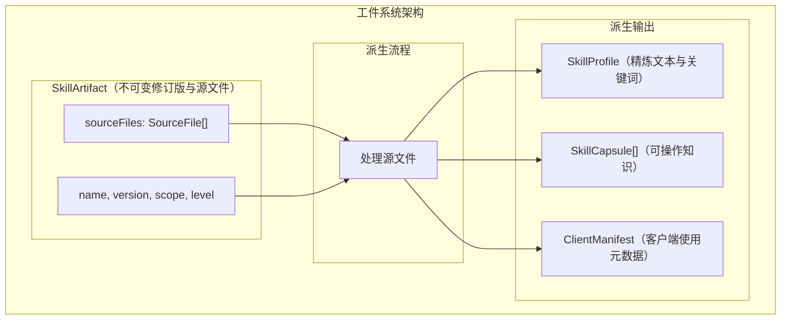
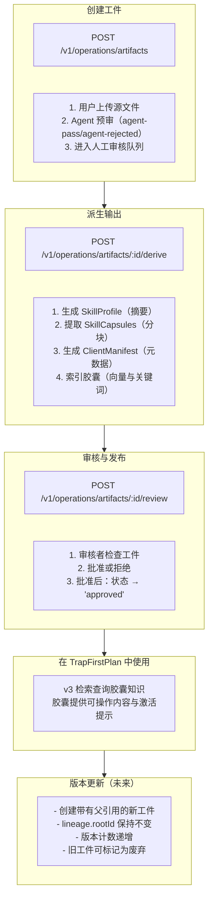
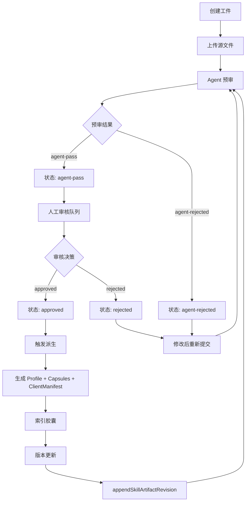
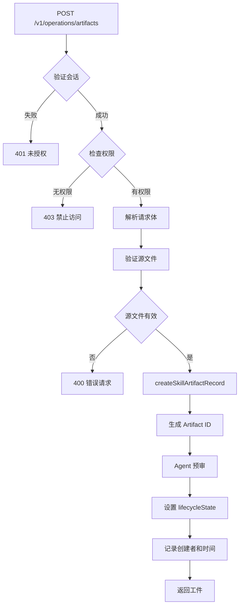
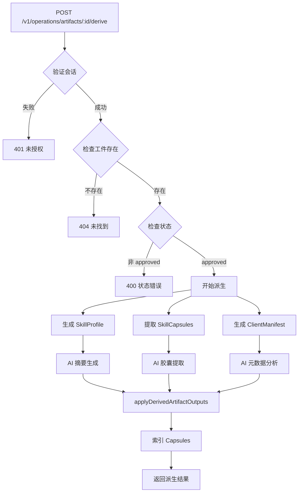
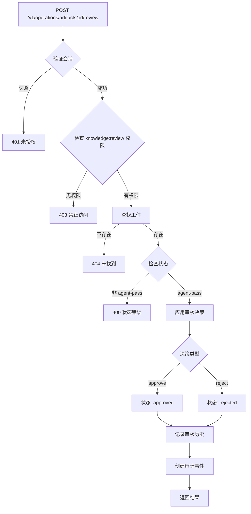
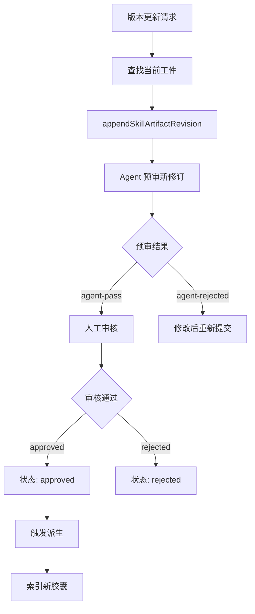

# 工件系统 (Artifact System)

## 概述

工件系统是 TrapMap 的技能管理组件，负责管理技能工件（SkillArtifact）及其派生产物：配置文件（SkillProfile）、胶囊（SkillCapsule）和客户端清单（ClientManifest）。

## 架构概览



---

## 核心概念

### SkillArtifact (技能工件)

技能的不可变修订版本聚合，包含源文件元数据和派生产物。使用修订历史（`history`）管理版本，而非单一 `version` 字段：

```typescript
// 实际定义见 store/types 中的 SkillArtifactRecord
interface SkillArtifactRecord {
  id: string;
  teamId: string | null;
  scope: 'global' | 'project';
  labels: string[];
  title: string;
  slug: string;
  requiredLevel: number;
  lifecycleState: LifecycleState;  // 复用知识条目的生命周期状态枚举
  ownerUserId: string;
  latestRevision: SkillArtifactRevisionRecord;
  history: SkillArtifactRevisionRecord[];  // 所有修订版本
  metadata: SkillArtifactMetadataRecord;
  agentReview: AgentReviewRecord;
  reviewHistory: SkillArtifactReviewDecisionRecord[];
  reviewNotes: SkillArtifactReviewNoteRecord[];
  lifecycleHistory: SkillArtifactLifecycleEventRecord[];
  decayMeta: unknown | null;
  evidenceMeta: unknown | null;
  maintenanceMeta: unknown | null;
  boundary: unknown | null;
  createdAt: string;
  updatedAt: string;
}

// 修订版本记录（包含派生产物）
interface SkillArtifactRevisionRecord {
  revision: number;
  sourceHash: string;
  files: Array<{
    path: string;
    kind: 'skill-markdown' | 'reference' | 'asset' | 'script';
    sha256: string;
    sizeBytes: number;
    mediaType: string;
    source: string;
    includeInDerivation: boolean;
    activationOnly: boolean;
  }>;
  submittedAt: string;
  submittedByUserId: string;
  scriptDescriptors: ScriptDescriptor[];
  derived: {
    profile: DerivedProfile | null;
    capsules: DerivedCapsule[];
    clientManifest: DerivedClientManifest | null;
    sourceHash: string;
    derivedAt: string;
  } | null;
}
```

### SkillProfile (配置文件)

工件的压缩文本表示，用于快速摘要。派生时存储在修订版本的 `derived.profile` 字段中：

```typescript
// 实际类型见 store 中的 DerivedSkillProfileRecord
interface DerivedSkillProfileRecord {
  artifactId: string;
  revision: number;
  sourceHash: string;
  title: string;
  summary: string;
  keywords: string[];
  referencePaths: string[];
  contentHash: string;
}
```

### SkillCapsule (技能胶囊)

可操作的知识单元。派生时存储在修订版本的 `derived.capsules` 数组中：

```typescript
// 实际类型见 store 中的 DerivedSkillCapsuleRecord
interface DerivedSkillCapsuleRecord {
  capsuleId: string;
  artifactId: string;
  revision: number;
  sourcePaths: string[];
  content: string;           // 精炼的可操作内容
  situation: string;         // 场景描述
  problem: string;           // 问题描述
  goal: string;              // 目标描述
  errorText: string | null;  // 错误文本
  labels: string[];
  scope: 'global' | 'project';
  requiredLevel: number;
}
```

### ClientManifest (客户端清单)

供客户端使用的激活元数据。派生时存储在修订版本的 `derived.clientManifest` 字段中：

```typescript
// 实际类型见 store 中的 ClientManifestRecord
interface ClientManifestRecord {
  artifactId: string;
  revision: number;
  references: Array<{
    path: string;
    sha256: string;
    sizeBytes: number;
    mediaType: string;
  }>;
  assets: Array<{
    path: string;
    sha256: string;
    sizeBytes: number;
    mediaType: string;
  }>;
  scripts: Array<{
    path: string;
    sha256: string;
    capability: string;
    argsSchemaSummary: string;
    sideEffectSummary: string;
    defaultPolicy: StoredScriptActivationPolicy;
  }>;
  sourceHash: string;
}
```

---

## 工作流程

### 工件生命周期流程



### Mermaid 流程图

#### 工件生命周期



#### 创建工件流程



#### 派生过程



#### 审核和发布流程



#### 版本更新



---

## API 端点

| 端点 | 方法 | 描述 | 权限 |
|------|------|------|------|
| `/v1/operations/artifacts/review-queue` | GET | 查看审核队列 | knowledge:review |
| `/v1/operations/artifacts/:artifactId/review` | POST | 审核工件 | knowledge:review |
| `/v1/operations/artifacts/:artifactId/edit` | POST | 编辑工件 | knowledge:submit |
| `/v1/operations/artifacts/:artifactId/history` | GET | 获取工件历史 | knowledge:search |
| `/v1/operations/artifacts/activate` | POST | 激活工件 | knowledge:export |
| `/v1/operations/artifacts/:artifactId/deactivate` | POST | 停用工件 | knowledge:update |
| `/v1/operations/artifacts/export` | POST | 导出工件 | knowledge:export |
| `/v1/operations/artifacts/import` | POST | 导入工件 | knowledge:import |
| `/v1/retrieval/skills/search-by-content` | POST | 搜索胶囊 | knowledge:search |

---

## 审计事件

工件系统产生的审计事件：

```typescript
type ArtifactAuditEvent =
  | { type: 'artifact.created'; actorId: EntityId; artifactId: EntityId }
  | { type: 'artifact.derived'; artifactId: EntityId }
  | { type: 'artifact.published'; actorId: EntityId; artifactId: EntityId }
  | { type: 'artifact.deprecated'; actorId: EntityId; artifactId: EntityId }
  | { type: 'artifact.reviewed'; actorId: EntityId; artifactId: EntityId; decision: string };
```

---

## 派生过程 (Derivation)

### 配置文件派生

```typescript
// artifacts/derive.ts — buildSkillProfile()
// 实际函数名为 buildSkillProfile，此处为概念性伪代码
async function buildSkillProfile(
  artifact: SkillArtifactRecord,
  revision: SkillArtifactRevisionRecord
): Promise<DerivedSkillProfileRecord> {
  // Combine all source files
  const combinedContent = artifact.sourceFiles
    .map(f => `// ${f.path}\n${f.content}`)
    .join('\n\n');
  
  // Generate summary using AI
  const response = await ai.chat([
    {
      role: 'system',
      content: `You are a skilled technical writer. Summarize the following code/skill 
      into a concise profile (2-3 paragraphs). Include:
      1. What it does
      2. Key capabilities
      3. Usage patterns
      
      Also extract 5-10 keywords that describe this skill.`
    },
    {
      role: 'user',
      content: combinedContent
    }
  ]);
  
  // Parse response to extract summary and keywords
  const { summary, keywords } = parseProfileResponse(response.content);
  
  return {
    id: generateEntityId(),
    artifactId: artifact.id,
    distilledText: summary,
    keywords,
    extractedAt: new Date().toISOString()
  };
}
```

### 胶囊提取

```typescript
// artifacts/derive.ts — buildSkillCapsules()
// 实际函数名为 buildSkillCapsules，此处为概念性伪代码
async function buildSkillCapsules(
  artifact: SkillArtifactRecord,
  revision: SkillArtifactRevisionRecord
): Promise<DerivedSkillCapsuleRecord[]> {
  const capsules: SkillCapsule[] = [];
  
  for (const sourceFile of artifact.sourceFiles) {
    // Split into logical chunks
    const chunks = splitIntoChunks(sourceFile.content, options.chunkSize || 2000);
    
    for (const chunk of chunks) {
      // Generate capsule content
      const response = await ai.chat([
        {
          role: 'system',
          content: `You are a technical documentation expert. Transform the following 
          code snippet into an actionable knowledge capsule.
          
          The capsule should:
          1. Have a clear, descriptive name
          2. Contain distilled, actionable content
          3. Include an activation hint (when to use this)
          
          Format as JSON: { "name": "...", "content": "...", "activationHint": "..." }`
        },
        {
          role: 'user',
          content: chunk.content
        }
      ]);
      
      const capsuleData = JSON.parse(response.content);
      
      capsules.push({
        id: generateEntityId(),
        artifactId: artifact.id,
        name: capsuleData.name,
        content: capsuleData.content,
        activationHint: capsuleData.activationHint,
        governanceInherited: true  // Inherits from artifact
      });
      
      // Respect max capsules limit
      if (options.maxCapsules && capsules.length >= options.maxCapsules) {
        return capsules;
      }
    }
  }
  
  return capsules;
}

function splitIntoChunks(content: string, maxSize: number): Array<{ content: string; metadata: object }> {
  const chunks: Array<{ content: string; metadata: object }> = [];
  
  // Simple split by lines (could be smarter based on language)
  const lines = content.split('\n');
  let currentChunk: string[] = [];
  let currentSize = 0;
  
  for (const line of lines) {
    if (currentSize + line.length > maxSize && currentChunk.length > 0) {
      chunks.push({
        content: currentChunk.join('\n'),
        metadata: { startLine: chunks.length * maxSize }
      });
      currentChunk = [];
      currentSize = 0;
    }
    currentChunk.push(line);
    currentSize += line.length;
  }
  
  if (currentChunk.length > 0) {
    chunks.push({
      content: currentChunk.join('\n'),
      metadata: { startLine: chunks.length * maxSize }
    });
  }
  
  return chunks;
}
```

### 清单生成

```typescript
// artifacts/derive.ts — buildClientManifest()
// 实际函数名为 buildClientManifest，此处为概念性伪代码
async function buildClientManifest(
  artifact: SkillArtifactRecord,
  revision: SkillArtifactRevisionRecord
): Promise<ClientManifestRecord> {
  const sourceContent = artifact.sourceFiles
    .map(f => f.content)
    .join('\n');
  
  const response = await ai.chat([
    {
      role: 'system',
      content: `Analyze the following code and generate a client manifest JSON.
      
      Extract:
      1. name, version, description
      2. capabilities (what it can do)
      3. requirements (what it needs)
      4. inputs (parameters)
      5. outputs (return values)
      
      Format as JSON matching this schema:
      {
        "name": string,
        "version": string,
        "description": string,
        "capabilities": string[],
        "requirements": string[],
        "inputs": [{ name, type, description, required, default }],
        "outputs": [{ name, type, description }]
      }`
    },
    {
      role: 'user',
      content: sourceContent
    }
  ]);
  
  const manifestData = JSON.parse(response.content);
  
  return {
    id: generateEntityId(),
    artifactId: artifact.id,
    metadata: {
      name: manifestData.name || artifact.name,
      version: manifestData.version || artifact.version,
      description: manifestData.description,
      capabilities: manifestData.capabilities || [],
      requirements: manifestData.requirements || [],
      inputs: manifestData.inputs || [],
      outputs: manifestData.outputs || []
    }
  };
}
```

### 上下文丰富 (Contextual Enrichment)

基于 Anthropic Contextual Retrieval 策略，为每个 Capsule 生成上下文前缀（`contextualPrefix`），显著提升检索效果。

**模块**: `packages/server/src/lib/artifacts/contextual-enrichment.ts`

**两阶段处理流程**：

1. **阶段 1 — 生成 Capsule 清单**: 将完整文档发送给 LLM，输出结构化 JSON 清单（`CapsuleManifest`），描述每个 Capsule 的标题、描述、来源和标签。超过 8000 字符的文档会自动截断以减少 token 消耗。
2. **阶段 2 — 并发生成上下文前缀**: 为清单中每个 Capsule 生成 ≤300 字符的上下文前缀。使用 prompt cache 优化（文档内容在前部共享），并发处理。单次 LLM 调用失败时自动重试（指数退避，最多 2 次重试）。

```typescript
// 阶段 1: 生成清单
const manifest = await generateCapsuleManifest(chat, documentTitle, labels, documentContent);
// manifest: { documentTitle, documentLabels, capsules: CapsuleManifestItem[] }

// 阶段 2: 并发生成前缀（带重试）
const results = await generateCapsuleContents(chat, documentTitle, labels, documentContent, manifest.capsules);
// results: { capsuleIndex, contextualPrefix }[]

// Fallback（LLM 不可用时）
const prefix = buildFallbackPrefix(documentTitle, sourceType, sourcePath);
```

**关键类型**:

```typescript
interface CapsuleManifestItem {
  capsuleIndex: number;
  title: string;
  description: string;
  contentScope: string;
  sourceType: 'skill-main' | 'reference';
  sourcePath: string;
  tags: string[];
}

// 性能监控指标
interface EnrichmentMetrics {
  totalCapsules: number;       // 处理的 Capsule 总数
  llmSuccessCount: number;     // LLM 成功生成的数量
  cacheHitCount: number;       // 缓存命中的数量
  fallbackCount: number;       // 使用 fallback 的数量
  manifestGenerated: boolean;  // 清单是否成功生成
  durationMs: number;          // 总耗时（毫秒）
}
```

**派生流程集成**: `deriveFromPayloads()` 接受可选的 `chat?: ChatProvider` 参数。传入时，生成 Capsule 后自动调用 `enrichCapsules()` 添加 `contextualPrefix`。未传入时保持向后兼容（无 `contextualPrefix`）。支持 `ContextualEnrichmentCache` 缓存 LLM 结果。

**Feature Flag (D-4)**: `enrichmentEnabled` 选项提供显式开关控制。设为 `false` 时完全跳过 LLM 调用，Capsule 保持无 `contextualPrefix` 状态。默认行为：有 `chat` 参数时启用。

---

派生产物自动继承治理属性：

```typescript
// 治理继承在 deriveSkillArtifactOutputs() 中实现
// 每个派生 Capsule 继承 artifact 的 scope 和 requiredLevel
const capsule: DerivedSkillCapsuleRecord = {
  // ...
  scope: artifact.scope,
  requiredLevel: artifact.requiredLevel,
};
```

---

## API 端点详情

### 编辑工件

```bash
POST /v1/operations/artifacts/:artifactId/edit
```

### 获取历史

```bash
GET /v1/operations/artifacts/:artifactId/history
```

### 审核

```bash
POST /v1/operations/artifacts/:artifactId/review
{
  "decision": "approved" | "rejected",
  "notes": "..."
}
```

### 搜索胶囊

```bash
POST /v1/retrieval/skills/search-by-content
{
  "query": "authentication setup",
  "limit": 5
}
```

---

## 胶囊检索

胶囊通过 v2 检索系统被使用：

```typescript
interface CapsuleSearchResult {
  capsuleId: EntityId;
  artifactId: EntityId;
  artifactName: string;
  name: string;
  content: string;
  activationHint?: string;
  score: number;
}

// v2 capsule retrieval response
interface CapsuleRetrievalResponse {
  query: string;
  mode: 'capsule-native';
  capsules: CapsuleSearchResult[];
  trace: {
    provider: string;
    confidence: number;
  };
}
```

---

## 存储

### PostgreSQL 表

工件通过 `PgArtifactRepository`（`artifacts/pg-repository/index.ts`）持久化到 PostgreSQL，使用原始 SQL 查询（非 Drizzle ORM）。主要表：

| 表名 | 用途 |
|------|------|
| `skill_artifacts` | 工件主表（id, team_id, scope, labels, title, slug, required_level, lifecycle_state, owner_user_id, latest_revision, metadata, agent_review, review_history, review_notes, lifecycle_history, decay_meta, evidence_meta, maintenance_meta, boundary, created_at, updated_at） |
| `skill_artifact_revisions` | 修订版本表（revision, source_hash, files, submitted_at, submitted_by_user_id, script_descriptors, derived） |
| `skill_artifact_maintenance_assignments` | 维护分配表 |

### 仓库接口

```typescript
// artifacts/repository.ts
interface ArtifactRepository {
  nextId(): Promise<string>;
  insert(artifact: SkillArtifactRecord): Promise<void>;
  getById(artifactId: string): Promise<SkillArtifactRecord | null>;
  updateLifecycle(artifactId: string, newState: LifecycleState, context): Promise<void>;
  appendRevision(artifactId: string, revision: SkillArtifactRevisionRecord): Promise<void>;
  updateRevisionDerived(artifactId: string, revision: number, derived): Promise<void>;
  appendLifecycleEvent(artifactId: string, event): Promise<void>;
  listByFilter(filter): Promise<SkillArtifactRecord[]>;
  updateGovernance(artifactId: string, governance): Promise<void>;
}
```

工厂函数 `createArtifactRepository()` 按是否有 PG pool 选择 `PgArtifactRepository` 或 `InMemoryArtifactRepository`。
