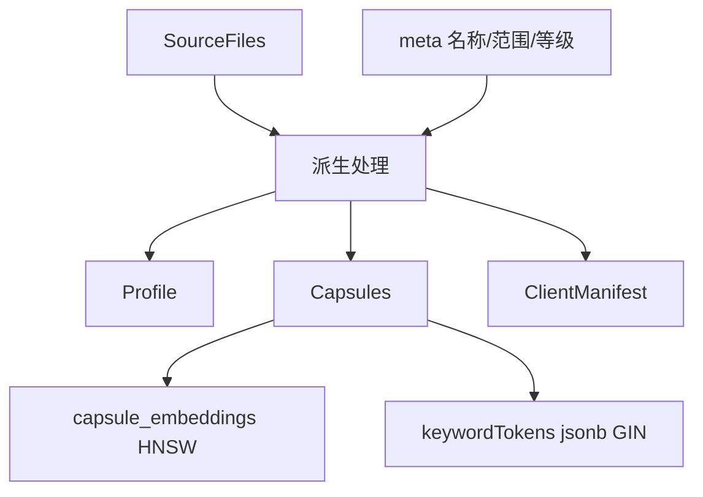

# 工件系统

> 真源：`packages/service-knowledge-write/src/artifact-derivation/` 与 `packages/db/src/schema/artifacts.ts`；契约见 `packages/contracts/src/domain/artifacts.ts`。状态：Active。

## 模型

```text
SkillArtifact (聚合根: id, teamId, scope, labels, title, slug, lifecycleState, owner, history)
 ├─ artifact_revisions (history: SourceFile[] + derived 缓存)
 ├─ skill_artifact_files + skill_artifact_script_descriptors (结构化事实源)
 ├─ skill_artifact_profiles / capsules / capsule_embeddings / client_manifests / manifest_items (派生事实源)
 └─ skill_artifact_agent_reviews / artifact_lifecycle_events (治理事实源)
```

表定义在 `packages/db/src/schema/artifacts.ts:1-440`，物理表名含 `skill_artifact_capsule_embeddings`（capsule_embeddings 事实表）、`skill_artifact_client_manifests`、`skill_artifact_manifest_items`。`skill_artifacts` / `artifact_revisions` 上的 JSONB 只做兼容缓存，结构化子表是事实源。



## 派生管线

1. 你经 `candidate-ingestion` 提交候选，入队、去重、审核后进入 `knowledge-write`。
2. `artifact-derivation` 从修订的 `SourceFile` 生成 `Profile / Capsules / Manifest`（入口 `packages/service-knowledge-write/src/artifact-derive-from-payloads.ts`，契约节点见 `packages/assembly/src/contracts/judgment-contracts.ts:68-74`）。
3. capsule 按 `capsuleId + contentHash` 幂等 upsert `keywordTokens` 与 embedding；`verifyCapsuleIndexHealth` 对账。
4. lifecycle 变更写 `artifact_lifecycle_events`；agent review 写 `skill_artifact_agent_reviews`。

## 生命周期

`draft → pending_review → approved → active → deprecated` 等状态在 `artifact_lifecycle_events` 中审计；`latestRevision` 指向生效修订，`history` 保留全量。

## 检索关联

- 胶囊经 `skill_artifact_capsule_embeddings`（HNSW）与 `keywordTokens`（GIN）暴露给 `service-knowledge-read` 的 v2 通道。
- 上下文丰富（`contextualPrefix`）在派生阶段由 LLM 生成，参与 v2 第五维度评分。
- **Experience Gene 派生（灵感：*From Procedural Skills to Strategy Genes* https://arxiv.org/html/2604.15097v2 ）**：`SkillArtifact`（按 bounded 16k derivation unit）与 `SkillCapsule`（单 capsule / unit）连同 `Trap` 一并作为 `ExperienceGene` 的三大真相源（`kind: trap | skill-artifact | skill-capsule`），经 `rule / LLM(experience-gene-llm-v1) / hybrid` 抽取为 `g=(m,u,π,α,c,v) → signalsMatch/summary/strategy/avoid/constraints/validation` 的紧凑控制块，`gene-native` 检索独立于 capsule 池（`POST /v1/retrieval/genes/search`），渲染为 `<strategy-gene>`。详见 `docs/archived/archived-plans/experience-gene-program-mainline-archived.md` 与 `packages/contracts/src/domain/experience-gene.ts`。

## 导入导出

- 导入 / 导出 / 激活经 gateway artifact route_defs 暴露，由 `service-knowledge-write` 处理；逐条路径见 [TrapMap API 契约表面](../../reference/api-surface.md)。
- 客户端激活时下发 `ClientManifest` 与清单条目（`skill_artifact_manifest_items` 三合一：references / assets / scripts）。

## 契约

Zod：`skillArtifactSchema` / `SkillArtifact` 在 `packages/contracts/src/domain/artifacts.ts`。42 表中的 11 张工件表见 [数据库表清单](../../reference/DATABASE_SCHEMA.md)。
