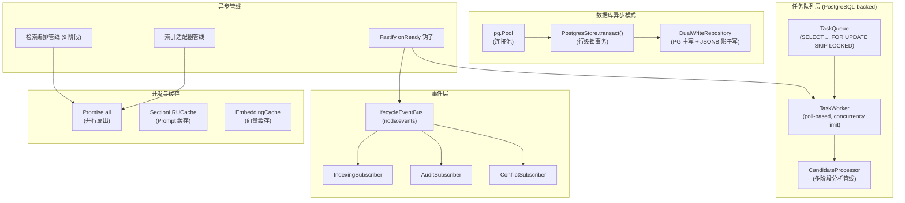
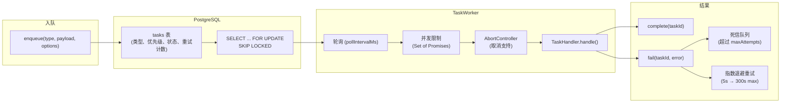
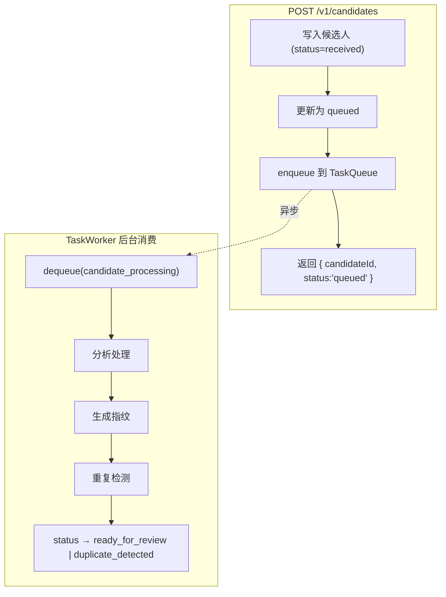
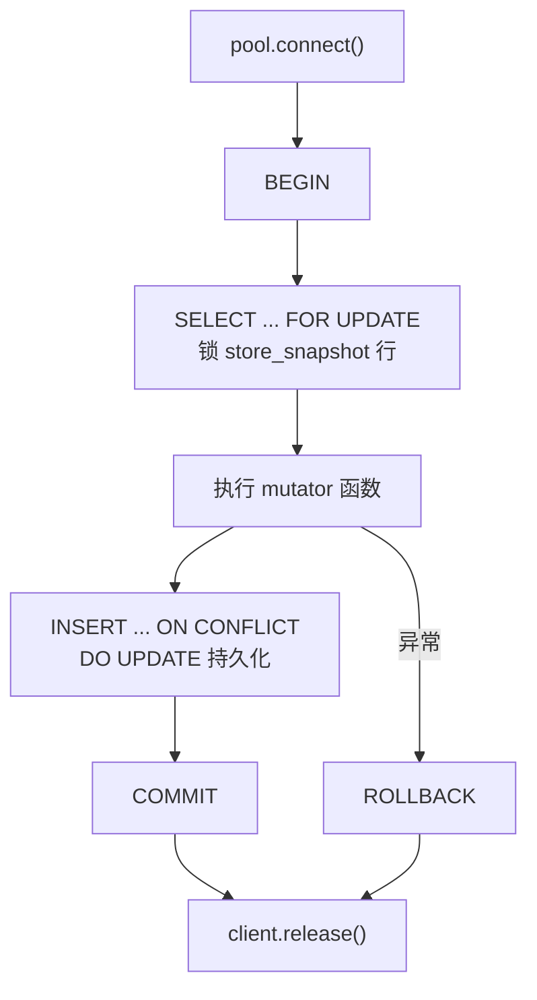
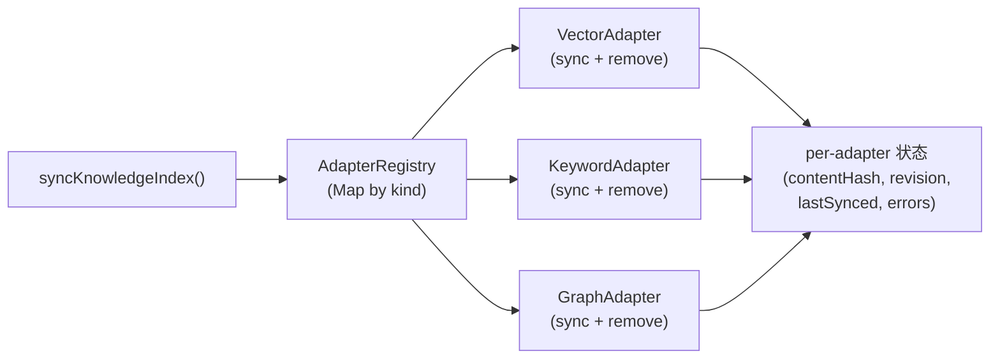

# 异步基础设施 (Async Infrastructure)

## 概述

TrapMap 的异步基础设施**不依赖外部中间件**（无 Redis、Bull、WebSocket、worker_threads），而是基于 PostgreSQL 和 Node.js 原语自建了一套轻量级异步栈，覆盖事件驱动、持久化任务队列、并发控制、缓存优化四大需求。

### 架构总览



---

## 1. 领域事件总线

### 概述

基于 Node.js `EventEmitter` 封装的 `LifecycleEventBus`，专用于知识条目的生命周期状态转换通知。提供同步和异步两种发射模式，内置错误隔离保证单个 handler 失败不影响其他。

### 核心实现

| 方法 | 模式 | 错误处理 | 用途 |
|------|------|----------|------|
| `emitDomainEvent(event)` | fire-and-forget | try/catch per handler + re-emit `'error'` | 不关心结果的副作用 |
| `emitDomainEventAsync(event)` | `Promise.all` 等待 | try/catch per handler，隔离 reject | 需要等待全部完成 |
| `onDomainEvent(eventName, handler)` | 注册 | — | 返回 `this` 支持链式调用 |

### 事件类型

```typescript
// lifecycle/types.ts
interface DomainEvent {
  name: string;          // e.g. 'knowledge.approved'
  entryId: EntityId;
  previousState: string;
  nextState: string;
  actorId: string;
  reason?: string;
  timestamp: string;
}

type DomainEventHandler = (event: DomainEvent) => void | Promise<void>;
```

### 内置订阅者

在 `app.ts` 的 `onReady` 钩子中注册（line 416-452）：

| 订阅者 | 监听事件 | 职责 |
|--------|----------|------|
| `createIndexingSubscriber` | `knowledge.approved`, `deactivated`, `agent-reviewed`, `rejected`, `resubmitted`, `re-review` | 触发索引同步 |
| `createAuditSubscriber` | 所有生命周期事件 | 审计日志记录 |
| `createConflictSubscriber` | `knowledge.approved` | 批准后运行冲突检测 |

全局错误 handler 捕获订阅者异常，日志记录但不崩溃服务。

### 实例化

```typescript
// app.ts line 236
const eventBus = new LifecycleEventBus();
app.skillShareer.eventBus = eventBus;
```

---

## 2. PostgreSQL 持久化任务队列

### 概述

完全基于 PostgreSQL 实现的任务队列，无需 Redis 或外部 MQ。使用 `SELECT ... FOR UPDATE SKIP LOCKED` 保证并发 worker 安全，支持优先级、延迟、指数退避重试和死信队列。

### 架构



### TaskQueue API

```typescript
// queue/task-queue.ts
interface TaskQueueConfig {
  pool: pg.Pool;
  tableName?: string;         // default: 'tasks'
  baseRetryDelayMs?: number;  // default: 5000
  maxRetryDelayMs?: number;   // default: 300000
}

interface EnqueueOptions {
  priority?: number;          // default: 0, 越小越优先
  maxAttempts?: number;       // default: 3
  delayMs?: number;           // 延迟处理
}

// 核心方法
enqueue(type, payload, options?): Promise<string>   // 返回 taskId
dequeue(type): Promise<Task | null>                  // SKIP LOCKED
complete(taskId): Promise<void>
fail(taskId, error): Promise<void>
requeue(taskId): Promise<void>                       // 死信重入
cleanup(retentionDays): Promise<number>              // 清理旧任务
```

### TaskWorker API

```typescript
interface TaskWorkerConfig {
  queue: TaskQueue;
  handlers: TaskHandler[];
  pollIntervalMs?: number;    // default: 1000
  concurrency?: number;       // default: 1
}

interface TaskHandler<T = unknown> {
  type: string;
  handle: (task: Task<T>, signal: AbortSignal) => Promise<void>;
  onDead?: (task: Task<T>) => Promise<void>;
}

// 生命周期
run(): Promise<void>          // 启动轮询循环
stop(): Promise<void>         // 优雅停止，等待活跃任务完成
```

### 实际使用者：候选人处理

`candidates/processor.ts` 中的多阶段分析管线，**完全通过 PG 持久化队列驱动**（Phase 1 后不再有进程内 fire-and-forget 兜底）：



**写入路径**只负责鉴权、落库和登记后台任务，不等待分析、去重或索引。

**恢复逻辑**（`app.ts` onReady）不再调用 `processPendingCandidates` 直接处理中断候选，而是将所有
`queued`/`analyzing` 状态的候选重置为 `received` 后重新入队到 TaskQueue，由 worker 统一消费。

在 `app.ts:322-417` 的 `onReady` 中，检测到 PostgresStore 时创建 TaskWorker 并后台启动：

```typescript
const worker = createTaskWorker({
  queue: taskQueue,
  handlers: [createCandidateProcessingHandler(services)],
  concurrency: 1
});
void worker.run();  // fire-and-forget 启动
app.decorate('taskWorker', worker);  // 挂载到 Fastify 实例供优雅关闭
```

---

## 3. 数据库异步模式

### PostgreSQL 连接池

由 `create-store.ts` 中 `createSkillShareerStore()` 创建，传入 `databaseUrl` 时生成 `pg.Pool`。`PostgresStore` 封装连接池并暴露 `getPool()`，供以下模块共享：

| 使用者 | 用途 |
|--------|------|
| TaskQueue / TaskWorker | 任务入队/出队 |
| `vectorSimilaritySearch` | 向量相似度搜索 |
| `createPgKeywordRecall` | BM25 关键词召回 |
| `createPgDuplicateDetector` | 重复检测 |
| `backfill-indexes.ts` | 索引回填脚本 |
| `bench-store.ts` | 性能基准测试 |

### 行级锁事务 (`PostgresStore.transact()`)

核心写入串行化机制，保证并发写入安全：



### Dual-Write 仓库模式

三组仓库同时写入 PostgreSQL（主）和 JSONB 快照（影子），保证数据兼容性：

| 仓库 | 文件 |
|------|------|
| `DualWriteKnowledgeRepository` | `knowledge/repository.ts` |
| `DualWriteArtifactRepository` | `artifacts/repository.ts` |
| `DualWriteCandidateRepository` | `candidates/repository.ts` |

---

## 4. Promise 并行扇出

项目使用原生 `Promise.all` 实现并行 fan-out，未引入 p-limit / p-queue 等外部库。

### 使用场景

| 场景 | 文件 | 说明 |
|------|------|------|
| 多路召回并行 | `recall-coordinator.ts:223,287,340` | semantic + keyword + graph 三通道并行执行 |
| 索引适配器扇出 | `indexing/pipeline.ts:143,284` | 多 adapter 并行移除非 approved 条目 |
| 事件异步发射 | `lifecycle/event-bus.ts:59` | `emitDomainEventAsync` 并行等待所有 handler |
| HTTP 路由批处理 | `routes/review.ts:38` | 并行处理审核请求 |
| 候选批量处理 | `routes/candidates.ts:232` | 并行处理候选提交 |
| 反馈批量处理 | `routes/feedback-admin.ts:336` | 并行处理反馈批次 |
| Worker 优雅关闭 | `queue/task-queue.ts:438` | `stop()` 时 `Promise.all` 等待活跃任务排空 |

### 并发限制

TaskWorker 通过 `Set<Promise<void>>` 实现隐式并发限制（默认 `concurrency=1`）：

```typescript
// task-queue.ts - 简化示意
while (this.active.size < this.concurrency) {
  const task = await this.queue.dequeue(handler.type);
  if (!task) break;
  const promise = handler.handle(task, signal).finally(() => this.active.delete(promise));
  this.active.add(promise);
}
```

---

## 5. 异步管线与钩子

### Fastify `onReady` 启动钩子

服务器启动时通过 `app.addHook('onReady', ...)` 按序执行 5 个异步初始化阶段：

| 阶段 | 行号 | 职责 |
|------|------|------|
| 1. 恢复 | 262 | 查找并重处理中断的候选人任务 |
| 2. 初始化 | 300 | 启动 TaskWorker + 创建所有 Repository（仅 PostgreSQL 模式） |
| 3. 组装 | 387 | 构建统一 repos 对象（含动态 import 的 UsageAnalytics） |
| 4. 协调 | 403 | 图索引一致性修复 |
| 5. 订阅 | 416 | 注册生命周期事件订阅者 |

### 索引适配器管线

采用 Registry + Pipeline 模式，适配器按注册顺序扇出执行：



- `AdapterRegistry`：按 string kind 管理 `IndexAdapter` 实现
- `syncKnowledgeIndex()`：顺序执行所有 adapter 的 `sync()` 方法，追踪每个 adapter 的同步状态
- `runArtifactAdapterFanOut()`：技能工件的适配器扇出

### 检索编排管线

`searchKnowledgeV2()` 实现 9 阶段异步管线，每阶段用 `timedStep()` 包装并记录延迟：


配套注册表：
- `StrategyRegistry`：按版本管理检索策略（semantic / hybrid / graph-assisted）
- `ChannelRegistry`：管理召回通道（keyword / vector / graph）

每个步骤的执行时间被记录为 `PipelineStep`，用于 RAG 日志和性能监控。

---

## 6. 缓存层

### LRU Prompt Section Cache

纯 TypeScript 实现的 LRU 缓存，用于减少 AI prompt 的重复构建开销：

| 特性 | 值 |
|------|------|
| 实现 | `Map` + 手动 LRU（删除后重插利用 V8 插入序） |
| 最大条目 | 1000（可配置） |
| TTL | 1 小时（可配置） |
| 外部依赖 | 无 |

核心 API：

```typescript
// ai/cache/section-cache.ts
class SectionLRUCache {
  computeHash(content: string): string;
  getCachedSection(name: string, computeFn: () => string): string;
  invalidateSection(name: string): void;
  clearAllSections(): void;
  getSectionCacheSize(): number;
}
```

#### Cache 辅助模块

| 模块 | 文件 | 职责 |
|------|------|------|
| `CacheMetrics` | `ai/cache/metrics.ts` | 命中率、miss 原因（content_changed / model_changed / ttl_expired） |
| `CACHE_BOUNDARY_MARKER` | `ai/cache/boundary-marker.ts` | 静态/动态边界切分（`__CACHE_BOUNDARY__`） |
| `buildCacheControlForSection()` | `ai/cache/api-integration.ts` | Anthropic API `cache_control: { type: 'ephemeral' }` 头生成 |
| `buildSystemPromptBlocks()` | `ai/cache/api-integration.ts` | 按 section 拆分 prompt blocks 带 cache control |

### 嵌入向量缓存

存储在 `StoreData.knowledgeEntries[].embeddingCache`：

```typescript
interface EmbeddingCache {
  textHash: string;    // 内容哈希，用于判断是否需要重新计算
  vector: number[];    // 缓存的向量
  createdAt: string;   // 生成时间
  revision: number;    // 数据版本
}
```

在索引同步（vector adapter sync）时填充，在检索编排时通过 `updateEntryEmbeddingCache()` 更新。

### 图索引内存存储

`InMemoryGraphIndexRepository`（`graph-index/repository.ts`）将图索引文档存储在 Store 的 JSONB 快照中，避免重复磁盘读取。

---

## 未采用的异步模式

| 模式 | 状态 | 原因/替代方案 |
|------|------|---------------|
| WebSocket / SSE / 流式传输 | 未使用 | 纯 REST 请求-响应架构，无实时推送需求 |
| 定时任务 / Cron | 未使用 | fire-and-forget + 任务队列延迟重试已满足需求 |
| Worker Threads / Cluster | 未使用 | 单进程 in-process 轮询 worker，避免跨线程通信复杂度 |
| Redis | 未使用 | PostgreSQL SKIP LOCKED + LRU 内存缓存已满足需求 |
| 外部队列库 (Bull, MQ) | 未使用 | 自建 PG 队列减少运维依赖 |
| 异步生成器 | 仅 1 处 | CLI stdin 读取 (`cli/src/lib/input.ts`) |

---

## 相关文档

- [持久化存储层](PERSISTENCE.md) — PostgresStore / JsonStore 详细实现
- [异步摄取管道](INGESTION.md) — 候选人处理流程与状态机
- [多适配器索引管道](INDEXING.md) — 索引适配器注册与执行
- [检索管道](RETRIEVAL.md) — v1/v2/v3 检索策略
- [AI 提供商抽象](AI_PROVIDER.md) — prompt 缓存集成
