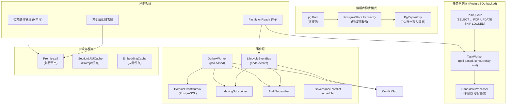
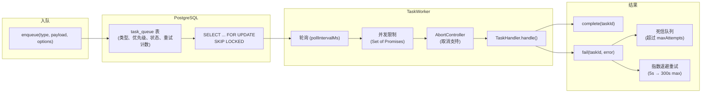
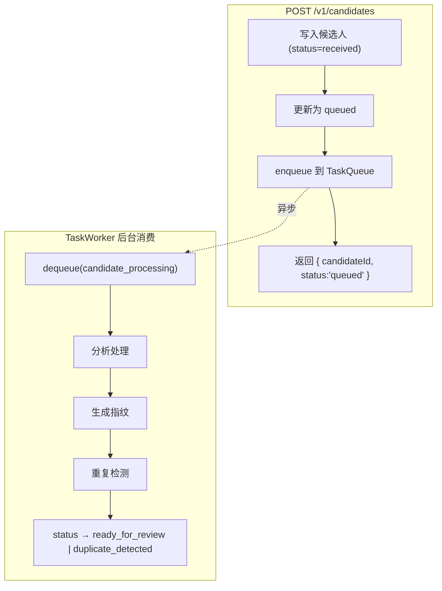
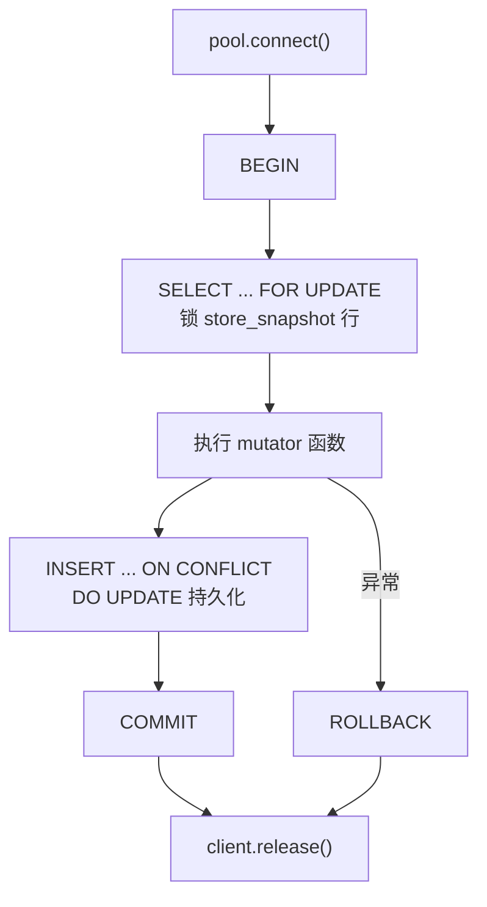
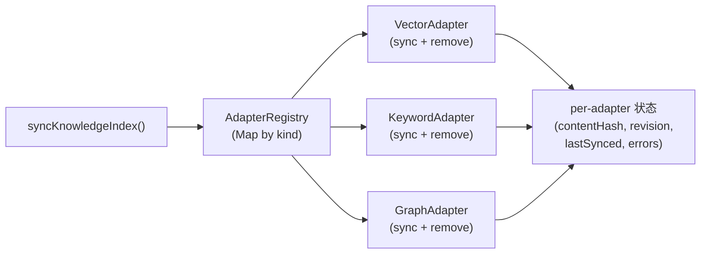

# 异步基础设施 (Async Infrastructure)

> 当前更完整、包含 Phase 5-7 shared jobs / cache invalidation / badcase export / runtime modes 的异步模型说明见 [`ASYNC_MODEL.md`](ASYNC_MODEL.md)。

> 当前组合层边界补充：PG 模式下，路由/服务不应直接构造 `TaskQueue` 或直接写 outbox。`job-runtime` 是 queue、retry、lease、workflow 和 dead-letter 的 owner；业务 owner 通过 typed command/handler 与 `JobRuntimePort` 接入，`LifecyclePublisher` 只负责 lifecycle event 注册。

## 概述

TrapMap 的异步基础设施**不依赖外部中间件**（无 Redis、Bull、WebSocket、worker_threads），而是基于 PostgreSQL 和 Node.js 原语自建了一套轻量级异步栈，覆盖事件驱动、持久化任务队列、并发控制、缓存优化四大需求。

### 架构总览



---

## 1. 领域事件总线

### 概述

基于 Node.js `EventEmitter` 封装的 `LifecycleEventBus`，专用于知识条目的生命周期状态转换通知。提供同步和异步两种发射模式，内置错误隔离保证单个 handler 失败不影响其他。

### 核心实现

| 方法 | 模式 | 错误处理 | 用途 |
|------|------|----------|------|
| `emitDomainEvent(event)` | fire-and-forget | try/catch per handler + re-emit `'error'` | 不关心结果的副作用 |
| `emitDomainEventAsync(event)` | `Promise.all` 等待 | try/catch per handler，隔离 reject | 需要等待全部完成 |
| `onDomainEvent(eventName, handler)` | 注册 | — | 返回 `this` 支持链式调用 |

### 事件类型

```typescript
// lifecycle/types.ts
interface DomainEvent {
  name: string;          // e.g. 'knowledge.approved'
  entryId: EntityId;
  previousState: string;
  nextState: string;
  actorId: string;
  reason?: string;
  timestamp: string;
}

type DomainEventHandler = (event: DomainEvent) => void | Promise<void>;
```

### 内置订阅者

在 `bootstrap/bootstrap-lifecycle.ts` 的启动序列中注册：

| 订阅者 | 监听事件 | 职责 |
|--------|----------|------|
| `createIndexingSubscriber` | `knowledge.approved`, `deactivated`, `agent-reviewed`, `rejected`, `resubmitted`, `re-review` | 触发索引同步 |
| `createAuditSubscriber` | 所有生命周期事件 | 审计日志记录 |
| `createConflictSubscriber` | `knowledge.approved` | 批准后运行冲突检测 |

全局错误 handler 捕获订阅者异常，日志记录但不崩溃服务。

### 实例化

```typescript
// app.ts (Fastify 实例化阶段)
const eventBus = new LifecycleEventBus();
app.skillShareer.eventBus = eventBus;
```

---

## 2. 领域事件 Outbox

### 概述

`DomainEventOutbox` 是 PostgreSQL 持久化的事件出箱表，用于解耦写路径和重副作用。审核/批准等写操作只负责提交事实并登记 outbox 事件，索引、冲突检测等重副作用由后台 worker 异步消费。

### 表结构

```sql
CREATE TABLE domain_event_outbox (
  id          TEXT PRIMARY KEY,
  aggregate_type TEXT NOT NULL,    -- 'knowledge'
  aggregate_id   TEXT NOT NULL,    -- entry ID
  event_name     TEXT NOT NULL,    -- 'knowledge.approved' etc.
  payload        JSONB NOT NULL,   -- DomainEvent
  status         TEXT NOT NULL DEFAULT 'pending',  -- pending|processing|completed|failed
  available_at   TIMESTAMPTZ NOT NULL DEFAULT now(),
  attempts       INTEGER NOT NULL DEFAULT 0,
  last_error     TEXT,
  created_at     TIMESTAMPTZ NOT NULL DEFAULT now(),
  published_at   TIMESTAMPTZ
);

CREATE INDEX domain_event_outbox_pending_idx
ON domain_event_outbox (event_name, available_at, created_at)
WHERE status = 'pending';
```

### 操作

| 方法 | 说明 |
|------|------|
| `enqueue(params)` | 登记事件，status=pending |
| `claimBatch(limit)` | 用 SKIP LOCKED 领取待处理事件，status→processing |
| `complete(eventId)` | 标记完成，status→completed |
| `fail(eventId, error)` | 失败重试：attempts++，指数退避后重置为 pending；达到 maxAttempts 后标记为 failed |

### 执行模式

| 模式 | 路径 | 说明 |
|------|------|------|
| **PostgreSQL** | 写路由 / application service → `createLifecyclePublisher()` / `asyncTransport` → OutboxWorker / TaskWorker → subscriber / handler | 业务层不直接拼装 `task_queue` / `domain_event_outbox` |
| **JSON (本地)** | 写路由 / application service → `createLifecyclePublisher()` → `eventBus.emitDomainEventAsync()` | 本地轻量运行，保留同步兼容语义 |

### OutboxWorker

PG 模式下启动一个后台 worker，轮询 outbox 表领取 pending 事件，按 eventName 分发到 indexing/audit subscriber，并将 approved lifecycle 的 conflict follow-up 交给 `job-runtime` 调度到 `governance-review` owner；失败自动重试并记录错误。

```typescript
// app.ts: 在 PG 模式下启动 outbox worker
const handlerMap = new Map<string, DomainEventHandler>([
  ['knowledge.approved', createIndexingSubscriber(store, adapterRegistry)],
  ['knowledge.deactivated', createIndexingSubscriber(store, adapterRegistry)],
  // ...
]);
```

---

## 3. PostgreSQL 持久化任务队列

### 概述

完全基于 PostgreSQL 实现的任务队列，无需 Redis 或外部 MQ。使用 `SELECT ... FOR UPDATE SKIP LOCKED` 保证并发 worker 安全，支持优先级、延迟、指数退避重试和死信队列。

### 架构



### TaskQueue API

```typescript
// queue/task-queue.ts
interface TaskQueueConfig {
  pool: pg.Pool;
  defaultMaxAttempts?: number;  // default: 3
  baseRetryDelayMs?: number;    // default: 5000
  maxRetryDelayMs?: number;     // default: 300000
}

interface EnqueueOptions {
  priority?: number;          // default: 0, 越大越优先（ORDER BY priority DESC）
  maxAttempts?: number;       // default: 3
  delayMs?: number;           // 延迟处理
  dedupeKey?: string;         // 幂等键，防止重复入队
}

// 核心方法
enqueue(type, payload, options?): Promise<string>   // 返回 taskId
dequeue(type): Promise<Task | null>                  // SKIP LOCKED
complete(taskId): Promise<void>
fail(taskId, error): Promise<void>
requeue(taskId): Promise<void>                       // 死信重入
cleanup(retentionDays): Promise<number>              // 清理旧任务
```

### TaskWorker API

```typescript
interface TaskWorkerConfig {
  pool: pg.Pool;               // 直接接收 pool，内部创建 TaskQueue
  handlers: TaskHandler[];
  pollIntervalMs?: number;    // default: 1000
  concurrency?: number;       // default: 1
}

interface TaskHandler<T = unknown> {
  type: string;
  handle: (task: Task<T>, signal: AbortSignal) => Promise<void>;
  onDead?: (task: Task<T>) => Promise<void> | void;
}

// 生命周期
run(): Promise<void>          // 启动轮询循环
stop(): void                  // 停止轮询（不等待活跃任务）
isRunning(): boolean          // 查询运行状态
```

### 实际使用者：候选人处理

`candidates/processor.ts` 中的多阶段分析管线，**完全通过 PG 持久化队列驱动**（Phase 1 后不再有进程内 fire-and-forget 兜底）：



**写入路径**只负责鉴权、落库和登记后台任务，不等待分析、去重或索引。

**恢复逻辑**（`app.ts` onReady）不再调用 `processPendingCandidates` 直接处理中断候选，而是将所有
`queued`/`analyzing` 状态的候选重置为 `received` 后重新入队到 TaskQueue，由 worker 统一消费。

启动逻辑已迁移到 `bootstrap/run-startup-sequence.ts`（单一 `onReady` 钩子调用 `runStartupSequence(app)`）。检测到 PostgresStore 时，`bootstrap/bootstrap-workers.ts` 创建 TaskWorker 并后台启动：

```typescript
const worker = createTaskWorker({
  pool,
  handlers: [createCandidateProcessingHandler(services)],
  concurrency: 1
});
void worker.run();  // fire-and-forget 启动
app.decorate('taskWorker', worker);  // 挂载到 Fastify 实例供优雅关闭
```

### Worker 生命周期与 graceful shutdown

TaskWorker 和 OutboxWorker 的生命周期由 `app.ts` 管理：

- **启动**: `onReady` 钩子中，`PostgresStore` 模式下后台启动 TaskWorker 和 OutboxWorker
- **停止**: `onClose` 钩子中，依次 `await taskWorker.stop()` 和 `await outboxWorker.stop()`，确保异步清理完成后再解析钩子
- **状态检查**: `/ready` 端点返回 `queueWorkerRunning` 字段，可被 Kubernetes liveness/readiness probe 使用
- **isRunning**: TaskWorker 暴露 `isRunning()` 方法用于运行时状态查询

关闭钩子中 **必须 await** 异步 stop()，否则 worker 可能在钩子返回后继续运行，导致未定义行为。

```typescript
// app.ts: onClose 钩子
app.addHook('onClose', async () => {
  const taskWorker = (app as any).taskWorker;
  const outboxWorker = (app as any).outboxWorker;
  if (taskWorker?.stop) { await taskWorker.stop(); }
  if (outboxWorker?.stop) { await outboxWorker.stop(); }
});
```

### 候选恢复边界

`bootstrap-candidate-recovery.ts` 在启动时处理中断的候选：

| 存储类型 | 恢复行为 |
|----------|----------|
| **PostgreSQL** | 重置 status → `received`，通过 TaskQueue 重新入队 |
| **JSON (本地)** | 重置 status → `received`，**不**入队（无任务队列基础设施）。记录 warning 日志。 |

JSON 存储模式用于开发/测试，不提供后台 worker 处理。非 PG 恢复是显式的设计边界，不会静默丢弃候选。

---

## 4. 数据库异步模式

### PostgreSQL 连接池

由 `create-store.ts` 中 `createSkillShareerStore()` 创建，传入 `databaseUrl` 时生成 `pg.Pool`。`PostgresStore` 封装连接池并暴露 `getPool()`，供以下模块共享：

| 使用者 | 用途 |
|--------|------|
| TaskQueue / TaskWorker | 任务入队/出队 |
| `vectorSimilaritySearch` | 向量相似度搜索 |
| `createPgKeywordRecall` | BM25 关键词召回 |
| `createPgDuplicateDetector` | 重复检测 |
| `backfill-indexes.ts` | 索引回填脚本 |
| `bench-store.ts` | 性能基准测试 |

### 行级锁事务 (`PostgresStore.transact()`)

核心写入串行化机制，保证并发写入安全：



### 仓库模式

各域仓库（knowledge、artifact、candidate）使用 PostgreSQL 作为唯一写入目标。JSONB 快照不再作为影子写入目标（Round 2 已移除 DualWrite 模式）。每个域提供 `InMemory*Repository`（测试用）和 `Pg*Repository`（生产用），通过工厂函数按是否有 PG pool 选择。

---

## 5. Promise 并行扇出

项目使用原生 `Promise.all` 实现并行 fan-out，未引入 p-limit / p-queue 等外部库。

### 使用场景

| 场景 | 文件 | 说明 |
|------|------|------|
| 多路召回并行 | `recall-coordinator.ts:223,287,340` | semantic + keyword + graph 三通道并行执行 |
| 索引适配器扇出 | `indexing/pipeline.ts:143,284` | 多 adapter 并行移除非 approved 条目 |
| 事件异步发射 | `lifecycle/event-bus.ts:59` | `emitDomainEventAsync` 并行等待所有 handler |
| HTTP 路由批处理 | `routes/review.ts:38` | 并行处理审核请求 |
| 候选批量处理 | `routes/candidates.ts:232` | 并行处理候选提交 |
| 反馈批量处理 | `service-governance-review/src/admin.ts` | 并行处理反馈批次 |
| Worker 优雅关闭 | `queue/task-queue.ts:438` | `stop()` 时 `Promise.all` 等待活跃任务排空 |

### 并发限制

TaskWorker 通过 `Set<Promise<void>>` 实现隐式并发限制（默认 `concurrency=1`）：

```typescript
// task-queue.ts - 简化示意
while (this.active.size < this.concurrency) {
  const task = await this.queue.dequeue(handler.type);
  if (!task) break;
  const promise = handler.handle(task, signal).finally(() => this.active.delete(promise));
  this.active.add(promise);
}
```

---

## 6. 异步管线与钩子

### Fastify `onReady` 启动钩子

服务器启动时通过 `app.addHook('onReady', ...)` 调用 `runStartupSequence(app)`，按序执行以下阶段（详见 `bootstrap/run-startup-sequence.ts`）：

| 阶段 | 模块 | 职责 |
|------|------|------|
| 1. 恢复 | `bootstrap-candidate-recovery.ts` | 查找并重处理中断的候选人任务 |
| 2. 初始化 | `bootstrap-repositories.ts` | 创建所有 Repository（仅 PostgreSQL 模式） |
| 3. Worker | `bootstrap-workers.ts` | 启动 TaskWorker + OutboxWorker |
| 4. 协调 | `bootstrap-graph-reconciliation.ts` | 图索引一致性修复 |
| 5. 订阅 | `bootstrap-lifecycle.ts` | 注册生命周期事件订阅者 |

### 索引适配器管线

采用 Registry + Pipeline 模式，适配器按注册顺序扇出执行：



- `AdapterRegistry`：按 string kind 管理 `IndexAdapter` 实现
- `syncKnowledgeIndex()`：顺序执行所有 adapter 的 `sync()` 方法，追踪每个 adapter 的同步状态
- `runArtifactAdapterFanOut()`：技能工件的适配器扇出

### 检索编排管线

`searchKnowledgeV2()` 实现 9 阶段异步管线，每阶段用 `timedStep()` 包装并记录延迟：


配套注册表：
- `StrategyRegistry`：按版本管理检索策略（semantic / hybrid / graph-assisted）
- `ChannelRegistry`：管理召回通道（keyword / vector / graph）

每个步骤的执行时间被记录为 `PipelineStep`，用于 RAG 日志和性能监控。

---

## 7. 缓存层

### LRU Prompt Section Cache

纯 TypeScript 实现的 LRU 缓存，用于减少 AI prompt 的重复构建开销：

| 特性 | 值 |
|------|------|
| 实现 | `Map` + 手动 LRU（删除后重插利用 V8 插入序） |
| 最大条目 | 1000（可配置） |
| TTL | 1 小时（可配置） |
| 外部依赖 | 无 |

核心 API：

```typescript
// ai/cache/section-cache.ts
class SectionLRUCache {
  computeHash(content: string): string;
  getCachedSection(name: string, computeFn: () => string): string;
  invalidateSection(name: string): void;
  clearAllSections(): void;
  getSectionCacheSize(): number;
}
```

#### Cache 辅助模块

| 模块 | 文件 | 职责 |
|------|------|------|
| `CacheMetrics` | `ai/cache/metrics.ts` | 命中率、miss 原因（content_changed / model_changed / ttl_expired） |
| `CACHE_BOUNDARY_MARKER` | `ai/cache/boundary-marker.ts` | 静态/动态边界切分（`__CACHE_BOUNDARY__`） |
| `buildCacheControlForSection()` | `ai/cache/api-integration.ts` | Anthropic API `cache_control: { type: 'ephemeral' }` 头生成 |
| `buildSystemPromptBlocks()` | `ai/cache/api-integration.ts` | 按 section 拆分 prompt blocks 带 cache control |

### 嵌入向量缓存

存储在 `StoreData.knowledgeEntries[].embeddingCache`：

```typescript
interface EmbeddingCache {
  textHash: string;    // 内容哈希，用于判断是否需要重新计算
  vector: number[];    // 缓存的向量
  createdAt: string;   // 生成时间
  revision: number;    // 数据版本
}
```

在索引同步（vector adapter sync）时填充，在检索编排时通过 `updateEntryEmbeddingCache()` 更新。

### 图索引内存存储

`InMemoryGraphIndexRepository`（`graph-index/repository.ts`）将图索引文档存储在 Store 的 JSONB 快照中，避免重复磁盘读取。

---

## 未采用的异步模式

| 模式 | 状态 | 原因/替代方案 |
|------|------|---------------|
| WebSocket / SSE / 流式传输 | 未使用 | 纯 REST 请求-响应架构，无实时推送需求 |
| 定时任务 / Cron | 未使用 | fire-and-forget + 任务队列延迟重试已满足需求 |
| Worker Threads / Cluster | 未使用 | 单进程 in-process 轮询 worker，避免跨线程通信复杂度 |
| Redis | 未使用 | PostgreSQL SKIP LOCKED + LRU 内存缓存已满足需求 |
| 外部队列库 (Bull, MQ) | 未使用 | 自建 PG 队列减少运维依赖 |
| 异步生成器 | 仅 1 处 | CLI stdin 读取 (`cli/src/lib/input.ts`) |

---

## 相关文档

- [持久化存储层](PERSISTENCE.md) — PostgresStore / JsonStore 详细实现
- [异步摄取管道](INGESTION.md) — 候选人处理流程与状态机
- [多适配器索引管道](INDEXING.md) — 索引适配器注册与执行
- [检索管道](RETRIEVAL.md) — v1/v2/v3 检索策略
- [AI 提供商抽象](AI_PROVIDER.md) — prompt 缓存集成
