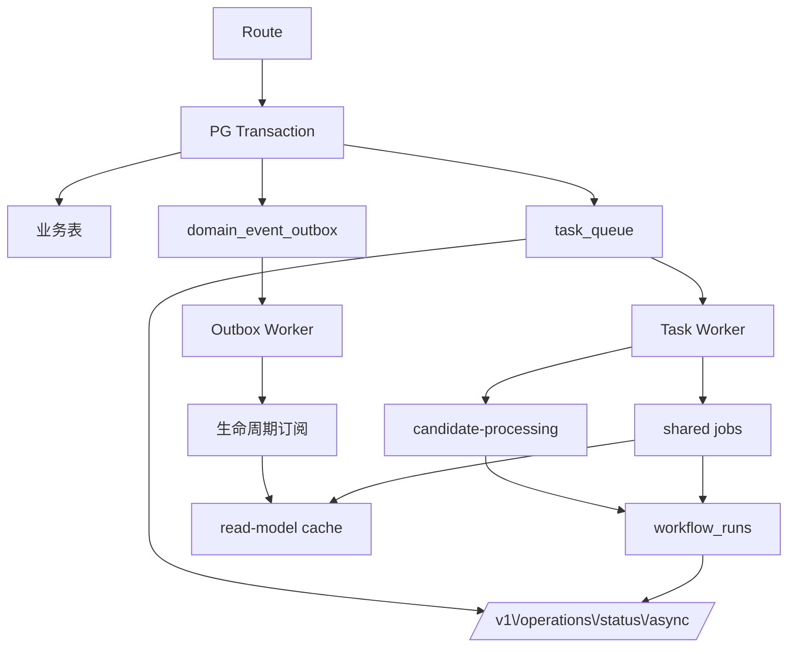

# 异步模型

> 真源：`packages/service-job-runtime`（queue / outbox / workflow）、`packages/contracts/src/domain/async.ts`。各 shared job 的契约表见 [ASYNC_SHARED_JOB_CONTRACTS](ASYNC_SHARED_JOB_CONTRACTS.md)，本页只讲模型。状态：Active。

## 模型

```text
Authoritative Write (PG 事务内)
  ├─ 业务表写入
  ├─ domain_event_outbox 注册
  └─ task_queue 注册
       ↓
Async Substrate (task_queue + domain_event_outbox + workflow_runs)
       ↓
Workers (Outbox Worker + Task Worker, 携带 lease)
       ↓
Derived Work (lifecycle 订阅 / candidate-processing / shared jobs)
       ↓
Read Side (retrieval read-model cache, intent cache)
       ↓
Operator (/v1/operations/status/async, /metrics)
```

- `task_queue.status`：`pending | running | completed | failed | dead`。
- `domain_event_outbox.status`：`pending | processing | completed | failed`。
- 派生状态 `staleRunning` / `staleProcessing` 表 lease 过期。
- Worker 状态词汇：`running | degraded | remote | not-configured`。

## 写入原子性

候选创建与 `task_queue` 入队同事务提交；`knowledge` 生命周期变更与 outbox 同事务。`task_queue` 与 outbox 均携带 `workerId / startedAt / heartbeatAt / leaseUntil`；`leaseUntil < now()` 的条目可回收，无需人工 SQL。

## Queue 与 Outbox 约束

`queueFactory` 与 `outboxFactory` 由 `service-job-runtime` 暴露（`packages/service-job-runtime/src/deps.ts`），host 在 bootstrap 阶段装配。重试为指数退避，失败进 `failed`，需人工介入的进 `dead`；`workflow_runs` 记录长任务 checkpoint。job handler 以 `dedupeKey` 去重，支持 `reclaim / retry / resume`。



## Transport

`createRabbitMqTaskTransport`（`packages/service-job-runtime/src/rabbitmq-task-transport.ts`）与 PG transport 二选一，见 [DEPLOYMENT](../DEPLOYMENT.md)。组合层经 `asyncTransport.queue` 注入窄 queue port；调度器与业务服务不直接构造 `TaskQueue`。

## Operator

- 现场：`/v1/operations/status/async`（backlog / dead-letter / stale / reclaimCount），gateway 定义在 `route-defs/job.ts:53`。
- 指标：`/metrics` 低基数聚合（queue 深度、lease 过期、hop 延迟、failureTaxonomy）。
- badcase 导出：`/v1/operations/badcases/:feedbackId/export`。

## 可观测性

命名与失败分类以 `packages/contracts/src/domain/observability.ts` 为准。`workflowRunId` 表 async / durable 语义，不等同于对客 `asyncJobId`。

## 常见用法

### 你查异步现场状态

前置条件：gateway 运行中。

```bash
curl -s <gateway>/v1/operations/status/async
```

路由定义在 `packages/host-distributed/src/gateway/route-defs/job.ts:53`；`<gateway>` 换成你的网关地址。

### 你列 typed handler

前置条件：离线可跑。

```bash
ls packages/service-job-runtime/src/handlers/
```

### 你列出 payload schema

前置条件：离线可跑。

```bash
grep -n "PayloadSchema" packages/contracts/src/domain/async.ts
```

逐任务契约见 [Shared Async Job Contracts](ASYNC_SHARED_JOB_CONTRACTS.md)。
