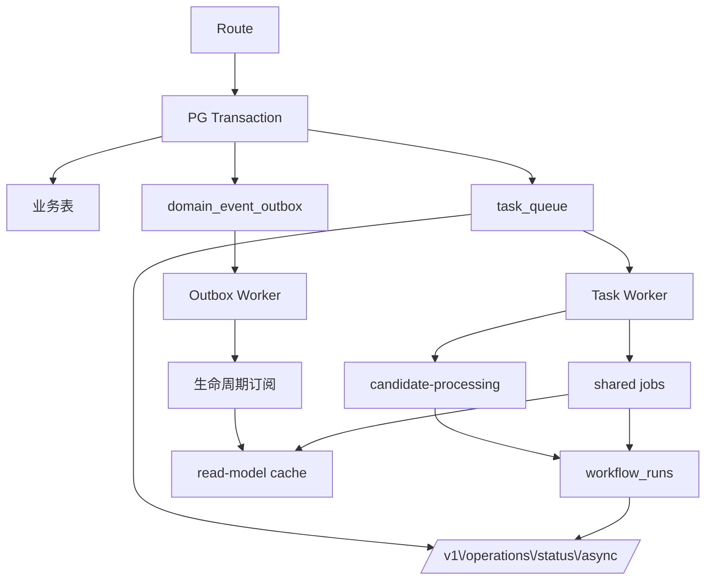

# 异步模型

> 真源：`packages/service-job-runtime`（queue/outbox/workflow）、`packages/contracts/src/domain/async.ts`、各 service 的 outbox/processor。

## 模型

```
Authoritative Write (PG 事务内)
  ├─ 业务表写入
  ├─ domain_event_outbox 注册
  └─ task_queue 注册
       ↓
Async Substrate (task_queue + domain_event_outbox + workflow_runs)
       ↓
Workers (Outbox Worker + Task Worker, 携带 lease)
       ↓
Derived Work (lifecycle 订阅 / candidate-processing / shared jobs)
       ↓
Read Side (retrieval read-model cache, intent cache)
       ↓
Operator (/v1/operations/status/async, /metrics)
```

- `task_queue.status`: `pending | running | completed | failed | dead`
- `domain_event_outbox.status`: `pending | processing | completed | failed`
- 派生状态：`staleRunning` / `staleProcessing` 表示 lease 过期。

## 写入原子性

- 候选创建与 `task_queue` 入队同事务提交；`knowledge` 生命周期变更与 `outbox` 同事务。
- `task_queue` / `outbox` 均携带 `workerId / startedAt / heartbeatAt / leaseUntil`；`leaseUntil < now()` 可回收无需人工 SQL。

## Queue / Outbox 约束

- `queueFactory` 与 `outboxFactory` 由 `service-job-runtime` 暴露，host 在 bootstrap 阶段装配。
- 重试：指数退避，失败进入 `failed` → `dead` 需人工介入；`workflow_runs` 记录长任务 checkpoint。
- 幂等：job handler 以 `dedupeKey` 去重，支持 `reclaim / retry / resume`。

## Shared Jobs

`task_queue` 承载的跨域派生任务（非业务主事实）：

- `knowledge.index-follow-up`
- `feedback.remediation-reactivation`
- `feedback.badcase-export-draft`
- `governance.conflict-detection`

其可见性来自 `task_queue` + `workflow_runs`；`feedback_records` 上的 `remediationStatus` 等列追踪修复生命周期。

## Worker 状态词汇

`running | degraded | remote | not-configured`（见 [ARCHITECTURE.md](../ARCHITECTURE.md) 的运行时状态节）。

## 可观测性

- 命名与失败分类以 `packages/contracts/src/domain/observability.ts` 为准。
- `workflowRunId` 为 async/durable 语义，不等同于对客 `asyncJobId`（`asyncJobId` 为 additive 句柄）。
- HTTP / DB / queue / internal-hop 四条 seam 在 `host-local` / `host-distributed` 中统一打点，见 [OBSERVABILITY.md](../OBSERVABILITY.md)。

## 图示



## Operator

- 现场：`/v1/operations/status/async`（backlog / dead-letter / stale / reclaimCount）
- 指标：`/metrics` 低基数聚合（queue 深度、lease 过期、hop 延迟、failureTaxonomy）
- badcase 导出：`/v1/operations/badcases/:feedbackId/export` → `scripts/archived/export-badcase-to-eval.ts`
