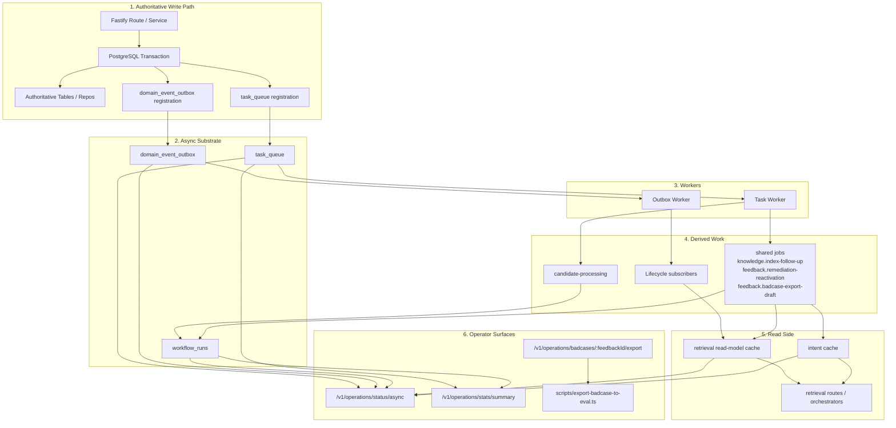
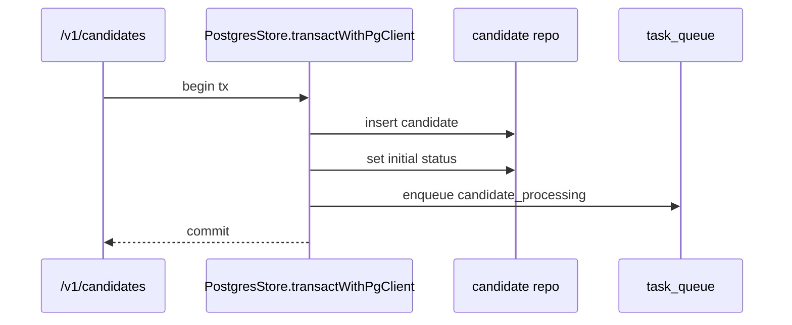
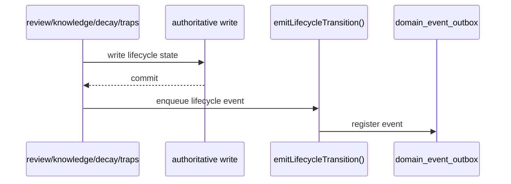
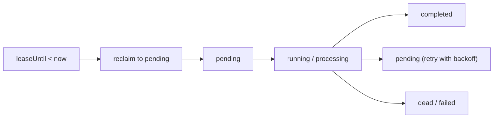
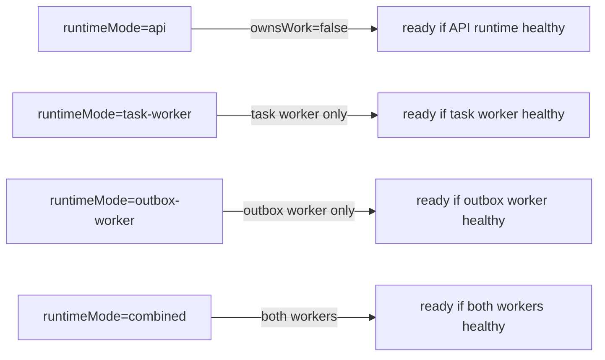
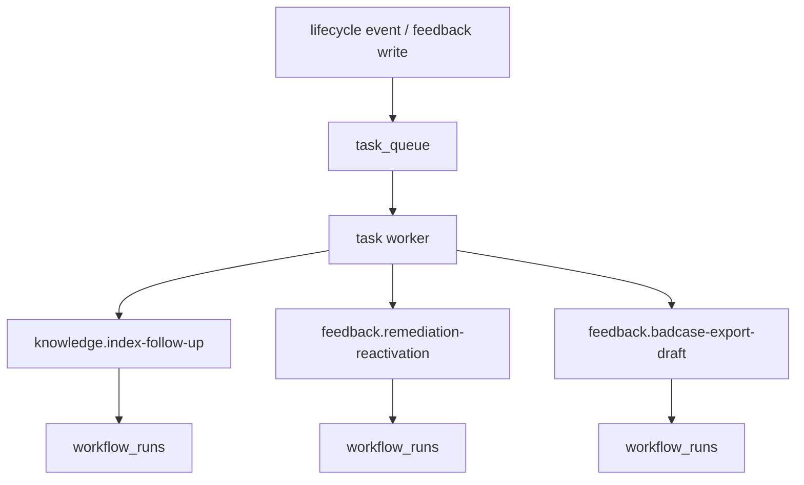
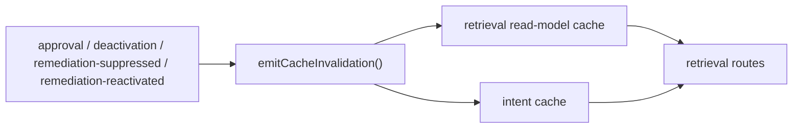
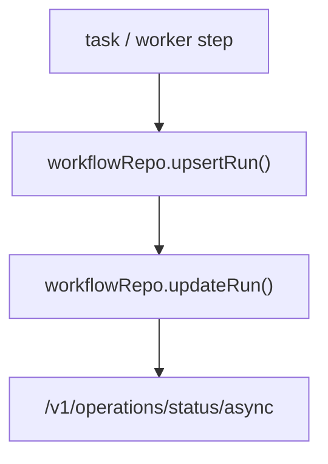
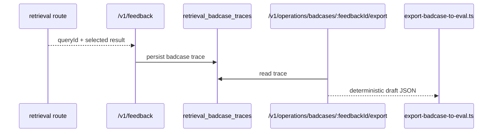
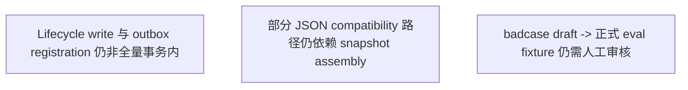

# TrapMap 异步模型

本文是当前 TrapMap 异步模型的详细说明，覆盖 authoritative write、outbox、task queue、worker modes、shared jobs、workflow snapshots、cache invalidation 与 badcase export。

## 总览

## 1. Authoritative write 与异步注册

### 1.1 Candidate 提交

当前 candidate 提交已经满足“authoritative write + queue registration”同事务。

### 1.2 Lifecycle transition

说明：

- `emitLifecycleTransition()` 已统一为 lifecycle event 唯一出口
- 但仍有若干调用点在事务提交后才调用该函数
- 因此“所有 lifecycle write 均与 outbox registration 原子同事务”仍是仓库剩余差距

## 2. Queue / Outbox 模型

### Queue

- 表：`task_queue`
- 关键能力：
  - `SKIP LOCKED`
  - dedupe key
  - retry/backoff
  - dead-letter
  - lease/reclaim

### Outbox

- 表：`domain_event_outbox`
- 关键能力：
  - async subscriber fanout
  - retry/backoff
  - failed-event visibility
  - lease/reclaim

## 3. Worker runtime modes

当前支持：

- `api`
- `task-worker`
- `outbox-worker`
- `combined`

## 4. Shared jobs

### 当前 shared jobs

- `knowledge.index-follow-up`
- `skill.index-follow-up`
- `feedback.remediation-reactivation`
- `feedback.badcase-export-draft`

这些任务都：

- 有 typed payload
- 先在 shared contract registry 中声明 owner、幂等键、`maxAttempts`、dead-letter 语义和 workflow binding
- 走同一 `task_queue`
- 写入 `workflow_runs`
- 通过 operator surface 可见

详细契约见 [`ASYNC_SHARED_JOB_CONTRACTS.md`](./ASYNC_SHARED_JOB_CONTRACTS.md)。

## 5. Cache invalidation 模型

### 失效原因

- `approved`
- `deactivated`
- `remediation-suppressed`
- `remediation-reactivated`

### 归属与触发

- `knowledge-lifecycle-projection`
  - trigger: `outbox-subscriber` 或 `shared-job`
  - owner scope: retrieval read-model 与 trap 可见性派生面
- `skill-lifecycle-projection`
  - trigger: `shared-job`
  - owner scope: skill graph / retrieval 可见性派生面
- `feedback-remediation-projection`
  - trigger: `shared-job` 或 `write-through-fallback`
  - owner scope: remediation suppression / reactivation 对 retrieval 可见性的派生面

### Freshness 语义

- authoritative write 成功不等于读侧投影立即可见
- 标准语义是 `eventual-consistency`
- 允许短暂的 “write succeeded, projection still catching up”
- 观察入口：
  - `workflow_runs`
  - `GET /v1/operations/status/async`
  - retrieval cache invalidation metrics

### 受控缓存

- `retrieval-read-model`
- `intent`

### 边界

- 它们都是 process-local derived caches
- 不能成为事实源
- operator 通过 `/v1/operations/status/async` 查看 hit/miss/eviction/invalidation

## 6. Workflow snapshots

当前 `workflowType`：

- `candidate-processing`
- `capsule-index-rebuild`
- `knowledge-index-follow-up`
- `skill-index-follow-up`
- `feedback-remediation-reactivation`
- `badcase-export-draft`

## 7. Badcase export

当前导出第一版：

- route 返回 JSON draft
- script 写 JSON draft
- 正式提升为 eval fixture 仍保留人工审核

## 8. Operator surfaces

### `/v1/operations/status/async`

暴露：

- queue snapshot
- outbox snapshot
- workflow snapshots
- cache stats

### `/v1/operations/stats/summary`

暴露：

- usage summary
- `asyncArchitecture`
  - `queueBacklogByType`
  - `deadLetterByType`
  - `retryRateByType`
  - `avgHandlerLatencyMsByType`
  - `cacheHitRateByNamespace`
  - `badcaseExportCount`
  - `retrievalFailureDistribution`
  - `thresholds`

## 9. 仍存在的已知差距

这些差距是当前模型的已知边界，不影响已有 async substrate 的运转，但决定了最终 acceptance 是否能全部勾选。
