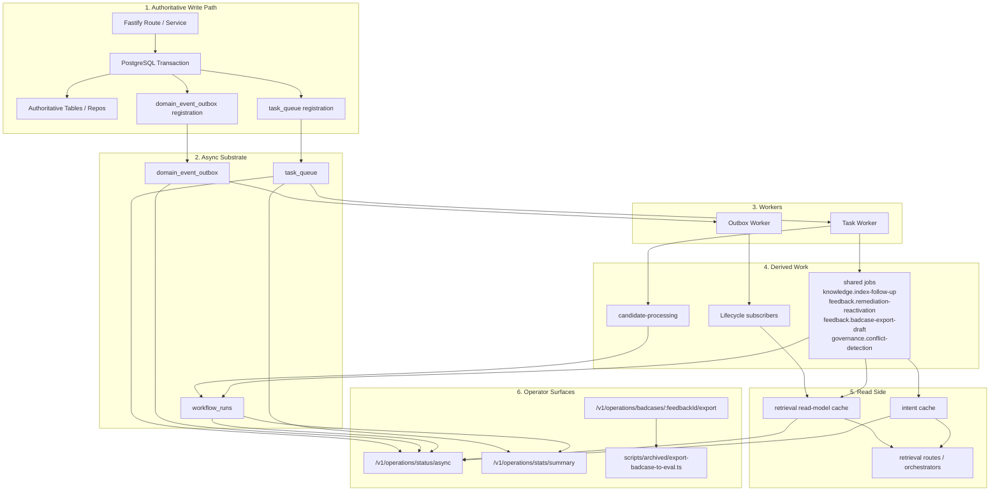
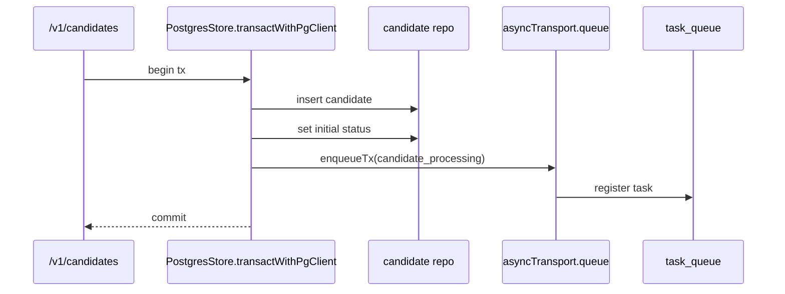
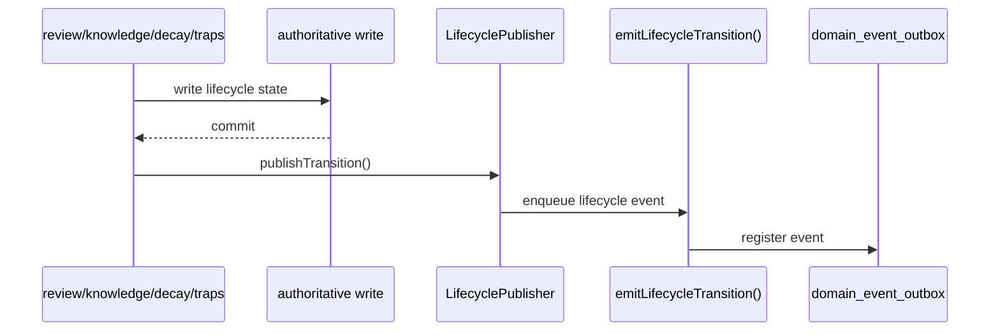
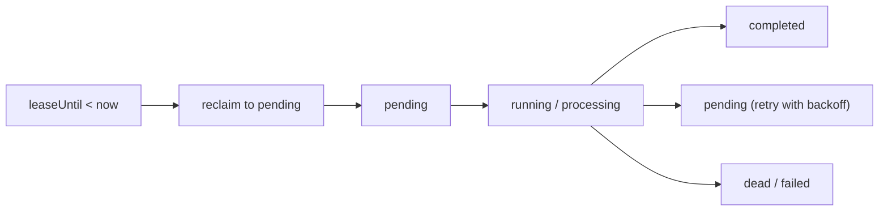
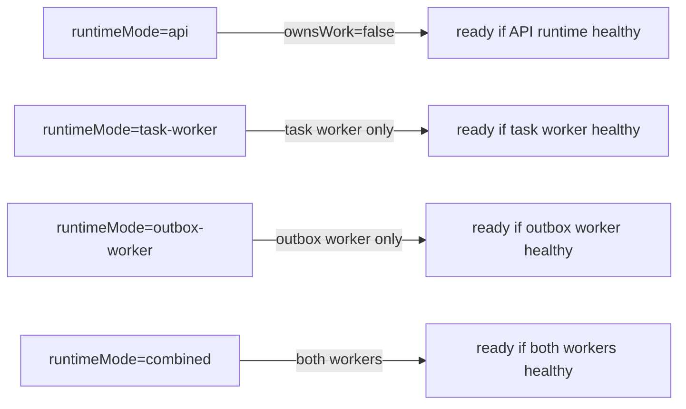
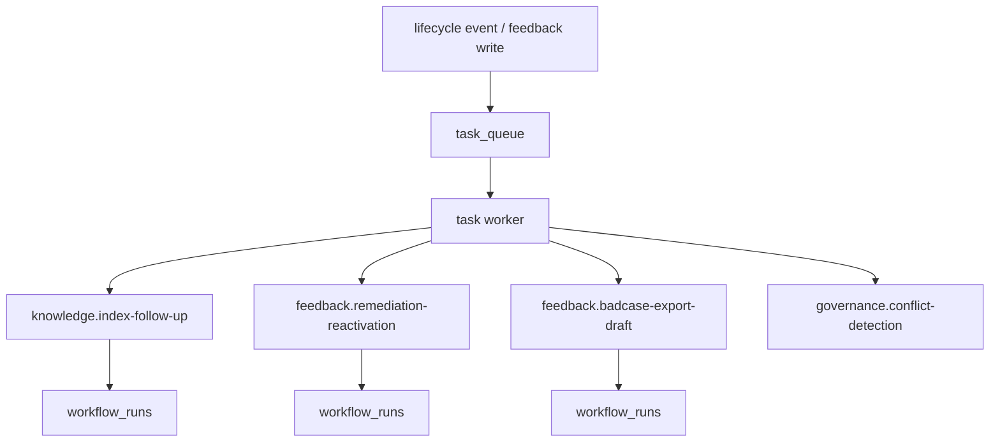
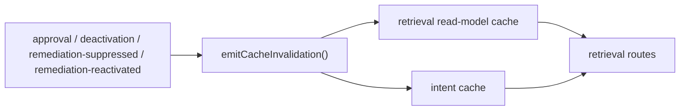
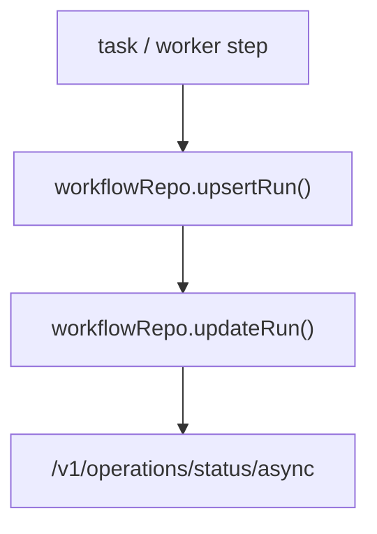
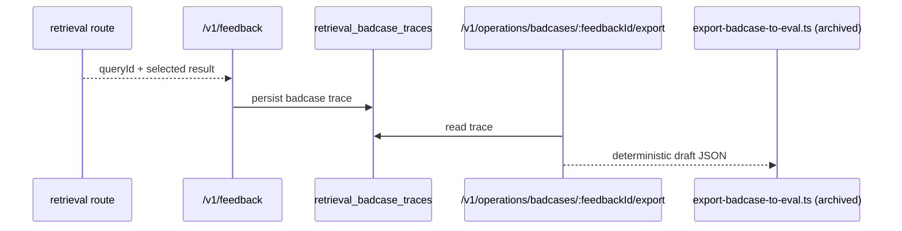
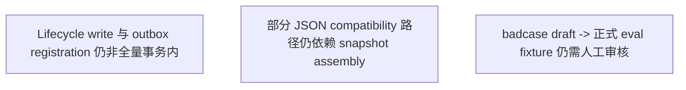

# TrapMap 异步模型

本文是当前 TrapMap 异步模型的详细说明，覆盖 authoritative write、outbox、task queue、worker modes、shared jobs、workflow snapshots、cache invalidation 与 badcase export。

> **Wave-4 closeout（2026-07-21）**：`governance-review` 是 feedback、conflict、remediation 和 operator projection 的唯一业务 owner；`job-runtime` 只拥有 queue、retry、lease、workflow 与 dead-letter，并消费治理 owner 提供的 typed handlers。distributed gateway 继续保留既有 feedback public URLs 和 transport semantics。

> **Wave-6 bridge（2026-07-21）**：PostgreSQL queue/outbox transport factory 现在由 `service-job-runtime` 提供；runtime owner 保留 worker lifecycle、lease/reclaim、retry/backoff 与 dead-letter，业务 handler 只经 typed workflow port 到达其领域 owner。

## Phase 1 observability seam

- 统一命名与可见性 contract 以 `packages/contracts/src/domain/observability.ts` 为准
- async/operator 面消费的是其中的 failure taxonomy、metric namespace 和 surface owner 边界，而不是再维护一份平行术语表
- `workflowRunId` 属于 async/operator/durable trace 语义，不等同于 public `asyncJobId`
- `asyncJobId` 是允许返回给 client/operator follow-up 的 additive 句柄；更细的 workflow checkpoint、candidate/artifact 关联仍应留在 operator surface 或 durable trace
- Phase 2 当前只把最小 request correlation 落到已存在的 shared job 样板链路：`feedback.badcase-export-draft` 会把 `requestId` / `traceId` 从 runtime seam 传播进 payload，并通过 `workflow_runs.stats` 投影为 operator-visible `workflows[*].correlation`

## Phase 3 runtime observability closeout

- HTTP request seam：`packages/server（Wave-10 已删除）/src/app.ts` 现在是 request completion log 与 `/metrics` export owner，统一输出 `eventCategory=request`、`eventName=request.completed`、`requestId`、`traceId`、`serviceName`、`routeFamily`
- DB seam：`packages/server（Wave-10 已删除）/src/lib/persistence/postgres-store.ts` 现在为 `store_snapshot.select` / `store_snapshot.transact` 记录低基数 DB metrics
- queue/outbox seam：`packages/server（Wave-10 已删除）/src/lib/queue/task-queue.ts` 与 `packages/server（Wave-10 已删除）/src/lib/lifecycle/outbox.ts` 现在为 enqueue / claim / complete / fail 记录低基数 async metrics
- distributed hop seam：`packages/host-distributed/src/gateway/routes.ts` 继续透传 `traceparent`，`packages/host-distributed/src/gateway/internal-client.ts` 为每个 internal hop 生成 `x-trapmap-span-id` / `x-trapmap-parent-span-id`
- backend boundary：当前仓库只冻结 scrape/collector/log-shipper 接入边界，不提供完整 OTEL collector pipeline、dashboard-as-code 或日志代理部署资产

## Phase 4 closeout

- operator runbook 继续冻结在既有入口：`/health`、`/ready`、`/metrics`、`/v1/operations/status/async`
- task queue 的第一现场仍是 `/v1/operations/status/async` 中的 backlog、dead-letter、stale worker、reclaimCount；`/metrics` 只补充低基数聚合
- internal hop latency 当前只冻结到 gateway/internal-service hop 聚合、timeout/retry 统计与 distributed closeout 证据，不承诺额外 trace UI
- error rate 继续通过 `timeouts`、`retryableFailures`、`permanentFailures`、`failureTaxonomy` 和结构化日志联合解释
- dashboard/alert/SLO 当前只冻结首批 operator 文档面：task queue、internal hop latency、error rate 三组指标必须有 dashboard/alert/SLO 语义，但不要求 checked-in Grafana/Prometheus assets
- service-to-service auth、mTLS、零信任 trust boundary hardening 仍然是 deferred platform topic，不属于当前 async substrate 已落地能力

## 总览

## 1. Authoritative write 与异步注册

### Distributed runtime capability

在 distributed assembly 中，业务服务只取得 `asyncDiagnostics.task/outbox.getStatusSnapshot()`。只有 `job-runtime` 取得 runtime capability，可 enqueue、claim、complete、fail、requeue 或处理 dead-letter。`candidate-ingestion` 通过内部 HTTP `job-runtime.schedule` 获取 `jobId`；下游 `conflict`、`unavailable` 与 `timeout` 映射为现有 `InvocationError`，没有本地 queue fallback。

当前 PG 运行时通过 `app.skillShareer.asyncTransport` 暴露唯一异步基础设施边界：

- `asyncTransport.queue`：`task_queue` 的注册/状态端口
- `asyncTransport.events`：`domain_event_outbox` 的注册/消费端口

业务服务不应直接 `createTaskQueue()` 或直接操作 outbox 表；候选提交、shared jobs 和 lifecycle follow-up 都应通过上述 transport seam 或其上层窄端口完成。

### 1.1 Candidate 提交

当前 candidate 提交通过 route composition 注入窄 `candidateQueue` 端口，满足“authoritative write + queue registration”同事务；服务层本身不再直接构造 queue。

### 1.2 Lifecycle transition

说明：

- `LifecyclePublisher` 是 review / knowledge / decay 等写路径进入 lifecycle async 边界的组合层 seam
- `emitLifecycleTransition()` 仍是 lifecycle event 注册唯一出口
- 但仍有若干调用点在事务提交后才调用该函数
- 因此“所有 lifecycle write 均与 outbox registration 原子同事务”仍是仓库剩余差距

## 2. Queue / Outbox 模型

### Queue

- 表：`task_queue`
- 关键能力：
  - `SKIP LOCKED`
  - dedupe key
  - retry/backoff
  - dead-letter
  - lease/reclaim

### Outbox

- 表：`domain_event_outbox`
- `knowledge-write` 的 distributed lifecycle 更新在同一 `PoolClient` 事务中锁定权威记录、验证状态转换、写入 lifecycle event、追加 outbox，再提交；任一写入失败都会回滚，compatibility shadow 或响应不得先于提交更新。
- 关键能力：
  - async subscriber fanout
  - retry/backoff
  - failed-event visibility
  - lease/reclaim

## 2.1 Failure taxonomy

Phase 2 统一后的失败类别固定为：

- `user-error`
- `auth-policy-error`
- `dependency-error`
- `timeout`
- `stale-projection`
- `retryable-async-failure`
- `permanent-failure`

解释约定：

- `retryable-async-failure` 表示 queue/outbox/worker 已接手自动恢复，operator 首先观察 backlog、reclaim 和 attempts，而不是立即人工重放。
- `permanent-failure` 表示 retry budget 已耗尽，当前 work item 已进入 dead-letter / failed，需要人工修复后 requeue 或 replay。
- `stale-projection` 不等于 authoritative write 失败；它表示 committed write 尚未完成 projection/cache convergence。

## 3. Worker runtime modes

当前支持：

- `api`
- `task-worker`
- `outbox-worker`
- `combined`

Phase 2 runtime contract 解释：

- `api`
  - 允许在 PostgreSQL 部署中看到 `queueWorker=remote` / `outboxWorker=remote`
  - 只要本进程不被期望拥有 async work，本地无 worker 不构成故障
- `task-worker`
  - 只负责 task queue consumer
  - 若本地拥有 task work 但 worker 未运行，则为 `degraded`
- `outbox-worker`
  - 只负责 outbox consumer
  - 若本地拥有 outbox work 但 worker 未运行，则为 `degraded`
- `combined`
  - 同时承接 gateway 与本地 worker
  - 任一 locally-owned async dependency degraded 都会让 runtime 进入 `not-ready`

## 4. Shared jobs

### 4.1 Phase 2 correlation sample

- `POST /v1/feedback` 在带 badcase payload 且 PostgreSQL async runtime 可用时，会把当前 request context 中的 `requestId` / `traceId` 与 `queryId`、`feedbackId` 一并传给 `feedback.badcase-export-draft` shared job。
- worker 执行该 shared job 时，会把 `asyncJobId`、`feedbackId`、`queryId`、`requestId`、`traceId` 写入 `workflow_runs.stats`。
- `/v1/operations/status/async` 读取 workflow snapshot 时，会将这组字段抽成 `workflows[*].correlation`，让 operator 能从 request 跟到 async follow-up，而不把完整内部 stats 或 workflow internals 暴露到通用 client surface。

### 当前 shared jobs

- `knowledge.index-follow-up`
- `skill.index-follow-up`
- `feedback.remediation-reactivation`
- `feedback.badcase-export-draft`
- `governance.conflict-detection`

这些任务都：

- 有 typed payload
- 先在 shared contract registry 中声明 owner、幂等键、`maxAttempts`、dead-letter 语义和 workflow binding
- 通过 `asyncTransport.queue` 走同一 `task_queue`
- 写入 `workflow_runs`
- 通过 operator surface 可见

详细契约见 [`ASYNC_SHARED_JOB_CONTRACTS.md`](./ASYNC_SHARED_JOB_CONTRACTS.md)。

## 5. Cache invalidation 模型

### 失效原因

- `approved`
- `deactivated`
- `remediation-suppressed`
- `remediation-reactivated`

### 归属与触发

- `knowledge-lifecycle-projection`
  - trigger: `outbox-subscriber` 或 `shared-job`
  - owner scope: retrieval read-model 与 trap 可见性派生面
- `skill-lifecycle-projection`
  - trigger: `shared-job`
  - owner scope: skill graph / retrieval 可见性派生面
- `feedback-remediation-projection`
  - trigger: `shared-job` 或 `write-through-fallback`
  - owner scope: `governance-review` 持有 remediation suppression / reactivation 对 retrieval 可见性的派生面

### Freshness 语义

- authoritative write 成功不等于读侧投影立即可见
- 标准语义是 `eventual-consistency`
- 允许短暂的 “write succeeded, projection still catching up”
- 观察入口：
  - `workflow_runs`
  - `GET /v1/operations/status/async`
  - retrieval cache invalidation metrics

Phase 2 显式 freshness contract：

- `authoritativeWriteCommitted=true` 表示真相写入已成功，不应再把陈旧读误解成写失败。
- `projectionRefreshPending=true` 表示 queue backlog、outbox backlog、workflow in-flight 或 cache pending invalidation 之一仍未清空。
- `cachesPendingInvalidation=true` 表示 process-local caches 已收到刷新请求但尚未完成 stale recovery。
- operator 应优先通过 `/v1/operations/status/async.freshnessContract.projectionLag` 解释 lag：
  - `queueBacklog`
  - `outboxBacklog`
  - `staleWorkers`
  - `workflowsInFlight`

### 受控缓存

- `retrieval-read-model`
- `intent`

### 边界

- 它们都是 process-local derived caches
- 不能成为事实源
- operator 通过 `/v1/operations/status/async` 查看 hit/miss/eviction/invalidation

## 6. Workflow snapshots

当前 `workflowType`：

- `candidate-processing`
- `capsule-index-rebuild`
- `knowledge-index-follow-up`
- `skill-index-follow-up`
- `feedback-remediation-reactivation`
- `badcase-export-draft`

Phase 2 resume / checkpoint 约定：

- `workflow_runs.stats` 是当前唯一持久化 checkpoint surface。
- shared jobs、candidate processing、capsule rebuild 和未来 bulk path 都应把可恢复进度写入 `stats`，而不是只保存在进程内变量。
- bulk path 在进入 Phase 3 operator/control 面之前，contract 先统一为 `jobId + batchId + idempotencyKey + resumeFromOffset/checkpoint`。

## 7. Badcase export

当前导出第一版：

- route 返回 JSON draft
- script 写 JSON draft
- 正式提升为 eval fixture 仍保留人工审核

## 8. Operator surfaces

### `/v1/operations/status/async`

暴露：

- queue snapshot
- outbox snapshot
- workflow snapshots
- cache stats

### `/v1/operations/stats/summary`

暴露：

- usage summary
- `asyncArchitecture`
  - `queueBacklogByType`
  - `deadLetterByType`
  - `retryRateByType`
  - `avgHandlerLatencyMsByType`
  - `cacheHitRateByNamespace`
  - `badcaseExportCount`
  - `retrievalFailureDistribution`
  - `thresholds`

## 9. 仍存在的已知差距

这些差距是当前模型的已知边界，不影响已有 async substrate 的运转，但决定了最终 acceptance 是否能全部勾选。
