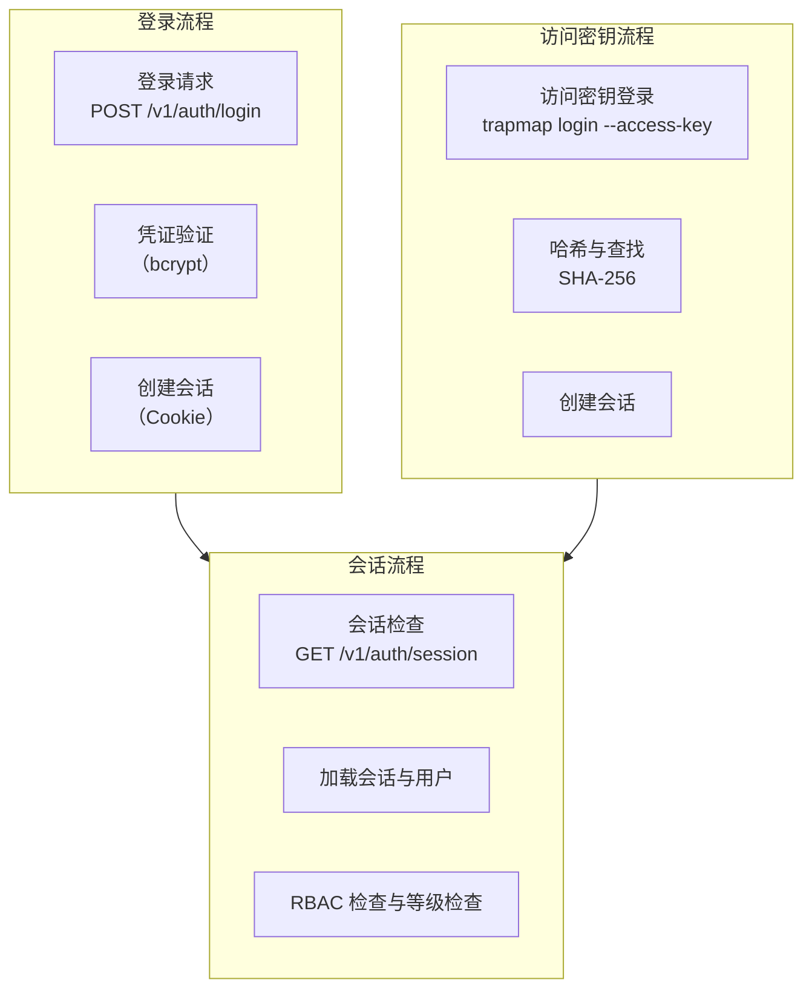
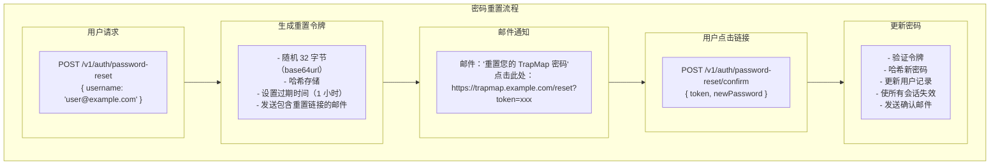

# 会话与认证 (Session & Authentication)

## 概述

TrapMap 使用基于会话的身份验证系统，支持用户名/密码登录和访问密钥认证。会话通过安全的 HTTP-only Cookie 管理，访问密钥用于 CLI 和自动化脚本。

## 认证流程概览



---

## 用户与角色

### 用户模型

```typescript
interface Member {
  id: EntityId;
  username: string;
  passwordHash: string;
  roleName: string;
  level: SecurityLevel;  // 0-10
  teamId?: EntityId;
  createdAt: string;
}

// 角色权限映射
const ROLES = {
  viewer: {
    permissions: ['knowledge:search', 'team:list'],
    level: 0
  },
  contributor: {
    permissions: ['knowledge:submit', 'knowledge:search', 'team:list'],
    level: 1
  },
  reviewer: {
    permissions: [
      'knowledge:submit', 'knowledge:search', 'knowledge:review',
      'team:list', 'team:select'
    ],
    level: 5
  },
  admin: {
    permissions: '*',  // All permissions
    level: 10
  }
};
```

### 密码安全

使用 bcrypt 进行密码 hashing：

```typescript
import bcrypt from 'bcrypt';

const SALT_ROUNDS = 12;

async function hashPassword(password: string): Promise<string> {
  return bcrypt.hash(password, SALT_ROUNDS);
}

async function verifyPassword(
  password: string,
  hash: string
): Promise<boolean> {
  return bcrypt.compare(password, hash);
}
```

---

## 会话管理

### 会话模型

```typescript
interface Session {
  id: EntityId;           // UUID v4
  userId: EntityId;
  createdAt: string;      // ISO 8601
  expiresAt: string;      // ISO 8601
  lastActivityAt: string;
  ipAddress?: string;
  userAgent?: string;
}

// Session TTL
const SESSION_TTL_MS = 7 * 24 * 60 * 60 * 1000;  // 7 days
```

### 会话创建

```typescript
async function createSession(
  userId: EntityId,
  context: { ip?: string; userAgent?: string }
): Promise<{ session: Session; cookieValue: string }> {
  const session: Session = {
    id: generateEntityId(),
    userId,
    createdAt: new Date().toISOString(),
    expiresAt: new Date(Date.now() + SESSION_TTL_MS).toISOString(),
    lastActivityAt: new Date().toISOString(),
    ipAddress: context.ip,
    userAgent: context.userAgent
  };
  
  await store.createSession(session);
  
  // Generate secure cookie value
  const cookieValue = await signSessionToken(session.id);
  
  return { session, cookieValue };
}

function signSessionToken(sessionId: EntityId): Promise<string> {
  const payload = { sessionId };
  const secret = process.env.SESSION_SECRET!;
  
  return jwt.sign(payload, secret, {
    expiresIn: SESSION_TTL_MS / 1000
  });
}
```

### Cookie 设置

```typescript
// In route handler
async function loginHandler(request: FastifyRequest, reply: FastifyReply) {
  const { username, password } = request.body;
  
  // Validate credentials
  const member = await store.getMemberByUsername(username);
  if (!member || !await verifyPassword(password, member.passwordHash)) {
    reply.status(401).send({ error: 'Invalid credentials' });
    return;
  }
  
  // Create session
  const { session, cookieValue } = await createSession(member.id, {
    ip: request.ip,
    userAgent: request.headers['user-agent']
  });
  
  // Send audit event
  await audit({ type: 'auth.login', actorId: member.id, success: true }, request);
  
  // Set HTTP-only cookie
  reply.setCookie('session', cookieValue, {
    httpOnly: true,
    secure: process.env.NODE_ENV === 'production',
    sameSite: 'strict',
    path: '/',
    maxAge: SESSION_TTL_MS / 1000  // seconds
  });
  
  return {
    user: {
      id: member.id,
      username: member.username,
      role: member.roleName,
      level: member.level
    }
  };
}
```

### 会话验证

```typescript
async function validateSession(
  request: FastifyRequest
): Promise<{ user: Member; session: Session } | null> {
  const cookieValue = request.cookies.session;
  if (!cookieValue) return null;
  
  try {
    // Verify and decode JWT
    const payload = await jwt.verify(cookieValue, process.env.SESSION_SECRET!);
    const sessionId = payload.sessionId;
    
    // Load session
    const session = await store.getSession(sessionId);
    if (!session) return null;
    
    // Check expiration
    if (new Date(session.expiresAt) < new Date()) {
      await store.deleteSession(sessionId);
      return null;
    }
    
    // Load user
    const user = await store.getMember(session.userId);
    if (!user) return null;
    
    // Update last activity
    await store.updateSession(sessionId, {
      lastActivityAt: new Date().toISOString()
    });
    
    return { user, session };
  } catch {
    return null;
  }
}
```

### 会话中间件

```typescript
// Fastify preHandler hook
async function authMiddleware(
  request: FastifyRequest,
  reply: FastifyReply
) {
  const result = await validateSession(request);
  
  if (!result) {
    reply.status(401).send({ error: 'Unauthorized' });
    return;
  }
  
  // Attach user and session to request
  request.user = result.user;
  request.session = result.session;
}
```

---

## 访问密钥认证

### 密钥 vs 会话

| 特性 | 会话 Cookie | 访问密钥 |
|------|-------------|----------|
| 用途 | Web UI | CLI / 自动化 |
| 有效期 | 7 天 | 可配置 |
| 更新 | 自动 | 手动 |
| 安全 | HTTP-only | 需要安全存储 |

### 密钥创建

```typescript
async function createAccessKey(
  userId: EntityId,
  options: {
    name: string;
    permissions?: Permission[];
    expiresInDays?: number;
  }
): Promise<{ key: string; id: EntityId }> {
  // Generate secure random key (32 bytes, base64url)
  const keyBytes = crypto.randomBytes(32);
  const key = keyBytes.toString('base64url');
  
  // Hash for storage
  const keyHash = crypto.createHash('sha256').update(key).digest('hex');
  
  // Calculate expiration
  const expiresAt = options.expiresInDays
    ? new Date(Date.now() + options.expiresInDays * 24 * 60 * 60 * 1000).toISOString()
    : null;
  
  // Get user for level
  const user = await store.getMember(userId);
  
  // Create access key record
  const accessKey: AccessKey = {
    id: generateEntityId(),
    name: options.name,
    keyHash,
    createdBy: { actorId: userId, actorName: user.username },
    createdAt: new Date().toISOString(),
    expiresAt,
    permissions: options.permissions || ROLES[user.roleName].permissions,
    level: user.level
  };
  
  await store.createAccessKey(accessKey);
  
  // Return key ONCE (it's not stored!)
  return { key, id: accessKey.id };
}
```

### 密钥登录

```typescript
async function loginWithAccessKey(
  key: string,
  request: FastifyRequest
): Promise<{ user: Member; accessKey: AccessKey } | null> {
  // Hash provided key
  const keyHash = crypto.createHash('sha256').update(key).digest('hex');
  
  // Lookup access key
  const accessKey = await store.getAccessKeyByHash(keyHash);
  if (!accessKey) return null;
  
  // Check expiration
  if (accessKey.expiresAt && new Date(accessKey.expiresAt) < new Date()) {
    return null;
  }
  
  // Load user
  const user = await store.getMember(accessKey.createdBy.actorId);
  if (!user) return null;
  
  // Update last used
  await store.updateAccessKey(accessKey.id, {
    lastUsedAt: new Date().toISOString()
  });
  
  // Create session from access key
  const session = await createSession(user.id, {
    ip: request.ip,
    userAgent: request.headers['user-agent']
  });
  
  // Attach access key info to session
  await store.updateSession(session.session.id, {
    accessKeyId: accessKey.id
  });
  
  return { user, accessKey };
}
```

### CLI 登录流程

```bash
# 使用用户名密码登录
trapmap login <username> <password>

# 使用访问密钥登录
trapmap login --access-key <your-access-key>

# 查看当前会话
trapmap session

# 登出
trapmap logout
```

---

## 登出

```typescript
async function logoutHandler(
  request: FastifyRequest,
  reply: FastifyReply
) {
  const sessionId = request.cookies.session;
  
  if (sessionId) {
    try {
      const payload = await jwt.verify(sessionId, process.env.SESSION_SECRET!);
      await store.deleteSession(payload.sessionId);
    } catch {
      // Session already invalid, continue
    }
    
    reply.clearCookie('session', { path: '/' });
  }
  
  await audit({ type: 'auth.logout', actorId: request.user?.id }, request);
  
  return { success: true };
}
```

---

## 密码重置

### 流程



### 实现

```typescript
async function requestPasswordReset(username: string): Promise<void> {
  const member = await store.getMemberByUsername(username);
  if (!member) {
    // Don't reveal if user exists
    return;
  }
  
  // Generate reset token
  const tokenBytes = crypto.randomBytes(32);
  const token = tokenBytes.toString('base64url');
  const tokenHash = crypto.createHash('sha256').update(token).digest('hex');
  
  // Store reset token
  await store.createPasswordResetToken({
    memberId: member.id,
    tokenHash,
    expiresAt: new Date(Date.now() + 60 * 60 * 1000).toISOString()  // 1 hour
  });
  
  // Send email (would integrate with email service)
  const resetUrl = `${process.env.APP_URL}/reset?token=${token}`;
  await sendEmail(member.email, {
    subject: 'Reset your TrapMap password',
    body: `Click here to reset: ${resetUrl}`
  });
}

async function confirmPasswordReset(
  token: string,
  newPassword: string
): Promise<void> {
  const tokenHash = crypto.createHash('sha256').update(token).digest('hex');
  const resetToken = await store.getPasswordResetToken(tokenHash);
  
  if (!resetToken) {
    throw new Error('Invalid token');
  }
  
  if (new Date(resetToken.expiresAt) < new Date()) {
    throw new Error('Token expired');
  }
  
  // Update password
  const passwordHash = await hashPassword(newPassword);
  await store.updateMember(resetToken.memberId, { passwordHash });
  
  // Invalidate all sessions
  await store.deleteAllSessionsForUser(resetToken.memberId);
  
  // Delete reset token
  await store.deletePasswordResetToken(resetToken.id);
}
```

---

## 安全配置

### 环境变量

```bash
# Session security
SESSION_SECRET=your-super-secret-session-key-min-32-chars

# Password hashing
PASSWORD_SALT_ROUNDS=12

# Cookie security
NODE_ENV=production  # Enables secure cookies
```

### CORS 配置

```typescript
// If serving from multiple origins
const corsOptions = {
  origin: process.env.ALLOWED_ORIGINS?.split(','),
  credentials: true  // Allow cookies
};
```

---

## 审计事件

```typescript
type AuthAuditEvent =
  | { type: 'auth.login'; actorId: EntityId; success: boolean }
  | { type: 'auth.logout'; actorId: EntityId }
  | { type: 'auth.failed'; actorId?: EntityId; reason: string }
  | { type: 'auth.session_created'; actorId: EntityId; sessionId: EntityId }
  | { type: 'auth.session_expired'; sessionId: EntityId }
  | { type: 'auth.access_key_created'; actorId: EntityId; keyId: EntityId }
  | { type: 'auth.access_key_used'; keyId: EntityId }
  | { type: 'auth.password_reset_requested'; actorId: EntityId }
  | { type: 'auth.password_reset_completed'; actorId: EntityId }
```
