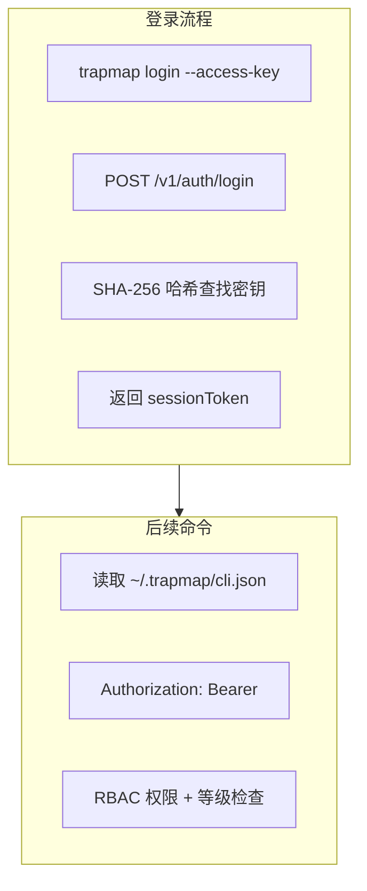

# 会话与认证 (Session & Authentication)

> **Round 10 Phase 3 更新**：身份域和审计域已从 `store_snapshot` JSONB 迁移为 PostgreSQL 结构化表（`users`、`teams`、`memberships`、`sessions`、`access_keys`、`audit_events`）。认证路由已统一通过 `repos.session`、`repos.accessKey`、`repos.membership` 访问，不再回退到 `store.snapshot()`。数据模型详见 [DATA_MODEL.md](../../reference/DATA_MODEL.md)。

## 概述

TrapMap **仅支持 CLI + 访问密钥认证**。不存在用户名/密码登录或浏览器会话。CLI 通过 `POST /v1/auth/login` 提交密钥，服务端返回 `sessionToken`，CLI 将其持久化到 `~/.trapmap/cli.json`。

## 认证流程概览



---

## CLI 登录命令

### 访问密钥登录

```bash
# 使用成员访问密钥
trapmap login --access-key <your-access-key>

# 使用系统管理员引导密钥（首次部署）
trapmap login --system-admin-key <your-admin-key>

# 指定远程服务器地址（写入配置后持久生效）
trapmap login --server https://trapmap.example.com --access-key <key>

# 查看当前会话
trapmap session

# 登出
trapmap logout
```

### 密钥类型

| 密钥 | 用途 | 创建方式 |
|------|------|----------|
| `--access-key` | 成员日常使用 | 管理员通过 `member key:create` 生成 |
| `--system-admin-key` | 首次部署引导 | 部署时通过 `TRAPMAP_SYSTEM_ADMIN_KEY` 环境变量设置 |

---

## CLI 服务器地址配置

CLI **同时只连接一个服务器**（`CliState.serverUrl` 为单值）。优先级：

| 优先级 | 来源 | 说明 |
|--------|------|------|
| 1 | `trapmap login --server <url>` | 登录时覆盖，写入 `~/.trapmap/cli.json` |
| 2 | `~/.trapmap/cli.json` → `serverUrl` | 登录后持久化 |
| 3 | `TRAPMAP_SERVER_URL` 环境变量 | 首次使用前的默认值 |
| 4 | `http://127.0.0.1:4000` | 硬编码兜底 |

切换服务器：

```bash
trapmap login --server https://new-server.example.com --access-key <key>
```

---

## 用户与角色

### 用户模型

身份域拆分为三个结构化表（`users`、`memberships`、`access_keys`），不再使用单一 `Member` 聚合：

```typescript
// store/types/system-records.ts
interface UserRecord {
  id: string;
  handle: string;           // 用户标识（非 username）
  notes: string | null;
  createdAt: string;
  updatedAt: string;
}

interface MembershipRecord {
  id: string;
  userId: string;
  teamId: string;
  roleTemplate: RoleTemplate;   // 来自 @trapmap/contracts
  securityLevel: number;        // 0-10
  permissions: Permission[];    // 来自 @trapmap/contracts
  notes: string | null;
  createdAt: string;
  updatedAt: string;
}
```

> 用户本身不持有密码哈希或角色名。角色和权限按团队成员关系（`MembershipRecord`）独立管理，同一用户在不同团队可拥有不同角色和安全等级。

### 角色与权限

角色通过 `RoleTemplate`（来自 `@trapmap/contracts`）定义，按成员关系分配。权限检查基于 `ResolvedAuthContext.effectivePermissions` 数组，而非全局角色常量。详见 [治理模型](GOVERNANCE.md)。

---

## 会话模型

```typescript
// store/types/system-records.ts
interface SessionRecord {
  id: string;
  subjectType: 'user' | 'system-admin';  // 区分用户会话和管理员会话
  userId: string | null;                   // system-admin 会话为 null
  activeTeamId: string | null;             // 当前活跃团队
  tokenHash: string;                       // SHA-256 哈希后的令牌
  expiresAt: string | null;                // null = 不过期
  createdAt: string;
  updatedAt: string;
}
```

会话由服务端在密钥登录成功后创建，`sessionToken` 返回给 CLI 存储于 `~/.trapmap/cli.json`。CLI 通过 `POST /v1/teams/select` 切换活跃团队。

---

## 访问密钥

### 密钥模型

```typescript
// store/types/system-records.ts
interface AccessKeyRecord {
  id: string;
  memberId: string;          // 关联的成员 ID
  tokenHash: string;         // SHA-256 哈希，不明文存储
  tokenPreview: string;      // 令牌前缀（用于展示）
  issuedByUserId: string;    // 签发者用户 ID
  teamId: string;            // 所属团队
  level: number;             // 安全等级
  notes: string | null;
  revokedAt: string | null;  // null = 未吊销
  createdAt: string;
  updatedAt: string;
}
```

### 密钥创建

```bash
# 管理员为成员创建密钥
trapmap member key:create --help
```

密钥明文仅显示一次，需立即保存。

### 密钥安全实践

- 不将密钥明文提交到代码仓库
- 使用环境变量或密钥管理服务存储
- 定期轮换（建议 90 天）
- 不再需要时及时撤销
- 为自动化任务创建独立密钥，限制权限范围

---

## 审计事件

> **Round 10 Phase 3 更新**：审计事件已从 `store_snapshot` JSONB 迁移为 `audit_events` 结构化表。PG 模式下通过 `repos.audit.listByFilter()` 查询，支持 action/actorId/entityId/teamId/时间范围过滤和分页。

| 事件 | 触发时机 |
|------|----------|
| `auth.login` | CLI 密钥登录 |
| `auth.logout` | CLI 登出 |
| `auth.access_key_created` | 创建访问密钥 |
| `auth.access_key_used` | 使用密钥认证 |

---

## 相关文档

- [安全指南](../operations/SECURITY.md) — 安全等级、RBAC 和配置清单
- [API 参考 — 认证端点](../architecture/API.md#认证端点) — 认证 API 详情
- [环境变量参考](../../reference/ENVIRONMENT.md) — 完整环境变量列表
