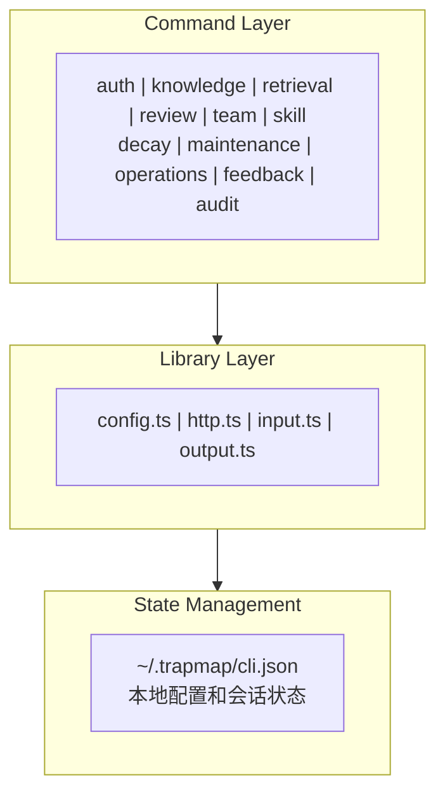
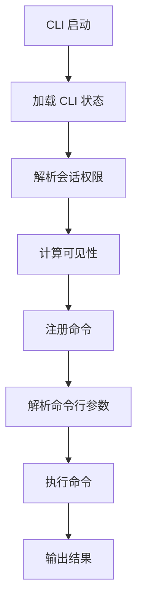
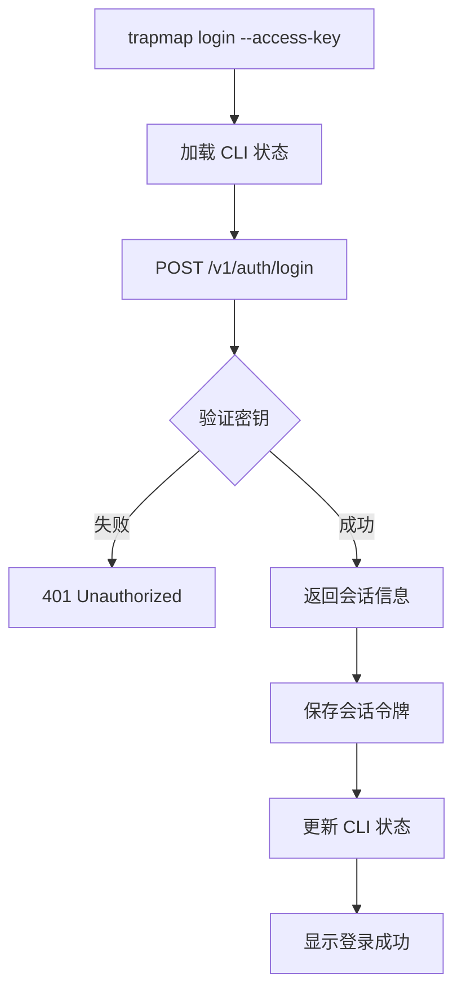

# 客户端运行逻辑 (Client Architecture)

## 概述

TrapMap 的客户端（CLI）基于 Commander.js 构建，提供终端用户与 TrapMap 服务器交互的命令行界面。客户端通过 HTTP API 与服务器通信，支持知识提交、检索、审核、团队管理等操作。

## 客户端架构



## 命令注册流程



### 启动流程详解

1. **加载 CLI 状态**：从 `~/.trapmap/cli.json` 读取配置
2. **解析会话权限**：提取 `effectivePermissions` 和 `securityLevel`
3. **计算可见性**：根据权限决定哪些命令可用
4. **注册命令**：按可见性注册对应命令
5. **解析参数**：Commander 解析命令行参数
6. **执行命令**：调用对应命令处理函数
7. **输出结果**：格式化输出结果

## 状态管理

### CLI 状态结构

```typescript
interface CliState {
  serverUrl: string;              // 服务器 URL
  sessionToken: string | null;    // 会话令牌
  session: ActiveSession | null;  // 活动会话
  outputProfile?: OutputProfile;  // 输出配置
}
```

### 输出配置

```typescript
interface OutputProfile {
  tool: OutputToolProfile;        // 'claude-code' | 'codex' | 'opencode' | 'generic'
  modelHint?: OutputModelHint;    // 'claude' | 'gpt' | 'qwen' | 'generic'
  renderMode: OutputRenderMode;   // 'text' | 'json'
  graphPlanMode: OutputGraphPlanMode; // 'summary' | 'full' | 'skill-list'
  verbosity: OutputVerbosity;     // 'compact' | 'balanced' | 'detailed'
  includeRawHints: boolean;       // 是否包含原始提示
}
```

### 配置文件位置

- **路径**：`~/.trapmap/cli.json`
- **格式**：JSON
- **默认服务器**：`http://127.0.0.1:4000`（可通过 `TRAPMAP_SERVER_URL` 环境变量覆盖）

### 状态管理 API

```typescript
// 加载状态
async function loadCliState(): Promise<CliState>

// 保存状态
async function saveCliState(state: CliState): Promise<void>

// 更新状态
async function updateCliState(
  patch: Partial<CliState> | ((current: CliState) => CliState)
): Promise<CliState>

// 清除会话
async function clearSession(): Promise<CliState>
```

## HTTP 通信层

### API 请求函数

```typescript
async function apiRequest<T>(
  state: CliState,
  options: ApiRequestOptions,
): Promise<ApiResponse<T>>
```

### 请求选项

```typescript
interface ApiRequestOptions {
  path: string;                  // API 路径
  method?: 'GET' | 'POST' | 'PATCH'; // HTTP 方法
  body?: unknown;                // 请求体
  serverUrl?: string;            // 服务器 URL（覆盖默认）
  sessionToken?: string | null;  // 会话令牌（覆盖默认）
}
```

### 响应结构

```typescript
interface ApiResponse<T> {
  data: T;                       // 响应数据
  sessionToken: string | null;   // 新会话令牌（如果有）
}
```

### 认证机制

```typescript
// 请求头中添加认证
if (options.sessionToken ?? state.sessionToken) {
  headers.authorization = `Bearer ${options.sessionToken ?? state.sessionToken}`;
}

// 响应中可能包含新令牌
const sessionToken = response.headers.get('x-session-token');
```

### 错误处理

```typescript
class ApiError extends Error {
  constructor(
    public readonly statusCode: number,
    public readonly payload: unknown,
    message: string,
  ) {
    super(message);
  }
}
```

## 命令分类

### 认证命令

| 命令 | 描述 | 权限要求 |
|------|------|---------|
| `login` | 使用访问密钥登录 | 无 |
| `logout` | 清除本地会话并登出 | 已登录 |
| `session` | 查看当前会话状态 | 无 |

### 知识管理命令

| 命令 | 描述 | 权限要求 |
|------|------|---------|
| `submit` | 提交新知识条目 | knowledge:submit |
| `resubmit` | 重新提交被拒绝的条目 | knowledge:submit |
| `review-status` | 查看提交历史 | knowledge:submit/review/update |
| `supersede` | 用新条目替代旧条目 | knowledge:submit |

### 检索命令

| 命令 | 描述 | 权限要求 |
|------|------|---------|
| `search` | 语义检索 | knowledge:search |
| `search --v2` | 胶囊检索（v2） | knowledge:search |

### 审核命令

| 命令 | 描述 | 权限要求 |
|------|------|---------|
| `review:queue` | 查看待审核队列 | knowledge:review |
| `review:approve` | 批准条目 | knowledge:review |
| `review:reject` | 拒绝条目 | knowledge:review |

### 团队管理命令

| 命令 | 描述 | 权限要求 |
|------|------|---------|
| `team list` | 列出团队 | 已登录 |
| `team select` | 选择活动团队 | 已登录 |
| `team create` | 创建团队 | team:create + level >= 1 |

### 运维命令

| 命令 | 描述 | 权限要求 |
|------|------|---------|
| `list` | 列出知识条目 | knowledge:export |
| `edit` | 编辑知识条目 | knowledge:update |
| `deactivate` | 停用知识条目 | knowledge:update |
| `export` | 导出知识条目 | knowledge:export |
| `import` | 导入知识条目 | knowledge:import |

## 输入处理

### 文本输入解析

```typescript
// 支持多种输入方式
async function resolveTextInput(
  sources: { text?: string; file?: string; stdin?: boolean },
  fieldName: string,
): Promise<string>
```

**支持的输入方式**：
- `--detail <text>`：直接提供文本
- `--file <path>`：从文件读取
- `--stdin`：从标准输入读取

### 数组参数收集

```typescript
// 收集多次出现的选项
function collectValues(value: string, previous: string[]): string[]
```

**使用示例**：
```bash
trapmap submit --label trap --label typescript --label node
```

## 输出格式化

### 输出模式

| 模式 | 描述 | 使用场景 |
|------|------|---------|
| `text` | 人类可读文本 | 终端交互 |
| `json` | JSON 格式 | 脚本集成 |

### 命令结果结构

```typescript
interface CommandResult {
  action: string;                // 操作名称
  success: boolean;              // 是否成功
  summary: string;               // 摘要
  artifacts: Artifact[];         // 产物列表
  nextSteps: string[];           // 下一步建议
}
```

### 知识条目格式化

```typescript
function formatEntry(entry: KnowledgeEntry): string {
  const lines = [
    `${entry.id} [${entry.lifecycleState}]`,
    `Scope: ${entry.scope}`,
    `Required level: ${entry.requiredLevel}`,
    `Owner: ${entry.owner.handle}`,
    `Labels: ${entry.labels.join(', ')}`,
    `Shortcut: ${entry.shortcut}`,
    `History: ${entry.history.length} revision(s)`,
  ];

  // 添加智能体审核信息
  if (entry.agentReview) {
    lines.push(`Agent review: ${entry.agentReview.status}`);
  }

  // 添加审核历史
  if (entry.reviewHistory.length > 0) {
    const lastDecision = entry.reviewHistory.at(-1);
    lines.push(`Last decision: ${lastDecision.decision}`);
  }

  return lines.join('\n');
}
```

### 检索结果格式化

```typescript
function formatMatch(match: RetrievalMatch): string {
  const lines = [
    `${match.entryId}`,
    `Shortcut: ${match.shortcut}`,
    `Labels: ${match.labels.join(', ')}`,
    `Score: ${match.score.toFixed(2)}`,
    `Reason: ${match.reason}`,
  ];

  // 添加引用信息
  if (match.citation?.recallChannels?.length) {
    lines.push(`Channels: ${match.citation.recallChannels.join(', ')}`);
  }

  // 添加冲突信息
  if (match.conflicts?.length) {
    lines.push(formatConflicts(match.conflicts));
  }

  return lines.join('\n');
}
```

## 权限可见性

### 可见性计算

```typescript
const visibility = {
  allowTeamCreate: securityLevel >= 1 && hasPermission(effectivePermissions, 'team:create'),
  allowMemberCreate: securityLevel >= 1 && hasPermission(effectivePermissions, 'member:create'),
  allowKnowledgeSubmit: hasPermission(effectivePermissions, 'knowledge:submit'),
  allowKnowledgeReview: securityLevel >= 1 && hasPermission(effectivePermissions, 'knowledge:review'),
  allowKnowledgeSearch: hasPermission(effectivePermissions, 'knowledge:search'),
  // ... 更多权限检查
};
```

### 命令可见性矩阵

| 命令 | 权限要求 | 安全等级要求 |
|------|---------|-------------|
| `team create` | team:create | >= 1 |
| `member create` | member:create | >= 1 |
| `submit` | knowledge:submit | - |
| `review:queue` | knowledge:review | >= 1 |
| `search` | knowledge:search | - |
| `list` | knowledge:export | - |
| `edit` | knowledge:update | >= 1 |
| `import` | knowledge:import | >= 1 |

## 检索模式

### v1 检索（传统）

```bash
trapmap search "typescript async error handling"
trapmap search --mode hybrid "node memory leak"
trapmap search --mode graph-assisted "react useEffect cleanup"
```

**支持的模式**：
- `semantic`：纯语义相似度
- `hybrid`：语义 + BM25 关键词
- `graph-assisted`：语义 + 图关系

### v2 检索（胶囊）

```bash
trapmap search --v2 "typescript async error handling"
```

**特点**：
- 胶囊优先输出
- 包含 Profile 提示
- 支持冲突检测

## 登录流程



### 登录命令

```bash
# 使用访问密钥登录
trapmap login --access-key <key>

# 使用系统管理员密钥登录
trapmap login --system-admin-key <key>

# 指定服务器 URL
trapmap login --access-key <key> --server http://example.com:4000
```

## 提交流程

```mermaid
flowchart TD
    A[trapmap submit --scope global --label trap --shortcut "xxx" --detail "yyy"] --> B[加载 CLI 状态]
    B --> C[检查会话令牌]
    C -->|无令牌| D[提示登录]
    C -->|有令牌| E[解析输入]
    E --> F[解析边界约束]
    F --> G[POST /v1/knowledge]
    G --> H{服务器处理}
    H -->|成功| I[返回条目信息]
    H -->|失败| J[返回错误]
    I --> K[格式化输出]
    K --> L[显示结果]
```

### 提交命令

```bash
# 基本提交
trapmap submit \
  --scope global \
  --label trap \
  --label typescript \
  --shortcut "Promise 未捕获拒绝导致进程退出" \
  --detail "详细描述..."

# 从文件读取详情
trapmap submit \
  --scope project \
  --label bug \
  --shortcut "xxx" \
  --file ./detail.md

# 从标准输入读取
cat detail.md | trapmap submit --scope global --label trap --shortcut "xxx" --stdin
```

## 检索流程

```mermaid
flowchart TD
    A[trapmap search "query"] --> B[加载 CLI 状态]
    B --> C[检查会话令牌]
    C -->|无令牌| D[提示登录]
    C -->|有令牌| E[解析搜索参数]
    E --> F[构建请求体]
    F --> G[POST /v1/retrieval/search]
    G --> H{服务器处理}
    H -->|成功| I[返回检索结果]
    H -->|失败| J[返回错误]
    I --> K[格式化输出]
    K --> L[显示结果]
```

### 检索命令

```bash
# 基本搜索
trapmap search "typescript async error"

# 带过滤的搜索
trapmap search --label typescript --scope global "memory leak"

# 混合模式搜索
trapmap search --mode hybrid "react useEffect"

# 胶囊检索
trapmap search --v2 "node event loop"

# 从标准输入读取
echo "query text" | trapmap search --stdin
```

## 错误处理

### 常见错误

| 错误 | 原因 | 解决方法 |
|------|------|---------|
| `Not authenticated` | 未登录 | 运行 `trapmap login` |
| `403 Forbidden` | 权限不足 | 联系管理员提升权限 |
| `404 Not Found` | 条目不存在 | 检查条目 ID |
| `400 Bad Request` | 请求参数错误 | 检查命令参数 |

### 错误输出

```typescript
// 错误格式化
function printError(error: Error): void {
  if (error instanceof ApiError) {
    console.error(`API Error ${error.statusCode}: ${error.message}`);
  } else {
    console.error(`Error: ${error.message}`);
  }
  process.exit(1);
}
```

## 环境变量

| 变量 | 描述 | 默认值 |
|------|------|-------|
| `TRAPMAP_SERVER_URL` | 默认服务器 URL | `http://127.0.0.1:4000` |

## 参考文档

- [检索系统](RETRIEVAL.md)
- [治理模型](GOVERNANCE.md)
- [知识生命周期](KNOWLEDGE_LIFECYCLE.md)

## 相关源码

- [packages/cli/src/index.ts](../../packages/cli/src/index.ts)
- [packages/cli/src/lib/config.ts](../../packages/cli/src/lib/config.ts)
- [packages/cli/src/lib/http.ts](../../packages/cli/src/lib/http.ts)
- [packages/cli/src/lib/output.ts](../../packages/cli/src/lib/output.ts)
- [packages/cli/src/commands/](../../packages/cli/src/commands/)
