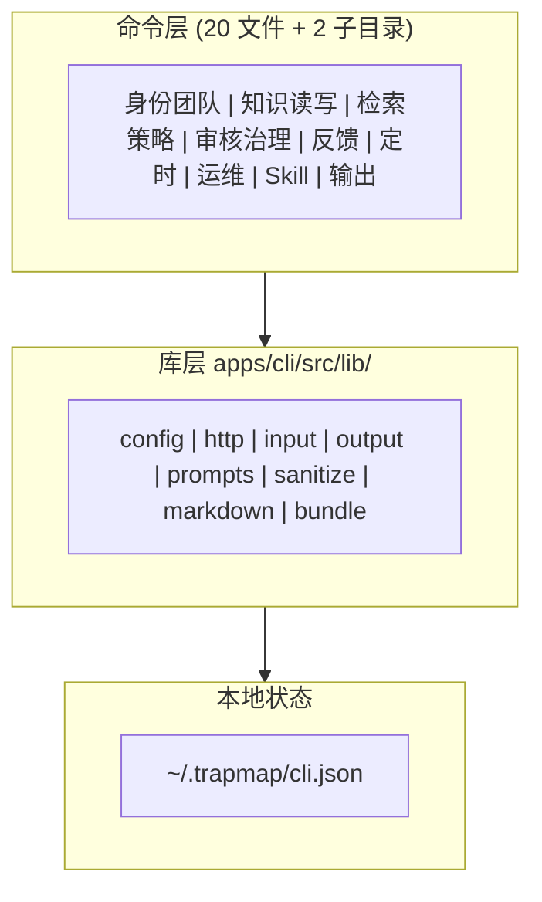

# 客户端运行逻辑

> 真源：`apps/cli/src/`、`apps/web-panel/src/`、`apps/mcp/src/`。状态：Active。

## 概述

你通过三类客户端接入 TrapMap：`apps/cli`（Commander 终端）、`apps/web-panel`（Web 面板）、`apps/mcp`（agent 接入封装）。三者都只连统一 gateway，不直连内部服务。zone 规则见 [架构边界守护](../BOUNDARIES.md)：`cli → [client-core, contracts, lib, skill-registry]`，`web-panel → [client-core, contracts]`，`mcp → [client-core, contracts, lib]`。

## 调试句柄边界

client 面只消费 additive debug 句柄：`requestId`、`traceId`、`queryId`、`feedbackId`、`asyncJobId`。你用它们把一次请求关联到 operator 或 badcase 导出路径。`workflowRunId`、`candidateId`、`entryId`、`artifactId` 不进默认通用 envelope；未来需要暴露时按路由单独设计。

## CLI 架构



命令注册按会话可见性裁剪（`apps/cli/src/index.ts:138-193`）。完整命令表见 [TrapMap CLI 参考](../CLI.md)。

## CLI 状态字段（压缩，OLD 540 行核心）

落点 `apps/cli/src/lib/config.ts:25-36`；持久化于 `~/.trapmap/cli.json`；默认 gateway `http://127.0.0.1:4000`（`TRAPMAP_GATEWAY_URL` 覆盖）。

| 字段 | 类型 | 说明 |
|---|---|---|
| `gatewayUrl?` | `string` | 统一 gateway URL（单 URL 模型；新写入只持久化此字段） |
| `backendTarget?` | `'light' \| 'heavy'` | 目标形态偏好：`light` = `local-agent` / `team-monolith`，`heavy` = `distributed`；缺省或未知值回退 `light`；只影响提示与默认行为，不改变 `gatewayUrl` |
| `sessionToken` | `string \| null` | 会话令牌 |
| `session` | `ActiveSession \| null` | 活动会话，携 `effectivePermissions` 与 `member.securityLevel`，是可见性计算的输入 |
| `outputProfile?` | `OutputProfile` | 输出配置：`tool`（`claude-code/codex/opencode/generic`）、`renderMode`（`text/json`）、`graphPlanMode`（`summary/full/skill-list`）、`verbosity`（`compact/balanced/detailed`）、`includeRawHints` |

状态 API：`loadCliState / saveCliState / updateCliState / clearSession`；`resolveCliGatewayUrl` 做 gateway 回退。`BackendTarget` 的 schema 与 profile 映射由 `@trapmap/contracts` 所有，client 不维护平行映射。

## 命令可见性矩阵（压缩）

落点 `apps/cli/src/index.ts:47-83`：`visibility` 由 `securityLevel` 与 `hasPermission(effectivePermissions, …)` 组合计算。

| 命令组 | 权限要求 | 安全等级 |
|---|---|---|
| `team create` | `team:create` | ≥ 1 |
| `member create/update`、`access-key` | `member:create` / `member:update` / `member:key:create` | ≥ 1 |
| `submit`、`resubmit`、`trap submit` | `knowledge:submit` | — |
| `review queue/approve/reject`、`skill review:*` | `knowledge:review` | ≥ 1 |
| `search`、`load`、`feedback` | `knowledge:search` | — |
| `list`、`export`、`status`、`activate` | `knowledge:export` | — |
| `import`、`migrate` | `knowledge:import` | ≥ 1 |
| `edit`、`deactivate`、`decay`、`maintenance` | `knowledge:update` | ≥ 1 |
| `audit` | `audit:read` | — |

## web-panel 与 mcp

- `apps/web-panel` 只依赖 `client-core` 与 `contracts`，渲染管理面（审核队列、activity、graph）。
- `apps/mcp` 为 agent 协议做外层封装；TrapMap 服务本体不实现 MCP 协议。

## 常见用法

### 你确认本机 CLI 可用

前置条件：离线可跑。

```bash
trapmap about
trapmap knowledge --help
```

完整命令表见 [TrapMap CLI 参考](../CLI.md)。

### 你起 web 面板

前置条件：gateway 运行中。

```bash
pnpm dev:web
```

`apps/web-panel` 只依赖 `client-core` 与 `contracts`，见本页「web-panel 与 mcp」节。

### 你跑 CLI 集成（dry）

前置条件：依赖已装；参数见 `scripts/cli-integration-run.sh`。

```bash
pnpm test:cli-integration:dry
```
