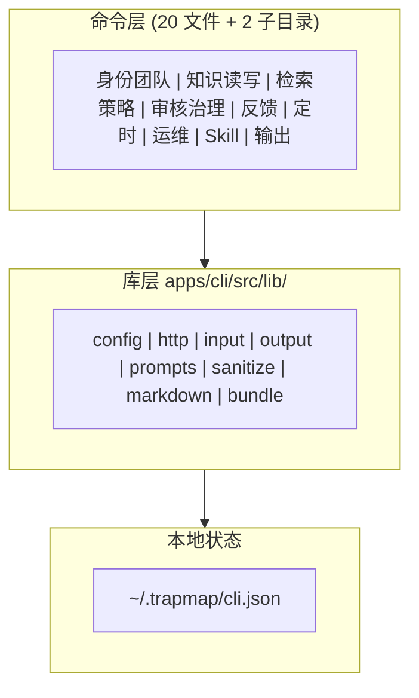

# 客户端运行逻辑

> 真源：`apps/cli/src/`、`apps/web-panel/src/`、`apps/mcp/src/`。状态：Active。

## 概述

你通过三类客户端接入 TrapMap：`apps/cli`（Commander 终端）、`apps/web-panel`（Web 面板）、`apps/mcp`（agent 接入封装）。三者都只连统一 gateway，不直连内部服务。zone 规则见 [架构边界守护](../BOUNDARIES.md)：`cli → [client-core, contracts, lib, skill-registry]`，`web-panel → [client-core, contracts]`，`mcp → [client-core, contracts, lib]`。

## 调试句柄边界

client 面只消费 additive debug 句柄：`requestId`、`traceId`、`queryId`、`feedbackId`、`asyncJobId`。你用它们把一次请求关联到 operator 或 badcase 导出路径。`workflowRunId`、`candidateId`、`entryId`、`artifactId` 不进默认通用 envelope；未来需要暴露时按路由单独设计。

## CLI 架构

命令注册按会话可见性裁剪（`apps/cli/src/index.ts:138-193`）。完整命令表见 [TrapMap CLI 参考](../CLI.md)。

## web-panel 与 mcp

- `apps/web-panel` 只依赖 `client-core` 与 `contracts`，渲染管理面（审核队列、activity、graph）。
- `apps/mcp` 为 agent 协议做外层封装；TrapMap 服务本体不实现 MCP 协议。
