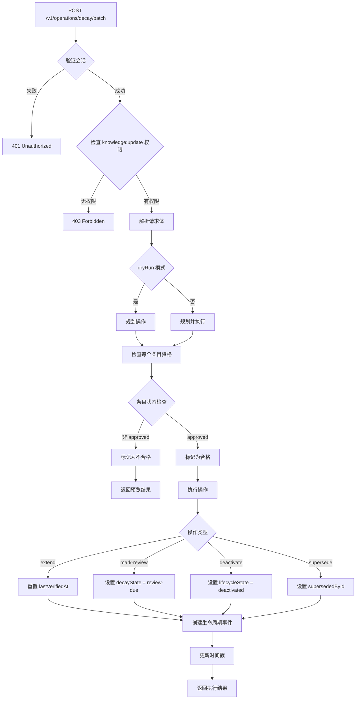
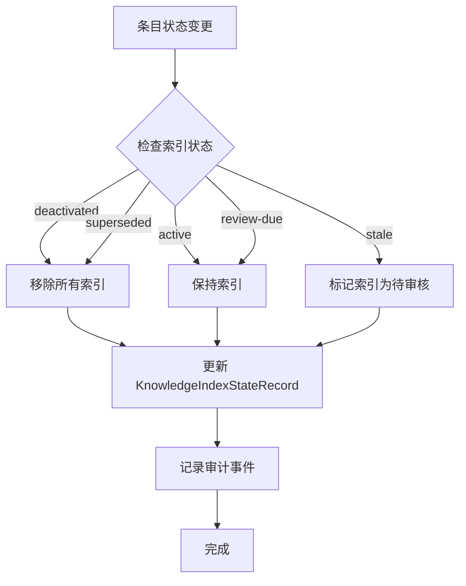
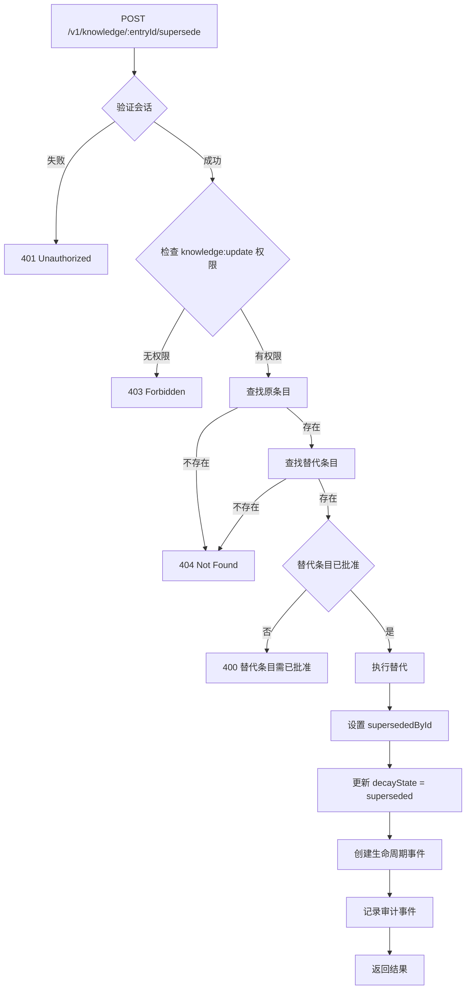

# 淘汰机制 (Decay Mechanism)

## 概述

TrapMap 的淘汰机制通过衰减状态机（Decay State Machine）管理知识条目的生命周期，确保过期或失效的知识被及时识别、审核或停用。该机制基于验证时间（lastVerifiedAt）和配置阈值自动计算条目状态。

## 衰减状态机

### 状态定义

```
┌─────────────────────────────────────────────────────────────────┐
│                    Decay State Machine                          │
├─────────────────────────────────────────────────────────────────┤
│                                                                 │
│  active ──────► review-due ──────► stale ──────► expired       │
│    ▲              │                                                │
│    │              │                                                │
│    └── extend() ──┘                                                │
│                                                                 │
│  superseded (独立状态，由替代操作触发)                           │
│                                                                 │
└─────────────────────────────────────────────────────────────────┘
```

### 状态转换规则

| 当前状态 | 触发条件 | 下一状态 | 说明 |
|---------|---------|---------|------|
| active | age >= reviewDueDays | review-due | 需要审核 |
| review-due | age >= staleDays | stale | 已过期 |
| stale | age >= expireDays | expired | 已失效 |
| 任何状态 | supersede() | superseded | 被替代 |
| 任何状态 | extend() | active | 延长验证时间 |
| 任何状态 | mark-review() | review-due | 标记为待审核 |

### 状态计算逻辑

```typescript
function computeDecayState(
  entry: DecayableEntry | null,
  config: DecayConfig,
  now: Date = new Date(),
): { decayState: DecayState; decayStateComputedAt: string } {
  const computedAt = now.toISOString();

  // 空条目默认为 active
  if (entry === null) {
    return { decayState: 'active', decayStateComputedAt: computedAt };
  }

  // 被替代的条目保持 superseded
  if (entry.supersededById !== null) {
    return { decayState: 'superseded', decayStateComputedAt: computedAt };
  }

  // 计算年龄（天数）
  const verifiedAt = new Date(entry.lastVerifiedAt);
  const ageMs = now.getTime() - verifiedAt.getTime();
  const ageDays = ageMs / (1000 * 60 * 60 * 24);

  // 按严重程度检查阈值
  if (ageDays >= config.expireDays) {
    return { decayState: 'expired', decayStateComputedAt: computedAt };
  }

  if (ageDays >= config.staleDays) {
    return { decayState: 'stale', decayStateComputedAt: computedAt };
  }

  if (ageDays >= config.reviewDueDays) {
    return { decayState: 'review-due', decayStateComputedAt: computedAt };
  }

  return { decayState: 'active', decayStateComputedAt: computedAt };
}
```

## 衰减配置

### 默认配置

```typescript
const DEFAULT_DECAY_CONFIG: DecayConfig = {
  reviewDueDays: 90,   // 90 天后需要审核
  staleDays: 180,      // 180 天后标记为过期
  expireDays: 365,     // 365 天后标记为失效
  enabled: false,      // 默认禁用
};
```

### 配置验证

```typescript
function validateDecayConfig(config: DecayConfig): boolean {
  return config.reviewDueDays <= config.staleDays && 
         config.staleDays <= config.expireDays;
}
```

### 配置约束

- `reviewDueDays <= staleDays <= expireDays` 必须成立
- 所有值必须为正整数
- `enabled` 控制是否启用衰减机制

## 状态类型

### 状态分类

| 状态 | 类型 | 需要人工干预 | 说明 |
|------|------|-------------|------|
| active | 正常 | 否 | 条目有效 |
| review-due | 警告 | 是 | 需要审核 |
| stale | 严重 | 是 | 已过期 |
| expired | 终态 | 是 | 已失效 |
| superseded | 终态 | 否 | 被替代 |

### 状态守卫函数

```typescript
// 检查是否为终态
function isTerminalDecayState(state: DecayState): boolean {
  return state === 'superseded' || state === 'expired';
}

// 检查是否需要人工关注
function requiresAttention(state: DecayState): boolean {
  return state !== 'active';
}
```

## 批量衰减操作

### 操作类型

| 操作 | 描述 | 适用状态 | 效果 |
|------|------|---------|------|
| **extend** | 延长验证时间 | 任何 approved 条目 | 重置为 active |
| **mark-review** | 标记为待审核 | 任何 approved 条目 | 设置为 review-due |
| **deactivate** | 停用条目 | 任何 approved 条目 | 生命周期状态 → deactivated |
| **supersede** | 替代条目 | 任何 approved 条目 | 设置为 superseded |

### 批量操作 API

```typescript
// POST /v1/operations/decay/batch
interface BatchOperationRequest {
  entryIds: EntityId[];
  action: 'extend' | 'mark-review' | 'deactivate' | 'supersede';
  extendDays?: number;      // extend 操作使用
  replacementId?: EntityId; // supersede 操作使用
  dryRun?: boolean;         // 预览模式
}
```

### 批量操作流程图



### 资格检查

```typescript
// 批量操作资格检查
function checkEligibility(entry: KnowledgeRecord, action: BatchAction): {
  eligible: boolean;
  reason: string | null;
} {
  // 所有操作都要求条目为 approved 状态
  if (entry.lifecycleState !== 'approved') {
    return {
      eligible: false,
      reason: 'Only approved entries can be modified'
    };
  }

  // supersede 特殊检查
  if (action === 'supersede') {
    if (!replacementId) {
      return { eligible: false, reason: 'replacementId required' };
    }
    if (entryId === replacementId) {
      return { eligible: false, reason: 'Cannot supersede with itself' };
    }
    if (!replacementEntry) {
      return { eligible: false, reason: 'Replacement entry not found' };
    }
    if (replacementEntry.lifecycleState !== 'approved') {
      return { eligible: false, reason: 'Replacement must be approved' };
    }
  }

  return { eligible: true, reason: null };
}
```

## 维护管理 (Maintenance Management)

### 维护元数据

```typescript
interface MaintenanceMeta {
  maintainer: ActorRef | null;  // 维护者
  reviewBy: string | null;      // 审核截止时间
}
```

### 维护操作

| 操作 | 描述 | 效果 |
|------|------|------|
| **assign-owner** | 分配维护者 | 设置 maintainerUserId |
| **extend-review** | 延长审核期限 | 更新 reviewBy 时间 |
| **mark-verified** | 标记已验证 | 更新 lastVerifiedAt |

### 维护检查点

```typescript
// 检查审核是否过期
function isReviewOverdue(reviewBy: string | null, now: Date): boolean {
  if (!reviewBy) return false;
  return new Date(reviewBy) < now;
}

// 检查验证是否过期
function isStaleVerification(
  lastVerifiedAt: string | null,
  staleDays: number,
  now: Date
): boolean {
  if (!lastVerifiedAt) return true;
  const ageDays = (now.getTime() - new Date(lastVerifiedAt).getTime()) / (1000 * 60 * 60 * 24);
  return ageDays >= staleDays;
}
```

## 索引同步

### 索引一致性

淘汰机制需要确保索引与条目状态一致：



### 索引同步 API

```typescript
// POST /v1/admin/reconcile-knowledge-indexes
// 系统管理员专用，批量同步索引状态
```

## 衰减状态查询

### 查询端点

| 端点 | 方法 | 描述 | 权限 |
|------|------|------|------|
| `/v1/operations/decay/entries` | GET | 列出衰减状态条目 | knowledge:export |
| `/v1/operations/decay/batch` | POST | 批量衰减操作 | knowledge:update |
| `/v1/operations/decay/search` | POST | 模式搜索衰减条目 | knowledge:export |

### 查询过滤

```typescript
// GET /v1/operations/decay/entries
interface DecayEntryListRequest {
  decayStates?: DecayState[];  // 按衰减状态过滤
  ageMinDays?: number;         // 最小年龄
  ageMaxDays?: number;         // 最大年龄
  labels?: string[];           // 按标签过滤
  scope?: 'global' | 'project'; // 按作用域过滤
  limit?: number;              // 返回数量限制
}
```

## 审计事件

淘汰机制产生的审计事件：

```typescript
type DecayAuditEvent =
  | { type: 'decay.extended'; actorId: EntityId; entryId: EntityId }
  | { type: 'decay.marked-review'; actorId: EntityId; entryId: EntityId }
  | { type: 'decay.deactivated'; actorId: EntityId; entryId: EntityId }
  | { type: 'decay.superseded'; actorId: EntityId; entryId: EntityId; replacementId: EntityId }
  | { type: 'maintenance.owner-assigned'; actorId: EntityId; entryId: EntityId }
  | { type: 'maintenance.review-extended'; actorId: EntityId; entryId: EntityId }
  | { type: 'maintenance.verified'; actorId: EntityId; entryId: EntityId };
```

## 替代机制 (Supersede)

### 替代流程



### 替代实现

```typescript
function supersedeEntry(args: {
  store: SkillShareerStore;
  data: StoreData;
  entryId: EntityId;
  replacementId: EntityId;
  actorId: EntityId;
}): KnowledgeRecord {
  const entry = data.knowledgeEntries.find(e => e.id === entryId);
  const replacement = data.knowledgeEntries.find(e => e.id === replacementId);
  
  if (!entry || !replacement) {
    throw new AppError(404, 'entry_not_found', 'Entry not found');
  }
  
  if (replacement.lifecycleState !== 'approved') {
    throw new AppError(400, 'invalid_state', 'Replacement must be approved');
  }
  
  // 更新衰减元数据
  entry.decayMeta = {
    lastVerifiedAt: entry.decayMeta?.lastVerifiedAt ?? entry.updatedAt,
    decayState: 'superseded',
    supersededById: replacementId,
    decayStateComputedAt: nowIso(),
    freshnessType: entry.decayMeta?.freshnessType ?? 'evergreen',
  };
  
  // 创建生命周期事件
  const event: KnowledgeLifecycleEventRecord = {
    id: store.nextId(data, 'evt'),
    type: 'superseded',
    createdAt: nowIso(),
    actorUserId: args.actorId,
    submissionId: null,
    revision: null,
    state: entry.lifecycleState,
    note: `Superseded by ${replacementId}`,
  };
  entry.lifecycleHistory.push(event);
  
  return entry;
}
```

## 参考文档

- [知识生命周期](KNOWLEDGE_LIFECYCLE.md)
- [文档更新流程](UPDATE.md)
- [治理模型](GOVERNANCE.md)

## 相关源码

- [packages/server/src/routes/decay.ts](../../packages/server/src/routes/decay.ts)
- [packages/server/src/routes/maintenance.ts](../../packages/server/src/routes/maintenance.ts)
- [packages/server/src/lib/decay/state-machine.ts](../../packages/server/src/lib/decay/state-machine.ts)
- [packages/server/src/lib/decay/batch.ts](../../packages/server/src/lib/decay/batch.ts)
- [packages/server/src/lib/decay/supersede.ts](../../packages/server/src/lib/decay/supersede.ts)
