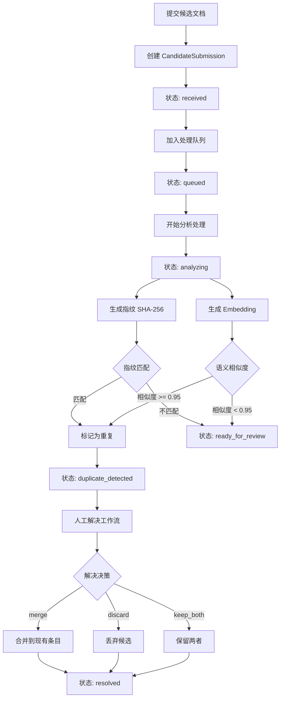
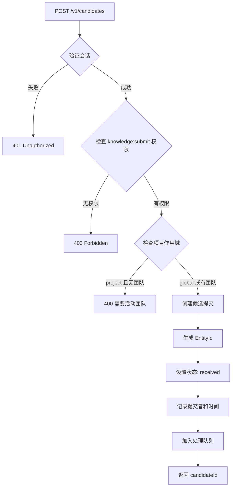
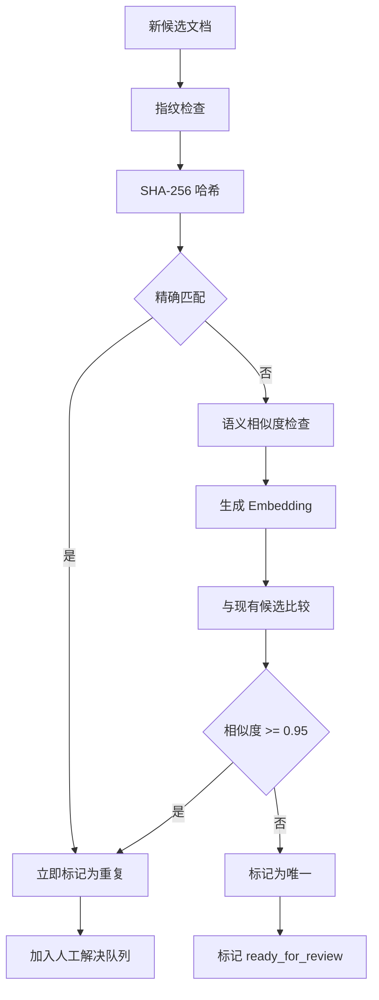
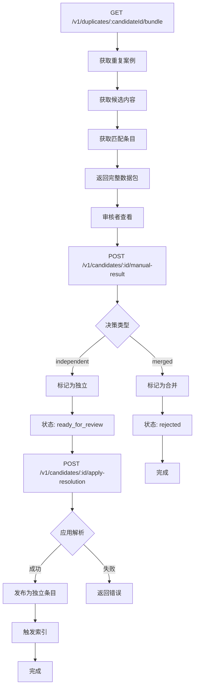

# 文档入库验重流程 (Deduplication Flow)

## 概述

TrapMap 的文档入库验重流程采用两阶段检测策略：先通过精确指纹匹配检测完全重复，再通过语义相似度检测近似重复。检测到的重复候选进入人工解决工作流，确保知识库的内容唯一性。

## 验重流程概览



## 两阶段重复检测

### 阶段一：精确指纹匹配

```typescript
// SHA-256 指纹生成
function computeSha256(content: string): string {
  let buffer: Buffer;
  try {
    buffer = Buffer.from(content, 'base64');
    // 验证 base64 有效性
    if (buffer.toString('base64') !== content) {
      buffer = Buffer.from(content, 'utf-8');
    }
  } catch {
    buffer = Buffer.from(content, 'utf-8');
  }
  return createHash('sha256').update(buffer).digest('hex');
}
```

**特点**：
- 100% 精确匹配
- 支持 base64 和文本内容
- 快速检测完全重复

### 阶段二：语义相似度匹配

```typescript
// 词元重叠度计算
function tokenize(text: string): Set<string> {
  return new Set(
    text
      .toLowerCase()
      .split(/[^a-z0-9]+/)
      .filter(part => part.length >= 3)
  );
}

function overlapScore(a: Set<string>, b: Set<string>): number {
  if (a.size === 0 || b.size === 0) return 0;
  
  let shared = 0;
  for (const token of a) {
    if (b.has(token)) shared += 1;
  }
  
  return shared / new Set([...a, ...b]).size;
}

// 风险等级转换
function toRisk(score: number): 'low' | 'medium' | 'high' {
  if (score >= 0.72) return 'high';
  if (score >= 0.38) return 'medium';
  return 'low';
}
```

**特点**：
- 余弦相似度阈值：≥ 0.95 判定为重复
- 检测近似重复（改写、重组）
- 基于词元重叠度计算

## 候选状态机

```
┌─────────────┐
│  RECEIVED   │  ← 初始状态
└──────┬──────┘
       │ process()
       ▼
┌─────────────┐
│   QUEUED    │  ← 在处理队列中
└──────┬──────┘
       │ start_processing()
       ▼
┌─────────────┐
│  ANALYZING  │  ← 正在处理
└──────┬──────┘
       │
       ├──────────────────────────────┐
       ▼                              ▼
┌────────────────────┐      ┌─────────────────┐
│ DUPLICATE_DETECTED │      │READY_FOR_REVIEW │
│                    │      │                 │
│  需要人工解决       │      │  唯一内容        │
│                    │      │  可发布          │
└──────┬─────────────┘      └─────────────────┘
       │ manual_resolution()
       ▼
┌─────────────┐
│  RESOLVED   │  ← 终态
└─────────────┘
```

## 候选提交流程

### API 端点

```typescript
// POST /v1/candidates
interface CandidateSubmissionRequest {
  sourceType: 'trap' | 'skill';
  payload: {
    // Trap payload
    scope?: 'global' | 'project';
    labels: string[];
    shortcut: string;
    detail: string;
    requiredLevel?: number;
    
    // Skill payload
    files?: Array<{
      path: string;
      content: string;
      mediaType: string;
    }>;
  };
}
```

### 提交流程图



## 后台处理流程

### 处理器实现

```typescript
interface CandidateProcessorServices {
  store: SkillShareerStore;
  getSnapshot: () => Promise<StoreData>;
}

// 调度候选处理
function scheduleCandidateProcessing(
  candidateId: EntityId,
  services: CandidateProcessorServices
): void {
  // 异步处理，不阻塞请求
  processCandidate(candidateId, services);
}

async function processCandidate(
  candidateId: EntityId,
  services: CandidateProcessorServices
): Promise<void> {
  // 1. 更新状态为 analyzing
  await updateStatus(candidateId, 'analyzing');
  
  // 2. 生成指纹
  const fingerprint = await generateFingerprint(candidateId);
  
  // 3. 生成 embedding
  const embedding = await generateEmbedding(candidateId);
  
  // 4. 检查重复
  const duplicates = await findDuplicates(candidateId, fingerprint, embedding);
  
  if (duplicates.length > 0) {
    // 标记为重复
    await updateStatus(candidateId, 'duplicate_detected', { duplicates });
  } else {
    // 标记为可审核
    await updateStatus(candidateId, 'ready_for_review');
  }
}
```

## 重复检测流程图



## 人工解决工作流

### 解决选项

| 选项 | 描述 | 结果 |
|------|------|------|
| **merge** | 合并到现有条目 | 候选被丢弃，内容合并 |
| **discard** | 丢弃候选 | 候选被标记为 rejected |
| **keep_both** | 保留两者 | 候选作为独立条目发布 |

### API 端点

```typescript
// POST /v1/candidates/:id/manual-result
interface ManualResolutionRequest {
  decision: 'independent' | 'merged';
  notes: string;
  mergedWith?: {
    entityType: 'trap' | 'skill';
    entityId: EntityId;
  };
}
```

### 人工解决流程图



### 解析应用

```typescript
// POST /v1/candidates/:candidateId/apply-resolution
function applyManualResultResolution(args: {
  store: SkillShareerStore;
  data: StoreData;
  candidateId: EntityId;
  actor: AuthContext;
}): ResolutionResult {
  // 1. 验证候选状态
  // 2. 检查人工解决结果
  // 3. 根据决策执行操作
  // 4. 发布条目（如果是 independent）
  // 5. 记录审计事件
  
  return {
    success: true,
    candidate,
    outcome: {
      decision: 'independent',
      publishedEntityId: entryId,
      entityType: 'trap'
    }
  };
}
```

## 重复案例查询

### 查询端点

| 端点 | 方法 | 描述 |
|------|------|------|
| `/v1/duplicates` | GET | 列出所有重复案例 |
| `/v1/duplicates/:candidateId` | GET | 获取特定候选的重复案例 |
| `/v1/duplicates/:candidateId/bundle` | GET | 获取完整数据包供离线审核 |

### 数据包结构

```typescript
interface DuplicateJobBundleResponse {
  candidate: {
    id: EntityId;
    sourceType: 'trap' | 'skill';
    status: string;
    receivedAt: string;
    submittedBy: EntityId;
  };
  originalPayload: any;
  analysisSnapshot: any;
  matches: Array<{
    match: DuplicateMatch;
    entity: DuplicateJobMatchEntity;
  }>;
  expectedResultSchema: {
    description: string;
    fields: Array<{
      name: string;
      type: string;
      required: boolean;
      description: string;
    }>;
  };
}
```

## 检测策略对比

| 策略 | 方法 | 阈值 | 用途 | 性能 |
|------|------|------|------|------|
| 精确指纹 | SHA-256 哈希 | 100% 匹配 | 精确重复 | 快 |
| 语义相似度 | 词元重叠度 | ≥ 0.72 (high) | 近似重复 | 中 |
| 语义相似度 | 词元重叠度 | ≥ 0.38 (medium) | 可能重复 | 中 |

## 预审核集成

文档提交时也运行预审核（pre-review），包含重复检测：

```typescript
// 提交时的预审核
const preReview = await runPreReview({
  existingEntries: await knowledgeRepo.listByFilter({}),
  submission: payload,
  chatProvider: app.skillShareer.ai.chat,
  authorBoundary: payload.boundary ?? null,
});

// 预审核结果包含重复风险
interface AgentReviewResult {
  duplicateRisk: 'low' | 'medium' | 'high';
  correctnessRisk: 'low' | 'medium' | 'high';
  completenessRisk: 'low' | 'medium' | 'high';
  notes: string[];
}
```

## 审计事件

验重流程产生的审计事件：

```typescript
type DeduplicationAuditEvent =
  | { type: 'candidate.submitted'; actorId: EntityId; candidateId: EntityId }
  | { type: 'candidate.analyzed'; candidateId: EntityId; duplicateRisk: string }
  | { type: 'duplicate.detected'; candidateId: EntityId; matchedIds: EntityId[] }
  | { type: 'duplicate.resolved'; actorId: EntityId; candidateId: EntityId; decision: string }
  | { type: 'duplicate.resolved-independent'; actorId: EntityId; candidateId: EntityId }
  | { type: 'duplicate.resolved-merged'; actorId: EntityId; candidateId: EntityId };
```

## 参考文档

- [异步摄取管道](INGESTION.md)
- [知识生命周期](KNOWLEDGE_LIFECYCLE.md)
- [文档审批流程](REVIEW.md)

## 相关源码

- [packages/server/src/routes/candidates.ts](../../packages/server/src/routes/candidates.ts)
- [packages/server/src/lib/pre-review.ts](../../packages/server/src/lib/pre-review.ts)
- [packages/server/src/lib/candidates/processor.ts](../../packages/server/src/lib/candidates/processor.ts)
- [packages/server/src/lib/candidates/reconcile.ts](../../packages/server/src/lib/candidates/reconcile.ts)
