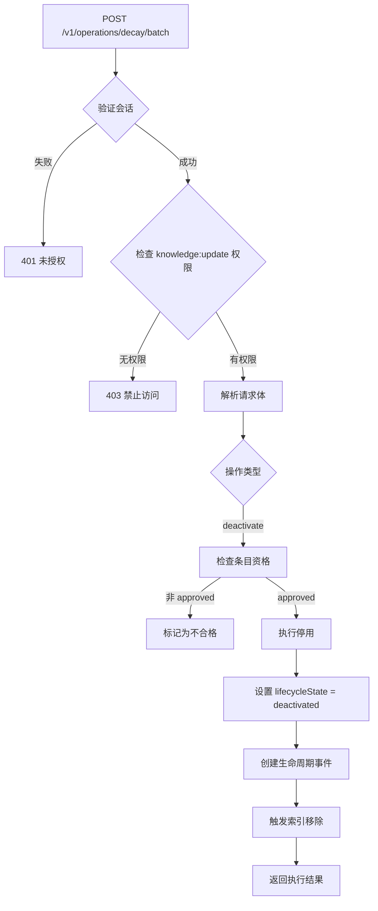
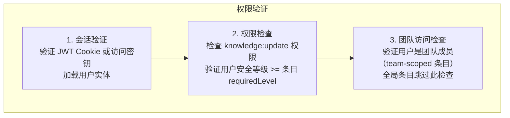
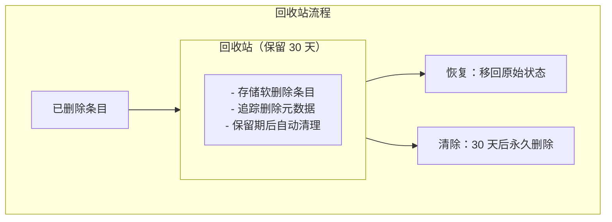
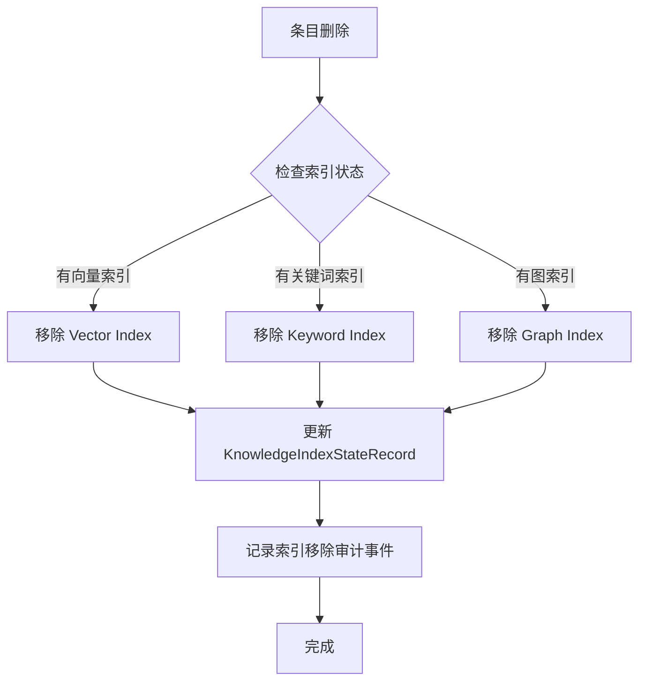

# 文档停用流程 (Deletion / Deactivation Flow)

## 概述

TrapMap 中的文档停用操作受到严格的生命周期状态和权限控制。当前版本不提供 DELETE 端点；条目通过衰减批量操作（`POST /v1/operations/decay/batch`，action=`deactivate`）停用。

## 停用策略按生命周期状态

| 生命周期状态 | 停用策略 | 说明 |
|-------------|---------|------|
| DRAFT | 不适用 | 草稿状态无停用操作 |
| SUBMITTED | 不允许停用 | 审核中条目需等待审核结果 |
| AGENT-PASS | 允许停用 | 通过 `deactivate` 操作停用 |
| AGENT-REJECTED | 允许停用 | 通过 `deactivate` 操作停用 |
| APPROVED | 允许停用 | 通过 `deactivate` 操作停用 |
| REJECTED | 允许停用 | 通过 `deactivate` 操作停用 |
| DEACTIVATED | 已停用 | 终态，无需操作 |

## 权限要求

删除操作需要以下权限验证：

```typescript
// 权限检查
requirePermission(auth, 'knowledge:update');

// 所有者检查（某些场景）
if (entry.ownerUserId !== auth.user?.id) {
  throw new AppError(403, 'forbidden', 'Only the owner may delete this entry');
}

// 团队访问检查
if (entry.teamId) {
  requireTeamAccess(auth, entry.teamId);
}
```

## 停用流程图

当前版本不提供 DELETE 端点。条目停用通过衰减批量操作完成：



## 删除流程详解

### 1. 权限验证阶段



### 2. 状态检查阶段

```typescript
// 状态检查逻辑
function canDeleteEntry(entry: KnowledgeRecord): boolean {
  const deletableStates = ['draft', 'rejected', 'agent-rejected', 'deactivated'];
  return deletableStates.includes(entry.lifecycleState);
}
```

### 3. 停用执行阶段

停用操作包含以下步骤：

1. **状态变更**：设置 `lifecycleState = 'deactivated'`
2. **索引清理**：
   - Vector Index: 移除 embedding 向量
   - Keyword Index: 移除 BM25 关键词
   - Graph Index: 移除图节点和边
3. **生命周期事件记录**：
   - 创建 `deactivated` 类型的生命周期事件

### 4. 审计事件记录

```typescript
// 审计事件类型
type DeactivationAuditEvent = {
  type: 'knowledge.deactivated';
  actorId: EntityId;
  entryId: EntityId;
  previousState: LifecycleState;
  deactivatedAt: string;
  reason?: string;
};

// 审计日志记录
await audit({
  type: 'knowledge.deactivated',
  actorId: auth.actorId,
  entryId: entry.id,
  previousState: entry.lifecycleState,
  deactivatedAt: nowIso(),
}, request);
```

### 软删除（建议实现）

- **定义**：标记条目为 deleted 状态，保留数据
- **适用场景**：APPROVED、DEACTIVATED 状态
- **优点**：可恢复，完整审计追踪
- **缺点**：存储开销，查询需过滤

```typescript
// 软删除实现示例
interface SoftDeleteMeta {
  deletedAt: string;
  deletedBy: ActorRef;
  reason?: string;
  recoverable: boolean;
  recoverableUntil?: string;  // 可恢复截止时间
}

interface KnowledgeRecord {
  // ... existing fields
  softDeleteMeta?: SoftDeleteMeta;
}
```

## 数据恢复机制

### 回收站机制（建议）



## 索引移除流程



## 批量删除（建议）

```typescript
// 批量删除 API 设计
interface BatchDeleteRequest {
  entryIds: EntityId[];
  reason?: string;
  dryRun?: boolean;  // 预览模式
}

interface BatchDeleteResponse {
  deleted: EntityId[];
  failed: Array<{
    entryId: EntityId;
    reason: string;
  }>;
  dryRun: boolean;
}
```

## 相关 API 端点

当前版本不提供 DELETE 端点。条目停用通过衰减批量操作完成：

| 端点 | 方法 | 描述 | 权限 |
|------|------|------|------|
| `/v1/operations/decay/batch` | POST | 批量衰减操作（含 deactivate） | knowledge:update |

## 注意事项

1. **级联删除**：删除条目时应同时删除关联的胶囊、工件派生产物
2. **外键约束**：PostgreSQL 中需处理外键引用（ON DELETE CASCADE）
3. **索引一致性**：删除后需触发索引同步，确保检索结果不包含已删除条目
4. **审计合规**：删除操作必须记录审计日志，保留操作者、时间、原因

## 参考文档

- [知识生命周期](KNOWLEDGE_LIFECYCLE.md)
- [治理模型](GOVERNANCE.md)
- [持久化存储层](PERSISTENCE.md)
- [审计日志](GOVERNANCE.md#审计日志-audit-logging)

## 相关源码

- [packages/server（Wave-10 已删除）/src/routes/knowledge.ts](../../../packages/server（Wave-10 已删除）/src/routes/knowledge.ts)
- [packages/server（Wave-10 已删除）/src/lib/knowledge.ts](../../../packages/server（Wave-10 已删除）/src/lib/knowledge.ts)
- [packages/server（Wave-10 已删除）/src/lib/lifecycle/state-machine.ts](../../../packages/server（Wave-10 已删除）/src/lib/lifecycle/state-machine.ts)
