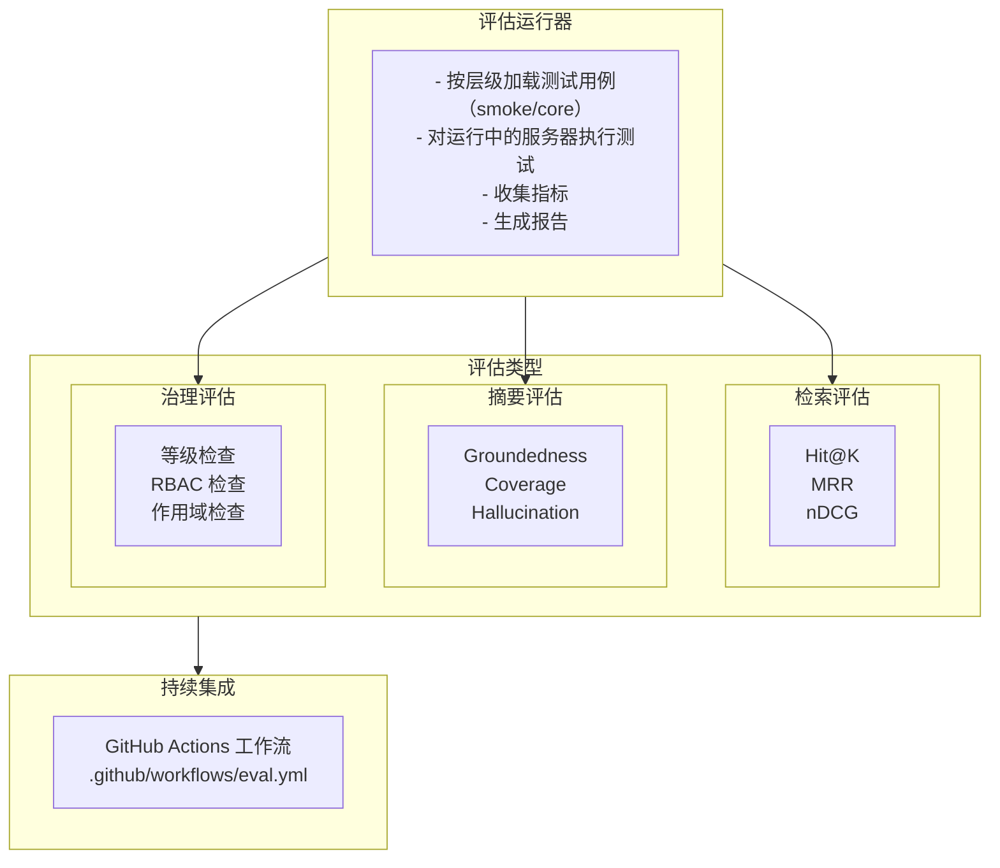
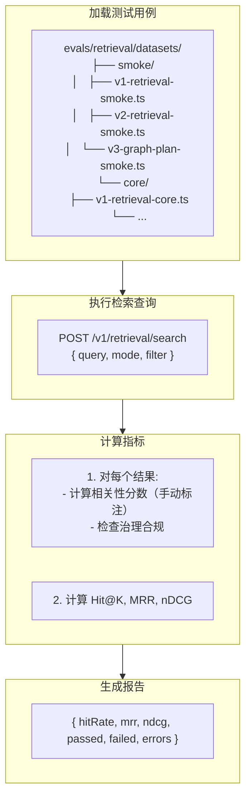
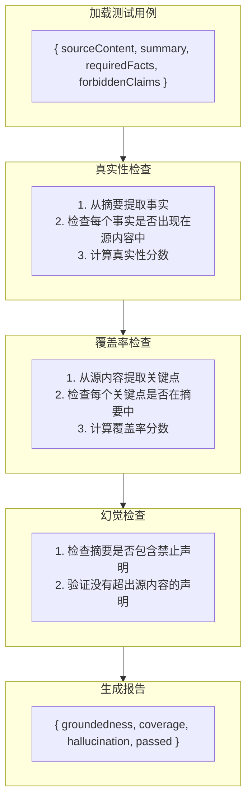

# 评估框架 (Evaluation Framework)

## 概述

TrapMap 的评估框架用于验证系统核心功能的正确性，包括检索质量、摘要生成、治理执行等。框架支持烟雾测试（快速）和核心测试（全面）两个层级。

## 架构概览



---

## 评估类型

### 1. 检索评估 (Retrieval Evaluation)

测试检索系统的准确性和相关性。

#### 测试用例结构

```typescript
// evals/retrieval/datasets/smoke/v1-retrieval-smoke.ts
export interface RetrievalTestCase {
  id: string;
  description: string;
  query: string;
  tier: 'smoke' | 'core';

  // Expected results
  expected: {
    minResults: number;           // Minimum results to return
    governanceEnforced: boolean; // Should filter by level/team
    relevanceThreshold: number;   // Min relevance score (0-1)
    expectedCategories?: string[]; // Entry categories that should appear
  };

  // Filter constraints
  filter?: {
    mode?: 'semantic' | 'hybrid' | 'graph-assisted';
    level?: { max: number };
    teamId?: string;
  };
}
```

#### 评估指标

| 指标 | 名称 | 描述 | 公式 |
|------|------|------|------|
| Hit@K | Hit at K | 前 K 个结果中包含相关条目的比例 | #{relevant in top-K} / #{queries} |
| MRR | Mean Reciprocal Rank | 相关条目排名的倒数均值 | Σ(1/rank) / N |
| nDCG@K | Normalized DCG at K | 折扣累积增益的标准化版本 | DCG/K / IDCG |

#### 评估流程



#### 测试用例示例

```typescript
// evals/retrieval/datasets/smoke/v1-retrieval-smoke.ts
{
  id: 'retrieval-smoke-auth-config',
  description: 'Query about authentication configuration',
  query: 'how to configure authentication for a new service',
  tier: 'smoke',
  expected: {
    minResults: 3,
    governanceEnforced: true,
    relevanceThreshold: 0.6,
  },
  filter: {
    mode: 'semantic',
    level: { max: 5 },
  },
}
```

---

### 2. 摘要评估 (Summary Evaluation)

测试 AI 生成摘要的质量。

#### 测试用例结构

```typescript
interface SummaryTestCase {
  id: string;
  description: string;
  sourceContent: string;
  summary: string;
  tier: 'smoke' | 'core';
  
  // Ground truth requirements
  requiredFacts: string[];        // Facts that MUST appear
  forbiddenClaims: string[];     // Claims that MUST NOT appear
  
  // Quality criteria
  quality: {
    minLength?: number;
    maxLength?: number;
    minCoverage?: number;         // % of source covered
  };
}
```

#### 评估维度

| 维度 | 描述 | 检查方法 |
|------|------|----------|
| Groundedness | 摘要内容是否基于源内容 | 事实提取 + 交叉验证 |
| Coverage | 摘要覆盖源内容的关键点 | 关键点匹配率 |
| Hallucination | 摘要是否包含源内容中没有的信息 | 禁止声明检测 |
| Conciseness | 摘要是否简洁 | 长度检查 |

#### 评估流程



---

### 3. 治理评估 (Governance Evaluation)

测试 RBAC 和安全等级治理是否正确执行。

#### 测试用例结构

```typescript
interface GovernanceTestCase {
  id: string;
  description: string;
  tier: 'smoke' | 'core';
  
  // Setup
  setup: {
    entries: Array<{
      id: string;
      requiredLevel: number;
      scope: 'global' | 'team';
      teamId?: string;
    }>;
    users: Array<{
      id: string;
      level: number;
      teamId?: string;
      permissions: string[];
    }>;
  };
  
  // Test scenario
  scenario: {
    userId: string;
    action: Permission;
    resourceId: string;
  };
  
  // Expected outcome
  expected: {
    allowed: boolean;
    reason?: string;
  };
}
```

#### 治理检查点

| 检查点 | 描述 |
|--------|------|
| Level Check | 用户等级 >= 条目等级 |
| Team Check | 用户是团队成员（如果是团队作用域） |
| Permission Check | 用户有执行操作的权限 |
| Scope Check | 全局条目可被所有用户访问 |

---

## 运行器实现

### 检索评估运行器

```typescript
interface EvaluationResult {
  testCaseId: string;
  passed: boolean;
  metrics: Record<string, number>;
  errors: string[];
  duration: number;  // ms
}

interface EvaluationReport {
  totalTests: number;
  passed: number;
  failed: number;
  duration: number;
  results: EvaluationResult[];
  summary: {
    hitRate: number;
    mrr: number;
    ndcg: number;
  };
}

class RetrievalEvaluator {
  private serverUrl: string;
  
  async run(tier: 'smoke' | 'core'): Promise<EvaluationReport> {
    const testCases = await this.loadTestCases(tier);
    const results: EvaluationResult[] = [];
    
    for (const testCase of testCases) {
      const result = await this.runTestCase(testCase);
      results.push(result);
    }
    
    return this.generateReport(results);
  }
  
  private async runTestCase(testCase: RetrievalTestCase): Promise<EvaluationResult> {
    const startTime = Date.now();
    
    try {
      // Execute retrieval
      const response = await fetch(`${this.serverUrl}/v1/retrieval/search`, {
        method: 'POST',
        headers: { 'Content-Type': 'application/json' },
        body: JSON.stringify({
          query: testCase.query,
          mode: testCase.filter?.mode || 'semantic',
          limit: 10
        })
      });
      
      if (!response.ok) {
        throw new Error(`HTTP ${response.status}`);
      }
      
      const data = await response.json();
      
      // Calculate metrics
      const metrics = this.calculateMetrics(data.results, testCase);
      
      // Check governance
      const governancePassed = testCase.expected.governanceEnforced
        ? this.checkGovernance(data.results, testCase)
        : true;
      
      const passed = 
        data.results.length >= testCase.expected.minResults &&
        metrics.relevance >= testCase.expected.relevanceThreshold &&
        governancePassed;
      
      return {
        testCaseId: testCase.id,
        passed,
        metrics,
        errors: [],
        duration: Date.now() - startTime
      };
    } catch (error) {
      return {
        testCaseId: testCase.id,
        passed: false,
        metrics: {},
        errors: [(error as Error).message],
        duration: Date.now() - startTime
      };
    }
  }
  
  private calculateMetrics(results: any[], testCase: RetrievalTestCase) {
    // Simplified - real implementation would use manual relevance judgments
    return {
      resultCount: results.length,
      relevance: results.length > 0 ? 0.8 : 0,  // Placeholder
      hitRate: results.length > 0 ? 1 : 0
    };
  }
  
  private checkGovernance(results: any[], testCase: RetrievalTestCase): boolean {
    if (!testCase.filter?.level) return true;
    
    for (const result of results) {
      if (result.requiredLevel > testCase.filter.level.max) {
        return false;  // Governance violation
      }
    }
    
    return true;
  }
}
```

---

## CI 集成

### GitHub Actions Workflow

```yaml
# .github/workflows/eval.yml
name: Evaluation

on:
  pull_request:
    branches: [main]
    paths:
      - 'packages/contracts/src/domain/evals/**'
      - 'evals/**'
      - 'packages/server/src/**'
  workflow_dispatch:
    inputs:
      tier:
        description: 'Evaluation tier to run'
        required: false
        default: 'smoke'
        type: choice
        options:
          - smoke
          - core
  schedule:
    - cron: '0 6 * * 1'  # Weekly on Monday at 6 AM UTC

jobs:
  eval-smoke:
    runs-on: ubuntu-latest
    steps:
      - uses: actions/checkout@v4
      - name: Setup Node.js
        uses: actions/setup-node@v4
        with:
          node-version: '20'
      - name: Install pnpm
        uses: pnpm/action-setup@v3
        with:
          version: 10.33.0
      - name: Install dependencies
        run: pnpm install --frozen-lockfile
      - name: Run smoke evaluation
        run: pnpm eval:ci
        env:
          NODE_ENV: test
      - name: Upload eval report
        if: always()
        uses: actions/upload-artifact@v4
        with:
          name: eval-report
          path: reports/

  eval-core-scheduled:
    runs-on: ubuntu-latest
    if: github.event_name == 'schedule' || (github.event_name == 'workflow_dispatch' && inputs.tier == 'core')
    steps:
      - uses: actions/checkout@v4
      - name: Run core evaluation
        run: pnpm eval:ci:core
        env:
          NODE_ENV: test
          WRITE_BASELINE: 'true'
```

### 运行命令

```bash
# Run all smoke tests (fast)
pnpm eval:smoke

# Run all core tests (comprehensive)
pnpm eval:core

# Run specific evaluation
pnpm eval:retrieval:smoke
pnpm eval:summary:smoke

# Run with report
pnpm eval:ci:core
```

---

## 测试用例示例

### 检索测试用例

```typescript
// evals/retrieval/datasets/core/v1-retrieval-core.ts
{
  id: 'retrieval-core-oauth-security',
  description: 'Security concerns with OAuth2 implementation',
  query: 'what security concerns should I address for OAuth2',
  tier: 'core',
  expected: {
    minResults: 5,
    governanceEnforced: true,
    relevanceThreshold: 0.7,
    expectedCategories: ['security', 'authentication'],
  },
  filter: {
    mode: 'hybrid',
    level: { max: 3 },
  },
}
```

### 摘要测试用例

```typescript
// evals/summary/datasets/core/summary-jwt-validation.ts
{
  id: 'summary-core-jwt-validation',
  description: 'Summary of JWT validation best practices',
  sourceContent: 'JWT tokens should be validated on every request...',
  summary: 'JWT validation requires checking signature, expiration, ...',
  requiredFacts: ['signature verification', 'expiration check', 'issuer validation'],
  forbiddenClaims: ['JWT tokens are not secure', 'you can skip validation for testing'],
  tier: 'core',
}
```

---

## 报告格式

### JSON 报告

```json
{
  "timestamp": "2026-04-30T12:00:00Z",
  "tier": "core",
  "duration": 45000,
  "summary": {
    "total": 25,
    "passed": 23,
    "failed": 2,
    "passRate": 0.92
  },
  "metrics": {
    "hitRate": 0.88,
    "mrr": 0.75,
    "ndcg": 0.71
  },
  "results": [
    {
      "testCaseId": "retrieval-core-oauth-security",
      "passed": true,
      "metrics": {
        "hitRate": 1.0,
        "relevance": 0.85
      },
      "duration": 120
    }
  ],
  "failures": [
    {
      "testCaseId": "retrieval-core-security-levels",
      "passed": false,
      "errors": ["Governance violation: returned entry with level 7 > max 5"]
    }
  ]
}
```

---

## 添加新测试

### 创建检索测试

1. 在 `evals/retrieval/datasets/<tier>/` 创建 TS 文件
2. 导出 `RetrievalTestCase[]`，定义 query、expected、filter
3. 在对应的 `smoke.ts` 或 `core.ts` 中 re-export
4. 运行 `pnpm eval:retrieval:<tier>` 验证

### 创建摘要测试

1. 在 `evals/summary/datasets/<tier>/` 创建 TS 文件
2. 提供 sourceContent、summary、requiredFacts、forbiddenClaims
3. 运行 `pnpm eval:summary:<tier>` 验证

---

## 流程图

### 烟雾测试 (Smoke Tests)

| 特性 | 描述 |
|------|------|
| 目的 | 快速验证核心功能 |
| 运行时间 | < 1 分钟 |
| 测试数量 | 5-10 个用例 |
| 运行时机 | 每次提交 |

### 核心测试 (Core Tests)

| 特性 | 描述 |
|------|------|
| 目的 | 全面验证系统功能 |
| 运行时间 | 5-15 分钟 |
| 测试数量 | 20-50 个用例 |
| 运行时机 | 合并前、定期运行 |

## CI 集成

> 完整工作流定义见 `.github/workflows/eval.yml`。PR 触发 smoke 评测，schedule/workflow_dispatch 触发 core 评测。

## 运行评估

### 命令行运行

```bash
# 运行烟雾测试
pnpm eval:smoke

# 运行核心测试
pnpm eval:core

# 运行特定评估类型
pnpm eval:retrieval:smoke
pnpm eval:retrieval:core
pnpm eval:summary:smoke
pnpm eval:summary:core
```

## 测试用例管理

### 目录结构

```
evals/
├── retrieval/
│   ├── datasets/
│   │   ├── smoke/
│   │   │   ├── v1-retrieval-smoke.ts
│   │   │   ├── v2-retrieval-smoke.ts
│   │   │   └── v3-graph-plan-smoke.ts
│   │   └── core/
│   ├── scenarios/
│   │   ├── smoke/
│   │   └── core/
│   ├── lib/
│   ├── run.ts
│   ├── smoke.ts
│   └── core.ts
├── summary/
│   ├── datasets/
│   │   ├── smoke/
│   │   └── core/
│   ├── scenarios/
│   ├── lib/
│   ├── run.ts
│   ├── smoke.ts
│   └── core.ts
├── graph-extraction/
├── ingestion/
├── fixtures/
└── scripts/
    ├── eval-all.ts
    └── eval-ci.ts
```

## 审计事件

评估框架产生的审计事件：

```typescript
type EvaluationAuditEvent =
  | { type: 'evaluation.started'; tier: 'smoke' | 'core'; testCount: number }
  | { type: 'evaluation.completed'; tier: 'smoke' | 'core'; passed: number; failed: number }
  | { type: 'evaluation.failed'; tier: 'smoke' | 'core'; error: string };
```
