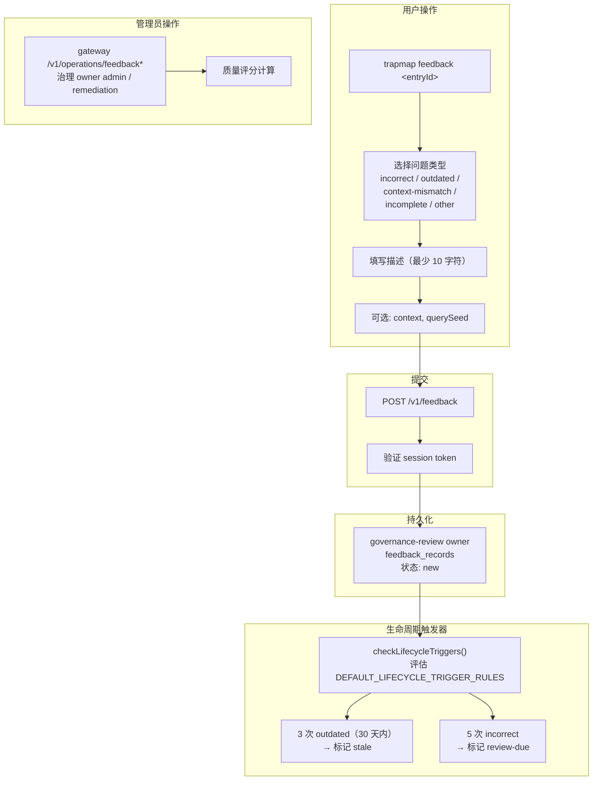

# 用户反馈机制 (User Feedback)

## 概述

用户反馈机制允许认证用户对已发布的知识条目（trap）提交问题报告，驱动条目的生命周期状态自动衰变。反馈是用户主动触发的，但后续的状态转换由系统自动执行。

## 反馈流程



## 问题类型 (Problem Types)

| 类型 | 含义 |
|------|------|
| `incorrect` | 内容有事实错误 |
| `outdated` | 内容已过时 |
| `context-mismatch` | 条目在当前上下文中不适用 |
| `incomplete` | 内容不完整 |
| `other` | 其他问题 |

## CLI 交互模式

交互式模式下，CLI 引导用户完成：

1. 选择问题类型（单选）
2. 填写描述（必填，最少 10 字符）
3. 补充上下文（可选）
4. 提供 querySeed（可选，用于记录触发该条目被检出的检索查询）

## API

### 提交反馈

```typescript
// POST /v1/feedback
interface FeedbackRequest {
  entryId: EntityId;
  entryType: 'trap' | 'skill';
  problemType: 'incorrect' | 'outdated' | 'context-mismatch' | 'incomplete' | 'other';
  description: string;       // 最少 10 字符
  context?: string;          // 可选上下文
  querySeed?: string;        // 可选，触发反馈的检索查询
}
```

### 管理员操作

```typescript
// Public gateway URLs remain stable and forward to governance-review:
// - GET  /v1/operations/feedback
// - POST /v1/operations/feedback/batch
// - GET  /v1/operations/feedback/stats/:entryId
// - GET  /v1/operations/feedback/remediation
// - GET  /v1/operations/feedback/remediation/:entryId
// - POST /v1/operations/feedback/remediation/:entryId/complete

// Internal owner routes are under /internal/feedback/admin*.
```

## 生命周期触发器

治理 owner 在反馈写入后评估累积反馈和 remediation 状态；需要重激活、重索引或 badcase draft 的 follow-up 通过 job-runtime 异步命令执行：

| 条件 | 动作 |
|------|------|
| 30 天内收到 3 次 `outdated` | 条目标记为 `stale` |
| 累计 5 次 `incorrect` | 条目标记为 `review-due` |

触发规则定义在 contracts 层的 `DEFAULT_LIFECYCLE_TRIGGER_RULES` 中。

## 权限要求

- 提交反馈：需要认证用户 session token
- 管理反馈：需要管理员权限

## 与候选管线的关系

反馈机制作用于**已发布的条目**，是发布后的质量保障手段；候选管线作用于**提交阶段**，是发布前的去重审核手段。两者形成内容质量的闭环：

```
提交 → 候选管线（去重/审核）→ 发布 → 用户使用 → 反馈 → 生命周期衰变
```

## 参考文档

- [知识生命周期](KNOWLEDGE_LIFECYCLE.md)
- [衰变管理](DECAY.md)
- [异步摄取管道](INGESTION.md)

## 相关源码

- [packages/cli/src/commands/feedback.ts](../../../packages/cli/src/commands/feedback.ts)
- [packages/service-governance-review/src/index.ts](../../../packages/service-governance-review/src/index.ts)
- [packages/service-governance-review/src/admin.ts](../../../packages/service-governance-review/src/admin.ts)
- [packages/service-governance-review/src/routes.ts](../../../packages/service-governance-review/src/routes.ts)
- [packages/host-distributed/src/gateway/routes.ts](../../../packages/host-distributed/src/gateway/routes.ts)
- [packages/contracts/src/domain/](../../../packages/contracts/src/domain/)
