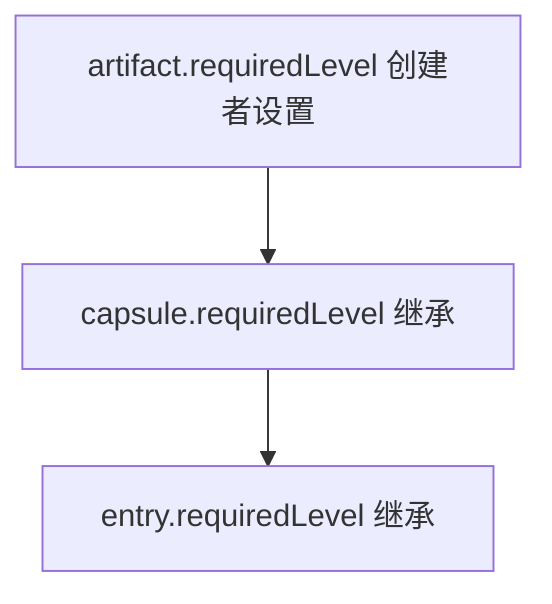

# 治理模型

> 真源：`packages/service-governance-review/src/`（`routes.ts`、`admin.ts`、`conflict-workflow.ts`）、`packages/host-distributed/src/gateway/routes.ts`。状态：Active。

## Owner 边界

`service-governance-review` 是 feedback、conflict、remediation 与 operator projection 的唯一业务 owner。它经 owner-local PostgreSQL ports 与 internal routes 提供 feedback admin、统计、批处理、remediation 与冲突工作流；最终知识生命周期变更经 `KnowledgeWritePort` 委托给 `knowledge-write`。`service-job-runtime` 只做 typed governance commands 的排队与执行底座（queue、retry / backoff、lease / reclaim、workflow、dead-letter），治理业务规则不回流 queue owner。distributed gateway 保留既有 public URL、认证 actor、trace / correlation header 与 canonical error 语义，把请求转发给 governance owner。

知识域治理约束已从应用层校验升级为数据库级约束：`knowledge_entries` 补 `CHECK` 约束（`scope`、`lifecycle_state`、`required_level`），`lifecycle_events` 补 `type` CHECK 约束；标签、边界、维护分配已从 JSONB 拆为结构化子表，支持按治理维度直接查询、过滤与索引。

## 安全等级

安全等级是 0-10 的整数：

| 等级 | 名称 | 示例 |
|---|---|---|
| 0 | 公开 | 公开文档、公共知识 |
| 1-3 | 内部 | 内部流程、团队知识 |
| 4-6 | 机密 | 敏感业务信息 |
| 7-9 | 高度机密 | 核心架构、密钥 |
| 10 | 最高机密 | 系统密钥、管理员凭据 |

继承链：`artifact.requiredLevel` 由创建者设置 → `capsule.requiredLevel` 继承 artifact → `entry.requiredLevel` 继承 capsule。



## 生命周期状态机（B-18，唯一落点；ARCHITECTURE.md 不重复）

7 状态枚举与 `knowledge_entries` CHECK 约束逐字一致（`packages/db/src/schema/knowledge.ts:224-225`，镜像 `packages/db/migrations/schema.sql:459`；Zod 源 `packages/contracts/src/domain/common.ts:38-46`）：`draft / submitted / agent-pass / agent-rejected / approved / rejected / deactivated`。

| 当前状态 | 允许转换到 | 触发条件 | 必需权限 |
|---|---|---|---|
| `draft` | `submitted` | `submit()` | `knowledge:submit` |
| `submitted` | `agent-pass`、`agent-rejected` | 智能体审核完成 | SYSTEM |
| `agent-pass` | `approved`、`rejected` | 人工审核 | `knowledge:review` |
| `agent-rejected` | `submitted` | `resubmit()` | `knowledge:submit` |
| `approved` | `deactivated` | `deactivate()` | `knowledge:update` |
| `rejected` | `submitted` | `resubmit()` | `knowledge:submit` |
| `deactivated` | （无，终态） | — | — |

decay 守卫（`packages/backend-core/src/knowledge-read/domain/eligibility.ts`）：`decayStateForAge(lastVerifiedAt, config): RetrievalDecayState`（`active / review-due / stale / expired` 按 `reviewDueDays / staleDays / expireDays` 判定）；`computeDecayState(decayMeta, config)`（`superseded` 优先于 age，`enabled=false` 时保留持久化值）；`isEligibleForActor(entry, auth, decayState)`（system-admin 放行，其余要求非 `expired/superseded` + 等级 + 团队匹配）。默认检索排除 `expired` 与 `superseded`。

## RBAC 角色/权限矩阵（压缩，OLD 全文见 `git show ec0e4c99:docs/architecture/components/GOVERNANCE.md`）

权限定义源 `packages/contracts/src/domain/common.ts`；检查基于 `ResolvedAuthContext.effectivePermissions` 数组，而非全局角色常量映射。

| 权限 | 覆盖操作 |
|---|---|
| `session:read` | 读取会话 |
| `knowledge:submit` | 提交 / 重提 |
| `knowledge:search` | 搜索、检索、feedback 提交 |
| `knowledge:review` | 审核（批准 / 拒绝 / 退回修正，需 `securityLevel ≥ 1`） |
| `knowledge:update` | 更新条目、停用、decay / maintenance（需 `securityLevel ≥ 1`） |
| `knowledge:import` / `knowledge:export` | 批量导入（需等级 ≥ 1）/ 批量导出 |
| `audit:read` | 查看审计日志 |
| `stats:read` | 读取统计 |
| `team:create` / `team:list` / `team:select` | 团队管理（`create` 需等级 ≥ 1） |
| `member:create` / `member:update` / `member:key:create` | 成员与密钥管理（需等级 ≥ 1） |

角色模板 `RoleTemplate = 'user' | 'admin' | 'system-admin'`；同一用户在不同团队可持不同角色与安全等级（`MembershipRecord` 携带独立 `permissions` + `securityLevel`）。

## 数据库级治理约束（Round3，与迁移双向核对一致）

核对源：`packages/db/src/schema/knowledge.ts:222-230,314` + `packages/db/migrations/schema.sql:458-459,548`。

```sql
-- 作用域：仅 'global' / 'project'
ALTER TABLE knowledge_entries ADD CONSTRAINT ck_knowledge_entries_scope
  CHECK (scope IN ('global', 'project'));

-- 生命周期：仅 7 状态枚举
ALTER TABLE knowledge_entries ADD CONSTRAINT ck_knowledge_entries_lifecycle_state
  CHECK (lifecycle_state IN ('draft', 'submitted', 'agent-pass',
    'agent-rejected', 'approved', 'rejected', 'deactivated'));

-- 安全等级：0-10
ALTER TABLE knowledge_entries ADD CONSTRAINT ck_knowledge_entries_required_level
  CHECK (required_level >= 0 AND required_level <= 10);

-- 生命周期事件类型：仅 7 枚举
ALTER TABLE lifecycle_events ADD CONSTRAINT ck_lifecycle_events_type
  CHECK (type IN ('submitted', 'resubmitted', 'agent-reviewed',
    'reviewer-approved', 'reviewer-rejected', 'updated', 'deactivated'));
```

| 索引 | 用途 |
|---|---|
| `idx_knowledge_entries_scope_level (scope, required_level)` | 按作用域 + 等级筛选可访问条目 |
| `idx_knowledge_entries_owner (owner_user_id)` | 按所有者筛选 |
| `idx_knowledge_entries_lifecycle_state (lifecycle_state)` | 按状态过滤（审核队列等） |
| `idx_knowledge_labels_label (label)` | 标签过滤（AND 语义） |
| `idx_knowledge_maintenance_assignments_maintainer / _review_by` | 按维护者 / 复核截止筛选 |

结构化子表（替代 JSONB 治理元数据，`PgKnowledgeRepository` 与 `knowledge_entries` JSONB 缓存列同步写）：`knowledge_labels`、`knowledge_boundary_contexts`、`knowledge_boundary_versions`、`knowledge_boundary_prerequisites`、`knowledge_boundary_signals`、`knowledge_boundary_exclusions`、`knowledge_boundary_evidence`、`knowledge_maintenance_assignments`。

## 审计事件类型（压缩）

审计事件存 `audit_events` 结构化表（`packages/db/src/schema/auth.ts:144-163`）。

| 前缀 | 事件 |
|---|---|
| `auth.*` | `login`（+ `success`）、`logout`、`failed`（+ `reason`） |
| `knowledge.*` | `created`、`submitted`、`agent-passed`、`agent-rejected`（+ `reason`）、`approved`、`rejected`（+ `notes`）、`deactivated` |
| `team.*` | `created`、`member_added` |
| `index.*` | `triggered`（+ `adapters`）、`failed`（+ `adapter`、`error`） |

## 路由

内部与对外路径的逐条对照见 [TrapMap API 契约表面](../../reference/api-surface.md)。实现落点：内部在 `packages/service-governance-review/src/routes/`，对外在 `packages/host-distributed/src/gateway/route-defs/governance.ts`。

## 冲突工作流

`conflict-workflow.ts` 编排冲突检测与消解，`llm-conflict.ts` 做 LLM 侧判断，`conflict-trigger` 判断节点契约见 `packages/assembly/src/contracts/judgment-contracts.ts:60-66`。检测任务经 shared job `governance.conflict-detection` 入队（见 [Shared Async Job Contracts](ASYNC_SHARED_JOB_CONTRACTS.md)）。

## 常见用法

### 你看审核队列帮助

前置条件：离线可跑。

```bash
trapmap review --help
```

内部与对外路径对照见 [TrapMap API 契约表面](../../reference/api-surface.md)。

### 你跑冲突评估（dry-run）

前置条件：依赖已装；不打活服务。

```bash
pnpm --filter @trapmap/evals eval:conflict:dry-run
```

脚本定义在 `evals/package.json:17`。

### 你查冲突检测 handler

前置条件：离线可跑。

```bash
ls packages/service-job-runtime/src/handlers/
```

`governance-conflict.ts` 承担检测任务执行；契约见 [Shared Async Job Contracts](ASYNC_SHARED_JOB_CONTRACTS.md)。
