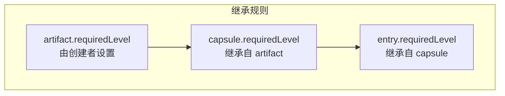
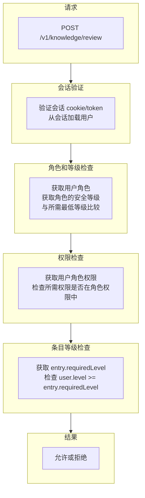
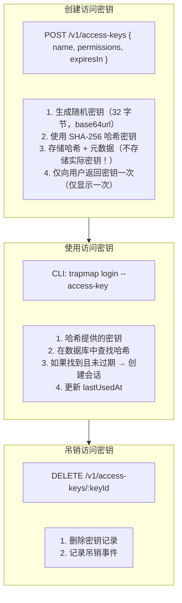
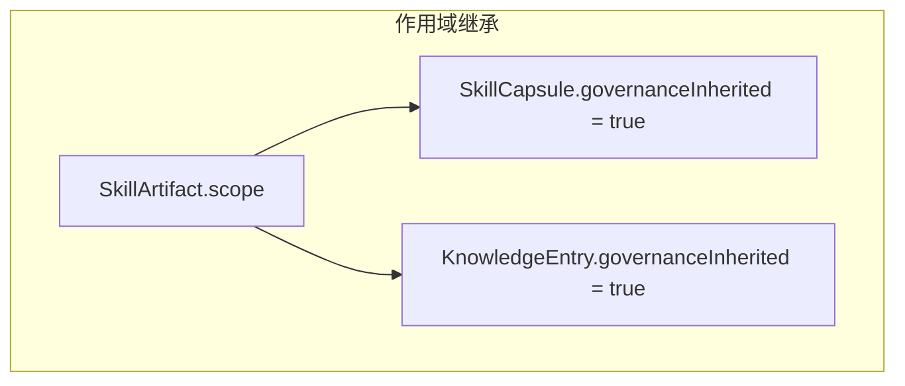

# 治理模型 (Governance Model)

## 概述

TrapMap 的治理模型基于 RBAC (基于角色的访问控制) 和多层级安全模型，确保知识条目在正确的权限级别下被访问和操作。

> **Round 3 更新**：知识域治理约束已从纯应用层校验升级为数据库级约束。`knowledge_entries` 表补齐 `CHECK` 约束（`scope`、`lifecycle_state`、`required_level`），`lifecycle_events` 表补齐 `type` CHECK 约束。标签、边界、维护分配已从 JSONB 拆为结构化子表（见 [数据库级治理约束](#数据库级治理约束)），支持按治理维度直接查询、过滤和索引。

## 安全等级 (Security Levels)

### 定义

安全等级是 0-10 的整数，表示知识的敏感程度：

| 等级 | 名称 | 描述 | 示例 |
|------|------|------|------|
| 0 | 公开 | 可被任何人访问 | 公开文档、公共知识 |
| 1-3 | 内部 | 仅内部团队可访问 | 内部流程、团队知识 |
| 4-6 | 机密 | 需要特定级别授权 | 敏感业务信息 |
| 7-9 | 高度机密 | 仅少数人可访问 | 核心架构、密钥 |
| 10 | 最高机密 | 仅管理员可访问 | 系统密钥、管理员凭据 |

### 等级继承



### 等级检查

```typescript
function canAccessLevel(userLevel: SecurityLevel, requiredLevel: SecurityLevel): boolean {
  return userLevel >= requiredLevel;
}

// 示例
const entry = { requiredLevel: 5 };
const user = { level: 7 };

canAccessLevel(user.level, entry.requiredLevel); // true, 7 >= 5
```

---

## RBAC 权限系统

### 权限定义

```typescript
type Permission =
  // 知识操作
  | 'knowledge:submit'      // 提交新知识
  | 'knowledge:search'      // 搜索和检索
  | 'knowledge:review'      // 审核（批准/拒绝）
  | 'knowledge:update'      // 更新现有条目
  | 'knowledge:import'      // 批量导入
  | 'knowledge:export'      // 批量导出
  
  // 审计
  | 'audit:read'           // 查看审计日志
  
  // 团队管理
  | 'team:create'          // 创建团队
  | 'team:list'            // 列出团队
  | 'team:select'          // 切换活动团队
  
  // 成员管理
  | 'member:create'        // 添加成员
  | 'member:update'        // 修改成员
  | 'member:key:create'    // 生成访问密钥
  
  // 工件操作
  | 'artifacts:read'       // 读取工件
  | 'artifacts:write'      // 写入工件
  | 'artifacts:review'     // 审核工件
  | 'artifacts:derive'     // 派生工件
```

### 角色定义

```typescript
interface Role {
  name: string;
  permissions: Permission[];
  level: SecurityLevel;  // 角色对应的安全等级
}

// 预定义角色
const ROLES: Record<string, Role> = {
  viewer: {
    name: 'viewer',
    permissions: ['knowledge:search', 'team:list'],
    level: 0
  },
  
  contributor: {
    name: 'contributor',
    permissions: ['knowledge:submit', 'knowledge:search', 'team:list'],
    level: 1
  },
  
  reviewer: {
    name: 'reviewer',
    permissions: [
      'knowledge:submit', 'knowledge:search', 'knowledge:review',
      'team:list', 'team:select'
    ],
    level: 5
  },
  
  admin: {
    name: 'admin',
    permissions: [
      'knowledge:submit', 'knowledge:search', 'knowledge:review',
      'knowledge:update', 'knowledge:import', 'knowledge:export',
      'audit:read',
      'team:create', 'team:list', 'team:select',
      'member:create', 'member:update', 'member:key:create',
      'artifacts:read', 'artifacts:write', 'artifacts:review', 'artifacts:derive'
    ],
    level: 10
  }
};
```

### 权限检查流程



### 实现

```typescript
interface PermissionCheck {
  userId: EntityId;
  permission: Permission;
  resourceId?: EntityId;
  resourceLevel?: SecurityLevel;
}

async function checkPermission(check: PermissionCheck): Promise<boolean> {
  const { userId, permission, resourceId, resourceLevel } = check;
  
  // 1. Load user
  const user = await store.getUser(userId);
  if (!user) return false;
  
  // 2. Get user's role
  const role = ROLES[user.roleName];
  if (!role) return false;
  
  // 3. Check permission
  if (!role.permissions.includes(permission)) {
    return false;
  }
  
  // 4. Check security level (if resource has level)
  if (resourceLevel !== undefined) {
    if (role.level < resourceLevel) {
      return false;
    }
  }
  
  // 5. For team-scoped operations, check team membership
  if (check.teamId) {
    const isMember = await store.isTeamMember(check.teamId, userId);
    if (!isMember) return false;
  }
  
  return true;
}
```

---

## 团队隔离 (Team Isolation)

### 概念

- **Global entries**: 可被所有团队访问
- **Team entries**: 仅团队成员可访问

### 访问控制矩阵

| 条目作用域 | 团队成员 | 其他团队成员 | 无团队用户 |
|------------|---------|-------------|-----------|
| Global | ✓ (按等级) | ✓ (按等级) | ✓ (按等级) |
| Team A | ✓ (按等级) | ✗ | N/A |
| No Team | ✓ (按等级) | ✓ (按等级) | ✓ (按等级) |

### 团队范围查询

```typescript
async function getAccessibleEntries(userId: EntityId): Promise<EntityId[]> {
  const user = await store.getUser(userId);
  
  // Get user's teams
  const userTeams = await store.getUserTeams(userId);
  const teamIds = userTeams.map(t => t.id);
  
  // Get accessible entry IDs
  const accessibleEntries: EntityId[] = [];
  
  // 1. Global entries (level <= user level)
  const globalEntries = await store.listEntries({
    filter: { 
      scope: 'global',
      requiredLevel: { lte: user.level }
    }
  });
  accessibleEntries.push(...globalEntries.map(e => e.id));
  
  // 2. Team entries (user is team member)
  const teamEntries = await store.listEntries({
    filter: {
      scope: 'team',
      teamId: { in: teamIds },
      requiredLevel: { lte: user.level }
    }
  });
  accessibleEntries.push(...teamEntries.map(e => e.id));
  
  return accessibleEntries;
}
```

---

## 审计日志 (Audit Logging)

### 审计事件类型

```typescript
type AuditEvent =
  // 认证事件
  | { type: 'auth.login'; actorId: EntityId; success: boolean }
  | { type: 'auth.logout'; actorId: EntityId }
  | { type: 'auth.failed'; actorId?: EntityId; reason: string }
  
  // 知识事件
  | { type: 'knowledge.created'; actorId: EntityId; entryId: EntityId }
  | { type: 'knowledge.submitted'; actorId: EntityId; entryId: EntityId }
  | { type: 'knowledge.agent-passed'; entryId: EntityId }
  | { type: 'knowledge.agent-rejected'; entryId: EntityId; reason: string }
  | { type: 'knowledge.approved'; actorId: EntityId; entryId: EntityId }
  | { type: 'knowledge.rejected'; actorId: EntityId; entryId: EntityId; notes: string }
  | { type: 'knowledge.deactivated'; actorId: EntityId; entryId: EntityId }
  
  // 团队事件
  | { type: 'team.created'; actorId: EntityId; teamId: EntityId }
  | { type: 'team.member_added'; actorId: EntityId; teamId: EntityId; memberId: EntityId }
  
  // 索引事件
  | { type: 'index.triggered'; entryId: EntityId; adapters: string[] }
  | { type: 'index.failed'; entryId: EntityId; adapter: string; error: string }
```

### 审计日志表

```sql
CREATE TABLE audit_log (
  id UUID PRIMARY KEY DEFAULT gen_random_uuid(),
  timestamp TIMESTAMP NOT NULL DEFAULT NOW(),
  event_type TEXT NOT NULL,
  actor_id UUID,
  resource_type TEXT,
  resource_id UUID,
  metadata JSONB,
  ip_address INET,
  user_agent TEXT
);

CREATE INDEX idx_audit_timestamp ON audit_log(timestamp DESC);
CREATE INDEX idx_audit_actor ON audit_log(actor_id);
CREATE INDEX idx_audit_resource ON audit_log(resource_type, resource_id);
CREATE INDEX idx_audit_type ON audit_log(event_type);
```

### 审计检查

```typescript
async function audit(
  event: AuditEvent,
  context: { ip?: string; userAgent?: string }
): Promise<void> {
  await store.createAuditLog({
    timestamp: new Date().toISOString(),
    eventType: event.type,
    actorId: event.actorId,
    metadata: event,
    ipAddress: context.ip,
    userAgent: context.userAgent
  });
}
```

---

## 访问密钥 (Access Keys)

### 概念

访问密钥是长期凭据，用于 CLI 或自动化脚本的身份验证。

### 密钥属性

```typescript
interface AccessKey {
  id: EntityId;
  name: string;
  keyHash: string;  // SHA-256 hash of actual key
  createdBy: ActorRef;
  createdAt: string;
  expiresAt?: string;
  lastUsedAt?: string;
  permissions: Permission[];
  level: SecurityLevel;
}
```

### 密钥流程



### 实现

```typescript
async function createAccessKey(
  userId: EntityId,
  name: string,
  permissions: Permission[],
  expiresInDays?: number
): Promise<{ key: string; id: EntityId }> {
  // Generate random key
  const key = generateSecureKey(32);  // 32 bytes, base64url encoded
  
  // Hash for storage
  const keyHash = crypto.createHash('sha256').update(key).digest('hex');
  
  // Calculate expiration
  const expiresAt = expiresInDays
    ? new Date(Date.now() + expiresInDays * 24 * 60 * 60 * 1000).toISOString()
    : undefined;
  
  // Get user's level
  const user = await store.getUser(userId);
  
  // Create access key record
  const accessKey = await store.createAccessKey({
    id: generateEntityId(),
    name,
    keyHash,
    createdBy: { actorId: userId, actorName: user.username },
    createdAt: new Date().toISOString(),
    expiresAt,
    permissions,
    level: user.level
  });
  
  // Return key ONCE (it's not stored!)
  return { key, id: accessKey.id };
}

async function validateAccessKey(key: string): Promise<User | null> {
  const keyHash = crypto.createHash('sha256').update(key).digest('hex');
  
  const accessKey = await store.getAccessKeyByHash(keyHash);
  if (!accessKey) return null;
  
  // Check expiration
  if (accessKey.expiresAt && new Date(accessKey.expiresAt) < new Date()) {
    return null;
  }
  
  // Update last used
  await store.updateAccessKey(accessKey.id, {
    lastUsedAt: new Date().toISOString()
  });
  
  // Load user
  return store.getUser(accessKey.createdBy.actorId);
}
```

---

## 作用域 (Scope)

### 作用域类型

```typescript
type Scope = 'global' | 'project' | 'team';
```

| 作用域 | 描述 | 访问控制 |
|--------|------|----------|
| global | 全局可访问 | 仅安全等级检查 |
| project | 项目范围内 | 项目成员 + 等级检查 |
| team | 团队范围内 | 团队成员 + 等级检查 |

### 作用域继承



当 governanceInherited 为 true 时，子实体继承父实体的作用域。

---

## 数据库级治理约束（Round 3）

Round 3 将知识域的核心治理规则从纯应用层校验升级为数据库级约束，同时将嵌入 JSONB 的治理元数据拆分为结构化可查询子表。

### knowledge_entries CHECK 约束

```sql
-- 作用域约束：仅允许 'global' 或 'project'
ALTER TABLE knowledge_entries ADD CONSTRAINT ck_knowledge_entries_scope
  CHECK (scope IN ('global', 'project'));

-- 生命周期约束：仅允许合法状态枚举值
ALTER TABLE knowledge_entries ADD CONSTRAINT ck_knowledge_entries_lifecycle_state
  CHECK (lifecycle_state IN ('draft', 'submitted', 'agent-pass',
    'agent-rejected', 'approved', 'rejected', 'deactivated'));

-- 安全等级约束：仅允许 0-10
ALTER TABLE knowledge_entries ADD CONSTRAINT ck_knowledge_entries_required_level
  CHECK (required_level >= 0 AND required_level <= 10);
```

### lifecycle_events CHECK 约束

```sql
ALTER TABLE lifecycle_events ADD CONSTRAINT ck_lifecycle_events_type
  CHECK (type IN ('submitted', 'resubmitted', 'agent-reviewed',
    'reviewer-approved', 'reviewer-rejected', 'updated', 'deactivated'));
```

### 治理相关索引

| 索引 | 用途 |
|------|------|
| `idx_knowledge_entries_scope_level` ON `(scope, required_level)` | 按作用域 + 安全等级筛选可访问条目 |
| `idx_knowledge_entries_owner` ON `(owner_user_id)` | 按所有者筛选 |
| `idx_knowledge_entries_lifecycle_state` ON `(lifecycle_state)` | 按生命周期状态过滤（审核队列等） |
| `idx_knowledge_labels_label` ON `(label)` | 按标签过滤（AND 语义） |
| `idx_knowledge_maintenance_assignments_maintainer` ON `(maintainer_user_id)` | 按维护者筛选 |
| `idx_knowledge_maintenance_assignments_review_by` ON `(review_by)` | 按复核截止时间筛选 |

### 治理结构化子表

| 表 | 说明 | 关键治理用途 |
|----|------|------------|
| `knowledge_labels` | `(entry_id, label)` 对，含唯一约束 | 标签过滤、分类统计、检索召回 |
| `knowledge_boundary_contexts` | 上下文标签（如 `frontend`） | 边界感知过滤、跨上下文访问控制 |
| `knowledge_boundary_versions` | 包/工具版本约束 | 版本匹配、兼容性检查 |
| `knowledge_boundary_prerequisites` | 前置条件（环境/权限/工具等） | 适用性检查 |
| `knowledge_boundary_signals` | 信号模式匹配器 | 自动触发匹配 |
| `knowledge_boundary_exclusions` | 排除规则 | 不适用场景判定 |
| `knowledge_boundary_evidence` | 证据引用（issue/CVE/commit 等） | 治理审计追踪 |
| `knowledge_maintenance_assignments` | 维护者和复核时间（1:1 PK） | 责任制追踪、SLA 监控 |

所有子表通过 `PgKnowledgeRepository` 与 `knowledge_entries` JSONB 缓存列同步写入，读路径从子表读取结构化数据，保证查询性同时保持 API 契约兼容。
